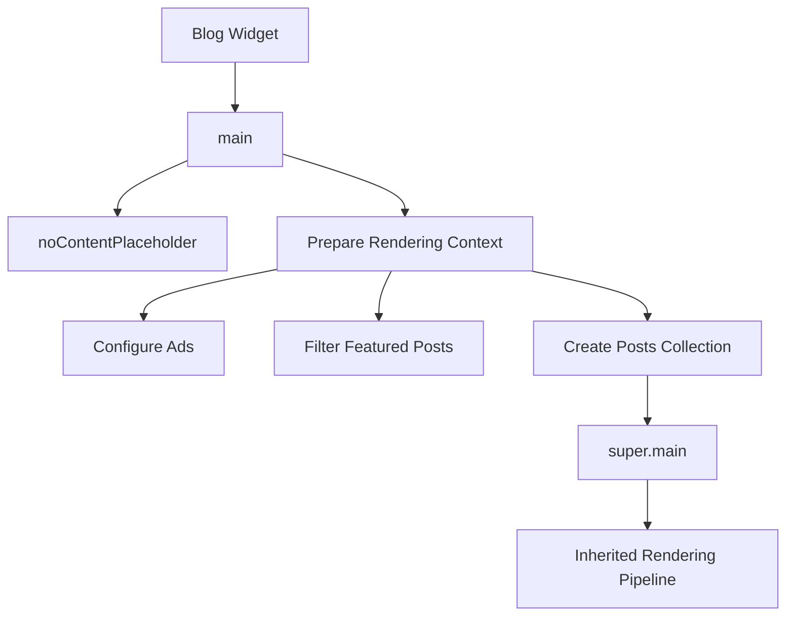

# Blog Widget Overview

## Purpose

The **Blog** widget is the core rendering engine of a Blogger theme.

Unlike most widgets, which render a single UI component (Header, Labels, Popular Posts, etc.), the Blog widget is responsible for generating the primary page content, including:

- Homepage post listings
- Individual post pages
- Static pages
- Search results
- Archive views
- Comments
- Post metadata
- Sharing controls
- Pagination

Without the Blog widget, a Blogger theme cannot render blog content.

---

# Widget Boundary

The Blog widget begins with the widget declaration:

```xml
<b:widget
    id='Blog1'
    type='Blog'
    ...
>
```

All `<b:includable>` elements contained within this widget belong to the Blog widget implementation.

This document concerns only those includables.

Other widgets (Header, PageList, Labels, FeaturedPost, etc.) are documented separately.

---

# High-Level Architecture

The Blog widget follows a component-based architecture built around **includables**.

An includable is comparable to a function.

It:

- accepts data
- performs logic
- optionally renders HTML
- may invoke other includables

Unlike ordinary XML templates, Blogger uses includables as reusable rendering units.

---

# Entry Point

The widget entry point is:

```xml
<b:includable id='main'>
```

This is the first Blog includable executed by Blogger.

Its responsibilities are orchestration rather than rendering.

---

# Responsibilities of `main`

The `main` includable performs the following tasks before rendering begins:

1. Displays the "no content" placeholder.
2. Configures advertisement limits.
3. Counts desktop advertisements.
4. Counts mobile advertisements.
5. Filters Featured Posts from the homepage.
6. Produces the final `posts` collection.
7. Delegates rendering to the inherited implementation.

Notably, `main` does **not** directly generate post HTML.

---

# Rendering Delegation

After preparing the rendering context, `main` delegates execution:

```xml
<b:include name='super.main'/>
```

This indicates that the Blog widget participates in Blogger's widget inheritance model.

The inherited implementation performs the actual rendering process.

Therefore:

- `main` acts as an orchestrator.
- Rendering occurs deeper within the widget hierarchy.

---

# Current Rendering Flow

The current understanding of the rendering pipeline is:



The internal behavior of `super.main` will be documented separately.

---

# Architectural Observations

The following observations are based on the Essential Light theme.

## Observation 1

The Blog widget is highly modular.

Instead of one large rendering routine, behavior is distributed across numerous includables.

---

## Observation 2

The `main` includable is intentionally small.

Its purpose is to prepare data rather than produce UI.

---

## Observation 3

Rendering is delegated.

The presence of `super.main` indicates Blogger provides inherited rendering behavior that individual themes customize.

---

## Observation 4

The Blog widget behaves more like a framework than a traditional XML template.

Each includable functions similarly to a reusable rendering component.

---

# Refactoring Strategy

The SEDS project follows these principles:

1. Preserve Blogger's widget contract.
2. Do not modify the widget entry point unnecessarily.
3. Refactor one includable at a time.
4. Keep the theme uploadable after every change.
5. Validate every extraction independently.

---

# Current Understanding

| Component | Status |
|-----------|--------|
| Blog Widget Boundary | ✅ Understood |
| Entry Point (`main`) | ✅ Understood |
| High-Level Responsibilities | ✅ Understood |
| Rendering Delegation | ✅ Understood |
| Internal Rendering Pipeline | 🔍 Under Investigation |

---

# Next Document

The next document in this series is:

`02-includables-reference.md`

It will catalogue every Blog widget includable, classify its responsibility, identify its dependencies, and describe its relationship with other includables.

This document serves as the authoritative reference for future refactoring work.