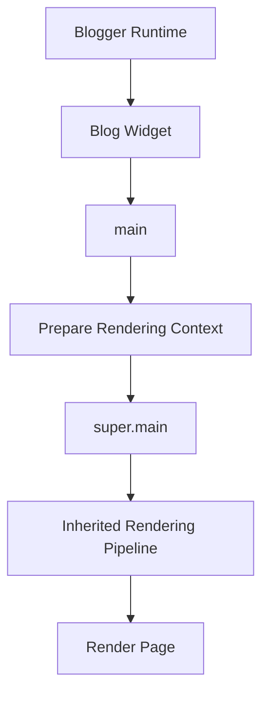

# Rendering Lifecycle

## Purpose

This document describes how Blogger renders content through the Blog widget.

Unlike the Includables Reference, which documents individual rendering units, this document explains the order in which those units participate in page generation.

The rendering lifecycle is reconstructed from the Essential Light theme and will be refined as additional evidence is collected.

---

# Overview

The Blog widget behaves similarly to a rendering engine.

Instead of generating HTML in one large procedure, Blogger composes many small includables into a complete page.

The current high-level lifecycle is shown below.



---

# Stage 1 — Widget Initialization

## Entry Point

Rendering begins when Blogger invokes:

```xml
<b:includable id="main">
```

### Responsibilities

- Display the no-content placeholder.
- Prepare advertisement variables.
- Prepare the posts collection.
- Delegate rendering.

---

# Stage 2 — Context Preparation

Before rendering begins, the widget prepares data required by downstream includables.

Examples include:

- advertisement counters
- featured post filtering
- posts collection

No page HTML is produced during this stage.

---

# Stage 3 — Delegation

The prepared context is passed to:

```xml
<b:include name="super.main"/>
```

At this point control moves into Blogger's inherited rendering pipeline.

---

# Stage 4 — Rendering

The inherited pipeline renders page content.

The exact rendering sequence is currently under investigation.

Expected participants include:

- post
- comments
- sharing
- pagination
- metadata

These relationships will be documented only after they have been verified.

---

# Stage 5 — Response Generation

The rendering pipeline returns generated HTML to Blogger.

The completed page is then delivered to the browser.

---

# Observed Characteristics

## Composition

Rendering is composed from numerous small includables rather than one monolithic renderer.

---

## Delegation

Responsibility is delegated downward through the includable hierarchy.

---

## Separation of Concerns

Preparation logic occurs before rendering.

Rendering components should avoid modifying rendering context.

---

# Current Confidence

| Stage | Confidence |
|---------|------------|
| Entry Point | High |
| Context Preparation | High |
| Delegation | High |
| Internal Rendering Pipeline | Low |
| Final Rendering Order | Low |

The confidence level will increase as additional includables are traced.

---

# Related Documents

- 01-blog-widget-overview.md
- 02-includables-reference.md