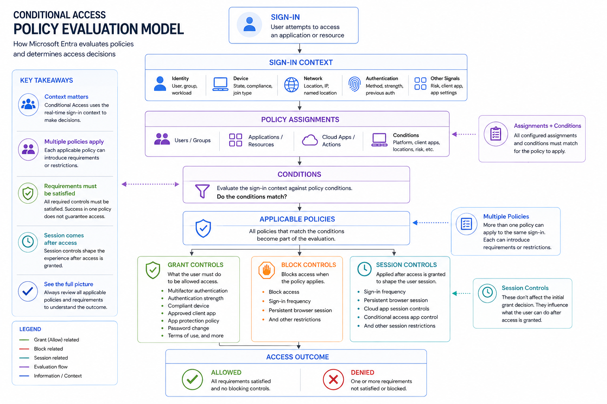
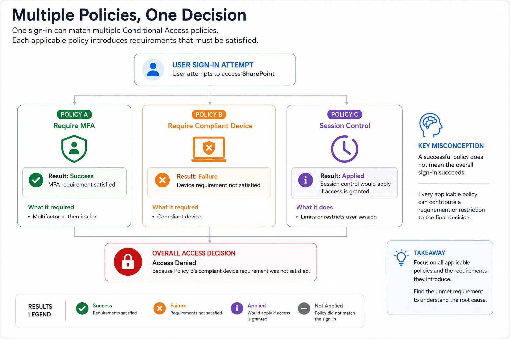
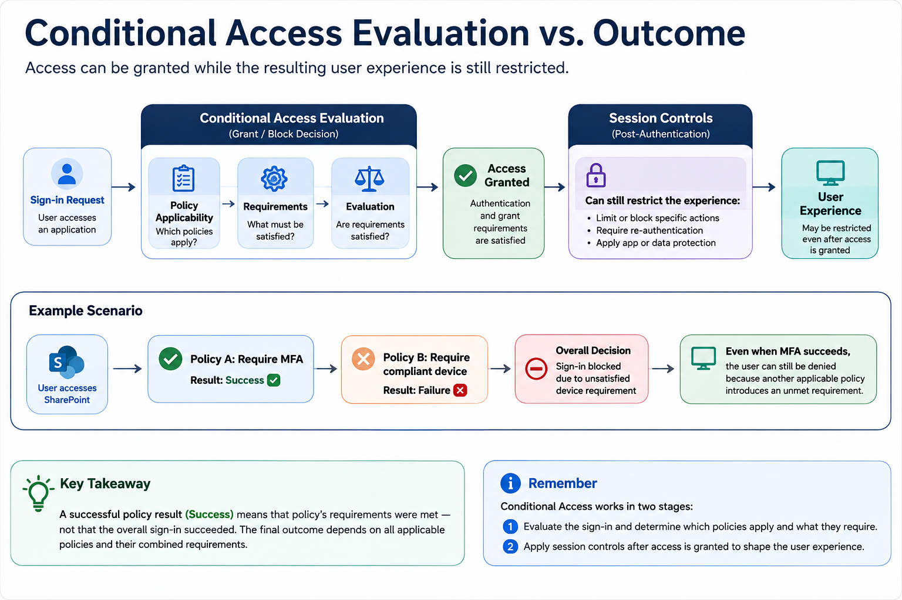

import ComparisonTable from "../../components/content/ComparisonTable.astro";
import ConditionalAccessEvaluationModel from "../../components/content/ConditionalAccessEvaluationModel.astro";
import ConditionalAccessPolicyResults from "../../components/content/ConditionalAccessPolicyResults.astro";

Conditional Access is often described with a simple formula:

> **If these conditions are met, require this control.**

That is useful when learning how to create a policy.

It becomes less useful when trying to understand what happens during a real sign-in.

Consider this:

```text
Policy A
Require MFA
    ↓
Success

Policy B
Require compliant device
    ↓
Failure
```

The user completed MFA successfully, yet access was still denied.

There is no contradiction.

**Multiple Conditional Access policies can apply to the same sign-in, and each applicable policy can introduce its own requirements.**

That leads to the central idea of this article:

> **Don't ask which Conditional Access policy "won." Ask which policies applied and which requirements remained unsatisfied.**



---

## 1. Conditional Access Is an Evaluation, Not a Policy List

It is tempting to think of Conditional Access like a firewall:

```text
Policy 1
   ↓
Policy 2
   ↓
Policy 3
   ↓
Allow / Deny
```

That mental model is misleading.

A better model is:

```text
                    Sign-in
                       │
                       ▼
                 Sign-in context
                       │
                       ▼
               Policy assignments
                       │
                       ▼
                  Conditions
                       │
                       ▼
               Applicable policies
                       │
             ┌─────────┴─────────┐
             ▼                   ▼
        Grant / Block        Session controls
             │                   │
             └─────────┬─────────┘
                       ▼
                 Access outcome
```

Microsoft Entra Conditional Access combines signals such as user, device, location, and other context to make access decisions. Multiple policies can apply to the same sign-in, and all applicable policy requirements must be satisfied.

The result is not simply "Policy X allowed the user."

It is the outcome of the **applicable policies and the requirements they introduce**.

---

## 2. First Question: Does the Policy Apply?

Before asking why a requirement failed, determine whether the policy actually applies.

Conceptually:

```text
User
  +
Resource
  +
Conditions
  ↓
Does the policy match?
  ↓
YES → Policy applies
NO  → Policy does not apply
```

A Conditional Access policy is built from assignments and access controls. The assignments determine who and what the policy targets, while conditions further narrow when the policy applies. Multiple configured assignments are logically combined using AND.

This distinction is important because **Not applied is not the same as Failure**.

For example:

```text
Policy
All users
+
SharePoint
+
iOS

Sign-in
User = Alice
Application = SharePoint
Platform = Windows
```

The policy does not apply.

It did not evaluate the user and reject them.

It simply was not part of that access decision.

### Policy result meanings

- **Not applied** — the policy did not match the sign-in.
- **Success** — the applicable policy's evaluated requirements were satisfied.
- **Failure** — the policy applied, but one or more evaluated requirements were not satisfied.

---

## 3. Multiple Policies Can Contribute to One Decision

Now consider a user whose sign-in matches three policies:

```text
                    Sign-in
                       │
        ┌──────────────┼──────────────┐
        ▼              ▼              ▼
     Policy A       Policy B       Policy C
       MFA           Device          Session
        │              │              │
     Satisfied       Failed        Applied
        │              │              │
        └──────────────┼──────────────┘
                       ▼
                  Final outcome
```

Policy A being successful does not cancel Policy B.

Policy B being successful does not necessarily cancel Policy C.

Each applicable policy contributes its configured controls to the overall evaluation.

This is the misconception worth emphasizing:

> **Conditional Access is not about finding the one policy responsible for the decision. It is about understanding the collection of applicable policies.**



---

## 4. Success Does Not Mean "Access Granted"

This deserves its own section because it is one of the easiest mistakes to make.

Suppose the sign-in shows:

```text
Policy A
Require MFA
    ↓
Success

Policy B
Require compliant device
    ↓
Failure
```

The correct interpretation is:

> **The MFA requirement introduced by Policy A was satisfied.**

It is **not**:

> "Conditional Access allowed the user."

The overall decision can still fail because another applicable policy introduced a requirement that was not satisfied.

So when reading Conditional Access results, do not stop at the first `Success`.

Ask:

> **What else applied?**

<ConditionalAccessPolicyResults />

---

## 5. Requirements Can Be Combined

Once a policy applies, its controls determine what must be satisfied.

Examples include:

- MFA;
- authentication strength;
- compliant device;
- Microsoft Entra hybrid joined device;
- approved client application;
- app protection policy;
- password change;
- Terms of Use.

Multiple grant controls can be configured together.

For example:

```text
MFA
 AND
Compliant device
```

A user can satisfy MFA and still fail the device requirement.

Microsoft documents both **Require all the selected controls** and **Require one of the selected controls**. By default, multiple selected controls require all selected controls.

This is why the useful question is not simply:

> "Does this policy require MFA?"

It is:

> **"What complete set of requirements does this applicable policy introduce?"**

---

## 6. Authentication Strength Is Not the Same as MFA

Another common misconception is:

> **"MFA succeeded, so the authentication requirement succeeded."**

Not necessarily.

Conditional Access can require a specific authentication strength rather than simply requiring that multifactor authentication occurred.

For example:

```text
MFA completed
      ≠
Required authentication strength satisfied
```

The important question is:

> **What authentication requirement did the applicable policy introduce, and what authentication method actually satisfied it?**

This distinction matters when a policy requires a stronger authentication method than the one the user already completed.

---

## 7. The Evaluation Has More Than One Layer

Conditional Access is easier to understand if we separate the major layers:

```text
1. Does the policy apply?
        ↓
2. What conditions are being evaluated?
        ↓
3. What requirements does the policy introduce?
        ↓
4. Are those requirements satisfied?
        ↓
5. Are session controls applied?
        ↓
6. What is the resulting user experience?
```

Microsoft describes Conditional Access evaluation in two broad phases: session details are gathered for evaluation, then applicable controls are enforced. Once grant controls are satisfied, session controls can be applied.

That last point matters because not every Conditional Access outcome is simply **Allow** or **Deny**.

A user can successfully authenticate and still receive a restricted experience.

For example:

```text
Authentication
      ↓
Access granted
      ↓
Session control
      ↓
Restricted experience
```



---

## 8. Authentication Context Adds Another Evaluation Layer

Authentication Context is another example where the access decision cannot be reduced to "Can the user sign in?"

An application may work normally while one sensitive operation requires additional protection:

```text
Application
     ↓
Normal access
     ↓
Sensitive operation
     ↓
Authentication Context
     ↓
Additional requirement
```

In this scenario, the entire application is not necessarily blocked.

The protected operation can introduce an additional Conditional Access requirement.

The important concept is:

> **Conditional Access can influence access at different points in the user's interaction with an application.**

---

## 9. Report-Only Is a Different Kind of Evaluation

Report-only mode is another source of confusion.

A report-only policy can show a failure without actually blocking the user.

Think of it as:

```text
Enabled policy
    ↓
What happened?

Report-only policy
    ↓
What would happen?
```

The important distinction is:

> **A report-only result describes the policy's evaluated impact; it is not automatically the cause of a user's production block.**

Microsoft documents that report-only policies are evaluated during sign-in but are not enforced in the normal way. Their results are visible in sign-in details and can be used to understand the impact of a policy before enforcement.

---

## 10. What If and Sign-In Logs Answer Different Questions

This distinction can be kept simple.

### What If

Answers:

> **Which policies would apply under these conditions?**

### Sign-in logs

Answers:

> **What actually happened during this sign-in?**

```text
             WHAT IF
                ↓
       What would apply?

                vs.

          SIGN-IN LOG
                ↓
       What actually happened?
```

The What If tool simulates a sign-in scenario and reports policies that apply and policies that do not apply. An actual sign-in event provides the production evidence for a specific request.

What If is therefore useful for understanding policy scope and potential evaluation.

The sign-in event is the evidence of what happened in production.

---

## 11. A Worked Evaluation

A user accesses SharePoint.

The sign-in matches two policies.

### Policy A

```text
Target:
All employees

Grant:
Require MFA
```

Result:

```text
Success
```

### Policy B

```text
Target:
All employees

Grant:
Require compliant device
```

Result:

```text
Failure
```

The sign-in evidence shows:

```text
Authentication
MFA succeeded

Device
Non-compliant

Conditional Access
Policy A → Success
Policy B → Failure
```

The evaluation can now be reconstructed:

```text
User
 ↓
SharePoint
 ↓
Policy A applies
 ↓
MFA satisfied
 ↓
Policy B applies
 ↓
Compliant-device requirement
 ↓
Device = non-compliant
 ↓
Requirement not satisfied
 ↓
Access denied
```

The correct conclusion is:

> **MFA was not the root cause. The device requirement was.**

The important lesson is that the individual policy results must be connected to the overall event rather than interpreted in isolation.

<ConditionalAccessEvaluationModel />

---

## 12. The Evaluation Model in One Diagram

The whole article can ultimately be reduced to this:

```text
                         SIGN-IN
                            │
                            ▼
                     SIGN-IN CONTEXT
                            │
             ┌──────────────┼──────────────┐
             ▼              ▼              ▼
          Identity        Device        Network
             │              │              │
             └──────────────┼──────────────┘
                            ▼
                       ASSIGNMENTS
                            │
                            ▼
                        CONDITIONS
                            │
                            ▼
                  APPLICABLE POLICIES
                            │
             ┌──────────────┼──────────────┐
             ▼              ▼              ▼
           Grant           Block         Session
          controls        controls       controls
             │              │              │
             └──────────────┼──────────────┘
                            ▼
                     ACCESS OUTCOME
                            │
                  ┌─────────┴─────────┐
                  ▼                   ▼
               Allowed              Denied
                  │
                  ▼
             Session behavior
```

The important part is the sequence:

> **Context → Applicability → Requirements → Evaluation → Outcome**

---

## 13. The Misconceptions to Remember

<ComparisonTable
  caption="Common Conditional Access evaluation misconceptions"
  columns={[
    { label: "Misconception" },
    { label: "Better mental model" }
  ]}
  rows={[
    {
      label: "Conditional Access evaluates policies one at a time.",
      cells: ["Multiple applicable policies can contribute to the decision."]
    },
    {
      label: "`Success` means the user was allowed.",
      cells: ["That policy's evaluated requirements were satisfied."]
    },
    {
      label: "`Not applied` means the policy rejected the user.",
      cells: ["The policy did not match the sign-in."]
    },
    {
      label: "MFA succeeded, so authentication is complete.",
      cells: ["A stronger authentication requirement may still apply."]
    },
    {
      label: "Every Conditional Access issue is a blocked sign-in.",
      cells: ["Session controls can restrict an already authenticated experience."]
    },
    {
      label: "A Report-only failure blocked the user.",
      cells: ["Report-only evaluates potential impact rather than acting as the normal enforcement result."]
    },
    {
      label: "What If tells me what happened.",
      cells: ["What If tells you what would apply; the sign-in event tells you what happened."]
    },
    {
      label: "One successful policy means the rest don't matter.",
      cells: ["Every applicable policy still needs to be considered."]
    }
  ]}
/>

---

## 14. The Practical Reading Order

When looking at a Conditional Access evaluation, use this order:

```text
1. Identify the sign-in
        ↓
2. Identify the applicable policies
        ↓
3. Determine what each policy requires
        ↓
4. Check which requirements were satisfied
        ↓
5. Find the requirement that wasn't satisfied
        ↓
6. Determine the resulting access/session outcome
```

Notice what is **not** at the beginning:

```text
❌ Exclude the user
❌ Disable the policy
❌ Remove MFA
❌ Change the device requirement
```

Those are remediation decisions.

They should come **after understanding the evaluation**, not before it.

That distinction is the bridge to the troubleshooting article, where the focus is on turning the evaluation into a systematic troubleshooting process.

---

## Conclusion

Conditional Access becomes much easier to understand when it is treated as an **evaluation model rather than a collection of isolated policies**.

The essential sequence is:

```text
Sign-in context
      ↓
Policy applicability
      ↓
Applicable policies
      ↓
Requirements
      ↓
Satisfied / unsatisfied controls
      ↓
Access decision
      ↓
Session experience
```

The most important ideas are simple:

**A policy showing `Success` does not necessarily mean the overall sign-in succeeded.**

**`Not applied` is not the same as `Failure`.**

**MFA success does not necessarily mean the required authentication strength was satisfied.**

**A successful authentication does not necessarily mean the user receives an unrestricted session.**

**Report-only and What If answer different questions from an actual sign-in event.**

Most importantly:

> **Don't ask which policy "won." Ask which policies applied, what they required, and which requirement remained unsatisfied.**

That is the mental model that makes Conditional Access evaluation understandable.
