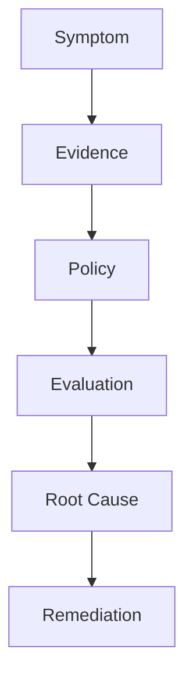
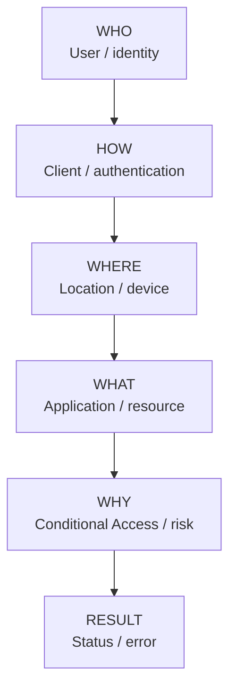
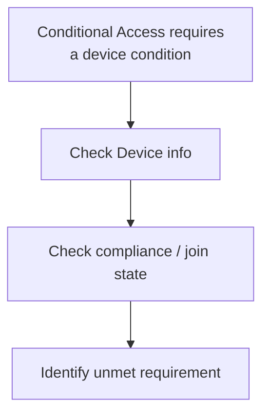
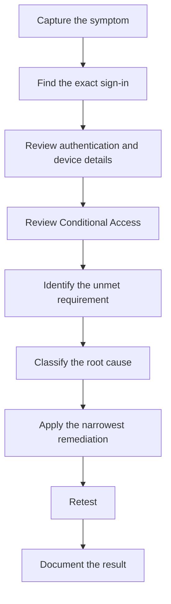

import ComparisonTable from "../../components/content/ComparisonTable.astro";
import ConditionalAccessTroubleshootingCheck from "../../components/content/ConditionalAccessTroubleshootingCheck.astro";
import ConditionalAccessInvestigationPath from "../../components/content/ConditionalAccessInvestigationPath.astro";
import ArticleImageLightbox from "../../components/article/widgets/ArticleImageLightbox.astro";
import conditionalAccessTroubleshootingMethod from "../../assets/images/articles/conditional-access-troubleshooting/conditional-access-troubleshooting-method.png";
import conditionalAccessPolicyEvaluation from "../../assets/images/articles/conditional-access-troubleshooting/conditional-access-policy-evaluation.png";
import conditionalAccessRootCauseMap from "../../assets/images/articles/conditional-access-troubleshooting/conditional-access-root-cause-map.png";
import conditionalAccessInvestigationTools from "../../assets/images/articles/conditional-access-troubleshooting/conditional-access-investigation-tools.png";

A user reports:

> **"I can sign in, but I still can't access the app."**

The instinct is often to open Conditional Access and start changing policies.

That is usually the wrong starting point.

The better starting point is the **specific sign-in attempt that failed**.

Microsoft Entra sign-in logs provide the evidence needed to understand what happened: who signed in, what they accessed, how the request was authenticated, which Conditional Access policies applied, and which requirement was not satisfied.

That gives us a repeatable troubleshooting method:

> **Don't start by asking, "Which policy should I change?" Start by asking, "What did Microsoft Entra evaluate in this exact sign-in?"**

<ArticleImageLightbox
  src={conditionalAccessTroubleshootingMethod.src}
  alt="Conditional Access troubleshooting methodology showing the sequence Symptom, Evidence, Policy, Evaluation, Root Cause, and Remediation."
/>

---

## 1. Start With the Exact Sign-In Event

The user's error message is a clue, not the diagnosis.

A user might report:

> "I cannot sign in."

> "MFA keeps prompting."

> "It works from the browser but not the mobile app."

> "I can open the application, but I cannot download files."

Those symptoms can come from completely different Conditional Access controls.

Start by finding the corresponding sign-in event.

Filter the sign-in logs using information such as:

- user;
- application;
- status;
- date and time;
- resource;
- Conditional Access result;
- correlation information.

Then inspect the event's most relevant details:

**Basic info → Location → Device info → Authentication details → Conditional Access → Report-only**

A useful mental model is:

Common Conditional Access-related error codes can provide an early clue, including device compliance, domain-join, approved-client, Conditional Access block, risk, and Intune protection errors.

But an error code should be treated as a starting point—not the entire diagnosis.

---

## 2. Understand What the Conditional Access Tab Is Telling You

Conditional Access is not a top-to-bottom firewall rule list.

Microsoft Entra evaluates matching policies using assignments, target resources, conditions, grant controls, and session controls.

Multiple policies can apply to the same sign-in.

For example:

**Policy A: Require MFA → Satisfied**

**Policy B: Require compliant device → Not satisfied**

The user can therefore complete MFA successfully and still be denied.

This is why:

> **A policy showing `Success` does not necessarily mean the overall sign-in was granted.**

You need to determine:

> **Which policies applied, and which requirement remained unsatisfied?**

<ArticleImageLightbox
  src={conditionalAccessPolicyEvaluation.src}
  alt="Conditional Access policy evaluation showing multiple policies applying to one sign-in, with one failed requirement causing an overall Access Denied result."
/>

---

## 3. Identify the Failed Requirement

Once you know which policies applied, classify the unmet requirement.

<ComparisonTable
  caption="Conditional Access root-cause areas and what to investigate"
  columns={[
    { label: "Root-cause area" },
    { label: "Typical investigation" }
  ]}
  rows={[
    {
      label: "Device",
      cells: ["Compliance, enrollment, registration, hybrid join"]
    },
    {
      label: "Network",
      cells: ["Public IP, VPN, proxy, named network"]
    },
    {
      label: "Authentication strength",
      cells: ["Required authentication method"]
    },
    {
      label: "Authentication Context",
      cells: ["Step-up requirement for a sensitive action"]
    },
    {
      label: "Grant controls",
      cells: ["Multiple access requirements"]
    },
    {
      label: "Session controls",
      cells: ["Restricted post-authentication experience"]
    },
    {
      label: "Policy scope",
      cells: ["Assignments, exclusions, application targeting"]
    },
    {
      label: "Client/application",
      cells: ["Approved client or app protection requirements"]
    }
  ]}
/>

<ArticleImageLightbox
  src={conditionalAccessRootCauseMap.src}
  alt="Conditional Access root-cause map showing device, network and location, authentication strength and context, grant controls, session controls, and client or application requirements as the main areas to investigate when a sign-in is blocked or an action is restricted."
/>

<ConditionalAccessTroubleshootingCheck />

This is the point where troubleshooting becomes targeted.

---

## 4. Device State and Device Filters

Device-related failures commonly occur when the device is:

- not registered;
- not enrolled;
- not compliant;
- not Microsoft Entra hybrid joined when required.

A useful sequence is:

Do not immediately remove the device requirement from the policy.

Fix the device condition that caused the failure.

The source material also notes that the older **Device state** condition is deprecated and that **Filter for devices** is the current approach.

---

## 5. Network and Location Evaluation

Network-based Conditional Access can be confusing when VPNs and proxies are involved.

A user may be physically in one place while Microsoft Entra evaluates the public IP of a proxy or VPN endpoint.

The investigation should therefore follow the actual network path:

**User → Public IP → VPN / Proxy → Named network → Conditional Access**

The important distinction is:

> **Location is a network signal, not an exact physical location.**

Before changing a named location, determine which network identity Microsoft Entra actually evaluated.

---

## 6. Authentication Strength — MFA Success Is Not Always Enough

One of the most common misunderstandings is:

> **"The user completed MFA, so why are they still blocked?"**

Conditional Access can require a specific **authentication strength**, rather than simply MFA.

The source identifies built-in strengths including:

- Multifactor authentication;
- Passwordless MFA;
- Phishing-resistant MFA.

The evaluation can therefore look like:

**Initial authentication → Conditional Access → Required authentication strength → Additional authentication → Access**

So:

> **MFA succeeded**

does not necessarily mean:

> **The required authentication strength was satisfied.**

When investigating this type of failure, inspect the **Authentication details** rather than stopping at "MFA completed."

---

## 7. Authentication Context — When Only a Sensitive Action Fails

Authentication Context allows Conditional Access requirements to be applied to sensitive data or actions within an application.

That can produce a distinctive symptom:

> **"The application works, except for one sensitive operation."**

The investigation should verify:

1. The expected authentication context was requested.
2. The context was published.
3. A Conditional Access policy targets it.
4. The resulting challenge was satisfied.

This keeps the investigation focused on the sensitive workflow rather than assuming the entire application is blocked.

---

## 8. Grant Controls Can Combine

Grant controls determine what must be satisfied before access is allowed.

Examples include:

- MFA;
- authentication strength;
- compliant device;
- hybrid joined device;
- approved client application;
- app protection policy;
- password change;
- terms of use.

Multiple controls can be combined.

For example:

MFA **AND** Compliant device

A user can satisfy the first requirement and still fail the second.

A more restrictive combination can also create an access path that a particular population cannot satisfy.

The question should therefore be:

> **Can the users targeted by this policy actually satisfy all of its grant controls?**

---

## 9. Session Controls Explain "I Got In, But..."

Not every Conditional Access problem is a blocked sign-in.

Sometimes authentication succeeds but the user's experience is intentionally restricted.

Examples:

> "I can access the application, but I cannot download files."

> "The application is read-only."

> "I'm being asked to authenticate again."

Those symptoms can point toward **session controls**.

Conceptually:

**Authentication → Access granted → Session control → Restricted experience**

This distinction matters because changing authentication requirements may do nothing to resolve a session restriction.

---

## 10. Use Report-Only, What If, and Sign-In Diagnostics

These tools answer different questions.

### Report-only

Use it to evaluate a policy **before enforcing it**.

It is particularly useful when testing broader targeting, stronger authentication, device requirements, or other high-impact changes.

### What If

Use it to understand:

> **Which policies would apply under these conditions?**

It is useful for analyzing assignments, conditions, exclusions, and controls before changing production policies.

### Sign-in diagnostics

Use it to accelerate investigation of a complex failure by narrowing the available evidence toward a likely root cause.

The important distinction is:

**What If → What would apply?**

**Sign-in logs → What actually happened?**

None of these replaces the actual sign-in event during a production incident.

<ArticleImageLightbox
  src={conditionalAccessInvestigationTools.src}
  alt="Conditional Access investigation tools comparison showing Report-only for policy testing, What If for policy-scope simulation, and Sign-in Logs and Diagnostics for investigating what actually happened."
/>

---

## 11. Five Common Conditional Access Failures

### MFA succeeds, but access is still blocked

**MFA → Success**

**Compliant device → Failure**

**Root cause:** multiple grant requirements apply.

**Remediation:** investigate device compliance rather than weakening MFA.

### The user can access the application but cannot download

**Sign-in → Success → Session control → Restricted action**

**Root cause:** a session restriction is being enforced.

**Remediation:** review the applicable session control and the device/application conditions.

### Only one sensitive workflow fails

**Application → Normal access → Sensitive resource → Authentication Context**

**Root cause:** the context or resulting authentication requirement was not satisfied.

**Remediation:** trace the authentication-context request and policy evaluation.

### A BYOD user is blocked by device requirements

Hybrid joined device **AND** Compliant device

**Root cause:** the targeted population cannot satisfy the selected requirements.

**Remediation:** review whether different device populations need different access policies.

### A Report-only failure is mistaken for an actual block

**Report-only policy → Failure**

**Root cause:** a report-only policy does not enforce access.

**Remediation:** identify the enabled policy that actually affected the sign-in.

---

## 12. Avoid These Troubleshooting Shortcuts

Some of the fastest-looking fixes create the biggest problems.

### Don't immediately exclude the user

An exclusion may hide the problem instead of explaining it.

### Don't disable a broad policy

You may resolve one user's problem while weakening protection for everyone.

### Don't assume MFA is the entire authentication requirement

Authentication strength can require a stronger method.

### Don't assume the reported location is the evaluated location

VPNs and proxies can change the network signal.

### Don't ignore session controls

A successful sign-in can still result in deliberately restricted access.

### Don't make production changes before testing

Use Report-only and What If to understand the impact first.

Maintain permanent emergency-access exclusions so administrators do not lock themselves out through policy changes.

---

## 13. The Troubleshooting Playbook

The entire methodology can be reduced to:

Notice what is deliberately missing:

> **Immediately exclude the user.**

> **Disable Conditional Access.**

> **Remove the security requirement.**

Those may be emergency actions in exceptional circumstances, but they should not be the default troubleshooting method.

<ConditionalAccessInvestigationPath />

---

## Conclusion — Make Conditional Access Understandable

Conditional Access troubleshooting becomes much faster when you stop asking:

> **"Which policy should I change?"**

and start asking:

> **"What did Microsoft Entra evaluate in this exact sign-in?"**

The sign-in event provides the evidence.

The Conditional Access view shows which policies applied.

The policy configuration explains the requirements.

The authentication and device details show what was actually satisfied.

And the unmet requirement points toward the root cause.

Use the same sequence every time:

**Symptom → Evidence → Policy → Evaluation → Root Cause → Remediation**

That consistency is what turns Conditional Access troubleshooting from guesswork into a repeatable support-engineering process.

> **The goal is not to make Conditional Access less strict. The goal is to make it understandable, testable, and precise.**