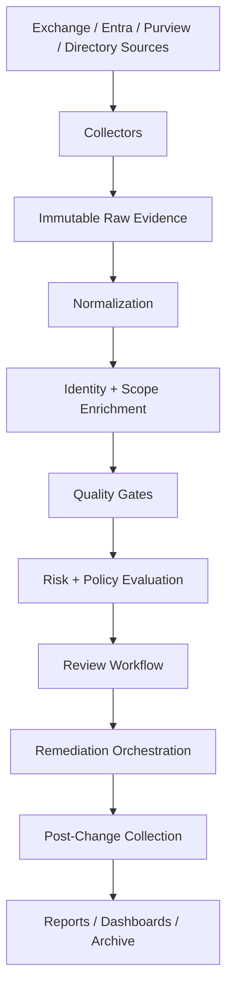

import ComparisonTable from "../../components/content/ComparisonTable.astro";
import Callout from "../../components/ui/Callout.astro";
import ArticleImageLightbox from "../../components/article/widgets/ArticleImageLightbox.astro";
import ExchangePermissionAuditMatrix from "../../components/content/ExchangePermissionAuditMatrix.astro";
import ExchangePermissionNormalizationViewer from "../../components/content/ExchangePermissionNormalizationViewer.astro";
import ExchangePermissionReviewWorkflow from "../../components/content/ExchangePermissionReviewWorkflow.astro";

import exchangePermissionAuditingControlPlaneMap from "../../assets/images/articles/exchange-powershell/exchange-permission-auditing-control-plane-map.png";
import exchangePermissionAuditingNormalizationModel from "../../assets/images/articles/exchange-powershell/exchange-permission-auditing-normalization-model.png";
import exchangePermissionAuditingEvidenceLifecycle from "../../assets/images/articles/exchange-powershell/exchange-permission-auditing-evidence-lifecycle.png";

# Exchange Permission Auditing: From Permission Reports to Effective Access

Permission auditing often starts with a deceptively simple request:

> **Who has access to this mailbox?**

A command such as:

```powershell
Get-MailboxPermission -Identity 'finance@contoso.com'
```

can produce an answer.

But it does not necessarily produce **the answer**.

The same person may have Full Access through a group. Another may have Send As. Someone else may have a calendar permission. A service principal may have application access. A disabled account may still appear in a permission entry. A permission can also be inherited, denied, unresolved, or controlled by another authorization system.

That is why a serious Exchange permission audit cannot be treated as a one-command report.

It is a **data and assurance problem**.

The objective is to determine:

- **what access exists**
- **who or what receives it**
- **which target it applies to**
- **how it was granted**
- **whether the identity and scope are still valid**
- **whether the access is approved**
- **and whether there is evidence that the access was actually used**

These are different questions and often require different evidence.

<Callout type="information" title="Entitlement is not usage">
A configured permission proves that access **can** exist. It does not prove that the permission **was used**. Entitlement evidence, change evidence, and usage evidence should therefore be collected and reviewed separately.
</Callout>

## 1. Exchange Permissions Are Spread Across Multiple Control Planes

There is no single Exchange permission store.

Mailbox ACLs, recipient delegation, folder permissions, public-folder permissions, Exchange RBAC, group ownership, Microsoft Entra permissions, application access, and audit telemetry each describe different parts of the authorization picture.

A useful audit starts by separating these domains before comparing them.

<ArticleImageLightbox
  src={exchangePermissionAuditingControlPlaneMap.src}
  alt="Exchange permission auditing control-plane map showing mailbox permissions, recipient delegation, folder permissions, public folders, Exchange RBAC, group ownership, Microsoft Entra application access, and audit telemetry feeding a central normalization and assurance layer."
/>

<ExchangePermissionAuditMatrix />

<ComparisonTable
  caption="Major Exchange permission audit domains"
  columns={[
    { label: "Domain" },
    { label: "What it represents" },
    { label: "Typical source" },
    { label: "Primary concern" }
  ]}
  rows={[
    {
      label: "Full Access",
      cells: ["Mailbox-content access", "`Get-MailboxPermission`", "Excessive data access, broad groups, inherited or denied entries"]
    },
    {
      label: "Send As",
      cells: ["Send as the target identity", "`Get-RecipientPermission`", "Impersonation and non-repudiation risk"]
    },
    {
      label: "Send on Behalf",
      cells: ["Send with delegate attribution", "`GrantSendOnBehalfTo`", "Untracked delegation and authority representation"]
    },
    {
      label: "Folder / calendar",
      cells: ["Folder-level roles or rights", "`Get-MailboxFolderPermission`", "Sensitive folders and calendar delegation"]
    },
    {
      label: "Public folders",
      cells: ["Public-folder client permissions", "`Get-PublicFolderClientPermission`", "Broad, Default, or Anonymous exposure"]
    },
    {
      label: "Exchange RBAC",
      cells: ["Administrative capability", "`Get-RoleGroupMember`, `Get-ManagementRoleAssignment`", "Privilege escalation and excessive scope"]
    },
    {
      label: "Applications",
      cells: ["Application and service-principal access", "Microsoft Graph / Entra plus Exchange", "Broad non-user access and credential compromise"]
    },
    {
      label: "Identity state",
      cells: ["Trustee status and lifecycle", "Directory / identity data", "Stale, blocked, external, or unaccountable access"]
    }
  ]}
/>

## 2. Full Access, Send As, and Send on Behalf Are Different

One of the easiest mistakes in permission reporting is treating mailbox delegation as one combined permission.

It is not.

**Full Access** allows a delegate to open and manage mailbox content. It does **not** grant sending rights.

**Send As** allows the delegate to send as the mailbox or group.

**Send on Behalf** also permits sending, but the delegate is represented as acting on behalf of the target.

These permissions must therefore be collected separately.

```powershell
Get-MailboxPermission -Identity 'finance@contoso.com'

Get-RecipientPermission -Identity 'finance@contoso.com'

Get-EXOMailbox `
    -Identity 'finance@contoso.com' `
    -Properties GrantSendOnBehalfTo |
    Select-Object DisplayName,GrantSendOnBehalfTo
```

<Callout type="important" title="Do not infer sending rights from Full Access">
A user can have Full Access without Send As or Send on Behalf. Sending rights must be audited independently.
</Callout>

### Automapping is not proof of complete access

Outlook automapping is associated with direct individual Full Access assignments.

Group-based Full Access does not provide the same automapping behavior. Therefore:

> **What appears automatically in Outlook is not a complete permission inventory.**

## 3. Folder and Calendar Permissions Need Their Own Audit

Mailbox-level reports are not enough.

A user may have no Full Access while still having:

- **Editor** access to a calendar
- **Reviewer** access to a folder
- **Delegate rights**
- **Granular folder permissions**

Folder names can also be localized or renamed, so a complete collector should establish identity-safe folder paths before retrieving permissions.

A useful starting point is:

```powershell
Get-MailboxFolderStatistics -Identity 'alex@contoso.com'

Get-MailboxFolderPermission `
    -Identity 'alex@contoso.com:\Calendar'
```

### Default and Anonymous are trustees too

Do not discard:

- Default
- Anonymous

They describe baseline or unauthenticated access and can be important findings.

Preserve them in raw evidence and classify them according to policy.

## 4. Public-Folder Permissions Are Another Permission System

Public-folder administration has two dimensions:

**Administrative Control**

and:

**Client Access**

They should not be confused.

A user can have Exchange RBAC capability to administer public folders without having client permissions to a specific folder.

A recursive audit can begin with:

```powershell
Get-PublicFolder -Recurse -ResultSize Unlimited
```

and then:

```powershell
Get-PublicFolderClientPermission `
    -Identity '\Corporate\Policies'
```

Pay particular attention to:

- **Owner**
- **PublishingEditor**
- **Default**
- **Anonymous**

and folders whose business ownership is unclear.

## 5. Distribution-Group Ownership Is Also Access

Permissions are not limited to mailbox content.

Group ownership can be an administrative entitlement. An owner may be able to influence membership or settings, depending on the group type and configuration.

```powershell
Get-DistributionGroup -ResultSize Unlimited |
    Select-Object DisplayName,
                  PrimarySmtpAddress,
                  ManagedBy
```

Ownership should therefore become a normalized access record:

**Target = group**

**PermissionType = Owner**

**Trustee = owner**

Prioritize:

- **large distribution groups**
- **security-sensitive groups**
- **externally visible groups**
- **business-critical groups**

Flag disabled, deleted, guest, or service identities acting as sole owners.

## 6. Exchange RBAC Must Be Audited as Effective Privilege

A role-group membership report is useful.

It is not enough.

An administrator can receive capability through:

- **role-group membership**
- **direct role assignments**
- **user assignments**
- **security-group assignments**
- **custom management roles**
- **custom write scopes**

The effective relationship is better understood as:

**Role Group → Member → Role Assignment → Role → Scope**

For example:

```powershell
Get-RoleGroup |
    ForEach-Object {
        Get-RoleGroupMember -Identity $_.Identity
    }
```

and:

```powershell
Get-ManagementRoleAssignment -GetEffectiveUsers |
    Select-Object Role,
                  RoleAssigneeName,
                  RoleAssigneeType,
                  RecipientWriteScope,
                  ConfigWriteScope
```

A row such as:

> "User is a member of Organization Management"

does not fully explain effective privilege. The audit needs to understand the capability and scope created by that membership.

## 7. Application and Service-Principal Access Must Be Included

Applications can access Exchange data without appearing as mailbox delegates.

A serious audit should include:

- **application registrations**
- **enterprise service principals**
- **application-role assignments**
- **delegated permissions**
- **administrative consent**
- **credentials**
- **owners**
- **publisher/verification context**
- **last-sign-in information where available**
- **Exchange service-principal registration**
- **mailbox scope**

Microsoft Graph / Entra provides much of the identity and consent context, while Exchange provides Exchange-specific service-principal and resource authorization information.

```powershell
Get-ServicePrincipal -Identity $ServicePrincipalObjectId

Test-ServicePrincipalAuthorization `
    -Identity $ServicePrincipalObjectId `
    -Resource 'finance@contoso.com'
```

The goal is to determine:

> **What can this workload access, and what resource population does that access actually cover?**

## 8. Build One Canonical Permission Record

Once several sources are collected, comparing them directly becomes difficult.

A Full Access object does not look like a folder-permission object. A role assignment does not look like a Graph permission. A public-folder ACL does not look like an application role.

The solution is a **canonical audit model**:

<ArticleImageLightbox
  src={exchangePermissionAuditingNormalizationModel.src}
  alt="Exchange permission normalization model showing raw source records transformed into atomic canonical entitlement rows, enriched with identity and scope data, and presented as configured-access, effective-access, risk, and review views."
/>

<ExchangePermissionNormalizationViewer />

```text
Target
TargetType
PermissionType
Trustee
TrusteeType
Inherited
Deny
Source
Scope
ReviewStatus
EvidenceDate
```

Each source record is transformed into one or more **atomic entitlement rows**.

<ComparisonTable
  caption="Normalized permission examples"
  columns={[
    { label: "Target" },
    { label: "Permission" },
    { label: "Trustee" },
    { label: "Audit Context" }
  ]}
  rows={[
    {
      label: "`finance@contoso.com`",
      cells: [
        "FullAccess",
        "Alex Wilber",
        "User · MailboxPermission · Approved"
      ]
    },
    {
      label: "`finance@contoso.com`",
      cells: [
        "SendAs",
        "Finance Operators",
        "Group · RecipientPermission · PendingOwner"
      ]
    },
    {
      label: "`finance@contoso.com`",
      cells: [
        "Editor",
        "Megan Bowen",
        "User · MailboxFolderPermission · Approved"
      ]
    },
    {
      label: "`\\Corporate\\Policies`",
      cells: [
        "PublishingEditor",
        "Default",
        "Default · PublicFolderClientPermission · Remediate"
      ]
    },
    {
      label: "`Organization Management`",
      cells: [
        "RoleGroupMember",
        "Legacy Admin",
        "User · ExchangeRBAC · Remediate"
      ]
    },
    {
      label: "`Exchange mailboxes`",
      cells: [
        "Mail.ReadWrite",
        "Invoice Processing App",
        "ServicePrincipal · Application access · ApprovedException"
      ]
    }
  ]}
/>

The canonical model is the **analysis layer**, not a replacement for raw evidence. Keep the original output so every normalized row can be traced to its source.

## 9. Preserve Raw Evidence

A common mistake is to normalize too early.

If inheritance, Deny flags, identifiers, source details, or other properties are discarded during transformation, later investigation loses context.

Keep separate:

- **raw evidence**
- **normalized evidence**
- **extension data**
- **collection metadata**
- **review decisions**

A useful run manifest should include:

- **CollectionRunId**
- **TenantId**
- **CollectorVersion**
- **script/module versions**
- **UTC timestamps**
- **raw identifiers**
- **hashes**
- **errors**
- **throttling**
- **coverage status**

This makes later audits reproducible rather than dependent on how an original report happened to be generated.

<Callout type="best-practice" title="Never silently lose data during normalization">
Rows missing critical fields such as Target, PermissionType, Trustee, Source, or EvidenceDate should move to a quarantine or data-quality path. They should not disappear from the report.
</Callout>

## 10. Identity Resolution Is Part of the Audit

Permission data can contain:

- **SID**
- **GUID**
- **distinguished name**
- **deleted-object identifier**
- **legacy identity**
- **mail address**
- **display name**

Resolve these to stable identities wherever possible.

A sensible resolution order is:

**Object ID / GUID** → **SID** → **External directory object ID** → **Distinguished name** → **Primary SMTP / Proxy address** → **UPN** → **Alias** → **Display name as a last resort**

Names and email addresses are presentation attributes, not durable identity keys when stronger identifiers are available.

### Unresolved does not mean harmless

An unresolved SID may represent stale access, historical evidence, a foreign security principal, a deleted identity, or another condition requiring investigation.

Do not automatically remove unresolved entries.

Instead:

- **preserve the raw identifier**
- **classify the resolution state**
- **check target sensitivity**
- **check inheritance and Deny flags**
- **validate service behavior**
- **then make a documented remediation decision**

## 11. Disabled, Hidden, Guest, and Inactive Accounts Need Context

Identity state provides useful risk context, but it should not be reduced to a single "inactive" flag.

A mailbox being hidden from address lists does not mean its account is disabled.

A disabled account may still have group membership or delegated access.

An inactive sign-in pattern is a risk signal, not proof that access is unnecessary.

Enrich trustees with appropriate information such as:

- **account enabled state**
- **sign-in blocking**
- **guest status**
- **last-sign-in indicators where available**
- **group membership**
- **privileged-role state**
- **recipient visibility**
- **mailbox state**

<ComparisonTable
  caption="Identity-state interpretation"
  columns={[
    { label: "Condition" },
    { label: "Meaning" },
    { label: "Audit response" }
  ]}
  rows={[
    {
      label: "Hidden from address lists",
      cells: ["Discoverability control.", "Review ownership and purpose; do not treat it as disabled."]
    },
    {
      label: "Disabled / sign-in blocked",
      cells: ["Interactive use is constrained.", "Remove unnecessary access and check automation dependencies."]
    },
    {
      label: "Soft-deleted / inactive mailbox",
      cells: ["Lifecycle or retention state may preserve data.", "Use lifecycle evidence and avoid unsupported destructive action."]
    },
    {
      label: "Guest / external",
      cells: ["Cross-boundary identity.", "Validate sponsor, expiry, and least privilege."]
    },
    {
      label: "No recent sign-in",
      cells: ["Potential staleness; telemetry can be incomplete.", "Seek owner attestation and consider non-interactive use."]
    }
  ]}
/>

## 12. Inherited, Group-Mediated, and Effective Access Are Different

An audit needs to distinguish between the **configured grant** and the **effective result**.

Consider Full Access granted to a group.

The configured entitlement is:

> **Finance Operators → finance@contoso.com → Full Access**

If the group contains ten users, the audit can derive ten effective access relationships.

But the original group grant must remain authoritative. Otherwise, the report loses the reason a particular user has access.

### Preserve inheritance and Deny

An inherited ACE should remain marked as inherited. If it violates policy, remediation usually belongs at its origin rather than as a local change that will reappear.

Do not remove Deny records during ingestion.

Keep raw allow and Deny evidence, then let the effective-access engine apply source-appropriate rules.

<Callout type="important" title="Effective access is a computed view">
An effective-access report depends on group membership, inheritance, scope evaluation, token timing, and other rules. It should never replace the configured-grant report.
</Callout>

## 13. Separate Configured Access from Usage Evidence

A permission inventory answers:

> **Who can access this?**

Audit and activity evidence can help answer:

> **Who actually accessed this?**

The two datasets should therefore be correlated rather than confused.

For example:

**Permission inventory**

> Alex has Full Access to Finance.

**Audit evidence**

> Alex accessed the Finance mailbox during the review period.

Those are separate facts.

A good governance process needs both when investigating sensitive access.

## 14. Risk Should Be Explicit and Explainable

Not every permission deserves the same review priority.

Full Access on an ordinary team mailbox is different from Send As on an executive mailbox.

A narrowly scoped, monitored service principal is different from an application with broad mailbox access and no accountable owner.

A transparent scoring model can help:

> **RiskScore** = TargetSensitivity + PermissionImpact + TrusteeRisk + Breadth + Staleness + EvidenceGap - CompensatingControls

This is a suggested framework, not a Microsoft product formula.

Useful signals include:

- **Target Sensitivity** — executive, legal, finance, security, regulated, privileged.
- **Permission Impact** — Send As, Full Access, high-power RBAC, broad application access.
- **Trustee Risk** — guest, unresolved, disabled, unowned service principal, broad nested group.
- **Breadth** — tenant-wide scope, large group, dynamic population.
- **Staleness** — expired exception, old evidence, no owner, no recent review.
- **Evidence Gap** — unknown scope, failed collector, unresolved identity.
- **Compensating Controls** — time bounds, strong ownership, monitoring, constrained scope, tested denial.

## 15. Review Status Needs a Lifecycle

An audit report is not complete when it says:

> "This permission exists."

Someone has to decide whether it is approved, remediated, expired, unresolved, or otherwise acceptable.

A useful status lifecycle is:

<ComparisonTable
  caption="Permission review lifecycle"
  columns={[
    { label: "Status" },
    { label: "Meaning" }
  ]}
  rows={[
    { label: "Unreviewed", cells: ["Collected and validated; no owner decision yet."] },
    { label: "PendingOwner", cells: ["Assigned to the accountable owner."] },
    { label: "PendingSecurity", cells: ["Requires security, privacy, legal, or application-owner assessment."] },
    { label: "Approved", cells: ["Business need confirmed and required controls met."] },
    { label: "ApprovedException", cells: ["Exception approved with compensating controls and an expiry."] },
    { label: "Remediate", cells: ["Owner or security decision requires a change."] },
    { label: "RemediationInProgress", cells: ["Change or automation is active."] },
    { label: "Removed", cells: ["Post-change evidence confirms the entitlement is gone."] },
    { label: "Rejected", cells: ["Access is not approved or evidence is insufficient."] },
    { label: "Unresolved", cells: ["Identity, scope, or evidence is not yet sufficient."] },
    { label: "Expired", cells: ["The previous approval or exception is no longer valid."] }
  ]}
/>

The status should also carry:

- **reviewer**
- **decision date**
- **decision reason**
- **ticket**
- **exception reference**
- **expiry date**
- **next review date**
- **control owner**
- **evidence links**

## 16. Build the Audit as a Pipeline

A mature permission-auditing process is easier to operate when it follows a repeatable lifecycle:

<ArticleImageLightbox
  src={exchangePermissionAuditingEvidenceLifecycle.src}
  alt="Exchange permission audit evidence lifecycle showing Plan, Discover, Collect, Normalize, Resolve and Enrich, Validate, Analyze, Review, Remediate, Attest and Retain, and Monitor as a repeating assurance loop."
/>

<ExchangePermissionReviewWorkflow />

### Plan

Define the tenant, scope, targets, permission taxonomy, risk rules, retention, owners, and acceptance criteria.

### Discover

Inventory mailboxes, folders, public folders, groups, role groups, applications, service principals, scopes, and identity sources.

### Collect

Use authenticated, least-privilege collectors and capture raw output, command/API metadata, errors, throttling, and timestamps.

### Normalize

Create atomic entitlement rows while preserving source meaning, permission arrays, identifiers, inheritance, and Deny.

### Resolve and enrich

Add identity state, group lineage, ownership, target sensitivity, application credentials, and resource scope.

### Validate

Reconcile counts and coverage, sample against administrative views, and test application authorization.

### Analyze

Produce configured and effective views, risk scores, policy findings, snapshot differences, and relevant change correlations.

### Review

Route findings to accountable owners with enough context to make a decision.

### Remediate

Possible outcomes include:

- **remove**
- **narrow**
- **replace group membership**
- **expire**
- **resolve identity**
- **document exception**

Then collect again.

### Attest and retain

Keep the decision, reviewer, ticket, before state, change, after state, and next review date.

### Monitor

Move beyond periodic snapshots with:

- **delta collection**
- **privileged-access alerts**
- **exception-expiry alerts**
- **scope-drift monitoring**
- **coverage metrics**
- **collector-health checks**

This operating model is the core of the framework.

## 17. Architect the Evidence Flow

The end-to-end architecture is:



The important design principle is that **raw evidence remains available throughout the process**.

Analytics, review policy, and risk models can evolve without losing the evidence needed to explain a finding.

## 18. Collection Engineering Matters

A good data model cannot rescue an incomplete collection process.

A collector that silently skips mailboxes has produced incomplete evidence.

A collector that changes versions without recording them weakens reproducibility.

A collector that hits throttling without recording partial coverage can create a misleading report.

Collection should therefore include:

- **pagination**
- **result-size handling**
- **transient retry**
- **throttling backoff**
- **checkpointing**
- **partial-run status**
- **non-terminating error capture**
- **coverage reconciliation**
- **collector versioning**

Partition large tenants by stable keys or recipient types and reconcile coverage against an authoritative inventory.

<Callout type="warning" title="A successful script is not necessarily successful evidence">
If a collector finishes while silently skipping objects because of errors or throttling, the audit result is incomplete. Partial coverage must be visible and reconciled before the snapshot is accepted.
</Callout>

## 19. Choosing the Right Collection Technology

No single tool covers the entire permission landscape.

<ComparisonTable
  caption="Permission-auditing implementation approaches"
  columns={[
    { label: "Approach" },
    { label: "Strength" },
    { label: "Limitation" },
    { label: "Best use" }
  ]}
  rows={[
    { label: "Admin portals", cells: ["Accessible and useful for spot checks.", "Not scalable and may omit indirect detail.", "Sampling and owner validation."] },
    { label: "Exchange Online PowerShell", cells: ["Broad Exchange coverage and automation.", "Multiple control planes, throttling, source-specific semantics.", "Primary Exchange entitlement collection."] },
    { label: "Microsoft Graph / Entra", cells: ["Strong application, identity, and consent data.", "Exchange-specific permissions may require Exchange cmdlets.", "Identity enrichment and application access."] },
    { label: "Purview Audit", cells: ["Change and activity evidence.", "Retention, licensing, latency, and coverage vary.", "Corroborating change and usage evidence."] },
    { label: "Commercial governance tools", cells: ["Dashboards and packaged workflow.", "Cost and coverage/logic differences.", "Operational acceleration after source validation."] },
    { label: "Custom data pipeline", cells: ["Maximum transparency and integration.", "Highest engineering burden.", "Large or regulated environments requiring defensible evidence."] }
  ]}
/>

A practical pattern is a **hybrid architecture**:

**Exchange Online PowerShell** for Exchange-native permission data

**Microsoft Graph / Entra** for identities and application grants

**Purview Audit** for change and activity evidence

**Versioned normalization and review pipeline** for correlation, analysis, and governance

## 20. Review Privileged Access First

Risk-based certification is more practical than treating every row identically.

Prioritize:

- **executive mailboxes**
- **legal**
- **HR**
- **finance**
- **security**
- **break-glass**
- **journal/discovery**
- **privileged role groups**
- **broad groups**
- **applications**
- **unresolved trustees**
- **disabled accounts**

<ComparisonTable
  caption="Suggested review cadence by risk"
  columns={[
    { label: "Risk" },
    { label: "Suggested cadence" }
  ]}
  rows={[
    {
      label: "Critical",
      cells: ["Monthly or event-driven"]
    },
    {
      label: "High",
      cells: ["Quarterly"]
    },
    {
      label: "Medium",
      cells: ["Semiannual"]
    },
    {
      label: "Low",
      cells: ["Annual"]
    }
  ]}
/>

These are framework recommendations, not universal compliance requirements; align them with policy, regulation, risk appetite, licensing, and operational capacity.

## 21. Detection Rules Turn the Inventory into Assurance

Once the normalized dataset exists, the audit can look for repeatable patterns such as:

**Full Access without separately documented sending rights**

**Group-based Full Access where automapping is expected**

**Unresolved trustee on a sensitive target**

**Disabled account retaining direct access**

**Default or Anonymous public-folder access exceeding policy**

**Send As on an executive or finance mailbox**

**Application access with tenant-wide or unknown scope**

**Service principal without accountable ownership**

**Role-group membership held by a guest or disabled identity**

**Sole distribution-group owner becoming inactive**

**Inherited permission violating policy**

**Expired or missing review evidence**

These create a consistent detection layer instead of relying on manual searching.

## 22. Remediation Must Produce New Evidence

### Download the audit workbook

Use the workbook to record audit scope, collection coverage, evidence quality, finding decisions, remediation, post-change validation, and attestation.

[Download the Exchange Permission Audit Workbook](/downloadable/exchange/exchange-permission-auditing-framework/Exchange-Permission-Audit-Workbook.pdf)

### Download the evidence checklist

Use the checklist alongside the collection and review process to verify that evidence, identity resolution, coverage, authorization testing, remediation, and retention gates have been completed.

[Download the Exchange Permission Audit Evidence Checklist](/downloadable/exchange/exchange-permission-auditing-framework/Exchange-Permission-Audit-Evidence-Checklist.pdf)

Removing an entitlement is not the end of the audit.

Capture:

- **why the access was removed**
- **who approved it**
- **what command or API request was executed**
- **what the system returned**
- **the before state**
- **the after state**
- **the post-change re-collection**

The final evidence should demonstrate:

> **What existed → why it was considered a problem → what changed → who authorized it → what exists now**

That is what makes permission cleanup auditable.

## 23. Continuous Permission Assurance

A quarterly snapshot is useful.

It should not be the end state for high-risk environments.

Move toward:

- **delta monitoring**
- **privileged-access alerts**
- **scope-drift detection**
- **application authorization testing**
- **exception-expiry monitoring**
- **collector-health metrics**
- **remediation SLA tracking**
- **repeat-finding analysis**
- **independent sampling**

This changes the model from:

> "We performed an access review."

to:

> **"We continuously know how access changes and can prove how significant changes were handled."**

## Conclusion

A reliable Exchange permission audit is not a prettier version of `Get-MailboxPermission`.

It is a system for understanding access.

That system has to collect multiple permission domains, preserve their meaning, resolve identities using stable identifiers, retain inheritance and Deny information, expand group-mediated access without losing the original grant, include applications and service principals, and distinguish configured entitlement from actual usage.

Then it has to turn the inventory into a decision process.

Access needs an owner.

Exceptions need expiry.

Findings need evidence.

Remediation needs authorization.

And the resulting state needs to be collected again.

The most useful mental model is:

**Collect → Normalize → Resolve → Validate → Analyze → Review → Remediate → Verify → Monitor**

That turns Exchange permission auditing from a periodic spreadsheet exercise into an **evidence-driven assurance capability**.

Once that foundation exists, the same dataset can support access certification, privileged-mailbox review, application governance, remediation workflows, compliance investigations, and continuous monitoring without rebuilding the audit from scratch each time.
