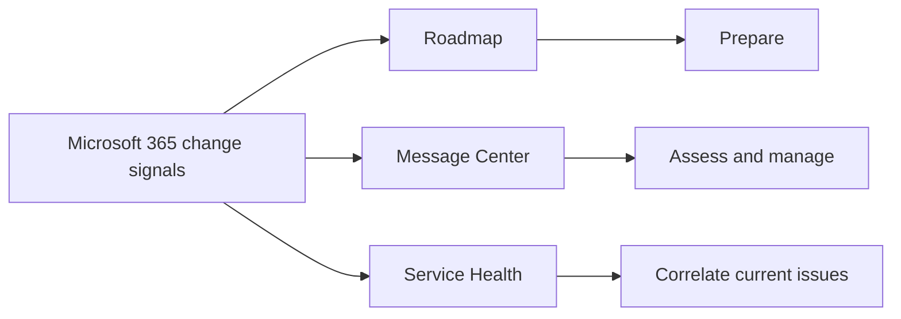
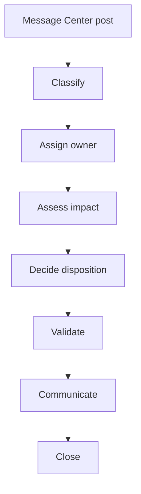
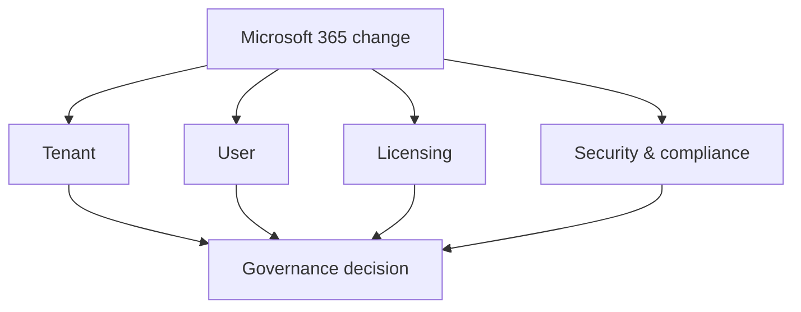
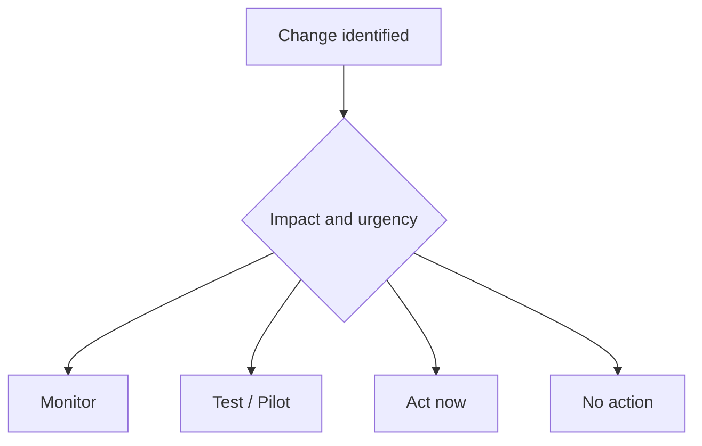
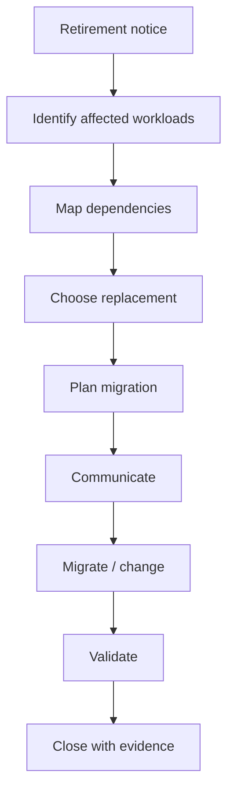
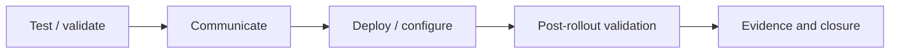
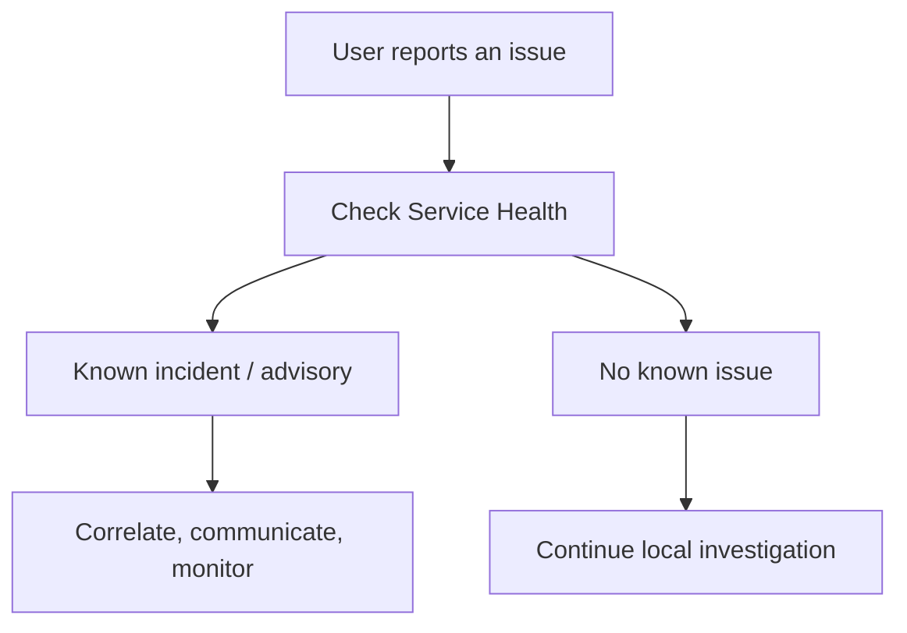
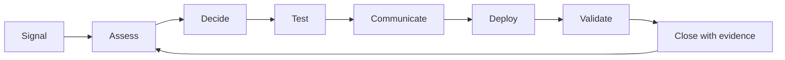

import ComparisonTable from "../../components/content/ComparisonTable.astro";
import Callout from "../../components/ui/Callout.astro";
import Microsoft365ChangeAssessment from "../../components/content/Microsoft365ChangeAssessment.astro";

Microsoft 365 administration is no longer a matter of configuring a service and waiting for the next major upgrade cycle.

The platform changes continuously.

Features are introduced, modified, rolled out, and retired, sometimes affecting tenant configuration, users, licensing, security, compliance, and support operations.

Microsoft's own change-management guidance describes this as an environment of continuous service change and emphasizes assessing impact, prioritizing work, and making informed decisions.

The question is no longer:

> **"Did we read the update?"**

It is:

> **"What does this change mean for our environment, who owns it, what should we do, and how do we know it was handled correctly?"**

That requires a repeatable operating model.

---

## 1. Treat Microsoft 365 Updates as Signals

Microsoft provides several sources for understanding change, but they answer different questions.

<ComparisonTable
  caption="Microsoft 365 change signals and what they are best used for"
  columns={[
    { label: "Source" },
    { label: "Primary purpose" },
    { label: "Administrator question" }
  ]}
  rows={[
    {
      label: "Microsoft 365 Roadmap",
      cells: ["Horizon scanning", "What should we prepare for?"]
    },
    {
      label: "Message Center",
      cells: ["Planned tenant-relevant change", "What is changing and what action may be required?"]
    },
    {
      label: "Service Health",
      cells: ["Current incidents and advisories", "Is something already happening?"]
    }
  ]}
/>

Roadmap provides a broad view of planned and emerging capabilities.

Message Center is the operational source for planned changes relevant to the organization.

Service Health is for current incidents, advisories, and known service issues.

<Callout type="information" title="Use the right signal for the right question">
Roadmap helps you look ahead. Message Center helps you manage planned change. Service Health helps you understand current operational problems.
</Callout>

---

## 2. Message Center Is a Change-Management Queue

Message Center should not be treated as a passive notification inbox.

A useful way to read a post is to ask:

- What is changing?
- Who is affected?
- When might it happen?
- Is action required?
- Who owns the response?

Microsoft provides filters and indicators such as relevance, timing, **Act by**, **Retirement**, **Major update**, and impact categories to help administrators prioritize changes.

So the real workflow is:

Reading the message is the beginning of the process, not the end.

---

## 3. Do Not Treat Rollout Dates as Guarantees

One of the easiest mistakes is treating a roadmap or Message Center date as a guaranteed tenant deployment date.

Microsoft says it cannot provide the exact date a change will reach an individual organization and provides timing based on the confidence available. Release options are also planning mechanisms rather than absolute guarantees.

The better approach is:

> **Plan around readiness windows, not a single assumed deployment date.**

That means identifying when you need to test, communicate, or prepare support rather than simply recording a calendar date.

---

## 4. Assess Every Meaningful Change Through Four Lenses

Once a change has been identified, assess it from four perspectives:

### Tenant impact

Check configuration, policies, integrations, scripts, automations, clients, and tenant-wide settings.

### User impact

Check workflow changes, UI changes, training needs, accessibility, documentation, and likely help-desk impact.

### Licensing impact

Check whether the feature is included in existing subscriptions, requires an add-on, or affects only certain users.

### Security and compliance impact

Check data handling, retention, DLP, eDiscovery, auditing, access controls, Entra integration, and regulatory obligations.

<Callout type="important" title="A feature change can be more than a feature change">
A seemingly small Microsoft 365 update can affect tenant configuration, users, licensing, and security or compliance controls at the same time.
</Callout>

---

{/* COMPONENT PLACEHOLDER: Microsoft365ChangeAssessment */}
<Microsoft365ChangeAssessment />

---

## 5. Decide What Happens Next

Not every change deserves a project.

A practical disposition model is:

The practical goal is not to turn every announcement into a project.

It is to make sure significant changes receive proportional attention.

---

## 6. Use Early-Release Audiences Deliberately

Targeted Release can provide earlier exposure for IT professionals and power users so administrators can test features, prepare communications, update documentation, and ready the help desk.

Microsoft's newer release model also includes Frontier, Standard, and Deferred for eligible modern updates.

The practical principle is:

> **Use early exposure when you have a clear validation objective.**

---

## 7. Treat Retirements as Migration Work

A retirement should not remain an FYI item.

Treat retirement notices as deadline-driven migration work, including workload identification, dependency mapping, replacement planning, communication, training, security/compliance review, licensing review, and evidence of completion.

<Callout type="warning" title="Retirements need ownership">
A retirement with business-critical dependencies should become an owned migration program with milestones, not remain in an FYI queue.
</Callout>

---

## 8. Validate, Communicate, and Close the Change

A change is not complete when the configuration changes.

The operating cycle should continue through:

After rollout, check the feature state, user impact, help-desk activity, audit and security signals, adoption measures, and business feedback.

Retain evidence such as:

- Message ID;
- decision notes;
- test evidence;
- communications;
- approvals;
- configuration changes;
- post-rollout findings.

That creates an important distinction:

> **Change implemented ≠ change completed.**

Completion means the organization has evidence that the intended result was achieved.

---

## 9. Use Service Health Before Assuming a Local Problem

Change management also applies when the problem is unexpected.

When users report an issue, check Service Health before assuming the problem is local.

If Microsoft already has an active incident or advisory, correlate the service impact, communicate status, preserve evidence, and monitor the issue.

<Callout type="tip" title="Check the service before changing the configuration">
Before spending an hour troubleshooting locally, check whether Microsoft already knows about the problem.
</Callout>

---

## 10. The Operating Model

The complete model can now be reduced to one loop:

The loop matters because every completed change should improve how the next change is handled.

That is the difference between **reacting to announcements** and **operating a change-management process**.

---

## Conclusion

Microsoft 365 is going to keep changing.

The goal is not to prevent that change. It is to make change **visible, owned, assessed, tested, communicated, validated, and traceable**.

A practical model is:

> **Roadmap → anticipate**  
> **Message Center → assess and manage**  
> **Service Health → correlate current issues**  
> **Governance → decide**  
> **Testing → validate**  
> **Communication → prepare people**  
> **Evidence → prove closure**

Message Center should therefore be treated as more than a stream of announcements.

<Callout type="best-practice" title="Operationalize change">
Treat Microsoft 365 change as managed operational work, not as notification reading.
</Callout>

That is how change management moves from a reactive administrative task to a repeatable operational capability.
