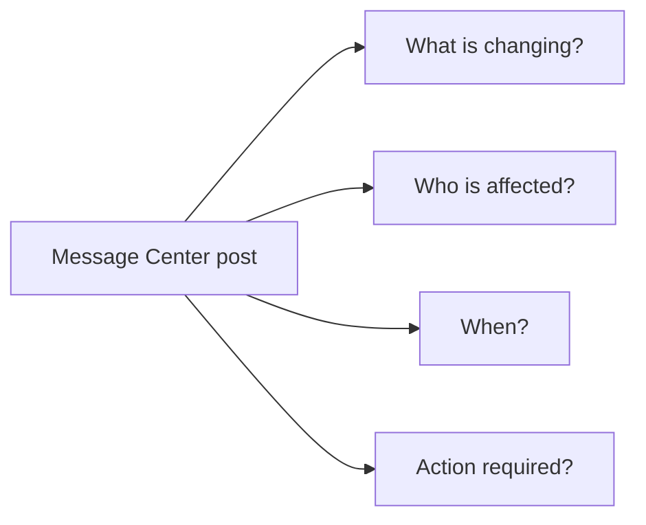
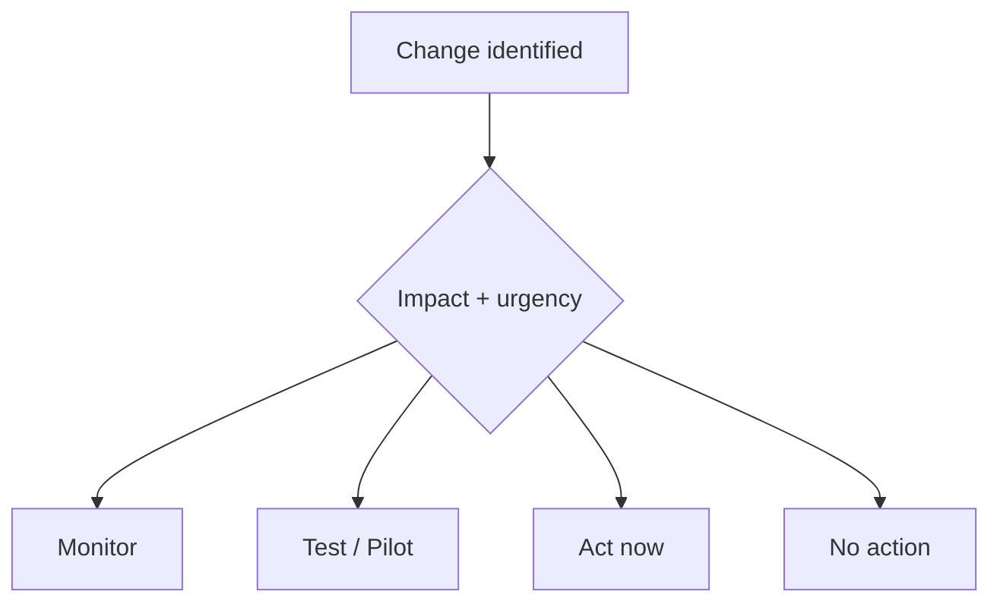
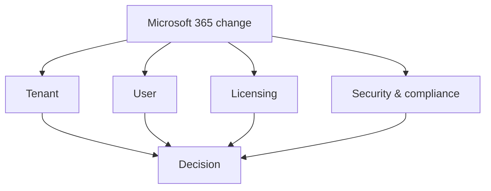
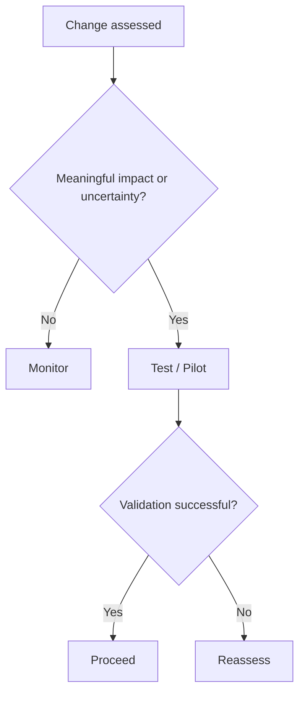
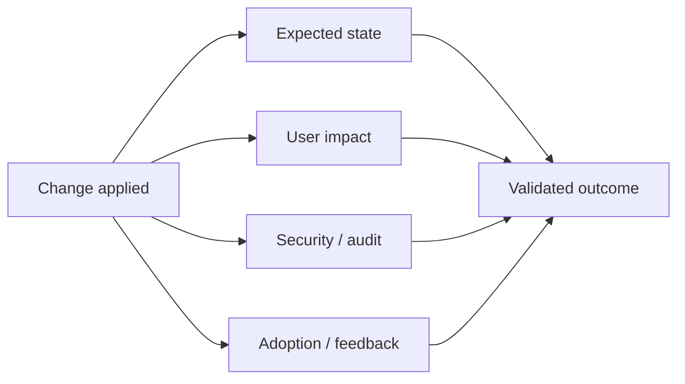
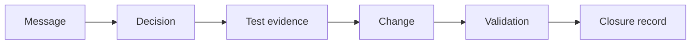
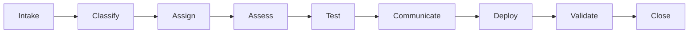
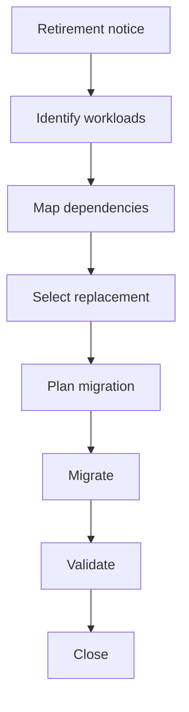

import Callout from "../../components/ui/Callout.astro";
import MessageCenterChangeReadiness from "../../components/content/MessageCenterChangeReadiness.astro";
import ArticleImageLightbox from "../../components/article/widgets/ArticleImageLightbox.astro";
import messageCenterChangeRecord from "../../assets/images/articles/message-center-change-management/message-center-change-record.png";

A Message Center notification is not the change.

It is the **starting signal**.

The real administrative work begins when you determine what the message means for your organization, who needs to own it, what needs to be tested, how users should be prepared, and how the result will be verified.

Microsoft's guidance supports a workflow that moves from intake and ownership through impact assessment, disposition, validation, communication, deployment, post-rollout review, and evidence-based closure.

The operating principle is:

> **Turn meaningful Message Center posts into managed work, not unread notifications.**

<ArticleImageLightbox
  src={messageCenterChangeRecord.src}
  alt="Microsoft 365 change-management record showing Message Center intake details, four impact assessment lenses, change disposition, preparation and deployment activities, post-rollout validation, and closure evidence."
/>

---

## 1. Start With the Message

Before assigning work, establish what the notification is actually telling you.

Capture:

- what is changing;
- why it is changing;
- which services are affected;
- who may be affected;
- expected timing;
- whether an **Act by** date exists;
- whether the message is a **Major update** or **Retirement**;
- whether Microsoft identifies administrator action.

Message Center provides filters and indicators that help administrators prioritize this information, including relevance, timing, action deadlines, and impact categories.

The goal is to build enough context to make the next decision.

---

## 2. Classify the Change

Not every message deserves the same response.

A practical disposition model is:

Use **Monitor** when the change matters but no immediate action is required.

Use **Test / Pilot** when validation is useful before broader exposure.

Use **Act now** for deadlines, retirements, security or compliance impact, required administrative action, or significant disruption.

Use **No action** when the change does not require intervention.

<Callout type="tip" title="Do not over-process every update">
The goal is proportional change management. A meaningful change deserves structured work; an informational update may only need to be monitored.
</Callout>

---

## 3. Assign an Owner

Once a message requires action, give it an owner.

For some changes, that may be the Microsoft 365 administrator.

For others, ownership may involve:

- security;
- compliance;
- licensing;
- application owners;
- help desk;
- business stakeholders.

The important rule is:

> **If everyone owns the change, nobody necessarily owns the outcome.**

Assign a primary owner and, where appropriate, a backup for changes that require action, risk review, communication, or validation.

---

## 4. Assess the Four Impact Areas

Every meaningful change should pass through four lenses:

### Tenant

Check configuration, policies, integrations, automation, scripts, clients, and tenant-wide settings.

### User

Check changed workflows, user experience, training, documentation, accessibility, and likely help-desk impact.

### Licensing

Check plan requirements, add-ons, affected users, and possible access or cost implications.

### Security and compliance

Check data handling, retention, auditing, DLP, eDiscovery, access controls, Entra integration, and regulatory requirements.

The purpose is not to perform the same depth of assessment for every update. It is to identify the impact areas that could change the disposition.

---

## 5. Decide Whether the Change Needs Testing

Testing should answer a specific question:

> **Will this change affect our users, configuration, integrations, or controls in the way Microsoft describes?**

Targeted Release users, power users, or a test tenant can provide controlled validation for appropriate changes.

Testing is valuable when it reduces uncertainty—not simply because a test environment exists.

---

## 6. Prepare People Before the Change Arrives

Technical validation is only part of readiness.

If the change affects users, prepare:

- user communications;
- help-desk guidance;
- documentation;
- training;
- known-issue information;
- champion or power-user feedback.

A useful rule is:

> **If users are likely to ask "What changed?", prepare the answer before rollout.**

---

## 7. Deploy or Configure

Once the change has been assessed, tested, and communicated, apply the required action.

Depending on the change, that might mean:

- modifying tenant configuration;
- changing policies;
- updating licenses;
- changing integrations;
- updating clients;
- enabling or disabling administrative controls.

If the required administrative control is unavailable, document the residual risk and escalation path rather than treating the item as complete.

---

## 8. Validate the Result

A change is not complete simply because the configuration changed.

After rollout, verify:

- the expected feature or configuration state;
- user impact;
- help-desk activity;
- security and audit signals;
- adoption;
- business feedback.

The question is no longer:

> "Did we deploy it?"

It is:

> **"Did the change produce the expected result?"**

---

## 9. Close With Evidence

Closure is what turns a completed task into a traceable administrative record.

Retain evidence such as:

- Message ID;
- decision notes;
- test evidence;
- approvals;
- communications;
- configuration changes;
- post-rollout findings.

This gives you something useful later:

> **What changed, what did we decide, what did we test, what happened, and who approved it?**

---

## 10. The Complete Workflow

The entire process can now be reduced to:

The sequence is straightforward:

> **Understand → Own → Assess → Validate → Act → Verify → Close**

Each stage should produce enough information or evidence to support the next.

---

## 11. What Changes When the Notification Is a Retirement?

Retirements deserve a different level of attention.

A retirement can require:

- affected workload identification;
- dependency mapping;
- replacement selection;
- migration planning;
- communications;
- licensing review;
- security and compliance review;
- validation;
- evidence.

Treat a retirement as deadline-driven migration work rather than an ordinary informational notification.

The workflow is the same in principle, but the **urgency, ownership, and evidence requirements are higher**.

---

## 12. Turn the Workflow Into a Readiness Check

The workflow is useful as a process. It can also be used as a quick readiness check before a change is considered complete.

<MessageCenterChangeReadiness />

Use the assessment to confirm that the change has an owner, the relevant impact areas have been reviewed, required validation has been completed, and closure evidence has been retained.

---

## Conclusion

A Message Center post is not the completed change.

It is the beginning of an administrative workflow.

A useful process is:

> **Intake → Classify → Assign → Assess → Test → Communicate → Deploy → Validate → Close**

The goal is not to create bureaucracy around every Microsoft 365 update.

It is to ensure that meaningful changes are **owned, understood, validated, and traceable**.

<Callout type="best-practice" title="Close the loop">
A Message Center item is complete when your organization can explain what changed, what decision was made, what was tested, what happened after rollout, and where the evidence is.
</Callout>

That is how a notification becomes **completed change management**.
