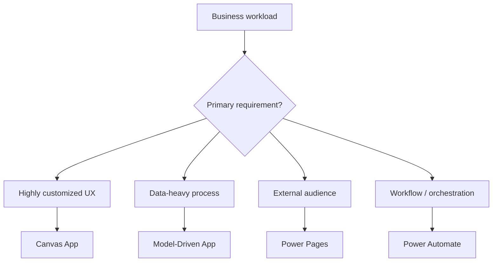
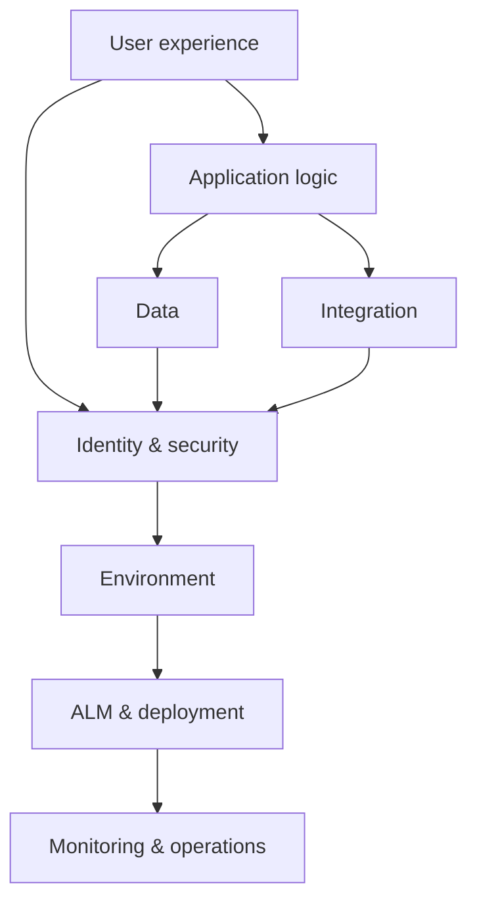
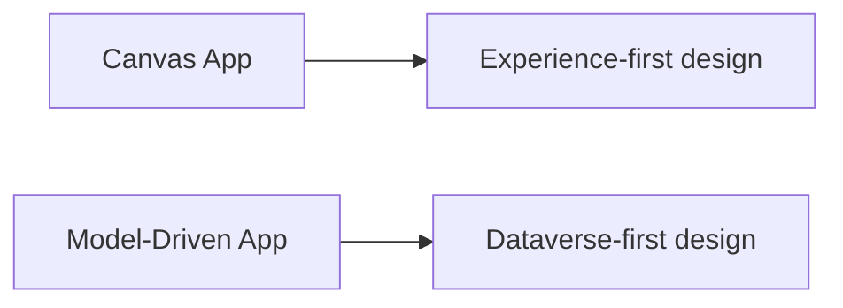
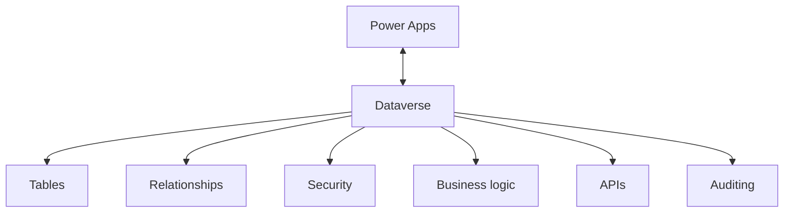
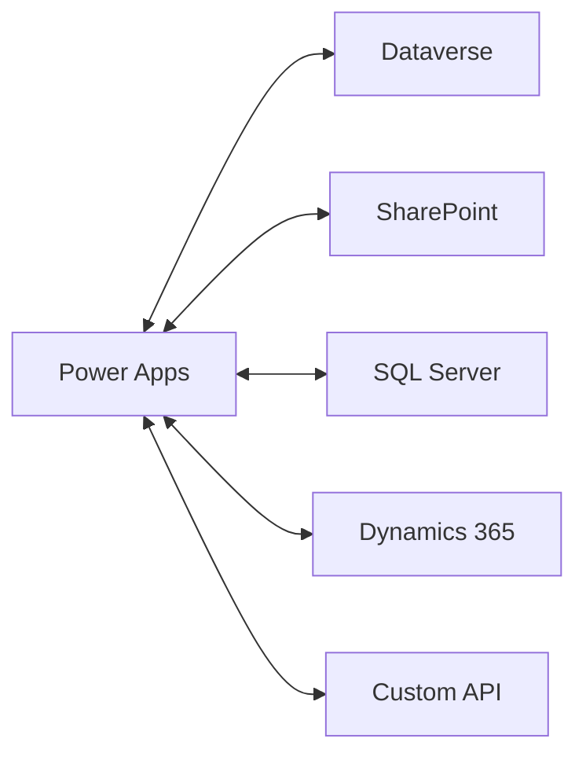
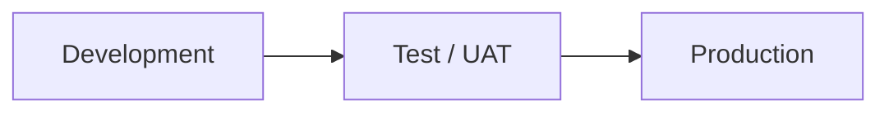
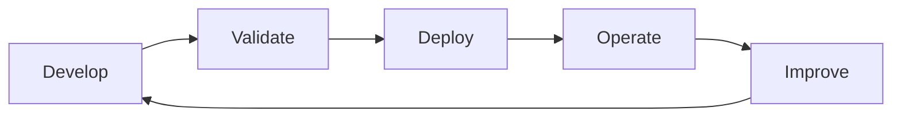
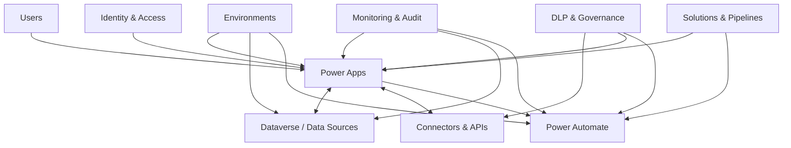
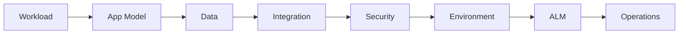

import Callout from "../../components/ui/Callout.astro";
import PowerAppsEnterpriseReadiness from "../../components/content/PowerAppsEnterpriseReadiness.astro";
import ArticleImageLightbox from "../../components/article/widgets/ArticleImageLightbox.astro";
import powerAppsEnterpriseReferenceArchitecture from "../../assets/images/articles/power-apps/power-apps-enterprise-reference-architecture.png";
import powerAppsCanvasRuntimeDataFlow from "../../assets/images/articles/power-apps/power-apps-canvas-runtime-data-flow.png";
import powerAppsAlmGovernanceLifecycle from "../../assets/images/articles/power-apps/power-apps-alm-governance-lifecycle.png";

Power Apps is easy to underestimate.

A maker can create a working application quickly, connect it to a data source, share it with users, and solve a real business problem without building a traditional software stack.

That speed is one of the platform's greatest strengths.

It is also where enterprise complexity begins.

A production Power App can involve:

**application experience → data → connectors → business logic → identity → security → environments → ALM → monitoring**

Microsoft therefore treats Power Apps as an **enterprise application platform**, not simply a low-code app builder. It works with Dataverse, Power Automate, Power Pages, Power BI/Fabric, Microsoft 365, Dynamics 365, Azure services, APIs, connectors, and governance capabilities.

The important question is no longer:

> **"Can Power Apps build this?"**

It becomes:

> **"How should this workload be architected so that it remains secure, performant, supportable, and deployable?"**

---

## 1. Start With the Workload, Not the App Type

The first architectural decision is choosing the application model that fits the workload.

**Canvas Apps** are suited to highly customized task and mobile experiences.

**Model-Driven Apps** are suited to data-heavy, process-driven Dataverse applications.

**Power Pages** are suited to secure external-facing experiences.

**Power Automate** provides workflow orchestration.

This decision affects the rest of the architecture.

---

## 2. The Enterprise Power Apps Architecture

A production Power App is better understood as a collection of layers:

> **The application experience is only one part of the workload.**

<ArticleImageLightbox
  src={powerAppsEnterpriseReferenceArchitecture.src}
  alt="Enterprise Power Apps reference architecture showing users and the Power Apps experience connected to identity and access, Dataverse and other data sources, connectors and APIs, Power Automate, environments, governance and DLP, solutions and pipelines, and monitoring and audit."
/>

---

## 3. Canvas Apps: Runtime and Scalability

Canvas Apps provide extensive control over the user experience.

That flexibility also introduces client-side and data-query considerations.

A Canvas App authenticates the user, retrieves metadata, executes initialization logic such as `OnStart`, and renders the initial screen. Data calls then travel through connectors and APIs to the underlying source, so performance issues can originate at several layers.

### Delegation is the critical scalability concept

When Power Apps can translate a Power Fx query into a query supported by the data source, filtering, sorting, and searching can occur server-side.

When a query is nondelegable, Power Apps may retrieve only the first 500 records by default, with an optional limit of 2,000, and evaluate locally. Against larger datasets, that can produce incomplete or incorrect results.

> **A Canvas App that works with a small dataset is not automatically a Canvas App that will work correctly at scale.**

<ArticleImageLightbox
  src={powerAppsCanvasRuntimeDataFlow.src}
  alt="Canvas App runtime and data flow diagram showing authentication and initialization, client rendering, connector calls, API or gateway processing, data source access, response payloads, and delegation as a key scalability boundary."
/>

For performance, focus on:

- smaller data payloads;
- delegation-safe queries;
- fewer startup calls;
- lazy loading of noncritical data;
- disciplined client memory usage;
- moving complex logic server-side where appropriate.

Power Apps Monitor and Application Insights can provide visibility into sessions, navigation, telemetry, and app-open performance.

---

## 4. Model-Driven Apps: Data First

Model-Driven Apps require Dataverse and are built around:

- tables;
- relationships;
- forms;
- views;
- charts;
- dashboards;
- app components;
- security roles.

The interface is **metadata-driven**, making Model-Driven Apps particularly suited to data-dense and process-driven applications.

The architectural distinction is:

Canvas emphasizes **how the user interacts with the application**.

Model-Driven emphasizes **the data model and business process behind the application**.

---

## 5. Dataverse, Connectors, and APIs

For enterprise Power Apps workloads, Dataverse often becomes the central data platform.

It is particularly suited to applications that need relational modeling, tables, metadata, security roles, auditing, business logic, APIs, and ALM packaging.

Power Apps can also connect to SharePoint, Microsoft 365, Dynamics 365, SQL Server, on-premises sources, and custom APIs through connectors.

The important question is not:

> **"Can Power Apps connect to it?"**

It is:

> **"Should Power Apps connect to it directly, and what happens to security, performance, ownership, and lifecycle when it does?"**

---

## 6. Security Is a Layered Model

Security should not be reduced to who can open the application.

A production workload can involve:

**Microsoft Entra ID → environment access → application access → connector permissions → Dataverse permissions → record and column security**

Dataverse provides role-based security, business units, record-level access, column-level security, hierarchy-based access, ownership, sharing, and team-based access.

> **Application access does not automatically determine data access.**

Security therefore needs to be designed alongside the data model and application architecture.

<Callout type="important" title="Think in layers">
A user being able to open a Power App does not by itself determine what data that user can read or modify. Application, connector, environment, and data permissions must be considered together.
</Callout>

---

## 7. Auditing Provides Operational Evidence

Security also raises another question:

> **How do you know what happened?**

Dataverse auditing can capture customer record changes, application or SDK access, create/update/delete operations, privilege changes, security-role changes, and other auditable activity. Auditing can be configured at environment, table, and column levels.

For enterprise applications, that makes auditing useful for:

- investigation;
- troubleshooting;
- compliance;
- governance;
- operational evidence.

---

## 8. Environments and Governance

Environments are not merely folders for applications.

They provide boundaries for Power Apps, Power Automate, and Dataverse resources, and can be used to separate workloads based on lifecycle, data sensitivity, criticality, maker population, and regulatory requirements.

Governance also extends to **data policies**.

Data policies provide connector governance by allowing connectors to be classified as **Business, Non-Business, or Blocked**.

That turns governance into a question of:

> **Which services should be allowed to exchange organizational data?**

<Callout type="warning" title="Governance is an architecture concern">
Connector selection is not only a development decision. The services an application can communicate with can affect data protection, security boundaries, and organizational risk.
</Callout>

---

## 9. ALM: When the App Becomes Software

A prototype can be built quickly.

An enterprise application needs repeatability.

Power Platform ALM is solution-centered. Solutions can package tables, columns, Canvas Apps, Model-Driven Apps, flows, agents, charts, plug-ins, and other components.

Pipelines then support controlled deployment between environments.

<ArticleImageLightbox
  src={powerAppsAlmGovernanceLifecycle.src}
  alt="Power Apps ALM and governance lifecycle showing development, source control, solution packaging, validation, test and UAT, deployment pipelines, production, operations and monitoring, and continuous improvement, with environment strategy, governance controls, and quality gates."
/>

A production-oriented ALM approach should include:

- development environments;
- solution-aware assets;
- unmanaged solutions only in development;
- managed solutions for non-development environments;
- source control;
- automated validation;
- approvals;
- deployment pipelines;
- environment variables;
- connection references;
- solution checking;
- rollback procedures;
- ownership and runbooks.

> **The app is not finished when it works. It is ready when it can be changed safely.**

<Callout type="best-practice" title="Treat production changes as deployments">
Use controlled, repeatable deployment rather than manually changing production applications. The goal is traceability, consistency, and the ability to recover from a bad change.
</Callout>

---

## 10. Performance Is an Engineering Concern

> **Performance should be designed, tested, and observed—not assumed.**

For Power Apps, evaluate:

**Canvas performance**  
Delegation, startup behavior, connector calls, payload size, and client memory.

**Data performance**  
Query design, data-source behavior, and relational structure.

**Integration performance**  
Connector and API latency, gateway behavior, and backend response time.

**Operational performance**  
Telemetry, failed requests, dependency failures, and user experience.

The broader Power Platform evaluation frame is:

**reliability → security → operational excellence → performance efficiency → experience optimization**

<Callout type="best-practice" title="Test with realistic data">
A development dataset can hide delegation, query, and payload problems. Validate performance with realistic data volumes and representative user behavior before production.
</Callout>

---

## 11. Licensing Is Part of Architecture

Power Apps licensing can involve:

- Power Apps Premium;
- per-app licensing;
- Power Automate licensing;
- Power Pages;
- Dataverse capacity;
- external users;
- managed environments;
- multiplexing.

The key point is:

> **Architecture decisions can create licensing consequences.**

The data source, connectors, application model, automation, audience, and deployment strategy can all affect the eventual cost model.

Always validate current Microsoft licensing requirements against the actual workload.

---

## 12. Enterprise Anti-Patterns

A few patterns should immediately raise concern.

### Nondelegable queries over large datasets

The app may work during development while returning incomplete results at scale.

### SharePoint or Excel used as a permanent enterprise system of record

These can be valid for some workloads, but their long-term use for regulated enterprise applications can create architectural limitations.

### Building everything in the default environment

This weakens lifecycle and governance boundaries.

### Manual production changes

Changes outside solutions and deployment processes weaken traceability and repeatability.

### Single-owner production dependencies

Critical applications should not depend on one person's account or undocumented knowledge.

### Broad Dataverse privileges

Security should follow least-privilege principles rather than granting broad access and attempting to compensate later.

---

## 13. The Enterprise Reference Model

At this point, the pieces fit together:

> **The Power App is the application experience inside a broader governed platform.**

---

## 14. Where Does Power Apps Fit?

The enterprise model becomes clearer when each service has a defined responsibility.

**Canvas Apps**  
→ tailored task and mobile experiences.

**Model-Driven Apps**  
→ Dataverse-heavy business processes.

**Power Pages**  
→ external engagement.

**Power Automate**  
→ workflow orchestration.

**Dataverse**  
→ governed operational business data.

**Azure / custom APIs**  
→ specialized compute and integration.

**Power BI / Fabric**  
→ analytics.

**Solutions and pipelines**  
→ lifecycle management.

This is much more effective than trying to solve every problem directly within Power Apps.

---

## 15. What Is Power Apps Becoming?

Microsoft's direction includes:

- modern Model-Driven UI;
- improved mobile and offline capabilities;
- faster search;
- AI enhancements;
- generative pages;
- monitoring;
- code-management improvements.

The broader direction is:

> **AI-assisted + agentic + governed low-code.**

Application creation may become faster, but the engineering requirements remain:

**identity → data → security → performance → ALM → observability → governance → ownership**

---

## 16. Enterprise Readiness

Power Apps can make application development significantly faster, but speed of creation is not the same as production readiness.

<PowerAppsEnterpriseReadiness />

The useful question is not whether every workload needs the same architecture.

It is whether the architecture is **appropriate for the workload's risk, scale, data, users, integrations, and lifecycle requirements**.

---

## Conclusion

Power Apps becomes an enterprise platform when the organization stops treating the application as an isolated artifact.

A production workload has to account for:

Canvas Apps provide flexibility.

Model-Driven Apps provide metadata-driven, Dataverse-first experiences.

Power Pages handles external engagement.

Power Automate orchestrates processes.

Dataverse can provide the governed operational data layer.

Connectors and APIs connect the workload to other systems.

Environments, DLP, solutions, pipelines, monitoring, and ownership turn those pieces into an operational platform.

The most important engineering principle is:

> **Build the application around the workload—not the workload around the app builder.**

That means selecting the appropriate app model, designing data and security boundaries early, testing performance with realistic data, controlling integrations, deploying through ALM, and defining who owns the application after it reaches production.

Power Apps adoption therefore requires more than application-building skills. It requires architecture discipline across data, identity, security, integration, performance, ALM, governance, monitoring, licensing, and ownership.