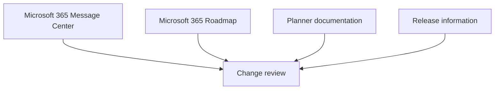
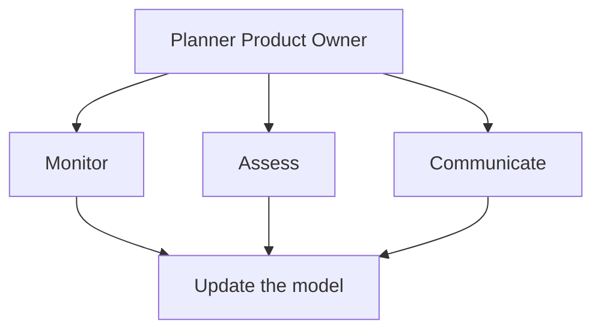
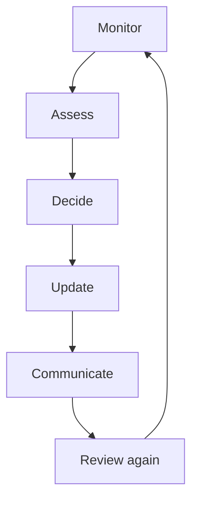

import ComparisonTable from "../../components/content/ComparisonTable.astro";
import PlannerChangeImpactCheck from "../../components/content/PlannerChangeImpactCheck.astro";
import ArticleImageLightbox from "../../components/article/widgets/ArticleImageLightbox.astro";
import plannerAdministrationRecord from "../../assets/images/articles/planner-administration/planner-administration-record.png";
import plannerAdministratorChangeLoop from "../../assets/images/articles/planner-administration/planner-administrator-change-loop.png";

Administrating Planner is different from deploying a traditional application.

The service continues to evolve.

Features change. Licensing changes. Product names change. Integrations evolve. Capabilities are added, moved, or retired.

That means an administrator cannot treat Planner as something that is configured once and then left alone.

The real question is:

> **How do you keep your Planner environment aligned with a product that keeps changing?**

The answer is not to react to every announcement.

It is to establish a repeatable process for **detecting change, assessing impact, updating standards, and communicating what matters**.

> **You cannot stop Planner from changing. You can build an administration model that changes with it.**

---

## 1. Know What Actually Changed

Not every Planner announcement represents the same type of administrative change.

<ComparisonTable
  caption="Questions to ask when reviewing a Planner change"
  columns={[
    { label: "Change type" },
    { label: "Administrator question" }
  ]}
  rows={[
    {
      label: "Feature",
      cells: ["What can users do now that they couldn't before?"]
    },
    {
      label: "Capability",
      cells: ["Did existing behavior change?"]
    },
    {
      label: "Licensing",
      cells: ["Does access or entitlement change?"]
    },
    {
      label: "Integration",
      cells: ["Do flows, applications, or reporting need review?"]
    },
    {
      label: "Architecture",
      cells: ["Did the underlying data or service model change?"]
    },
    {
      label: "Product transition",
      cells: ["Is an existing experience being renamed, consolidated, or retired?"]
    }
  ]}
/>

The first responsibility is simply to understand **what changed**.

---

## 2. Maintain a Planner Capability Baseline

Once the current environment is understood, keep a small internal record of the things that actually matter.

At minimum, document:

- supported Planner plan types;
- licensing requirements;
- approved use cases;
- known limitations;
- integrations and dependencies;
- governance standards;
- current adoption expectations;
- last-reviewed date.

This becomes the organization's reference point when Microsoft changes something.

It also prevents old training material or internal guidance from quietly becoming the source of confusion.

<ArticleImageLightbox
  src={plannerAdministrationRecord.src}
  alt="Planner administration record showing approved use cases, plan and licensing model, known limitations, integration inventory, governance standards, recent and upcoming changes, ownership, and review information."
/>

---

## 3. Monitor Change Through a Small Number of Signals

You do not need to watch the entire Microsoft ecosystem every day.

Establish a small set of trusted signals:

The important distinction is:

> **Monitoring a change does not mean acting on every change.**

The purpose of monitoring is to identify changes that could affect your environment.

---

## 4. Assess the Impact Before You Act

When a meaningful change appears, evaluate it against the environment.

<PlannerChangeImpactCheck />

<ComparisonTable
  caption="Change-impact questions for Planner administrators"
  columns={[
    { label: "Area" },
    { label: "Question" }
  ]}
  rows={[
    {
      label: "Users",
      cells: ["Who is affected?"]
    },
    {
      label: "Projects",
      cells: ["Which workloads are affected?"]
    },
    {
      label: "Licensing",
      cells: ["Does entitlement change?"]
    },
    {
      label: "Integrations",
      cells: ["Do workflows or applications need review?"]
    },
    {
      label: "Data",
      cells: ["Does the underlying data model change?"]
    },
    {
      label: "Governance",
      cells: ["Do standards need updating?"]
    },
    {
      label: "Training",
      cells: ["Do users need new guidance?"]
    },
    {
      label: "Documentation",
      cells: ["What internal material is now outdated?"]
    }
  ]}
/>

The important point is to determine **what the announcement means for your environment**, not simply what Microsoft changed.

---

## 5. Assign Ownership for Planner Changes

Someone should own that question.

Establish a defined **Planner product owner** or equivalent administrative responsibility.

The role can coordinate with Microsoft 365 administration, the PMO, enterprise architecture, security, application owners, and other stakeholders as appropriate.

A simple model is:

The objective is not to create another layer of bureaucracy.

It is to make sure that someone is accountable for keeping the organization's Planner model current.

---

## 6. Keep Documentation as an Operational Control

Documentation should not simply explain how Planner works.

It should explain **how your organization uses Planner**.

That can include:

- Approved use cases
- Plan / licensing model
- Known limitations 
- Integration inventory
- Governance standards
- Recent product changes
- Upcoming changes
- Owner
- Last reviewed
- Next review

A stale document can be worse than having no document because users assume it is authoritative.

---

## 7. Establish a Regular Review Loop

The best long-term model is not a one-time audit.

It is a recurring cycle:

A quarterly review can cover:

- product changes;
- licensing changes;
- adoption metrics;
- integration health;
- governance gaps;
- documentation freshness;
- upcoming changes.

Not every review needs to produce a change.

Sometimes the correct outcome is:

> **No action required.**

That is still a valid administrative decision.

<ArticleImageLightbox
  src={plannerAdministratorChangeLoop.src}
  alt="Planner administration change loop showing Monitor, Assess, Decide, Update, Communicate, and Review Again as a continuous cycle, with change signals feeding the review and governance, training, documentation, adoption, or no-action decisions as outcomes."
/>

---

## 8. Don't Standardize Planner Beyond Its Capabilities

A moving product also requires knowing when **not** to change the organization around it.

Planner can be a strong fit for many structured project and work-management scenarios, but organizations should still evaluate whether a particular workload matches the capabilities and limits of the service.

That means the administrator should periodically ask:

> **"Is Planner still the right tool for this workload?"**

Not every product change should result in another Planner configuration.

Sometimes the right decision is to keep a workload elsewhere.

That is part of good administration too.

---

## Conclusion — Don't Administer Planner Once

Planner should be administered as an **evolving service**, not deployed as a finished product.

The administrator's responsibility is not to predict every Microsoft change.

It is to create a process that can:

> **Detect → Assess → Decide → Update → Communicate → Review**

That process needs an owner, reliable change signals, current documentation, and a regular review cadence.

The result is a different kind of administration model.

You are not trying to keep Planner unchanged.

You are keeping **your organization's use of Planner aligned with the product as it changes**.

> **Planner will keep moving. Your administration model should move with it.**
