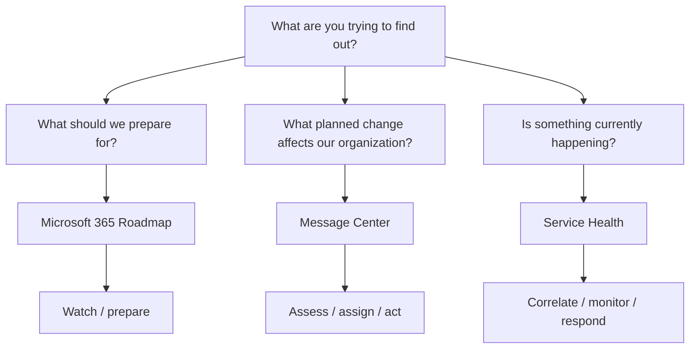
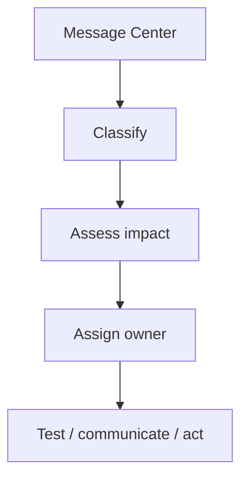
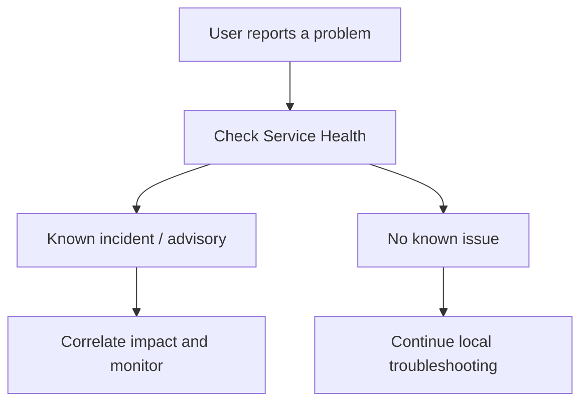
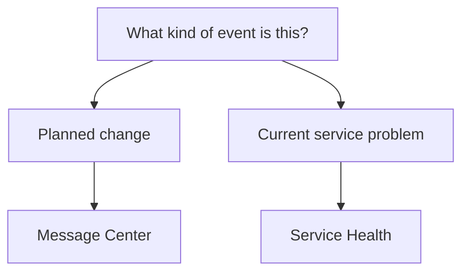
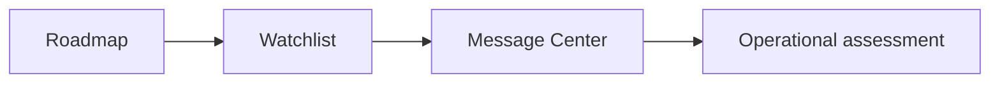
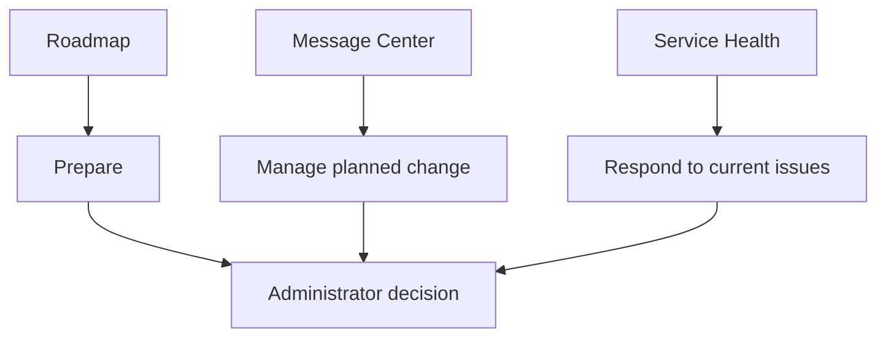

import ComparisonTable from "../../components/content/ComparisonTable.astro";
import Callout from "../../components/ui/Callout.astro";

Microsoft 365 gives administrators several places to find information about product changes and service conditions.

The challenge is that they do not answer the same question.

An administrator preparing for a feature coming next quarter needs different information from an administrator investigating an issue affecting users right now.

The practical distinction is:

> **Roadmap tells you what to watch. Message Center tells you what to manage. Service Health tells you what is happening now.**

---

## 1. The Three Sources Have Different Jobs

<ComparisonTable
  caption="Microsoft 365 change signals and what they are best used for"
  columns={[
    { label: "Source" },
    { label: "Best used for" },
    { label: "Administrator question" }
  ]}
  rows={[
    {
      label: "Microsoft 365 Roadmap",
      cells: ["Horizon scanning", "What should we prepare for?"]
    },
    {
      label: "Message Center",
      cells: ["Planned tenant-relevant change", "What is changing and what action may be required?"]
    },
    {
      label: "Service Health",
      cells: ["Current incidents and advisories", "Is something already happening?"]
    }
  ]}
/>

Microsoft describes the Roadmap as a broad view of Microsoft 365 updates and changes, while Message Center provides more operational information about changes relevant to the organization. Service Health is intended for current incidents, advisories, issue history, and known service problems.

<Callout type="information" title="Choose the source by the question">
Roadmap helps you look ahead. Message Center helps you manage planned change. Service Health helps you understand current operational problems.
</Callout>

---

## 2. Use Roadmap to Look Ahead

The Roadmap is best treated as a **planning signal**.

Use it to identify:

- capabilities worth watching;
- future training or documentation needs;
- possible licensing questions;
- changes that may affect a workload;
- items worth placing on a preparation watchlist.

The important limitation is scope.

A Roadmap item does not automatically mean that your organization is affected, that action is required, or that the feature is arriving immediately. Microsoft notes that Roadmap content is broader than tenant-specific change.

<Callout type="tip" title="Use Roadmap for preparedness">
Do not turn every Roadmap item into an immediate task. Use it to identify changes worth watching before they become operationally relevant.
</Callout>

---

## 3. Use Message Center When the Change Becomes Operational

Message Center is where a broad planning signal becomes an operational change signal.

It can provide information about:

- affected services;
- timing;
- required actions;
- relevance;
- **Act by** dates;
- **Retirement** indicators;
- **Major update** information;
- organizational impact.

That makes it the better starting point when the question becomes:

> **"What does this change mean for my organization?"**

The workflow can then become:

Message Center should therefore be treated as **change intake**, not simply as an inbox.

---

## 4. Use Service Health When Something Is Already Happening

Service Health answers a different question:

> **"Is Microsoft already aware of this problem?"**

It is intended for active incidents, advisories, issue history, service degradation or interruption, and tenant-reported issues.

<Callout type="important" title="Check the service before changing the configuration">
A known Microsoft service incident can look like a tenant configuration problem. Check Service Health before changing policies, settings, or integrations.
</Callout>

---

## 5. Do Not Confuse Planned Changes With Current Incidents

One distinction is particularly useful:

**Planned change → Message Center**

**Current service issue → Service Health**

Microsoft explicitly separates planned maintenance and unplanned service incidents between these sources.

A rollout happening at the same time as a user complaint does not automatically mean the rollout caused the problem.

First establish whether the service itself is reporting an active issue.

---

## 6. Roadmap and Message Center Work Together

These sources are complementary.

Roadmap helps identify what may be coming.

Message Center helps determine when that change becomes operationally relevant.

Microsoft recommends maintaining a Roadmap watchlist and moving watched items into the Message Center assessment workflow when they become relevant to the organization.

This creates a simple progression:

> **Anticipate → Assess → Act**

---

## 7. The Quick Decision Guide

<ComparisonTable
  caption="Which Microsoft 365 source should you use?"
  columns={[
    { label: "What are you trying to find out?" },
    { label: "Start here" }
  ]}
  rows={[
    {
      label: "What is Microsoft working on?",
      cells: ["Roadmap"]
    },
    {
      label: "What should we prepare for?",
      cells: ["Roadmap"]
    },
    {
      label: "What planned change affects our organization?",
      cells: ["Message Center"]
    },
    {
      label: "What action might we need to take?",
      cells: ["Message Center"]
    },
    {
      label: "Is there an Act by or retirement deadline?",
      cells: ["Message Center"]
    },
    {
      label: "Are users suddenly reporting a service problem?",
      cells: ["Service Health"]
    },
    {
      label: "Is Microsoft already investigating the issue?",
      cells: ["Service Health"]
    },
    {
      label: "What happened during or after a service incident?",
      cells: ["Service Health"]
    }
  ]}
/>

The goal is not to memorize portals.

It is to build the habit of choosing the **signal that answers the question**.

---

## 8. One Operating Model

The three sources fit into a broader administrative model:

**Roadmap supports anticipation.**

**Message Center supports operational change management.**

**Service Health supports incident awareness and correlation.**

They are complementary rather than interchangeable.

---

# Conclusion

Microsoft 365 provides multiple sources of change and service information because those sources solve different operational problems.

Use **Roadmap** when you need to look ahead.

Use **Message Center** when a planned change becomes relevant to your organization.

Use **Service Health** when the question is whether Microsoft is already reporting a current operational problem.

The simplest mental model is:

> **Roadmap → What should I watch?**  
> **Message Center → What should I manage?**  
> **Service Health → What is happening now?**

Knowing that distinction helps administrators spend less time searching the wrong place and more time acting on the right signal.

<Callout type="best-practice" title="Choose the source by the question">
Choose the source by the question, not by the portal.
</Callout>
