import Callout from "../../components/ui/Callout.astro";
import DataverseArchitectureDecisionGuide from "../../components/content/DataverseArchitectureDecisionGuide.astro";
import ArticleImageLightbox from "../../components/article/widgets/ArticleImageLightbox.astro";

import dataverseEnterpriseReferenceArchitecture from "../../assets/images/articles/dataverse/dataverse-enterprise-reference-architecture.png";
import dataverseSecurityAndAccessModel from "../../assets/images/articles/dataverse/dataverse-security-and-access-model.png";
import dataverseCapacityAndAlmModel from "../../assets/images/articles/dataverse/dataverse-capacity-and-alm-model.png";

Dataverse is often introduced as the place where Power Platform applications store their business data.

At enterprise scale, that description is incomplete.

Dataverse is a **metadata-driven application data platform** with APIs, security, business events, storage, auditing, integration, analytics, governance, and lifecycle management built around the data.

The architectural question is therefore not:

> **"How should I design these tables?"**

It is:

> **"How should the Dataverse workload be designed so that data, security, APIs, capacity, integrations, and ALM behave predictably together?"**

---

## 1. Dataverse Has Layers

A useful enterprise model separates Dataverse into six layers:

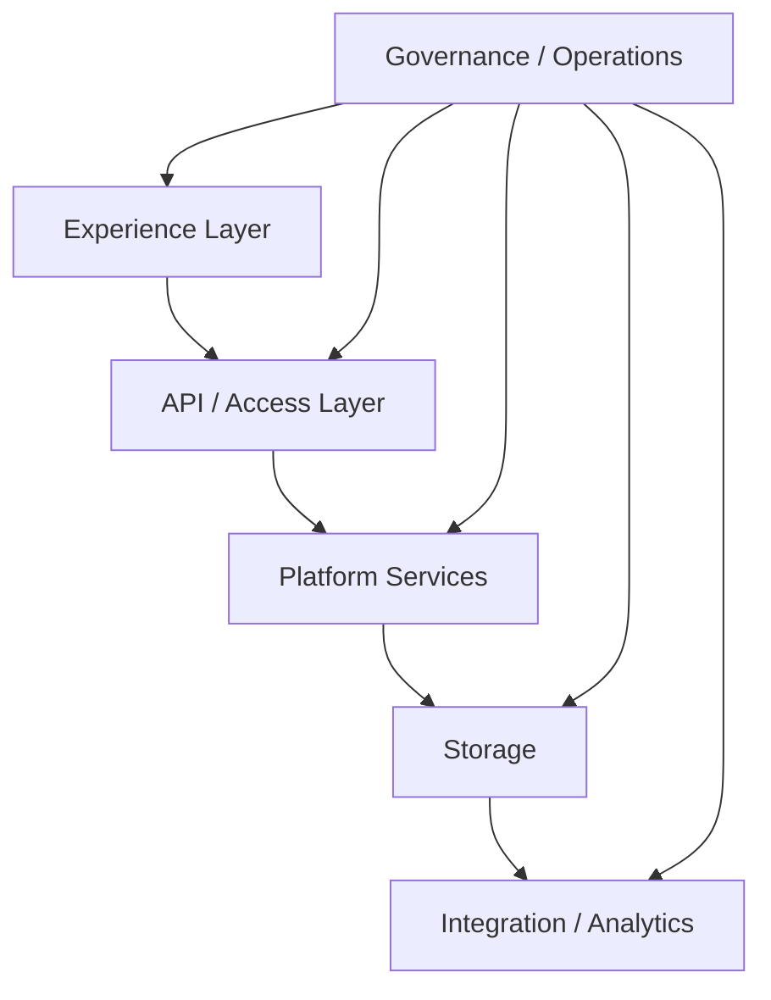

Microsoft-oriented architecture guidance in the source describes these as the **experience, API/access, platform-services, storage, integration/analytics, and governance/operations layers**.

> **Dataverse is a platform stack, not just a relational schema.**

<ArticleImageLightbox
  src={dataverseEnterpriseReferenceArchitecture.src}
  alt="Microsoft Dataverse enterprise reference architecture showing the experience, API and access, platform services, storage, and integration and analytics layers, with governance and operations spanning environments, DLP, ALM, monitoring, capacity, and recovery."
/>

---

## 2. What Happens at Runtime?

Requests can originate from Power Apps, Power Automate, Power Pages, Dynamics 365, custom applications, SDK-based code, Web API calls, or connector actions.

They then pass through access and platform services before reaching storage or integration targets.

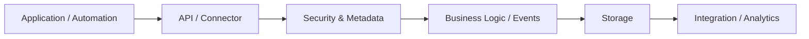

This is why Dataverse architecture cannot be reduced to table design.

A schema change can affect applications and APIs.

A security change can affect access.

A plug-in can affect latency.

Capacity growth can affect cost and operations.

---

## 3. Metadata Is the Platform Contract

Dataverse is metadata-driven.

Table metadata describes not only stored data, but also how records can be created, what actions can be performed, and how applications, APIs, relationships, and security behave.

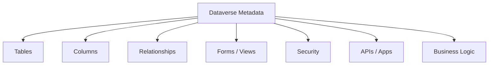

> **Treat the schema as a platform contract, not simply a database structure.**

Use standard tables when they fit the business concept rather than replacing them unnecessarily with custom alternatives.

---

## 4. Choose the Right Data Model

Not every Dataverse dataset should use the same storage pattern.

**Standard and custom tables** suit transactional, relational business data.

**Elastic tables** are designed for high-volume, bursty, semi-structured workloads and use partitioning backed by Azure Cosmos DB. They introduce different consistency and transaction characteristics and therefore are not simply "faster tables."

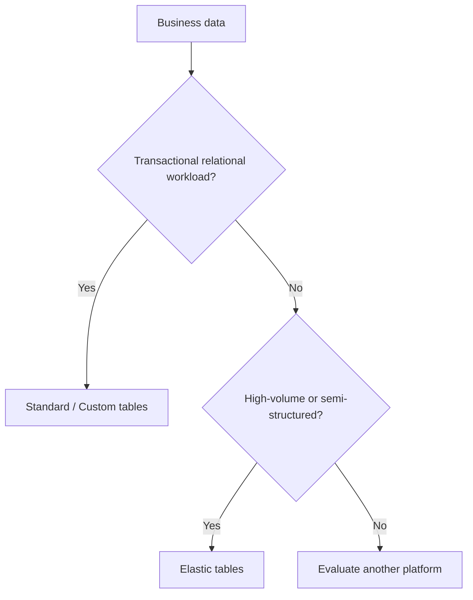

The table model should follow the workload.

<DataverseArchitectureDecisionGuide />

---

## 5. Capacity Is More Than Row Count

Dataverse capacity is broadly divided into:

**Database** — structured data and metadata.

**File** — attachments and other file content.

**Log** — audit and trace-related data.

That means capacity planning must consider more than record growth.

Also consider:

- attachments;
- audit retention;
- trace data;
- search/indexing;
- analytics replicas;
- elastic-table retention.

> **Forecast each growth curve separately.**

<ArticleImageLightbox
  src={dataverseCapacityAndAlmModel.src}
  alt="Dataverse capacity and ALM model showing separate database, file, and log capacity categories alongside a managed application lifecycle from development through solution packaging, validation, test, approval, deployment, and operation."
/>

---

## 6. Security Is Cumulative

Dataverse access is shaped by multiple layers:

**authentication → licensing → environment → roles → business units → ownership/sharing → column security**

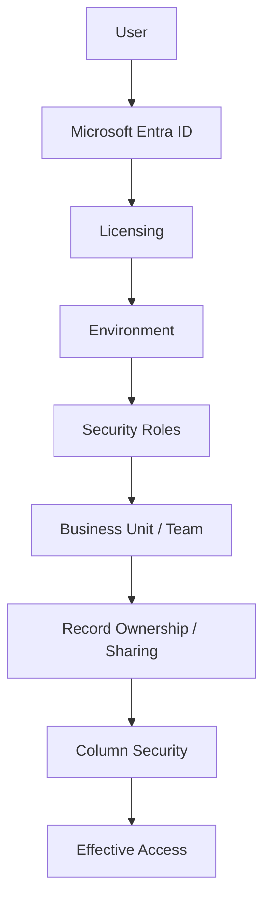

That is why application access does not automatically determine data access.

<Callout type="important" title="Design security before migration">
Security roles, business units, teams, ownership, and column-level requirements should be designed before large-scale data migration rather than retrofitted afterward.
</Callout>

### Auditing

Auditing can capture record changes, application or SDK access, create/update/delete operations, sharing changes, security-role changes, and other activity.

Audit data also consumes log capacity.

That creates a direct relationship between:

**compliance → audit scope → retention → capacity → cost**

> **Audit design is both a governance decision and a capacity decision.**

<ArticleImageLightbox
  src={dataverseSecurityAndAccessModel.src}
  alt="Microsoft Dataverse security and access model showing cumulative access controls from Microsoft Entra ID authentication and licensing through environment boundaries, security roles, business units or teams, record ownership and sharing, and column-level security to effective access."
/>

---

## 7. APIs and Extensibility

The primary developer interfaces are:

**Dataverse Web API** — OData v4 REST access.

**SDK for .NET** — programmatic access to data, metadata, and Organization Service messages.

**TDS** — read-only SQL-style access for supported scenarios.

Beyond those, Dataverse supports several extensibility patterns:

**Custom APIs**  
For governed business operations.

**Plug-ins**  
For server-side transactional or near-transactional logic.

**Webhooks**  
For HTTP event delivery.

**Service Bus / event endpoints**  
For durable asynchronous processing.

**Virtual tables**  
When another system remains authoritative.

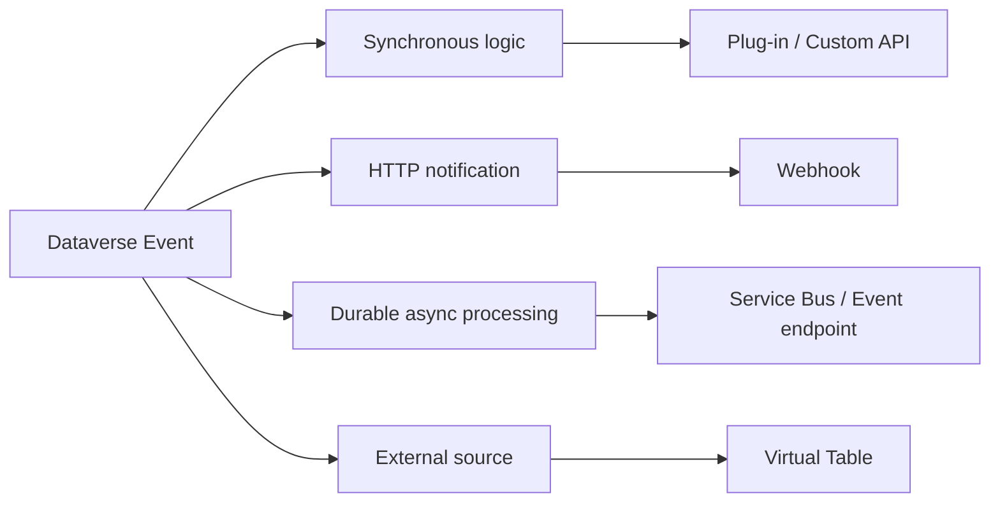

The important rule is:

> **Do not turn every requirement into synchronous plug-in code.**

---

## 8. Keep Analytics Out of the Transaction Path

Operational and analytical workloads have different requirements.

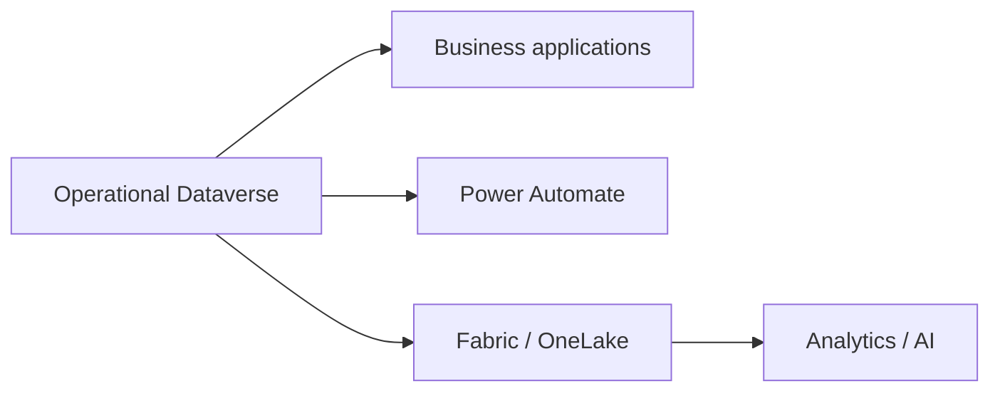

> **Use Dataverse for operational transactions; use the analytical platform for analytical workloads.**

This separation protects operational APIs from warehouse-style demand.

---

## 9. Performance and Service Protection

Dataverse is scalable, but not unlimited.

Service-protection limits can return HTTP `429` with `Retry-After` when demanding traffic exceeds platform limits.

Robust integrations therefore need:

- bounded concurrency;
- backoff;
- retry handling;
- idempotency;
- request-volume awareness;
- sensible payload design.

<Callout type="warning" title="Treat 429 as a control signal">
Honor `Retry-After`, use bounded concurrency and backoff, and make operations safe to retry. Retrying aggressively can make the original problem worse.
</Callout>

Performance design should also consider:

- excessive columns;
- expensive relationship patterns;
- high-frequency polling;
- oversized batches;
- uncontrolled parallelism;
- analytical queries against operational APIs.

> **Design integrations to cooperate with the platform rather than fight its limits.**

---

## 10. ALM and Solution Layering

Dataverse is deeply integrated with Power Platform ALM.

Tables, columns, apps, flows, security roles, plug-ins, connection references, environment variables, and virtual tables can be packaged as solution components.

The recommended lifecycle is:

**unmanaged development → managed test/UAT → managed production**

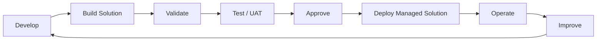

A mature operating model should include:

- source control;
- pipelines;
- solution checker;
- automated validation;
- smoke tests;
- branch protection;
- rollback strategy;
- connection-reference ownership.

<Callout type="best-practice" title="Keep production solution-aware">
Production Dataverse should be changed through managed, repeatable deployment rather than unmanaged customization.
</Callout>

---

## 11. Governance, Backup, and Operations

Governance extends beyond permissions.

Managed environments and related governance capabilities can provide environment grouping, data policies, pipelines, solution checking, capacity management, Application Insights, and backup/recovery controls.

DLP policies provide connector guardrails across Power Apps, Power Automate, and Copilot Studio.

Operational resilience also includes backups, restore procedures, disaster recovery, and cross-platform monitoring.

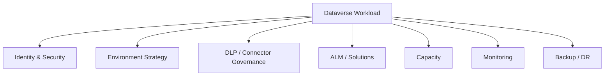

---

## 12. Enterprise Anti-Patterns

The most important anti-patterns are:

**Unmanaged production changes**

**Broad organization-level security roles**

**Indefinite blanket auditing**

**High-frequency polling**

**`SELECT *` over TDS**

**Large synchronous plug-ins**

**Excessive record sharing**

**Using Dataverse as a historical or telemetry warehouse**

These problems share the same root cause:

> **Treating Dataverse as an isolated database instead of a governed application platform.**

The more serious failure mode is the combination of weak environment strategy, ad-hoc production customization, unclear ownership, insufficient capacity monitoring, and integrations that ignore retry and idempotency behavior.

---

## 13. The Dataverse Reference Model

Everything now comes together:

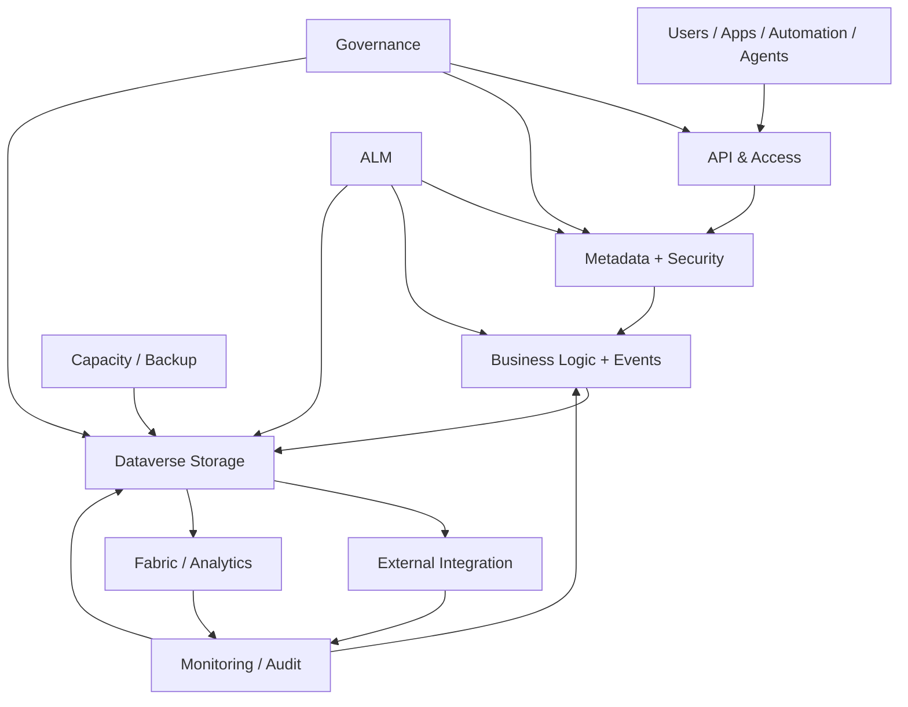

> **Dataverse architecture is the interaction between data, platform services, access, integration, and operational controls.**

---

## 14. Where Dataverse Is Heading

Microsoft's 2026 roadmap increasingly positions Dataverse as an AI-grounded operational data platform, with themes including Work IQ, agent programmability, MCP servers, Python SDK capabilities, AI prompt columns, agent identities, and deeper Copilot/Microsoft 365 integration.

That makes clean metadata, meaningful relationships, security hygiene, auditing, and governed data increasingly valuable.

But the architectural priority remains:

**Good data architecture first.**

**Good security alongside it.**

**Good lifecycle and operations underneath it.**

**AI on top.**

---

# Conclusion

Dataverse is not simply a place to store Power Platform data.

It is a managed application data platform whose behavior emerges from several interacting layers:

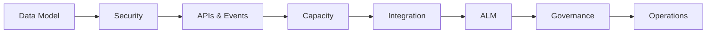

A strong Dataverse implementation therefore:

**models data deliberately;**

**designs security before migration;**

**chooses APIs and integration patterns according to workload;**

**keeps analytical workloads away from transactional paths;**

**plans database, file, and log growth separately;**

**uses solutions and managed deployment for lifecycle;**

**monitors service protection, capacity, auditing, and integrations;**

**and treats governance as part of the architecture.**

The right Dataverse implementation is not measured by how quickly tables are created.

It is measured by:

> **security correctness + lifecycle repeatability + observability + capacity predictability + integration resilience + alignment with platform limits and licensing economics.**

That is the difference between **using Dataverse** and **engineering a Dataverse platform**.