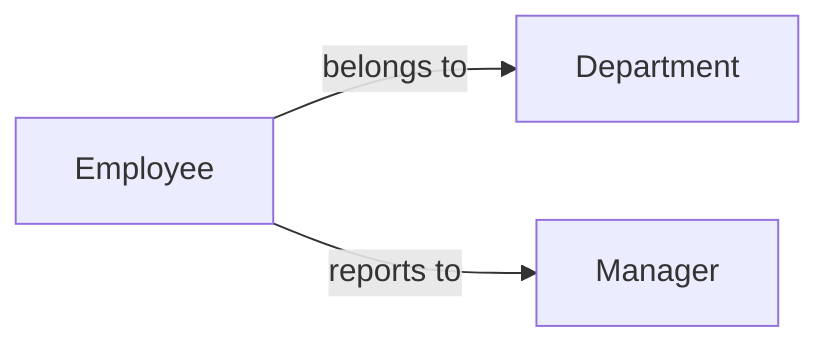
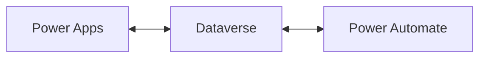
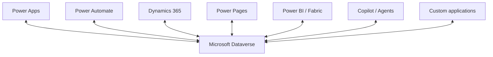
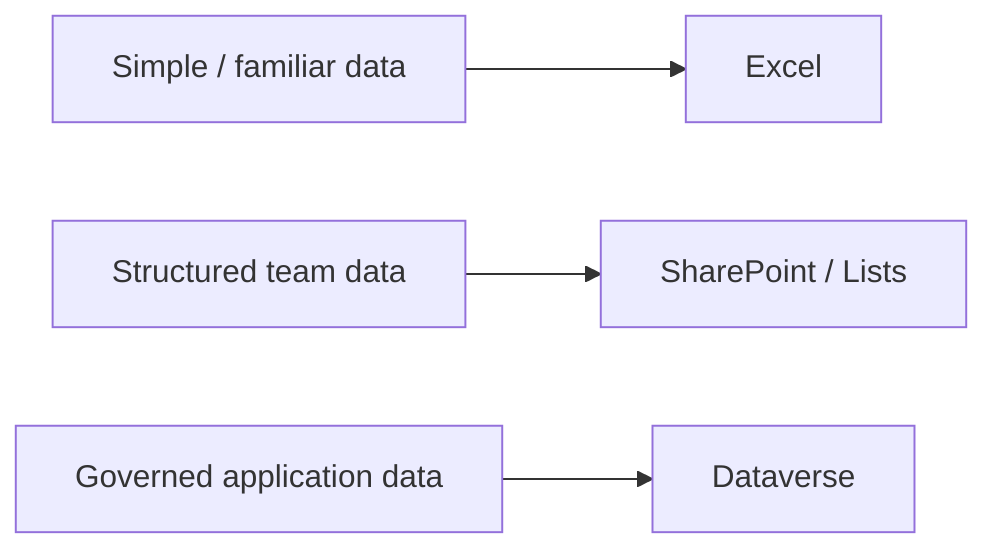
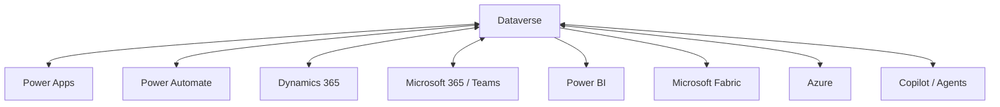
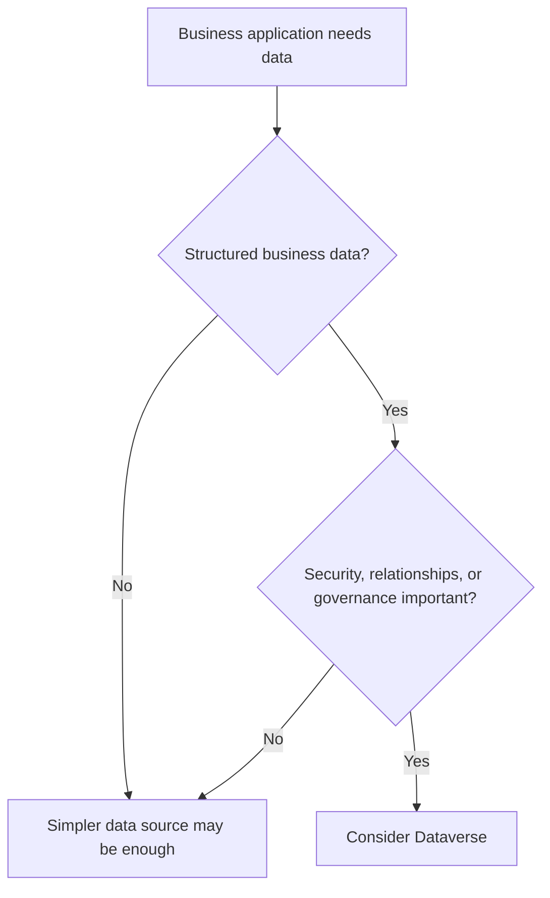
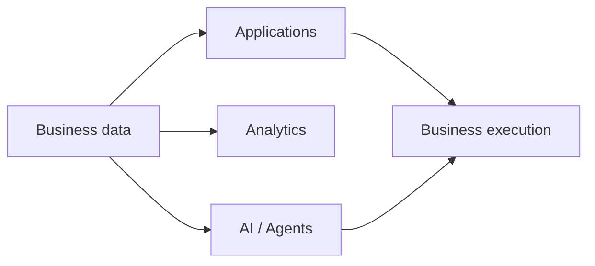
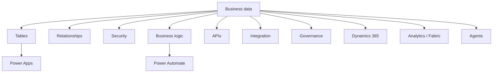

import Callout from "../../components/ui/Callout.astro";
import DataverseFitSelector from "../../components/content/DataverseFitSelector.astro";
import ArticleImageLightbox from "../../components/article/widgets/ArticleImageLightbox.astro";
import dataverseBusinessDataModel from "../../assets/images/articles/dataverse/dataverse-business-data-model.png";
import dataversePlatformEcosystem from "../../assets/images/articles/dataverse/dataverse-platform-ecosystem.png";

Dataverse is often described as Microsoft's cloud data platform for Power Platform.

That is true, but it does not explain why Dataverse exists or when an organization should choose it.

A better description is:

> **Dataverse is a business data platform that combines structured data with relationships, security, business logic, APIs, integration, and application lifecycle capabilities.**

It stores business information in tables, but it is more than a place to put rows and columns. Dataverse is designed to support the applications, workflows, and other workloads that use that data.

---

## 1. What Is Microsoft Dataverse?

At the simplest level, Dataverse stores business information in **tables**.

A table contains:

- rows;
- columns;
- defined data types;
- relationships to other tables.

Dataverse provides standard tables for common scenarios and supports custom tables for organization-specific processes. Those tables can then be used by Power Apps and other Power Platform workloads.

But calling Dataverse "a database" leaves out an important part of the platform.

Dataverse also provides:

**metadata → relationships → security → business logic → workflows → APIs → integration → lifecycle capabilities**

That is why a more useful mental model is:

> **Dataverse is a business-aware application data platform.**

---

## 2. The Building Blocks of Dataverse

A beginner can understand Dataverse through a few core concepts.

<ArticleImageLightbox
  src={dataverseBusinessDataModel.src}
  alt="Dataverse business data model showing tables, columns, rows, and relationships surrounded by business rules, security, environments, automation, APIs, connectors, audit, and governance, with Power Platform and business application integrations at the base."
/>

### Tables

Tables hold business records.

**Employee record**

- **Employee:** Alice
- **Department:** Finance
- **Manager:** Robert

### Columns

Columns describe the information stored in each record.

Examples include text, numbers, dates, choices, and lookups.

### Relationships

Relationships connect records across tables.

Dataverse supports relationship patterns including one-to-many and many-to-many relationships.

### Environments

Environments provide boundaries in which Power Platform resources and Dataverse data are managed.

---

## 3. Why Dataverse Is More Than Storage

A traditional database primarily answers:

> **How do I store and retrieve data?**

Dataverse adds another question:

> **How does this data participate in a governed business application?**

For example, an employee record may need relationships to departments and managers, controlled access, business rules, automation, auditability, application forms, and integration with other Microsoft workloads.

Dataverse brings many of those concerns into the same platform.

<Callout type="information" title="Dataverse is more than storage">
Dataverse connects business data with the application capabilities that depend on it. The value is not only where the data is stored, but how that data participates in applications, automation, security, and governance.
</Callout>

---

## 4. How Dataverse Fits With Power Apps and Power Automate

This is the relationship a beginner should understand first:

**Power Apps** provides the application experience.

**Dataverse** provides the business data.

**Power Automate** can react to changes in that data and orchestrate processes around it.

For example:

**Power Apps**  
Employee submits an onboarding request.

↓

**Dataverse**  
The onboarding record is created.

↓

**Power Automate**  
An approval and follow-up tasks are triggered.

Dataverse therefore sits at the center of many Power Platform business scenarios.

---

## 5. Dataverse Is Also an Integration Platform

Dataverse is not limited to Power Apps.

Applications, automations, agents, reports, and custom code can interact with Dataverse through connectors, APIs, and Microsoft Cloud integrations. The Dataverse Web API uses OData v4, and Microsoft provides SDK options for pro-code scenarios.

<ArticleImageLightbox
  src={dataversePlatformEcosystem.src}
  alt="Dataverse platform ecosystem showing Dataverse as the central business data foundation connected to Power Apps, Power Automate, Power Pages, Dynamics 365, Power BI and Fabric, Copilot and agents, custom applications and APIs, and Microsoft Cloud services."
/>

Dataverse is therefore better understood as a **shared business data foundation** than as a database used by one application.

---

## 6. What Makes Dataverse Different From Excel, SharePoint, or SQL?

Dataverse is not automatically the best answer for every dataset.

A small team process may work perfectly well with a simpler data source.

An application with relational business data, stronger security, governed application behavior, and deeper Power Platform integration may justify Dataverse.

The useful question is:

> **What does this workload require from its data platform?**

The goal is not to choose the most sophisticated option.

> **Choose Dataverse when the workload needs the capabilities Dataverse provides.**

---

## 7. Dataverse and the Microsoft Ecosystem

Dataverse is particularly compelling when an organization already uses Microsoft technologies.

It integrates closely with:

- Power Apps;
- Power Automate;
- Dynamics 365;
- Microsoft 365 and Teams;
- Power BI;
- Microsoft Fabric;
- Azure;
- Copilot and agent scenarios.

Dynamics 365 customer-engagement applications use Dataverse for their business data, while Fabric integration can make Dataverse and Dynamics 365 data available in OneLake.

The ecosystem is a major part of Dataverse's value.

---

## 8. Security and Capacity Matter Early

Two areas deserve attention even in a beginner discussion: **security** and **capacity**.

### Security

Dataverse supports role-based security, business units, record-level access, column-level security, and hierarchy-based access. Microsoft Entra authentication and environment boundaries also contribute to the overall access model.

The important principle is:

> **The data model and the security model need to be designed together.**

### Capacity

Dataverse capacity is separated into database, file, and log categories.

That means capacity planning is part of architecture.

Rows grow.

Files accumulate.

Logs grow.

The right question is therefore not:

> "How much data do we have today?"

but:

> **"How will this workload grow?"**

<Callout type="warning" title="Treat capacity as an architecture concern">
Dataverse capacity should be considered before deployment and monitored as the workload grows. Storage, audit data, files, licensing, and usage patterns can all affect the long-term cost and operation of a solution.
</Callout>

---

## 9. When Should You Use Dataverse?

Dataverse is particularly useful when the workload needs a combination of **business data, application behavior, and governance**.

Common scenarios include:

- business applications;
- case management;
- onboarding;
- approvals;
- inspections;
- service workflows;
- Dynamics 365 extensions;
- governed Power Platform applications.

<DataverseFitSelector />

A useful first filter is:

This is a starting point, not a final architecture or licensing decision.

---

## 10. When Might Something Else Be Better?

Dataverse is not a universal database replacement.

| Requirement | Potential fit |
|---|---|
| Governed business application data | **Dataverse** |
| Custom relational database application | **Azure SQL** |
| Analytics and data products | **Fabric** |
| Existing authoritative business data | **Source system** |

The important architectural question is:

> **Which system is the right home for this workload and its data?**

---

## 11. What Is Changing in Dataverse?

Dataverse is evolving beyond its traditional role as a low-code application data platform.

Microsoft's 2026 direction increasingly connects Dataverse with:

- Copilot;
- agents;
- Work IQ;
- MCP tooling;
- Python SDK capabilities;
- Fabric;
- governed business context.

Microsoft describes Dataverse as an increasingly **agentic and low-code data platform**, with business data becoming a governed source of context and action for applications and agents.

The broader trajectory is:

The important point is not that every organization needs these capabilities today.

It is that **the role of Dataverse is expanding**.

---

## 12. Common Beginner Mistakes

A few mistakes are worth avoiding:

**Treating Dataverse as just another database.**

This misses the platform services around the data.

**Choosing Dataverse without understanding the workload.**

More capability does not automatically mean better fit.

**Ignoring security design.**

A sophisticated security model still needs deliberate design.

**Ignoring capacity.**

Rows, files, and logs grow over time.

**Treating licensing as an afterthought.**

Capacity, licensing, connectors, external users, and related architecture decisions can affect overall cost.

**Assuming Dataverse must contain everything.**

Operational data can remain in source systems, while analytics may belong elsewhere.

---

## 13. The Dataverse Mental Model

The entire article can be reduced to:

Think of Dataverse this way:

**Tables** provide structured business data.

**Relationships** connect that data.

**Security** controls access.

**Business logic** gives the data behavior.

**APIs and integration** make it available to applications and automation.

**Governance** keeps it manageable.

That is why Dataverse is better understood as a **business application data platform** than merely a cloud database.

---

## Conclusion

Microsoft Dataverse provides the data foundation for many Power Platform and Dynamics 365 workloads.

At the surface, it stores tables, rows, and columns.

Underneath, it combines those structures with relationships, security, business logic, APIs, integration, and lifecycle capabilities.

That makes Dataverse particularly useful when an organization needs:

> **Business data + applications + automation + governance**

It does not mean Dataverse belongs everywhere.

Azure SQL may be better for some custom relational workloads.

Fabric may be better for analytics and data products.

Source systems may need to remain authoritative for particular business data.

The architectural question is therefore:

> **Which business data should live in Dataverse, which should remain in its source system, and which should flow elsewhere?**

As Microsoft expands Dataverse toward Copilot, agents, Fabric, and broader business execution, that question becomes increasingly important.

<Callout type="best-practice" title="Choose the data platform by workload">
Dataverse is most valuable when the workload needs governed business data that works closely with applications, automation, security, and the Power Platform ecosystem. Do not choose it simply because it is the most familiar or feature-rich option.
</Callout>