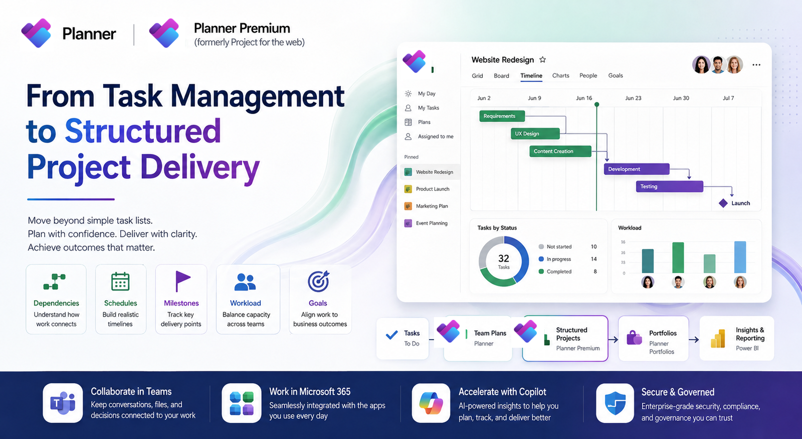
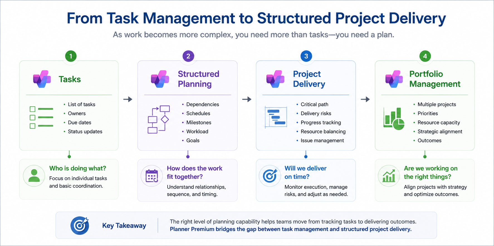
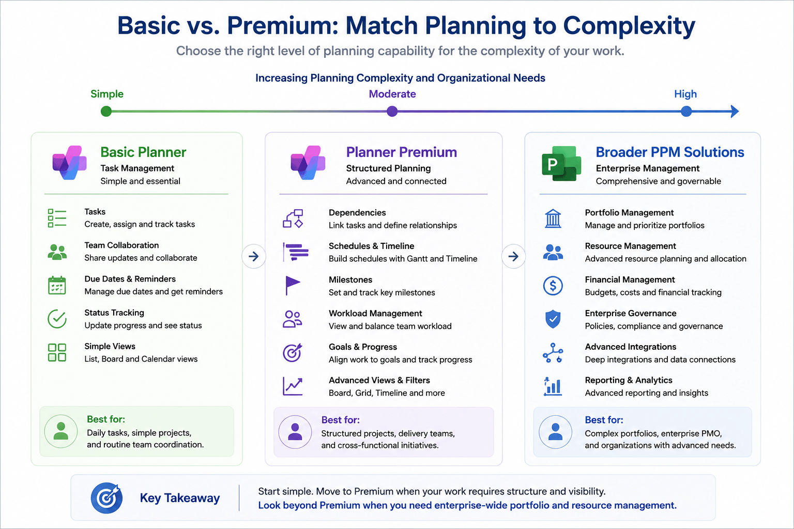
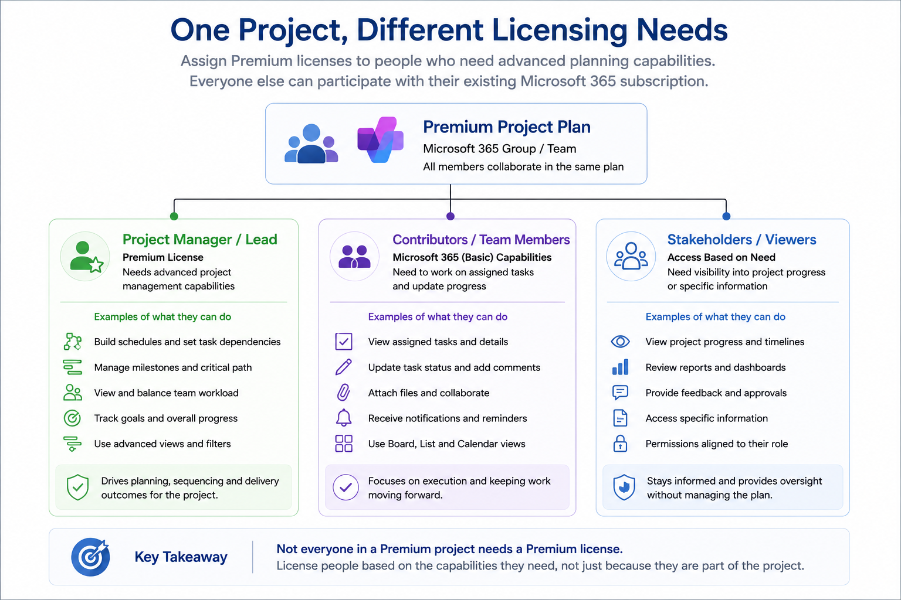
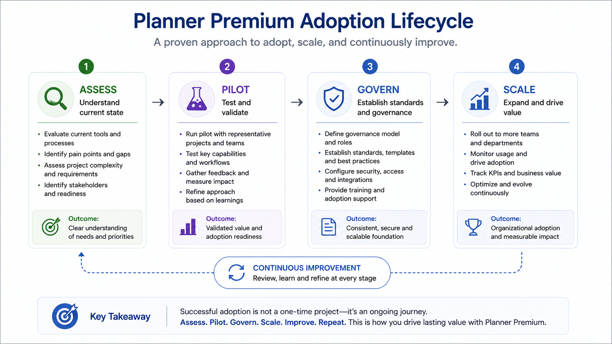
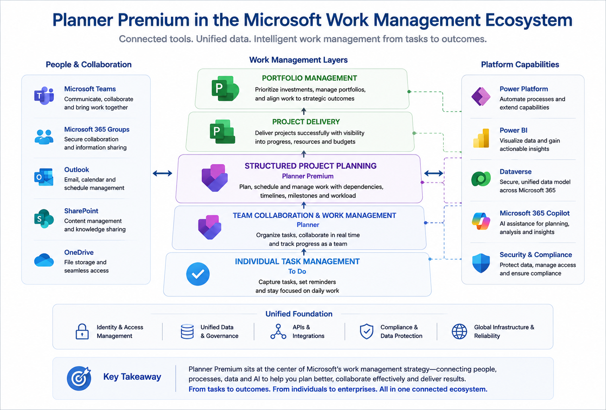

import PlannerFitCheck from "../../components/content/PlannerFitCheck.astro";
import ComparisonTable from "../../components/content/ComparisonTable.astro";
import WorkManagementJourney from "../../components/content/WorkManagementJourney.astro";

For many Microsoft 365 users, Planner has traditionally been the place to organize team tasks, assign work, and keep day-to-day activities moving. A board with tasks, owners, due dates, and status can go a long way when the work is relatively straightforward.

But projects rarely stay straightforward for long.

As work becomes more complex, simply knowing what needs to be done is no longer enough. Project teams need to understand which tasks depend on one another, how a change affects the schedule, which milestones are approaching, and whether the project is still on track.

That creates a different kind of planning problem.

A task list tells a team what needs to be done. **Structured project planning helps the team understand how that work fits together.**

This is the space Microsoft is addressing with **Planner Premium**.

Microsoft Planner now supports two plan types: **Basic and Premium**. Premium plans add capabilities such as Timeline, dependencies, milestones, critical-path analysis, People view, custom fields, Goals, sprints, and custom calendars.

The distinction matters.

Planner Premium should not be viewed simply as "Planner with more features." It represents a move from managing individual tasks toward managing **structured project work**.

For Microsoft 365 administrators, project managers, PMO teams, and business leaders, that raises a more useful question than simply asking what Premium can do:

> **When does an organization actually need to move from task management to structured project delivery?**

That is the question this article explores.

---

## From Planner to Planner Premium

The evolution of Planner Premium makes more sense when viewed in the context of Microsoft's broader changes to its project-management portfolio.

Planner began as a lightweight collaborative work-management experience. Its strength was simplicity: teams could create plans, organize tasks, assign responsibility, and track progress without introducing a heavyweight project-management system.

That simplicity remains valuable.

Not every team needs formal project schedules, dependencies, critical-path analysis, or detailed project structures. For many operational and collaborative workloads, a Basic plan remains an appropriate starting point.

The challenge appears when the nature of the work changes.

A project involving a handful of largely independent tasks can be managed comfortably from a task board. A project involving hundreds of activities, interdependent workstreams, fixed milestones, and a carefully sequenced schedule requires a different level of planning.

This is where Microsoft's history with **Project for the web** becomes relevant.

Project for the web was Microsoft's earlier cloud-based project-management experience for structured work. Microsoft subsequently transitioned its capabilities into the modern Planner experience.

The significance of that transition is easy to miss.

Premium Planner did not emerge as an entirely separate project-management concept. It represents the continuation of many of those structured project-planning capabilities inside the modern Planner experience.

The result is a spectrum:

**Basic task coordination → Structured project planning → Broader project and portfolio management**

Planner Premium occupies the middle of that spectrum.

It is designed for organizations that have outgrown purely task-oriented planning but may still benefit from keeping project planning closely connected to the Microsoft 365 environment they already use.

---

## What Changes with Planner Premium?

The most important difference between Basic and Premium plans is not the number of features available.

It is **the type of work those features allow teams to manage**.

A Basic plan can answer questions such as:

- What tasks need to be completed?
- Who owns each task?
- When is the task due?
- What is its current status?
- How is the team's workload progressing?

Those questions are important.

Structured projects introduce another layer:

- Which tasks depend on other tasks?
- What happens to the schedule if an activity slips?
- Which activities are on the critical path?
- What milestones are approaching?
- How is work distributed across the project team?
- Are project goals connected to the work being performed?

Premium plans add capabilities intended to answer those questions.

### From a list of tasks to a project schedule

Consider a simple project to launch a new internal application.

A Basic plan might contain:

- Define requirements
- Configure the application
- Test the solution
- Prepare training
- Launch

The task board shows all five activities.

But the project manager also needs to understand that testing cannot begin until configuration reaches a certain point, training preparation may depend on the finalized solution, and the launch itself depends on several preceding activities.

Dependencies turn those tasks from a list into a schedule with relationships.

Premium plans support advanced dependencies, including relationships such as finish-to-start, and Planner's scheduling engine can update dates based on those relationships.

### From task status to project visibility

Premium also introduces views designed to help users look at work from a project perspective.

**Timeline** provides a Gantt-style representation of project work, while milestones and critical-path analysis help project managers focus on activities that can materially affect delivery.

That changes the conversation from:

> "Which tasks are incomplete?"

to:

> **"What is likely to affect the delivery of the project?"**

That is a much more meaningful question for project managers and stakeholders.

### From individual activities to connected outcomes

Premium plans can also connect project goals with the work required to achieve them.

A project is not successful because every task is marked complete.

It is successful because the work produces the intended outcome.

That gives structured project planning a useful progression:

**Tasks → Dependencies → Schedule → Milestones → Goals**

The value of Premium therefore comes from the relationships between these elements, rather than from simply having a longer feature list.

---

## Basic vs. Premium: Choosing the Right Level of Planning

An organization does not need Premium simply because a project has a large number of tasks.

Nor does the presence of a project manager automatically mean that every plan should be created as a Premium plan.

The better question is:

> **How much structure does the work require?**

For straightforward operational work, Basic plans may provide everything the team needs. Basic plans support core capabilities such as Grid, Board, and Charts views, filtering and grouping, task assignment, progress tracking, and other everyday coordination scenarios.

### When a Basic plan is enough

Consider a team responsible for maintaining an internal knowledge base.

Its work might include:

- Review existing articles
- Identify outdated content
- Assign updates to subject-matter experts
- Review completed changes
- Publish revised content

The tasks have owners and deadlines, but they may not have complicated relationships with one another.

A board or grid gives the team enough visibility to understand what needs to happen and who is responsible.

In this scenario, adding project dependencies, critical-path analysis, or a detailed project schedule may introduce more structure than the work actually requires.

Basic is therefore not "inferior Planner."

It is the appropriate level of planning for work that does not require advanced project-management constructs.

### When Premium becomes valuable

Now consider a technology implementation involving several teams:

- Requirements gathering
- Solution design
- Environment preparation
- Application configuration
- Integration development
- Security validation
- User acceptance testing
- Training
- Production deployment

These activities are no longer simply a collection of independent tasks.

Testing may depend on configuration being completed. Training material may depend on the solution being sufficiently stable. Production deployment may depend on testing, security validation, and operational readiness.

A project manager needs to understand not just what is outstanding, but **how the outstanding work affects the overall delivery schedule**.

This is where Premium capabilities such as dependencies, Timeline, milestones, critical path, custom fields, and People view become meaningful.

The distinction can be summarized simply:

> **Basic plans help teams organize work. Premium plans help teams model and manage more complex project work.**

That does not make Premium universally better.

It makes it better suited to a different class of problem.

### A practical decision guide

<PlannerFitCheck />

Use the guide below to match the complexity of the work to the level of planning capability it requires.

<ComparisonTable
  caption="Planner decision guide"
  columns={[
    { label: "If the work primarily involves…" },
    { label: "Consider", emphasis: true },
    { label: "Why" }
  ]}
  rows={[
    {
      label: "Assigning and tracking team tasks",
      cells: [
        "Basic",
        "Task assignment and tracking are the primary requirement."
      ]
    },
    {
      label: "Coordinating recurring operational activities",
      cells: [
        "Basic",
        "The work does not necessarily require structured project scheduling."
      ]
    },
    {
      label: "Managing a straightforward team initiative",
      cells: [
        "Basic may be sufficient",
        "A simple initiative may not justify Premium capabilities."
      ]
    },
    {
      label: "Coordinating multiple dependent activities",
      cells: [
        "Premium",
        "Dependencies introduce relationships between activities."
      ]
    },
    {
      label: "Building a structured project schedule",
      cells: [
        "Premium",
        "Structured scheduling is where Premium capabilities become valuable."
      ]
    },
    {
      label: "Tracking milestones and critical-path activities",
      cells: [
        "Premium",
        "These require more advanced project-planning capabilities."
      ]
    },
    {
      label: "Understanding workload across project participants",
      cells: [
        "Premium",
        "Workload visibility becomes increasingly important as delivery complexity grows."
      ]
    },
    {
      label: "Managing broader portfolio or enterprise PPM requirements",
      cells: [
        "Evaluate wider Microsoft ecosystem",
        "Portfolio, resource, financial and governance requirements may extend beyond individual Premium plans."
      ]
    }
  ]}
/>

The important point is that this is not a permanent boundary.

A team can begin with a Basic plan and later discover that its work has become complex enough to justify Premium capabilities. Conversely, an organization with Premium licenses may still use Basic plans for simpler work.

**The choice should follow the workload, not the perceived status of the license.**

---

## Where Does Planner Premium Fit in Microsoft 365?

Planner Premium becomes easier to understand when viewed as part of the wider Microsoft 365 work-management environment.

For many organizations, collaboration already happens in Microsoft Teams. Tasks may already be managed through Planner. Individual users may work with Microsoft To Do, while documents and project information live across SharePoint and other Microsoft 365 services.

Introducing more sophisticated project planning does not necessarily mean abandoning that environment.

Instead, Premium extends the planning capabilities available through Planner.

A useful progression is:

**Team collaboration → Task management → Structured project planning → Broader project and portfolio management**

Teams remains an important collaboration layer.

Planner provides a way to turn collaborative activity into managed work.

Premium adds project-oriented capabilities such as relationships, schedules, milestones, workload views, and project goals.

The result is not necessarily a replacement for Teams or the rest of Microsoft 365.

It is a deeper planning capability within an environment where collaboration is already taking place.

For organizations already invested in Microsoft 365, that continuity can matter.

A user does not necessarily have to think:

> "We're leaving Planner and moving to a project-management product."

The experience can instead become:

> **"The work has become more complex, so we're using the more advanced planning capabilities available in Planner."**

That distinction may seem subtle, but it can matter for adoption.

---

## Where the Broader Microsoft Project Ecosystem Enters the Picture

Planner Premium should not be treated as the endpoint for every project-management requirement.

As an organization's project-management requirements become more sophisticated, they may need capabilities that extend beyond individual project execution—particularly when project management becomes closely tied to portfolio governance, resource planning, financial management, enterprise controls, or specialized PMO processes.

The important distinction is therefore not:

**Planner vs. Project**

It is:

> **What level of work management does the organization need?**

For straightforward team coordination, Basic may be enough.

For structured project execution, Premium capabilities can provide the additional planning depth required.

For organizations operating mature project and portfolio-management processes, the evaluation needs to become broader.

That gives Microsoft 365 administrators a more useful way to position Premium:

> **Planner Premium is not a universal replacement for every project-management system. It is an increasingly capable layer between everyday task management and more specialized enterprise project-management requirements.**

---

## Who Should Use Planner Premium?

The question of who should use Premium is more nuanced than simply identifying everyone who works on a project.

Different people interact with project information for different reasons.

### Project Managers: Control Over the Plan

A project manager is responsible for more than maintaining a list of tasks.

They need to understand sequencing, dependencies, milestones, schedule changes, and the factors that could affect delivery.

Premium's project-oriented capabilities provide a more structured environment for this work.

Timeline helps visualize the schedule. Dependencies represent relationships between activities. Milestones highlight important delivery points, while critical-path analysis helps identify activities that directly influence the plan's finish date.

This allows the project manager to ask:

- Which activities are driving the schedule?
- What happens if this task slips?
- Which milestone is at risk?
- Where is the team spending its effort?

These are fundamentally project-management questions rather than simple task-management questions.

### PMO Teams: Consistency, Visibility, and Governance

For a PMO, the question is broader.

A project manager may be concerned with one project's schedule. A PMO may be concerned with how dozens of projects are planned, managed, reported, and governed.

That makes consistency important.

The PMO still needs to determine:

- Which projects require Premium plans?
- What constitutes a project versus routine operational work?
- Which planning practices should be standardized?
- How should milestones and project status be represented?
- Who owns project plans?
- What information should leadership expect to see?

This distinction is worth emphasizing:

> **Premium can provide the structure. A PMO still needs to provide the operating model.**

That is why a successful Premium rollout should not begin with licensing alone.

It should begin by defining how the organization intends to manage projects.

### Microsoft 365 Administrators: Governance Before Scale

For Microsoft 365 administrators, Premium presents a different set of questions.

The administrator may not be responsible for managing an individual project schedule. Their responsibility is to make sure the capability can be introduced and operated appropriately across the organization.

That means looking at:

**Licensing**  
Who requires Premium capabilities, and which subscription is appropriate?

**Access and permissions**  
Who can create or manage plans, and how does access align with the organization's Microsoft 365 governance model?

**Adoption**  
Which teams have a genuine need for Premium?

**Existing workloads**  
Are users already relying on Basic Planner, Project for the web, Project Online, Excel-based schedules, or another project-management system?

**Lifecycle management**  
Who owns the plan after the project finishes? How should inactive projects be handled?

**Training and support**  
Do project teams understand the difference between Basic and Premium planning?

For administrators, the most important lesson may be:

> **Deploying Premium is a technical decision. Deciding where Premium belongs is an organizational decision.**

### Business Leaders: Visibility Without Unnecessary Complexity

Business leaders tend to evaluate project-management tools from another perspective.

Their questions are more likely to be:

- Are important projects on track?
- Where are delivery risks emerging?
- Are teams aligned around the right priorities?
- Can project information be understood without asking every project manager for a separate update?
- Are we using the tools we already own effectively?

Premium can contribute to that visibility by giving project teams more structured ways to represent schedules, milestones, goals, and progress.

But leadership visibility should not become an excuse to introduce unnecessary administrative overhead.

> **The objective should be useful visibility, not more data.**

### Project Contributors: Simplicity Still Matters

There is another group that can easily be overlooked: the people actually doing the work.

A developer, analyst, designer, consultant, or business user may not need to understand critical-path analysis or project scheduling.

They need to know:

- What am I responsible for?
- What is due next?
- What is blocking my work?
- What depends on me?
- Where should I update progress?

A project-management environment can become counterproductive if contributors are forced to interact with complexity that provides no value to them.

The project manager may need the advanced planning model.

The contributor may simply need a clear task.

The PMO may need standardized project information.

The administrator may need governance.

Leadership may need visibility.

**The same project can therefore create different requirements for different people.**

---

## When Planner Premium May Not Be Enough

Planner Premium can bridge an important gap between everyday task management and structured project planning.

But a bridge is not the same thing as a destination.

As an organization's project-management requirements become more sophisticated, the question eventually shifts from:

> "Can Planner Premium manage this project?"

to:

> **"Is Planner Premium the right foundation for the way we manage projects across the organization?"**

A single project can be complex without requiring an enterprise project-management platform.

Conversely, an organization can have relatively straightforward individual projects but still require sophisticated portfolio-level governance.

The complexity of the **management model** matters just as much as the complexity of the individual project.

### Project execution versus portfolio governance

Planner Premium is well aligned with project execution.

A project team can define work, establish relationships between tasks, build a schedule, identify milestones, and monitor progress.

Portfolio management introduces a different set of concerns:

- Which projects should receive priority?
- How are resources distributed across competing initiatives?
- Which projects are consuming more capacity than expected?
- How do projects align with organizational strategy?
- What happens when multiple projects compete for the same people or budget?
- Which investments should continue, change direction, or stop?

Those questions extend beyond managing the schedule of an individual project.

They require an organizational view of projects.

### Resource management can change the equation

A project can have a well-designed schedule and still encounter problems because the people required to deliver it are unavailable.

As organizations mature, they may need to understand resource demand across multiple projects:

- How much capacity does a team actually have?
- Which projects are competing for the same specialist?
- What happens when priorities change?
- Can the organization forecast resource demand?
- How should work be prioritized when capacity is constrained?

If resource management becomes a central requirement, Premium should be evaluated as part of a broader solution rather than assumed to be the complete answer.

### Enterprise governance introduces another layer

A mature PMO may have requirements around:

- portfolio-level reporting
- financial tracking
- standardized governance
- investment decisions
- enterprise resource planning
- formal stage gates
- risk and issue management
- organizational performance measurement

Some of these requirements can be addressed through combinations of Microsoft services and solutions. Others may require specialized project and portfolio-management platforms.

The useful conclusion is not:

> "Planner Premium cannot do enterprise project management."

It is:

> **The further an organization moves from managing individual project execution toward managing a portfolio of investments, resources, and strategic outcomes, the broader the technology evaluation needs to become.**

Premium can still be part of that environment.

It simply should not automatically be treated as the entire environment.

---

## Project Online Retirement: Reassess the Workload, Not Just the Tool

This consideration becomes particularly important for organizations that already use Microsoft's older project-management products.

Microsoft has confirmed that **Project Online will retire on September 30, 2026**. Project Online provides capabilities around managing multiple projects, timesheets, resource needs, and portfolio/project management, making its retirement a significant workload-assessment exercise for existing customers.

But migration should not be reduced to moving existing plans into Planner Premium and assuming the job is complete.

The capabilities, processes, governance models, integrations, and reporting requirements built around an existing Project Online environment may be considerably more complex than the project plans themselves.

The right question is therefore not:

> "Can Planner Premium replace what we have?"

It is:

> **"Which parts of our existing project-management model can move to Planner, which need to be redesigned, and which require another solution?"**

That distinction can prevent a technically successful migration from becoming an operationally unsuccessful one.

Microsoft does not present Planner Premium as a universal one-to-one replacement for every Project Online scenario. The appropriate path depends on how the organization uses Project Online and which capabilities it needs to retain.

The important takeaway is that **Project Online retirement is a workload decision, not simply a product-selection exercise**.

---

## Licensing Planner Premium: Match the License to the Work

One of the most useful licensing considerations for organizations adopting Premium is that **not every person participating in a Premium project necessarily needs the same license**.

Microsoft currently identifies **Planner Plan 1** and **Planner and Project Plan 3** as Premium subscriptions. Premium plans also provide basic editing capabilities to users without a Premium subscription, while access to Premium-only capabilities requires the appropriate Premium subscription.

Consider a project managed by a project manager and a development team.

The project manager may need Premium capabilities to create and manage the plan, build schedules, work with dependencies, and use Timeline or other Premium features.

The developers may have a Microsoft 365 subscription that provides the Basic Planner experience.

They can still participate in shared project work, subject to the access their subscription provides. Microsoft specifically documents limited editing for users working with assigned tasks from Premium plans, while Premium-only capabilities remain restricted to appropriately licensed users.

This creates an important distinction:

> **The project manager may need the license to manage the project at the Premium level. The project contributor may only need the license required to participate in the work.**

That can have a meaningful effect on licensing costs in larger teams.

Imagine a 20-person implementation project with:

- 1 Project Manager
- 2 Project Leads
- 12 Developers and Analysts
- 3 Business Stakeholders
- 2 PMO representatives

The project manager and project leads may require Premium capabilities.

The developers and analysts may primarily need to work on assigned tasks.

The business stakeholders may primarily need visibility.

The PMO representatives may require Premium access depending on their responsibilities.

The licensing requirement therefore does **not automatically become 20 Premium licenses simply because 20 people belong to the project**.

Instead, administrators can evaluate users according to what they actually need to do.

### No special workaround is required

This is one of the useful aspects of the model.

Administrators do not need to build a separate technical mechanism simply to distinguish project managers from contributors.

The access model is tied to Microsoft's licensing architecture. Users with qualifying Microsoft 365 or Office 365 subscriptions can participate with the access their subscription provides, while Premium subscriptions provide the additional project-management capabilities associated with Premium plans.

For administrators, the cost-optimization exercise is therefore primarily about **license assignment and role analysis**, rather than creating a separate access-control solution for every project.

A useful question during a Premium rollout is:

> **Does this person need to manage the project, or do they simply need to participate in the work?**

If the answer is the latter, a Premium license may not always be necessary.

The exact access available to each user depends on their subscription and Microsoft's current licensing model, so administrators should validate the applicable licensing requirements before rollout.

---

## Use Trials as a Learning Mechanism, Not Just a Sales Funnel

Microsoft provides trials for Premium Planner capabilities, including a 30-day Planner and Project Plan 3 trial, subject to organizational settings and administrator controls. Administrators can manage and approve related license requests.

For organizations evaluating Premium, that can be more useful than simply giving a team access and asking whether they "like it."

A better pilot asks the team to test specific scenarios:

- Can the project manager build a meaningful schedule?
- Do dependencies improve planning decisions?
- Does Timeline improve stakeholder conversations?
- Does People view help identify workload issues?
- Are the additional capabilities actually being used?
- Does Premium simplify the existing project-management process—or add another layer of administration?

The answers provide evidence for the licensing decision.

---

## What Administrators Should Consider Before Adoption

Licensing is only one part of the decision.

An organization can assign the correct licenses and still have a poor Premium rollout.

The harder question is:

> **How do we introduce more capable project planning without creating unnecessary complexity?**

That requires administrators to think beyond the product itself.

### 1. Establish a clear use case

"We want to use the new Planner features" is not a particularly useful objective.

A stronger objective might be:

> "We want project teams managing dependency-driven initiatives to have a consistent way to build schedules, identify delivery risks, and communicate project progress."

That gives the organization something it can evaluate.

It also gives administrators a way to distinguish genuine Premium use cases from teams that simply want access because the functionality is available.

### 2. Segment workloads before assigning licenses

Not every plan needs to become Premium.

An organization may have:

- operational task plans
- departmental initiatives
- structured projects
- large transformation programs
- portfolio-level work

These workloads should not automatically be treated as equivalent.

A useful classification might be:

**Operational work** → Basic

**Structured departmental projects** → Evaluate Premium

**Dependency-driven projects** → Premium

**Enterprise portfolio management** → Broader evaluation

The exact boundaries should be defined by the organization.

The important thing is to establish them before Premium becomes widespread.

### 3. Decide what good project planning looks like

Premium provides capabilities such as dependencies, milestones, critical-path analysis, custom fields, goals, People view, and Timeline.

But giving project teams more capabilities does not automatically produce better project plans.

The PMO or project leadership team should decide:

- Should every project have defined milestones?
- When should dependencies be created?
- Should critical-path analysis be reviewed during status meetings?
- Which fields are mandatory?
- How should project status be reported?
- When should a project be considered complete?
- Who owns the plan after project closure?

These are governance questions.

> **Planner provides the mechanics. The organization still needs to define the method.**

### 4. Establish ownership

Every project plan should have clear ownership.

An organization should be able to answer:

- Who owns this project?
- Who maintains the schedule?
- Who is responsible for keeping dependencies accurate?
- Who approves changes to the project structure?
- Who is responsible for closing the plan?

Without ownership, a Premium plan can quickly become another repository of outdated project information.

> **The objective should not be to create more plans. It should be to create plans people trust.**

### 5. Think about lifecycle management

Projects have a beginning and an end.

Planner governance should therefore address what happens throughout that lifecycle:

**Create → Execute → Monitor → Close → Retain or Archive**

The exact implementation depends on the organization's Microsoft 365 configuration and information-management requirements.

But the principle is universal:

> **A project plan should have a lifecycle, not an indefinite existence.**

### 6. Consider existing Planner and Project workloads

Organizations rarely introduce Premium into an empty environment.

They may already have:

- Basic Planner plans
- Project for the web workloads
- Project Online projects
- Excel-based project schedules
- Power Platform solutions
- custom reporting
- third-party project-management tools

These existing processes need to be understood before a new operating model is introduced.

In particular, administrators should assess:

- What are we managing today?
- Which capabilities are actually being used?
- Which processes depend on integrations or reporting?
- Which workloads are candidates for Planner Premium?
- Which workloads require a different modernization path?

This turns migration into an architectural decision rather than a product-substitution exercise.

### 7. Pay attention to integrations

Microsoft notes that applications and workflows built to interact with Basic plans may require modification to work with Premium plans.

For organizations with automation around Planner, that matters.

Before moving an existing process to Premium, identify:

- Power Automate flows
- reporting solutions
- custom applications
- integrations
- exports
- downstream processes
- operational dashboards

The question isn't simply:

> "Can the new plan do what the old plan did?"

It is:

> **"What else in our environment depends on the old way of managing that work?"**

That distinction can prevent unpleasant surprises after rollout.

---

## A Better Adoption Model: Assess, Pilot, Govern, Scale

Once the organization understands its workloads, licensing, governance, and dependencies, adoption can follow a more deliberate path.

### Assess

Start by understanding the current environment.

Inventory:

- existing Planner usage
- project-management workloads
- user roles
- current licensing
- integrations
- reporting requirements
- pain points

The goal is to establish a baseline before introducing Premium.

### Pilot

Select a small number of representative teams.

The best pilot is not necessarily the team most excited about Planner.

It should represent the kinds of projects the organization expects Premium to support.

Give the pilot teams clear objectives. Measure whether Premium helps them:

- plan more effectively
- identify dependencies earlier
- communicate project status more clearly
- understand workload
- reduce manual reporting
- improve project visibility

The pilot should produce **evidence, not just opinions**.

### Govern

Use what the pilot teaches the organization to establish standards.

Define:

- when Premium should be used
- who can create Premium plans
- how projects should be structured
- ownership expectations
- naming conventions
- required project information
- lifecycle practices
- support responsibilities

Governance should be proportional to the organization's needs.

The goal isn't to create bureaucracy around every task.

It is to make sure that projects requiring more formal management receive enough structure to remain useful.

### Scale

Only after the organization has established the operating model should Premium adoption expand.

At this stage, administrators can refine:

- license assignment
- onboarding
- training
- support
- governance
- reporting
- adoption metrics

Scaling then becomes an extension of a tested model rather than a company-wide experiment.

### Adoption is more than turning on a feature

This is perhaps the most important lesson for administrators.

Planner Premium provides additional capabilities, but those capabilities only create value when people use them consistently and appropriately.

A project team can have access to dependencies and never create them.

A PMO can have Timeline views and still rely entirely on manually maintained status reports.

An organization can purchase Premium licenses and still have no consistent project-management practice.

> **Technology can enable a process. It cannot replace the process.**

For that reason, the success of a Premium rollout should not be measured only by:

> How many licenses were assigned?

A better set of questions is:

- How many eligible projects are using Premium appropriately?
- Are project teams actually using the advanced capabilities?
- Has project visibility improved?
- Have manual reporting activities decreased?
- Are project managers identifying dependencies and risks earlier?
- Do stakeholders have greater confidence in project information?

Those measures tell a much more useful story.

---

## The Bigger Picture: Where Microsoft Is Taking Work Management

Planner Premium makes more sense when viewed as part of a larger change in Microsoft's approach to work management.

For years, organizations have often managed different layers of work through different applications.

Individual tasks might live in To Do.

Team activities might be managed through Planner.

Project managers might work in Project.

Portfolio information might exist elsewhere.

Collaboration might happen in Teams.

Reporting might be handled through Power BI.

Automation might depend on Power Automate.

Each product can solve an important problem.

The challenge is what happens between them.

Information has to move between systems. Users have to understand different experiences. Administrators have to manage different applications, licensing models, integrations, and governance requirements.

Microsoft's current Planner direction is increasingly focused on bringing these work-management experiences closer together.

Planner Premium is an important part of that transition.

## From separate tools to a connected work experience

Consider the progression we've followed throughout this article:

**Tasks → Plans → Projects → Portfolios**

Each step introduces another level of management.

Planner Portfolios can bring multiple Premium plans together and expose information such as progress, dates, and status. Basic plans are not currently supported in Planner Portfolios, and Project Online projects cannot currently be connected directly.

That creates an increasingly connected progression:

> **Tasks → Plans → Projects → Portfolios**

The important word here is **connected**.

The value isn't necessarily that one application can now do everything.

The value is that Microsoft is reducing the number of disconnected experiences users need to navigate to manage different layers of work.

### Why this matters to Microsoft 365 administrators

For administrators, this direction has an important architectural implication.

The question is no longer simply:

> "Which project-management product should we deploy?"

It increasingly becomes:

> **"How should we use the capabilities already available across Microsoft 365 to create an appropriate work-management model for different types of work?"**

A Microsoft 365 environment may contain teams that need nothing more than basic task coordination.

Another department may manage structured projects.

A PMO may need visibility across multiple Premium plans.

A leadership team may need portfolio-level information.

Instead of automatically placing all of these users into the same product or licensing tier, administrators can think about the environment as a set of **connected work-management capabilities**.

The platform is becoming more capable.

The organization's job is still to determine **where each capability belongs**.

---

## The Role of AI Is Changing Too

Microsoft now has several AI-assisted experiences across Planner, and they should not be treated as one single feature.

**Planner Agent** can help users work with tasks and plans through Microsoft 365 Copilot, including asking questions, updating tasks, and managing work. Access to Planner Agent in Microsoft 365 Copilot requires an active Microsoft 365 Copilot license and tenant availability.

Separately, **Copilot in Planner (preview)** can generate plans, tasks, goals, and buckets and answer questions about plan information. Microsoft currently labels this experience as preview.

For administrators, the distinction matters.

The question is not simply:

> "Does Planner have AI?"

It is:

> **"Which AI experience are we talking about, who can use it, what data does it work with, and is the capability generally available or still in preview?"**

That matters when designing governance.

As these capabilities mature, some activities traditionally associated with project management may become increasingly assisted:

- building the initial project plan
- maintaining task information
- reviewing status
- preparing updates
- identifying work requiring attention

But that does not eliminate the need for project management.

It changes where people spend their time.

A project manager's value may increasingly shift from maintaining project information toward making decisions about the project.

AI can help organize information.

It does not remove the need to decide whether a project should change direction, whether a risk is acceptable, or whether the expected business outcome is still worth pursuing.

---

## Planner Premium and the Project Online Transition

The broader strategy also helps explain why the retirement of Project Online matters.

Project Online was designed for broader project and portfolio management, including managing multiple projects, timesheets, resource needs, and portfolio-level work. Microsoft has confirmed its retirement for **September 30, 2026**.

Planner Premium is one of the destinations organizations may evaluate when modernizing their project-management environment.

But the distinction we've made throughout this article remains critical:

> **Planner Premium is not a feature-for-feature replacement for every Project Online workload.**

The appropriate path depends on how an organization currently uses Project Online.

That means the retirement should not be interpreted as:

> **Project Online is retiring → therefore move everything to Planner Premium.**

The more responsible interpretation is:

> **Project Online is retiring → reassess the organization's project-management requirements and determine which workloads belong in Planner, which require other Microsoft capabilities, and which may require a different solution.**

Planner Premium may be the right answer for many structured project workloads.

It is not automatically the answer for all of them.

---

## The Direction Is Clear, Even If the Destination Is Still Evolving

Microsoft's work-management strategy is still evolving.

New capabilities are being added to Planner, including portfolio management and AI-assisted experiences. Some capabilities are generally available, while others remain in preview or have specific licensing requirements.

That means administrators should be careful about building long-term governance models around features that are still changing.

But the broader direction is becoming easier to see.

<WorkManagementJourney />

Planner Premium sits directly in the middle of that transition.

And that is ultimately why it deserves attention.

Not because it turns Planner into a replacement for every project-management system.

But because it changes what organizations can reasonably expect from a work-management platform that already sits inside Microsoft 365.

---

## Planner Premium: A Practical Decision Framework

By this point, the distinction between Basic and Premium should be clear.

The decision is not simply about which plan offers more capabilities.

It is about matching the **level of planning to the nature of the work**.

### Choose a Basic plan when...

Your primary requirement is straightforward task coordination.

This may include:

- assigning work to team members
- tracking task status
- managing due dates
- coordinating routine operational activities
- collaborating on relatively simple initiatives
- maintaining visibility into team workloads

If the team can effectively answer **who is doing what and when it is due** without needing task dependencies, formal schedules, or project-level planning constructs, a Basic plan may be sufficient.

There is no advantage in introducing additional project-management complexity simply because the capability is available.

### Consider Premium when...

The work has moved beyond a collection of independent tasks.

Premium becomes more compelling when teams need to:

- establish dependencies between activities
- build structured project schedules
- manage milestones
- identify critical-path activities
- understand workload across project participants
- connect work to project goals
- provide more structured visibility to stakeholders

In other words:

> **Consider Premium when the team needs to understand not only what work exists, but how the work fits together to deliver an outcome.**

### Evaluate broader project-management capabilities when...

The organization's requirements extend beyond individual project execution.

This may happen when the organization needs:

- portfolio-level governance
- sophisticated resource management
- financial or investment tracking
- enterprise-wide project prioritization
- complex PMO processes
- extensive integrations
- specialized project and portfolio-management capabilities

At that point, Premium may still be part of the solution, but it should be evaluated within the context of the organization's broader project-management architecture.

### License according to responsibility

A Premium project does not automatically mean that every participant requires a Premium subscription.

The project manager, project lead, or PMO representative who needs to build schedules, manage dependencies, and work with Premium capabilities may require a Premium license.

Other participants may only need to work with assigned tasks using the capabilities provided by their existing Microsoft 365 subscription.

That distinction is worth making before assigning licenses at scale.

> **License the people who need Premium capabilities—not simply everyone who belongs to a Premium project.**

The exact access available to each user depends on their subscription and Microsoft's current licensing model, so administrators should validate the applicable requirements before rollout.

---

## Pilot Before Scaling

Finally, organizations should resist the temptation to treat Premium adoption as a simple licensing exercise.

A pilot can answer questions that a feature comparison cannot:

- Are project managers actually using the advanced capabilities?
- Do dependencies improve planning?
- Does project visibility improve?
- Are manual reporting activities reduced?
- Are teams able to adopt the new planning model?
- Does Premium solve a genuine problem?

If the answer is yes, the organization has evidence for broader adoption.

If the answer is no, that is equally valuable information.

> **The objective is not to maximize Premium adoption. The objective is to improve how the organization manages work.**

---

## Frequently Asked Questions

### Does everyone working on a Premium plan need a Premium license?

Not necessarily.

Microsoft states that Premium plans provide basic editing capabilities to users without a Premium subscription, while access to Premium-only capabilities requires an appropriate Premium subscription. The exact capabilities available depend on the user's subscription.

### What is the difference between Basic and Premium plans in Planner?

Basic plans provide core task and team-work management. Premium plans add project-management capabilities such as Timeline, dependencies, milestones, critical path, People view, custom fields, Goals, sprints, and custom calendars.

### Is Planner Premium a replacement for Project Online?

Not universally.

Planner Premium can be an appropriate destination for some structured project workloads, but Project Online supports broader project and portfolio-management scenarios. Organizations should assess their existing processes, integrations, reporting, resource requirements, and governance before selecting a migration path.

### Can Basic plans be added to Planner Portfolios?

Currently, no. Planner Portfolios support Premium plans; Basic plans aren't currently supported. Project Online projects also cannot currently be connected directly to Planner Portfolios.

---

## Final Thoughts: From Tasks to Structured Project Delivery

Microsoft Planner has evolved considerably from its origins as a straightforward team task-management experience.

That evolution reflects a broader change in the way organizations manage work.

Teams still need simple ways to assign tasks and track progress.

But some work has become too interconnected to manage effectively as a collection of independent activities.

**Projects introduce dependencies.**

**Dependencies create schedules.**

**Schedules create milestones and delivery risks.**

**Multiple projects can introduce portfolio-level concerns.**

Planner Premium occupies an important point in that progression.

It provides organizations with more structured project-planning capabilities while remaining within the broader Planner and Microsoft 365 experience.

For project managers, that can mean greater control over schedules and dependencies.

For PMOs, it can provide a richer foundation for project-management practices.

For administrators, it introduces another layer of licensing, governance, adoption, and lifecycle considerations.

But greater capability does not automatically mean greater value.

A team coordinating routine operational work may have little reason to introduce Premium.

A project team managing interconnected activities may benefit considerably from it.

An organization managing complex portfolios may need to look beyond it.

The right decision therefore starts with the work—not the license.

Before introducing Planner Premium, ask:

> **How complex is the work we need to manage?**

Then ask:

> **Which people actually need the advanced capabilities?**

And finally:

> **What should we expect to improve as a result?**

Those questions provide a much stronger foundation for adoption than simply comparing feature lists or assigning licenses across an entire project team.

Planner Premium is ultimately most valuable when it helps an organization make the transition from **managing tasks to managing structured project delivery**.

That is the real opportunity—not to put every piece of work into a more sophisticated tool, but to give each type of work the level of planning and management it actually requires.
