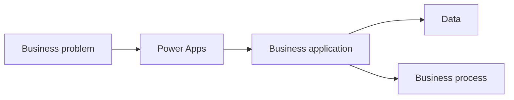
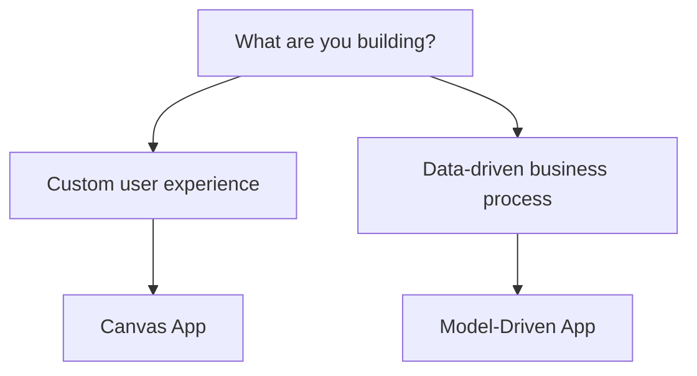
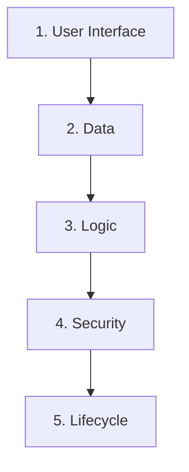
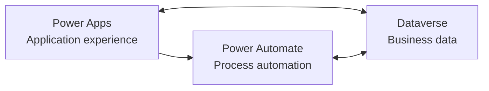
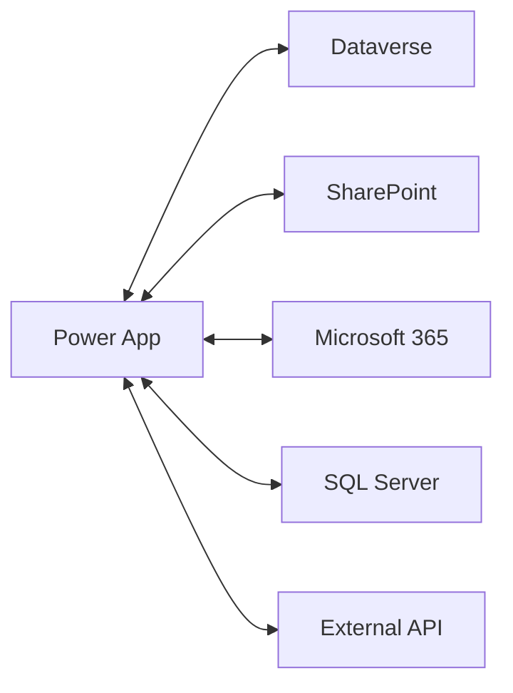
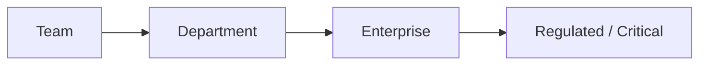
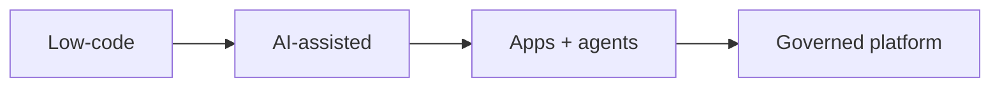
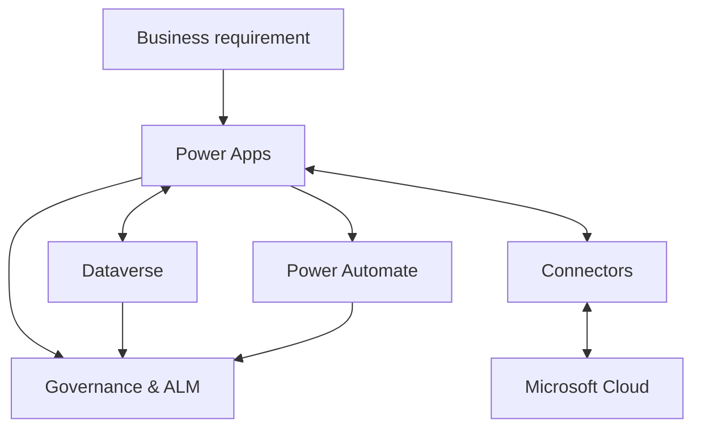

import Callout from "../../components/ui/Callout.astro";
import PowerAppsWorkloadSelector from "../../components/content/PowerAppsWorkloadSelector.astro";
import ArticleImageLightbox from "../../components/article/widgets/ArticleImageLightbox.astro";
import powerAppsApplicationModel from "../../assets/images/articles/power-apps/power-apps-application-model.png";
import powerAppsAppModels from "../../assets/images/articles/power-apps/power-apps-app-models.png";

Power Apps is often introduced as Microsoft's low-code platform for building business applications.

That is accurate, but incomplete.

Power Apps has evolved into a broader application platform that connects business applications with data, workflows, Microsoft 365, Dataverse, Dynamics 365, Azure, and increasingly AI-assisted development experiences. Microsoft positions it for makers, users, administrators, and professional developers.

So the better starting question is:

> **What is Power Apps actually for?**

---

## 1. What Is Microsoft Power Apps?

Power Apps is a platform for building custom business applications.

Instead of developing every application from scratch with a traditional software stack, organizations can use visual design tools, formulas, connectors, and reusable components to digitize business processes.

Typical examples include:

- leave-request applications;
- inspection forms;
- onboarding trackers;
- asset registers;
- field-service applications;
- approval applications.

A useful mental model is:

The application is only the visible layer. Behind it are the data, logic, security, integrations, and lifecycle controls.

---

## 2. The Different Ways You Can Build with Power Apps

Power Apps supports several application models, and choosing the right one depends on the workload.

<ArticleImageLightbox
  src={powerAppsAppModels.src}
  alt="Comparison diagram of Power Apps application models showing Canvas Apps as experience-first, Model-Driven Apps as data-first, Power Pages as an external experience, and code or AI-assisted experiences for advanced customization, with example use cases for each."
/>

### Canvas Apps

Canvas Apps start with the user experience.

> **Experience first.**

You design screens and controls and use Power Fx to define behavior. They are well suited to customized interfaces, mobile scenarios, field applications, and task-focused experiences.

### Model-Driven Apps

Model-Driven Apps start with the data model.

> **Data first.**

They are built around Dataverse tables, relationships, forms, views, charts, dashboards, and security roles, making them a strong fit for data-heavy and process-driven applications.

Power Apps is also expanding into **Power Pages, code-based experiences, Copilot-assisted development, and agentic application scenarios**.

<PowerAppsWorkloadSelector />

---

## 3. How Does a Power App Actually Work?

A Power App can be understood through five layers:

<ArticleImageLightbox
  src={powerAppsApplicationModel.src}
  alt="Five-layer Power Apps application model showing User Interface, Data, Logic, Security, and Lifecycle, with representative technologies and the principle that a Power App is a complete application system rather than only a screen."
/>

### User interface

Canvas Apps, Model-Driven Apps, or newer development experiences.

### Data

Dataverse, SharePoint, Excel, SQL Server, Dynamics 365, or other connected sources.

### Logic

Power Fx, business rules, Power Automate, plug-ins, and APIs.

### Security

Microsoft Entra ID, app sharing, environment boundaries, Dataverse roles, connector permissions, and data policies.

### Lifecycle

Solutions, environments, deployment, pipelines, monitoring, and governance.

The key lesson is:

> **A Power App is not just a screen. It is a small application system.**

---

## 4. Where Does Dataverse Fit?

If Power Apps is the application layer, the next question is:

> **Where does the business data live?**

Microsoft Dataverse is the cloud-based business data platform behind many Power Platform and Dynamics 365 scenarios. It provides tables, relationships, security, business rules, and other platform services.

That gives us a simple relationship:

For example, an onboarding solution could use:

**Power Apps** for the employee and manager experience.

**Dataverse** for onboarding records and business data.

**Power Automate** for approvals, notifications, and process steps.

The detailed Dataverse architecture belongs in the dedicated Dataverse article; for now, the important point is knowing where it fits.

---

## 5. How Does Power Apps Connect to Other Systems?

Power Apps can also work with data outside Dataverse through **connectors**.

Microsoft documents prebuilt and custom connectors for services such as Microsoft 365, Salesforce, Dropbox, Google services, and other systems.

This is powerful because an app can act as an interface over existing business systems.

It also introduces two questions:

> **What should the app connect to?**

> **Under whose permissions should it operate?**

Those questions become increasingly important as the application grows.

---

## 6. When Does a Simple App Become an Enterprise Application?

A small team may be able to build a simple SharePoint-backed Canvas App with modest controls.

A cross-department, regulated, or mission-critical application is different.

As complexity increases, organizations may need:

- Dataverse;
- stronger security;
- dedicated environments;
- solutions and ALM;
- deployment pipelines;
- monitoring;
- professional development support.

The important change is not necessarily the application itself.

It is the **engineering discipline around it**.

---

## 7. Security and Licensing

Two topics become important surprisingly early: **security and licensing**.

### Security

Access to the application does not automatically answer every question about access to the underlying data.

Power Apps security can involve identity, app sharing, environment boundaries, connector permissions, Dataverse roles, and data policies.

> **Application access and data access are related, but they are not the same question.**

### Licensing

Licensing also depends on more than user count.

Connector usage, data sources, Power Automate context, Dataverse capacity, external users, Power Pages, and other architectural choices can affect licensing and cost.

So a better licensing question is:

> **What will the users access, through which connectors, against which data, and in which environment?**

<Callout type="warning" title="Check licensing before deployment">
Power Platform licensing is scenario-dependent. Validate the current Microsoft licensing rules against the actual app architecture, connectors, data sources, environments, and usage pattern before production deployment.
</Callout>

The exact licensing rules should always be checked against Microsoft's current licensing documentation.

---

## 8. What Is Power Apps Becoming?

Power Apps has moved steadily from traditional low-code development toward **AI-assisted, agentic, and more deeply governed application development**.

Microsoft's 2026 release plan includes modern model-driven experiences, mobile and offline improvements, smarter search, AI enhancements, generative pages, monitoring, code management, and enterprise-scale improvements.

The broader direction is:

The development experience is moving toward describing business requirements, generating application components and data models, working with agents, and managing the resulting application through governed lifecycle processes.

But the engineering questions remain:

> **Where should the data live?**

> **Who should access it?**

> **How should it be deployed and monitored?**

> **Who owns it?**

AI may make application creation faster. It does not remove the need for architecture and governance.

---

## 9. Common Beginner Mistakes

Power Apps makes it easy to build something quickly. That is both its strength and one of its risks.

A few mistakes are worth avoiding:

**Building everything in one environment.**

**Treating Excel, SharePoint, and Dataverse as interchangeable.**

**Ignoring licensing until deployment.**

**Treating security as simply sharing the app.**

**Skipping lifecycle management because the app is "small."**

**Using Power Apps automatically when another technology would fit the workload better.**

The most important lesson is:

> **Fast app creation is not the same as good application architecture.**

---

## 10. Where Does Power Apps Fit?

The platform can now be reduced to a simple model:

Think of the pieces this way:

**Power Apps** — build the application experience.

**Dataverse** — provide a governed business-data foundation where appropriate.

**Power Automate** — orchestrate processes and automation.

**Connectors** — connect the application to other systems.

**Governance and ALM** — keep the solution manageable as it grows.

---

## Conclusion

Power Apps is easiest to understand when you stop thinking of it as simply a tool for building screens.

It is an **application platform**.

A production application can involve:

**Experience → Data → Logic → Security → Lifecycle**

That is why a Power App can begin as a small departmental tool and eventually require architecture, governance, security, licensing analysis, monitoring, and professional engineering.

The strategic question is therefore not simply:

> **"Should we use Power Apps?"**

It is:

> **"Which workloads should we build with Power Apps, what architecture should support them, and how will we govern them as they grow?"**

That is the mental model to carry into the rest of the Power Platform.

And the next question follows naturally:

> **If Power Apps is the application layer, where does the business data actually live?**
