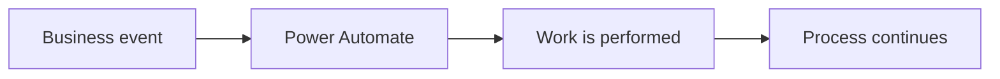
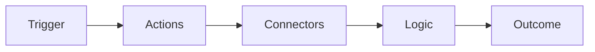
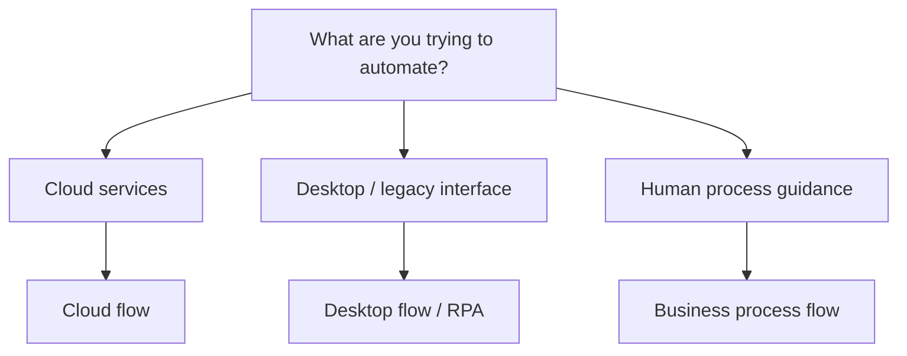
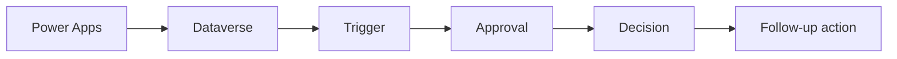
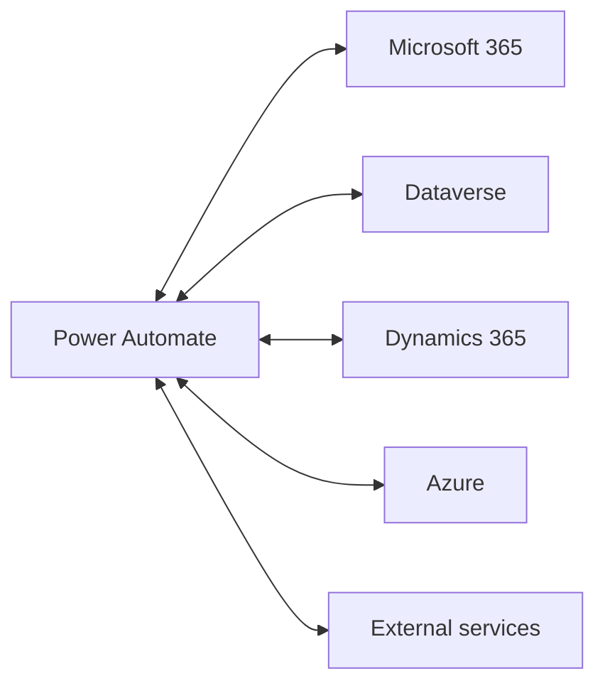
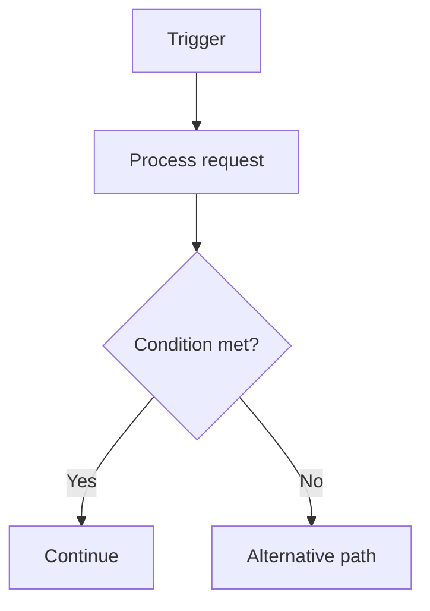
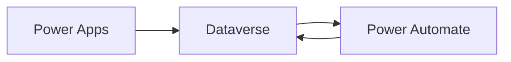
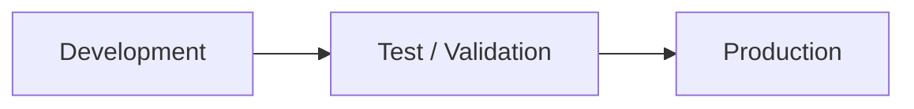
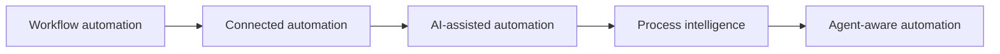
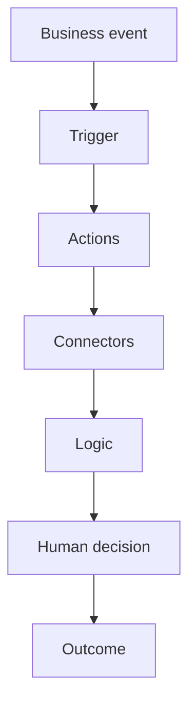

import Callout from "../../components/ui/Callout.astro";
import PowerAutomateAutomationSelector from "../../components/content/PowerAutomateAutomationSelector.astro";
import ArticleImageLightbox from "../../components/article/widgets/ArticleImageLightbox.astro";
import powerAutomateFlowAnatomy from "../../assets/images/articles/power-automate/power-automate-flow-anatomy.png";
import powerAutomateAutomationTypes from "../../assets/images/articles/power-automate/power-automate-automation-types.png";

Power Automate is often described as Microsoft's workflow automation platform.

That is a useful starting point.

Today, it can connect applications and services, automate desktop interfaces, guide business processes, handle approvals, and increasingly support AI-assisted automation and process intelligence.

For a beginner, however, the platform can be reduced to one simple idea:

> **When this happens, do that.**

Everything else builds on that model.

---

## 1. What Is Power Automate?

Power Automate helps organizations automate repetitive work and coordinate processes across applications, services, data sources, and desktop interfaces.

Common examples include:

- approvals;
- notifications;
- document processing;
- record synchronization;
- onboarding;
- service-ticket updates;
- finance processes.

A simple automation looks like this:

The flow starts from an event or request, performs work, and produces an outcome.

---

## 2. The Power Automate Mental Model

A flow can be understood through five building blocks:

<ArticleImageLightbox
  src={powerAutomateFlowAnatomy.src}
  alt="Power Automate flow anatomy showing Trigger, Actions, Connectors, Logic, and Outcome, with examples illustrating how an event starts a flow, work is performed, systems are connected, decisions are made, and a measurable result is produced."
/>

### Trigger

What starts the flow?

Examples include a new email, file, record change, button press, or scheduled event.

### Actions

What work should happen?

Examples include sending a message, creating a record, calling an API, or starting an approval.

### Connectors

Which services does the flow need to communicate with?

### Logic

What decisions, conditions, loops, or approvals determine what happens next?

### Outcome

What should be different when the automation finishes?

<Callout type="information" title="Remember the model">
A Power Automate flow is easiest to reason about as **Trigger → Actions → Connectors → Logic → Outcome**.
</Callout>

---

## 3. What Types of Automation Can Power Automate Handle?

Power Automate supports several automation models.

<ArticleImageLightbox
  src={powerAutomateAutomationTypes.src}
  alt="Comparison of Power Automate automation types showing Cloud Flows for cloud services, Desktop Flows or RPA for desktop and legacy interfaces, and Business Process Flows for guiding users through structured business processes."
/>

### Cloud flows

Cloud flows automate work across online services and can be:

- automated by an event;
- started manually;
- scheduled.

### Desktop flows

Desktop flows use RPA to interact with Windows applications, websites, and legacy interfaces.

### Business process flows

Business process flows guide users through defined stages and steps in model-driven business processes. They are designed to guide people rather than simply execute background automation.

This gives us a useful boundary:

> **Cloud flows automate work. Desktop flows automate interfaces. Business process flows guide people.**

<PowerAutomateAutomationSelector />

---

## 4. How Does a Cloud Flow Work?

Consider an onboarding process.

A user submits a request.

Dataverse stores the record.

The change triggers Power Automate.

The flow starts an approval, evaluates the response, updates the record, and performs the next action.

This is the core role of Power Automate:

> **Connect an event to the work that should happen next.**

---

## 5. Connectors: How Flows Reach Other Systems

Power Automate uses connectors to communicate with services such as:

- Outlook;
- Teams;
- SharePoint;
- OneDrive;
- Excel;
- Dataverse;
- Dynamics 365;
- Azure;
- third-party applications.

A connector determines which operations the flow can perform against a service.

That makes connectors part of the automation's **architecture, permissions, and potentially licensing**.

---

## 6. Logic Turns Automation Into a Process

Real processes rarely follow one straight path.

A flow may need to evaluate conditions, repeat work, or wait for a human decision.

Approvals can add human decisions, while loops can process multiple records.

This is why Power Automate is more than a list of actions:

> **Logic determines how the workflow behaves.**

---

## 7. How Power Automate Fits With Power Apps and Dataverse

One of the most common Power Platform patterns is:

**Power Apps** provides the user experience.

**Dataverse** stores structured business data.

**Power Automate** orchestrates what happens around that data.

For example:

> User submits a service request → Dataverse stores it → Power Automate assigns it and sends notifications → Dataverse records the new status.

This is one of the central relationships across Power Platform.

---

## 8. Desktop Automation: When APIs Are Not Available

Some organizations still depend on systems that expose no useful API.

That is where desktop flows can help.

They can automate:

- Windows applications;
- legacy interfaces;
- websites;
- repetitive desktop tasks.

The important principle is:

> **Use UI automation when UI automation is actually necessary.**

When a stable API or connector is available, an API-based integration is generally a better architectural starting point.

The deeper RPA design, unattended execution, machine management, and reliability concerns belong in the later technical article.

---

## 9. Environments and Lifecycle

Production automation needs more than a working flow.

Power Automate uses environments to separate applications, flows, connections, data, and lifecycle stages. Solutions and pipelines provide the foundation for controlled application lifecycle management.

For this beginner article, the important model is simply:

The detailed mechanics of solutions, pipelines, ownership, deployment strategy, and observability belong to the production-focused article.

---

## 10. Licensing Matters

Power Automate licensing depends on what the automation does and how it runs.

Scenarios can differ based on:

- standard versus premium connectors;
- RPA;
- AI Builder;
- managed-environment capabilities;
- user-based licensing;
- process-based capacity.

The beginner lesson is simple:

> **The automation design can influence its licensing requirements.**

A standard Microsoft 365 workflow is not necessarily licensed the same way as automation involving premium connectors, unattended RPA, or other advanced capabilities.

<Callout type="warning" title="Check licensing before deployment">
Validate the current Microsoft licensing rules against the actual connectors, automation type, execution model, and other capabilities used by the workload.
</Callout>

---

## 11. When Is Power Automate a Good Fit?

Power Automate is particularly useful when a process contains:

**an event → repeatable actions → business logic → a defined outcome**

Good examples include:

- approvals;
- notifications;
- document processing;
- onboarding;
- record synchronization;
- service requests;
- scheduled processes;
- Microsoft 365 automation.

The most useful question is:

> **Is this a repeatable process that can be expressed through events, actions, logic, and outcomes?**

---

## 12. When Should You Consider Something Else?

Power Automate is not automatically the answer to every automation problem.

Some workloads may be better served by specialized services when they require:

- heavy custom code;
- high-throughput messaging;
- complex transformation;
- reusable enterprise APIs;
- strict system decoupling.

Depending on the requirement, that may mean Azure Functions, Logic Apps, API Management, Service Bus, or another specialized platform.

The principle is:

> **Use Power Automate for orchestration; use specialized services when the workload demands specialized capabilities.**

---

## 13. Common Beginner Mistakes

Power Automate makes it easy to create a flow.

That does not mean every flow is well designed.

Avoid:

**Overly broad triggers** that run unnecessarily.

**Huge all-purpose flows** that become difficult to maintain.

**Desktop automation when a stable API exists.**

**Production flows owned only by one person's account.**

**Ignoring licensing until deployment.**

**Treating important automation as "fire and forget."**

The most important lesson is:

> **Easy to create does not mean easy to operate.**

---

## 14. What Is Power Automate Becoming?

Power Automate is expanding from traditional workflow automation into:

- AI-assisted authoring;
- process intelligence;
- RPA;
- richer governance;
- agent-aware automation.

Microsoft's current direction continues investment across cloud flows, desktop automation, process mining, Copilot, and Copilot Studio.

The important point is that AI does not replace deterministic automation.

It extends how automation can be created, understood, and combined with newer experiences.

---

## 15. The Power Automate Mental Model

Everything comes back to the same foundation:

Ask six questions:

**What starts the automation?**

**What work must happen?**

**Which systems does it need to reach?**

**What decisions or repetition are required?**

**Where does a person need to participate?**

**What should be different when the flow finishes?**

That is the foundation for understanding Power Automate.

---

## Conclusion

Power Automate is best understood as an **automation and orchestration platform**, not simply a notification tool.

The core model is:

> **Trigger → Actions → Connectors → Logic → Outcome**

From that foundation, the platform expands into cloud workflows, desktop automation, business process guidance, approvals, AI-assisted automation, process intelligence, and enterprise governance.

Power Apps can provide the experience.

Dataverse can provide the business data.

Power Automate can move the process forward.

The real engineering question is therefore not:

> **"Can Power Automate automate this?"**

It is:

> **"Is this a repeatable process that Power Automate can orchestrate reliably, securely, and economically?"**

That is the question that matters when an automation grows from a personal productivity flow into a business-critical process.