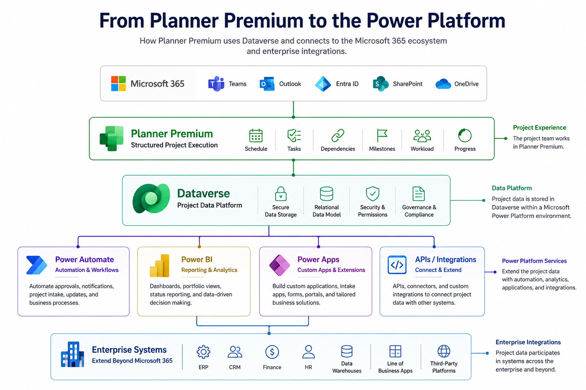
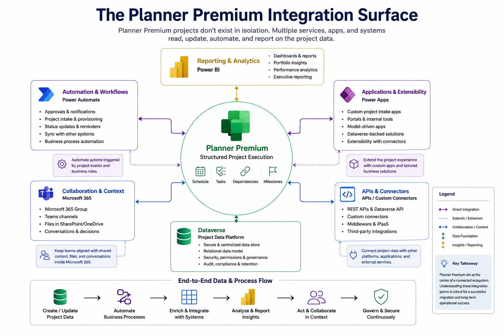
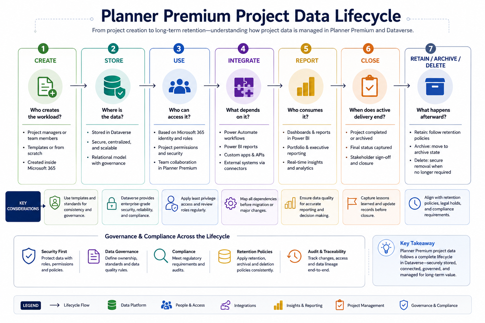

import PlannerPremiumIntegrationDependencyCheck from "../../components/content/PlannerPremiumIntegrationDependencyCheck.astro";
import MilestoneTimeline from "../../components/content/MilestoneTimeline.astro";
import ComparisonTable from "../../components/content/ComparisonTable.astro";

When a project manager opens Planner Premium, the experience can look familiar.

There are tasks, assignments, dates, schedules, dependencies, and milestones.

From the user's perspective, it is easy to think of Premium as simply a more capable version of Planner.

For a Microsoft 365 administrator, however, another question matters:

> **Where does the project data actually live, and what services depend on it?**

Planner Premium uses Microsoft Dataverse as the underlying data platform for its project data and is built around the Microsoft Power Platform. Project Online uses a different, SharePoint-based architecture.

That difference can affect:

- automation
- reporting
- integrations
- APIs
- security
- data ownership
- retention
- support

So the migration question is not simply:

> **"How do we move this project into Planner Premium?"**

It is:

> **"What changes in the architecture when this workload becomes a Planner Premium project?"**

## The Architectural Difference

A useful mental model is:

```text
Project Online
     │
     ▼
SharePoint Online / Office 365
     │
     ├── Reporting
     ├── Workflows
     └── Integrations


Planner Premium
     │
     ▼
Dataverse
     │
     ├── Power Automate
     ├── Power BI
     ├── Power Apps
     └── APIs / integrations
```

The important point is not that one architecture is inherently better.

They represent different service models.

For administrators, that means existing reports, workflows, applications, and integrations should be treated as dependencies to validate rather than assumed to migrate unchanged.



## Where Planner Premium Data Lives

Dataverse is part of the underlying architecture of Premium project management.

Microsoft's architecture documentation describes Premium project data as being stored in Dataverse entities within a Dataverse environment.

For administrators, that immediately creates several questions:

- Which environment contains the data?
- Who administers it?
- Who owns the data?
- How is access governed?
- Which integrations depend on it?
- What happens when the project closes?

These aren't development questions alone.

An administrator may never build a Power App and still be responsible for the environment in which project data exists.

## What Dataverse Changes for Administrators

Once Premium project data sits in Dataverse, several responsibilities become more explicit.

### Environment

Where does the workload live, and who administers the environment?

### Data

Who owns the project information and the processes built around it?

### Security

Who can access the data, applications, and related project information?

### Integration

Which flows, reports, APIs, or applications consume the data?

### Support

Which team owns the issue when the Planner experience works but an integration does not?

The architectural shift therefore creates a broader question:

> **Who owns the system around the project, not just the project itself?**

## Power Automate: The First Integration Surface to Validate

An organization may already use Power Automate for:

- approvals
- notifications
- project intake
- downstream updates
- synchronization
- reporting support

The important question is not whether a Flow mentions Planner.

It is:

> **What data source, connector, trigger, and action is the workflow actually using?**

A simple workflow might look like:

```text
Project activity
      ↓
Power Automate
      ↓
Approval / Notification
      ↓
Downstream action
```

After migration, the business process must still work.

That means testing the **transaction**, not merely confirming that the Flow still exists.

For each critical workflow, validate:

- trigger
- data source
- connector
- action
- downstream result
- owner
- failure handling

## Power BI: Validate the Reporting Architecture

Power BI introduces a similar question.

An organization may already have:

- executive dashboards
- project reports
- portfolio reporting
- milestone views
- resource reporting
- refresh schedules

The project can move successfully while the reporting architecture still depends on a particular data source or transformation.

The right question is therefore:

> **Where does the report get its data, and does that path still represent the workload?**

Administrators should not automatically assume:

> **Planner changed → rebuild every report.**

Instead:

> **Planner changed → validate the existing reporting architecture.**

That validation should cover:

- data source
- dataset
- refresh
- calculations
- permissions
- ownership
- cross-system dependencies



The deeper Power BI implementation belongs in a dedicated reporting article.

## APIs, Custom Applications, and Extensibility

Some dependencies are less visible.

An organization may have built an internal application that:

- creates projects
- collects project intake
- displays project status
- synchronizes information
- supports approvals
- exposes project information through an internal portal

These applications may never appear to users as "Planner integrations."

They are still part of the project architecture.

The right question is:

> **What applications depend on this project data?**

<ComparisonTable
  caption="Information to capture for each important integration"
  columns={[
    { label: "Dependency" },
    { label: "Capture" }
  ]}
  rows={[
    {
      label: "Application",
      cells: ["Name and owner"]
    },
    {
      label: "API / connector",
      cells: ["Integration path"]
    },
    {
      label: "Data",
      cells: ["Read / write / both"]
    },
    {
      label: "Authentication",
      cells: ["Identity or application"]
    },
    {
      label: "Business purpose",
      cells: ["Why it exists"]
    },
    {
      label: "Criticality",
      cells: ["Business impact"]
    },
    {
      label: "Support",
      cells: ["Owning team"]
    }
  ]}
/>

And don't assume every legacy integration needs to be rebuilt.

Classify it:

**Retain** — still valid.

**Modify** — the business process remains, but the architecture changes.

**Replace** — a simpler native capability now exists.

**Retire** — the dependency no longer provides sufficient value.

This is particularly useful during Project Online retirement because migration can also be an opportunity to remove technical debt.

## Data Lifecycle, Retention, and Compliance

Project data can remain valuable long after the project closes.

It may contain:

- approvals
- delivery commitments
- customer information
- financial context
- security activity
- evidence of compliance

That means the question is not only:

> **"How do we move the active project?"**

It is:

> **"What happens to the data throughout its lifecycle?"**

For each workload, administrators should know:

- what must be retained
- for how long
- who owns the decision
- what happens when the project closes
- whether historical reporting is required
- what can eventually be deleted

A key distinction is:

> **Project closure and data deletion are not automatically the same event.**

For regulated or sensitive workloads, Legal, Compliance, Records, and Security may need to approve the control model before migration.



## Security, Governance, and Support Ownership

Planner Premium sits within a broader Microsoft 365 and Power Platform environment.

That means ownership needs to be explicit.

At minimum, identify:

### Business owner

Who is accountable for the project or business process?

### Data owner

Who determines how the information is used and retained?

### Platform owner

Who administers the Microsoft 365 / Dataverse environment?

### Technical owner

Who maintains automation, reports, APIs, and applications?

Security should also follow the data.

A project can contain sensitive:

- customer information
- financial information
- legal activity
- product plans
- security remediation

Therefore the organization should know:

- who can create the project
- who belongs to the associated Microsoft 365 Group
- whether guest access is allowed
- how sensitive workloads are classified
- what happens when ownership changes

## Build the Integration Inventory

Before moving a significant workload, create a single inventory of what depends on it.

<ComparisonTable
  caption="Integration inventory"
  columns={[
    { label: "Area" },
    { label: "What to capture" }
  ]}
  rows={[
    {
      label: "Project",
      cells: ["Owner, purpose, lifecycle"]
    },
    {
      label: "Dataverse",
      cells: ["Environment, data owner"]
    },
    {
      label: "Power Automate",
      cells: ["Flows, connectors, owners"]
    },
    {
      label: "Power BI",
      cells: ["Dataset, reports, refresh, owner"]
    },
    {
      label: "APIs",
      cells: ["Endpoint, authentication, consumer"]
    },
    {
      label: "Custom apps",
      cells: ["Application, dependency, owner"]
    },
    {
      label: "Microsoft 365 Groups",
      cells: ["Membership, owner, lifecycle"]
    },
    {
      label: "Retention",
      cells: ["Policy and records owner"]
    },
    {
      label: "Support",
      cells: ["First-line and specialist owner"]
    }
  ]}
/>

Then classify each dependency:

**Critical** → business process depends on it.

**Important** → process is degraded if it fails.

**Informational** → useful but non-critical.

**Obsolete** → candidate for retirement.

The inventory should ultimately answer:

> **What depends on this workload, who owns it, and how will we test it?**

<PlannerPremiumIntegrationDependencyCheck />

## Test the Business Process, Not Just the Project

A project appearing in Planner Premium is not proof that the migration succeeded.

Test the complete workload.

### Data

Are the required projects, tasks, dates, dependencies, and historical information present?

### Users

Can each role perform its intended responsibility?

### Automation

Do critical workflows complete successfully?

### Reporting

Do dashboards refresh and produce the expected information?

### Security

Can the right people access the right data?

### Lifecycle

Are retention and closure requirements satisfied?

### Support

Does everyone know where failures go?

## Test Representative Workloads

Don't pilot only the simplest project.

Include:

**Simple workload**

Basic users and straightforward execution.

**Structured project**

Schedules, dependencies, milestones, and Premium capabilities.

**Integration-heavy project**

Power Automate, Power BI, applications, and APIs.

**Sensitive workload**

Access, governance, retention, and compliance.

<MilestoneTimeline
  milestones={[
    {
      date: "01",
      datetime: "2026-01-01",
      title: "Assess",
      description:
        "Establish a baseline of the organization's Planner usage, project workloads, roles, licensing, integrations, reporting requirements, and pain points.",
      impact:
        "Creates the baseline needed to determine where Planner Premium is appropriate before adoption expands."
    },
    {
      date: "02",
      datetime: "2026-02-01",
      title: "Pilot",
      description:
        "Select representative teams and evaluate whether Planner Premium improves planning, dependency management, project visibility, workload understanding, and reporting.",
      impact:
        "Produces evidence from real workloads rather than relying on assumptions about adoption."
    },
    {
      date: "03",
      datetime: "2026-03-01",
      title: "Govern",
      description:
        "Use the pilot findings to establish standards for Premium usage, project structure, ownership, naming, required information, lifecycle, and support.",
      impact:
        "Creates a repeatable operating model without introducing unnecessary governance overhead."
    },
    {
      date: "04",
      datetime: "2026-04-01",
      title: "Scale",
      description:
        "Expand Premium adoption only after the organization has validated the operating model and refined licensing, onboarding, training, support, governance, reporting, and adoption practices.",
      impact:
        "Turns broader adoption into an extension of a tested model rather than a company-wide experiment."
    }
  ]}
/>

## Define Acceptance Criteria

Before testing begins, agree on what "successful" means.

<ComparisonTable
  caption="Acceptance criteria for migration validation"
  columns={[
    { label: "Area" },
    { label: "Acceptance criterion" }
  ]}
  rows={[
    {
      label: "Data",
      cells: ["Required information is available"]
    },
    {
      label: "Users",
      cells: ["Each role can perform its responsibilities"]
    },
    {
      label: "Automation",
      cells: ["Critical workflows complete"]
    },
    {
      label: "Reporting",
      cells: ["Key reports refresh and reconcile"]
    },
    {
      label: "Security",
      cells: ["Access follows the approved model"]
    },
    {
      label: "Governance",
      cells: ["Ownership and support are documented"]
    },
    {
      label: "Lifecycle",
      cells: ["Retention and closure process is defined"]
    }
  ]}
/>

That turns migration from:

> "It seems to work."

into:

> **"The workload meets the agreed acceptance criteria."**

## Reference Architecture

The architecture we've discussed can now be summarized:

```text
                         MICROSOFT 365
                               │
                          Planner Premium
                               │
                               ▼
                           Dataverse
                               │
             ┌─────────────────┼─────────────────┐
             │                 │                 │
             ▼                 ▼                 ▼
       Power Automate       Power BI         Power Apps
             │                 │                 │
             └─────────────────┼─────────────────┘
                               │
                       APIs / Integrations
                               │
                               ▼
                       Enterprise systems
```

This is a **reference architecture**, not a requirement that every organization implement every component.

Its purpose is to show the relationship between:

**Project experience**

→ **Data platform**

→ **Business services**

→ **Enterprise integrations**

→ **Governance and support**

## Administrator Readiness Checklist

Before moving a significant workload into Planner Premium, administrators should be able to answer:

### Data

- Where is the project data stored?
- Which Dataverse environment contains it?
- Who owns the data?
- What must be retained?

### Access

- Who needs Premium capabilities?
- Who only needs task participation?
- Who belongs to the Microsoft 365 Group?
- Is guest access appropriate?

### Automation

- Which Flows depend on the project?
- Which connectors do they use?
- Who owns them?

### Reporting

- Which Power BI reports depend on the workload?
- What is their source?
- Who owns the dataset?
- How is refresh managed?

### Applications

- Are there custom applications or APIs?
- What data do they consume?
- Who supports them?

### Lifecycle

- What happens when the project closes?
- What is archived?
- What is retained?
- What can eventually be deleted?

### Support

- Who receives the first ticket?
- Which team owns the platform?
- Who owns integrations?
- How are cross-service incidents escalated?

## Conclusion — The Project May Look the Same. The Architecture Doesn't.

Planner Premium can look familiar to the project team.

They still see tasks, assignments, dates, schedules, milestones, and project information.

But underneath that experience is a broader architectural model.

Premium project data is stored in Dataverse and can participate in a Power Platform ecosystem involving automation, reporting, applications, and integrations.

For organizations moving from older project environments, that distinction matters even more.

The migration should not be treated as:

> **Move the project and move on.**

It should be treated as:

> **Understand the data, map the dependencies, validate the business process, establish ownership, and then move the workload.**

A successful migration therefore isn't simply one where the new project opens.

It is one where:

- the data is available,
- the users can work,
- the integrations operate,
- the reports remain trustworthy,
- the access model is appropriate,
- the lifecycle is understood,
- and the support organization knows what to do when something fails.

> **The project may look the same to the project manager. The architecture underneath it may not.**

And for the Microsoft 365 administrator, understanding that architecture is what turns Planner Premium from a deployed feature into a **supportable enterprise service**.
