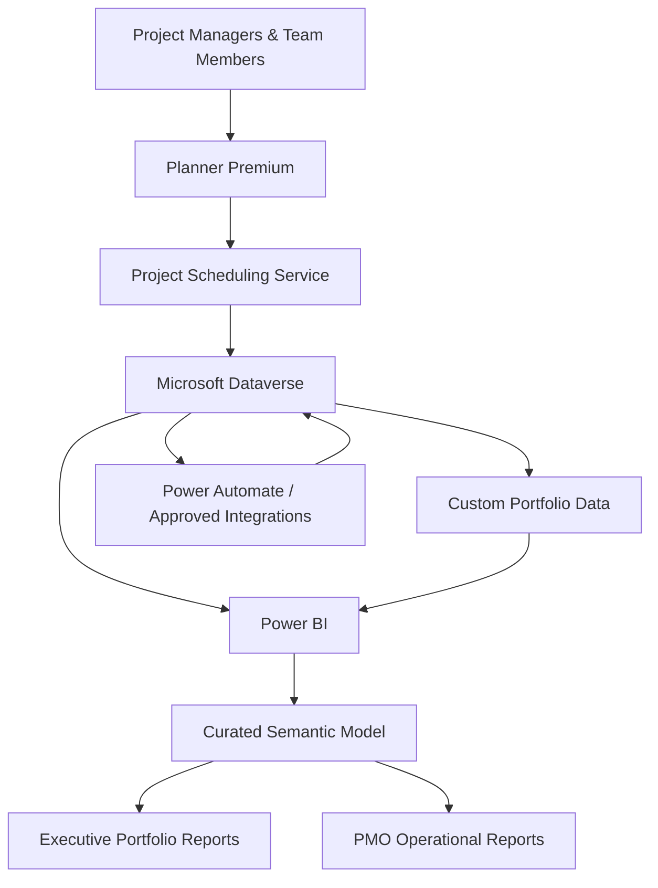
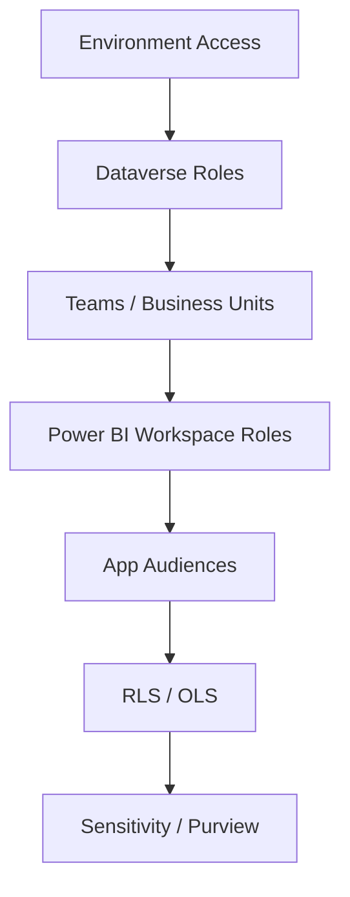
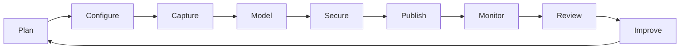

import ComparisonTable from "../../components/content/ComparisonTable.astro";
import Callout from "../../components/ui/Callout.astro";
import PlannerAnalyticsArchitectureSelector from "../../components/content/PlannerAnalyticsArchitectureSelector.astro";
import ArticleImageLightbox from "../../components/article/widgets/ArticleImageLightbox.astro";

import plannerPremiumPowerBiFabricReferenceArchitecture from "../../assets/images/articles/planner/planner-premium-power-bi-fabric-reference-architecture.png";
import plannerPremiumSemanticModel from "../../assets/images/articles/planner/planner-premium-semantic-model.png";

An executive portfolio dashboard is only the visible layer of a larger system.

Planner Premium provides the project-management experience and scheduling capabilities. Dataverse stores project information and metadata. Power BI provides the semantic and analytical layer. Power Automate can extend the solution with notifications, approvals, and integration orchestration. Fabric or Azure can add a broader analytical layer when scale or cross-system reporting requires it.

A production implementation therefore needs to answer more than:

> **“How do I connect Planner to Power BI?”**

It needs to answer:

> **“How do I build a governed, secure, supportable project analytics platform?”**

<ArticleImageLightbox
  src={plannerPremiumPowerBiFabricReferenceArchitecture.src}
  alt="Enterprise project portfolio analytics architecture showing Planner Premium and the project scheduling service feeding Microsoft Dataverse, a curated semantic model, and Power BI executive and PMO reporting, with Fabric or Azure as an optional analytical layer and governance surrounding the platform."
/>

---

## 1. The Reference Architecture

A practical architecture is:

For moderate implementations, direct Dataverse connectivity to Power BI can be sufficient.

Larger or cross-system implementations may need an analytical layer before Power BI consumption.

> **Separate project execution from analytical consumption.**

---

## 2. Give Each Component a Clear Responsibility

<ComparisonTable
  caption="Platform components and their primary responsibilities"
  columns={[
    { label: "Component" },
    { label: "Responsibility" }
  ]}
  rows={[
    {
      label: "Planner Premium",
      cells: ["Project-management and team experience"]
    },
    {
      label: "Scheduling service",
      cells: ["Tasks, dependencies, assignments, and schedule operations"]
    },
    {
      label: "Dataverse",
      cells: ["Project data, metadata, security, and extensibility"]
    },
    {
      label: "Power Apps",
      cells: ["Administration and portfolio-data extensions"]
    },
    {
      label: "Power Automate",
      cells: ["Notifications, approvals, status collection, and orchestration"]
    },
    {
      label: "Power BI",
      cells: ["Semantic modeling, KPI calculation, and analytics"]
    },
    {
      label: "Microsoft Entra ID",
      cells: ["Identity and access governance"]
    },
    {
      label: "Microsoft Purview",
      cells: ["Optional lineage, sensitivity, catalog, and compliance controls"]
    },
    {
      label: "Fabric / Azure",
      cells: ["Optional analytical scale and cross-system integration"]
    }
  ]}
/>

Do not make one component responsible for work that belongs elsewhere.

---

## 3. Confirm the Workload Is Actually Planner Premium

Planner Premium follows the Project for the web lineage and uses Dataverse for project data.

Basic Planner follows a different service and data architecture.

That distinction affects:

- **Data access**
- **Reporting**
- **Automation**
- **Integrations**
- **Licensing**
- **Security**

Before designing the analytical layer, confirm that the workload is genuinely a Premium project workload.

---

## 4. Separate Project Data From Portfolio Intelligence

Core project domains include:

- **Project**
- **Project Task**
- **Dependency**
- **Assignment**
- **Project Team Member**
- **User / Resource**
- **Bucket**

Portfolio reporting often also needs information that is custom or external:

- **Portfolio**
- **Status Updates**
- **Risks / Issues / Decisions**
- **Strategic Alignment**
- **Benefits**
- **Financials**
- **Snapshots / History**

A useful model is:

**Native project data + Governed portfolio data + Approved external data → Portfolio analytics**

This separation keeps the project execution model from becoming a dumping ground for every portfolio-management requirement.

---

## 5. Choose the Right Data-Access Pattern

There is no single correct extraction method.

<ComparisonTable
  caption="Planner Premium analytics data-access approaches"
  columns={[
    { label: "Approach" },
    { label: "Best fit" },
    { label: "Primary trade-off" }
  ]}
  rows={[
    {
      label: "Power BI + Dataverse connector",
      cells: [
        "Moderate portfolios and direct reporting",
        "Requires careful query reduction and model design"
      ]
    },
    {
      label: "Power Query dataflows",
      cells: [
        "Repeated transformation and reusable cleansing",
        "Adds refresh and lifecycle dependencies"
      ]
    },
    {
      label: "Dataverse Web API",
      cells: [
        "Controlled integrations",
        "Not normally the best bulk BI extraction pattern"
      ]
    },
    {
      label: "Power Automate",
      cells: [
        "Notifications and low-volume orchestration",
        "Poor fit for large-scale analytical ingestion"
      ]
    },
    {
      label: "Analytical replication",
      cells: [
        "Large history or cross-system reporting",
        "Adds infrastructure and governance"
      ]
    },
    {
      label: "Fabric / Azure",
      cells: [
        "Enterprise analytical scale",
        "Requires broader data-platform engineering"
      ]
    }
  ]}
/>

For moderate portfolios, start with the simplest supported path.

For larger history, multiple departments, or multiple source systems, separate analytical workloads from operational access rather than turning Power Automate into a row-by-row ingestion mechanism.

<PlannerAnalyticsArchitectureSelector />

---

## 6. Build a Curated Semantic Model

The semantic model should simplify Dataverse rather than reproduce its complexity.

### Dimensions

- **Date**
- **Project**
- **Portfolio / Program**
- **Organization**
- **Project Manager**
- **Resource**
- **Status**
- **Strategic Objective**

### Facts

- **Current Project Status**
- **Tasks**
- **Assignments**
- **Milestones**
- **Periodic Snapshots**
- **Risks / Issues**
- **Financials, where authorized**

<ArticleImageLightbox
  src={plannerPremiumSemanticModel.src}
  alt="Curated Planner Premium Power BI semantic model using a star schema, with descriptive dimensions such as Date, Project, Portfolio, Organization, Resource, Status, and Strategic Objective surrounding fact tables for Tasks, Assignments, Milestones, Dependencies, Snapshots, Risks and Issues, and optional Financials."
/>

The model should use stable Dataverse identifiers, one-to-many relationships where possible, and limited bidirectional filtering.

> **Do not build one giant flattened table.**

---

## 7. Treat KPIs as Business Definitions

Representative measures include:

- **Active Projects**
- **Overdue Milestones**
- **Milestone On-Time %**
- **Schedule Variance**
- **Critical Open Risks**

The important point is not the DAX syntax.

Business owners must agree on the:

- **Definition**
- **Threshold**
- **Weighting**
- **Owner**
- **Exception treatment**

A technical formula does not automatically create a meaningful management KPI.

<Callout type="information" title="KPI logic needs business ownership">
Document each portfolio KPI as a governed definition before implementing the measure. In particular, do not treat average task completion as portfolio health unless the organization has explicitly agreed how that measure should be weighted and interpreted.
</Callout>

---

## 8. Build History Deliberately

Current-state data answers:

> **Where is the project now?**

It does not reliably answer:

> **How did the project get here?**

Historical health, schedule, and risk trends require persisted snapshots.

History is therefore a data-architecture decision, not simply a charting feature.

---

## 9. Design Security as Layers

A production implementation can combine:

Imported Power BI models should not be assumed to enforce identical restrictions to Dataverse.

Security must be designed and tested at the analytical layer.

For executive consumers, prefer curated app access over unnecessary workspace collaboration roles.

---

## 10. Separate Authors From Consumers

A practical role model separates administration, development, portfolio ownership, and consumption.

**Power Platform administrator** → environment and service administration

**Solution administrator** → managed solution and configuration control

**PMO data steward** → portfolio taxonomy and data quality

**Project manager** → authorized project management

**Portfolio manager** → governed portfolio visibility

**Executive** → curated scorecards

**Power BI developer** → analytical development

**Refresh identity** → non-interactive least-privilege access

Do not depend on a departing employee's identity for production refresh.

---

## 11. Design for Performance Before Scale Arrives

The most important controls are architectural:

- Select only required rows and columns.
- Prefer Import unless another mode is justified.
- Reduce high-cardinality fields.
- Use snapshots for trends.
- Avoid excessive calculated columns.
- Prefer measures and upstream transformations.
- Separate executive reporting from heavy operational detail.
- Monitor refresh duration and query performance.

For multiple environments, a centralized analytical layer may be preferable to embedding many independent sources in every report.

<Callout type="best-practice" title="Performance starts before the report">
Treat model shape, data reduction, refresh strategy, and source separation as architecture decisions rather than waiting until a Power BI report becomes slow.
</Callout>

---

## 12. Use Automation to Extend the Platform

Useful patterns include:

- **status reminders**
- **overdue-milestone escalation**
- **project intake**
- **stage-gate approvals**
- **snapshot creation**
- **data-quality notifications**
- **approved finance / HR synchronization**
- **executive summary distribution**

Automation should also include:

- **idempotency**
- **retry handling**
- **logging**
- **service ownership**
- **exception handling**

and protection against update loops.

Power Automate should complement the analytics platform, not become its bulk ingestion engine.

---

## 13. Recognize the Boundaries

<ComparisonTable
  caption="Common architectural boundaries and responses"
  columns={[
    { label: "Limitation" },
    { label: "Architectural response" }
  ]}
  rows={[
    {
      label: "Planner Premium is not a complete PPM system",
      cells: ["Add governed portfolio extensions"]
    },
    {
      label: "Schedule data does not define executive health",
      cells: ["Define KPI and status governance"]
    },
    {
      label: "Current-state data lacks history",
      cells: ["Create periodic snapshots"]
    },
    {
      label: "Assignments are not automatically capacity",
      cells: ["Add availability and non-project demand"]
    },
    {
      label: "Financials may be incomplete",
      cells: ["Integrate an authoritative finance source"]
    },
    {
      label: "Cross-environment portfolios are difficult",
      cells: ["Use an analytical consolidation layer"]
    },
    {
      label: "Dataverse is complex",
      cells: ["Build a curated semantic layer"]
    },
    {
      label: "Source and BI security differ",
      cells: ["Implement and test Power BI security"]
    },
    {
      label: "Licensing can be underestimated",
      cells: ["Review entitlements by persona"]
    },
    {
      label: "Service limits can change",
      cells: ["Validate current limits before sign-off"]
    }
  ]}
/>

These are architectural boundaries, not just implementation nuisances.

---

## 14. Production Readiness

Before release, validate four areas.

### Architecture

Approved topology, supported data-access method, history strategy, and cross-system approach.

### Data

Portfolio taxonomy, mandatory fields, KPI definitions, reconciliation, and data-quality ownership.

### Security

Least-privilege access, RLS testing, governed refresh identity, and sharing controls.

### Operations

Deployment process, refresh monitoring, support runbook, recovery expectations, schema-change process, and periodic licensing review.

Production readiness means the report can be **operated**, not merely opened successfully in Power BI.

---

## 15. The Complete Operating Model

A mature implementation can be summarized as:

The dashboard is therefore the visible end of a larger operating system.

---

# Conclusion

An enterprise project portfolio analytics solution is not simply:

**Planner Premium + Power BI.**

The architecture is:

> **Planner Premium for project execution → Dataverse for governed information → Power BI for semantic modeling and analytics → Fabric or Azure when scale or cross-system consolidation requires it → governance and operations around the entire system.**

The most important engineering decisions are:

- **model the right information**
- **separate project data from portfolio intelligence**
- **choose the appropriate data-access path**
- **build a curated semantic model**
- **design security explicitly**
- **persist history when trends matter**
- **treat assignments carefully when discussing capacity**
- **govern automation**
- **validate performance**
- **operate the solution as a production service**

The result is not merely an executive dashboard.

It is a **governed project analytics platform**.
