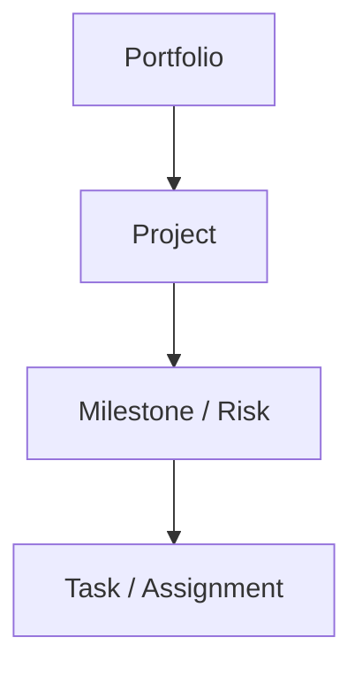
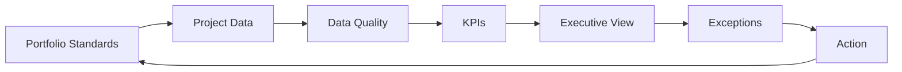

import ComparisonTable from "../../components/content/ComparisonTable.astro";
import Callout from "../../components/ui/Callout.astro";
import PlannerPortfolioDashboardGuide from "../../components/content/PlannerPortfolioDashboardGuide.astro";
import ArticleImageLightbox from "../../components/article/widgets/ArticleImageLightbox.astro";

import plannerPremiumExecutivePortfolioDashboard from "../../assets/images/articles/planner/planner-premium-executive-portfolio-dashboard.png";
import plannerPremiumExecutiveDashboardHierarchy from "../../assets/images/articles/planner/planner-premium-executive-dashboard-hierarchy.png";

Most project reporting starts with a simple question:

> **What work is complete?**

Executives need a different view.

They need to know which initiatives are healthy, which are drifting, which milestones are at risk, where resource pressure is building, and which projects need intervention.

Planner Premium provides a stronger foundation for this kind of reporting because its project data is stored in Microsoft Dataverse and can be analyzed in Power BI or extended into Microsoft Fabric.

An executive dashboard should therefore be treated as a **decision-support layer over project data**, not simply a collection of charts.

<ArticleImageLightbox
  src={plannerPremiumExecutivePortfolioDashboard.src}
  alt="Executive project portfolio dashboard concept using Planner Premium and Power BI, showing portfolio health, schedule performance, milestone risk, resource pressure, delivery trends, and project-level drill-through for executive decision-making."
/>

---

## 1. Design for Decisions, Not Available Fields

Before building visuals, define the decisions the dashboard must support:

- Which projects need intervention?
- Which milestones threaten strategic commitments?
- Where is delivery risk increasing?
- Where is resource pressure building?
- Which initiatives need funding or executive attention?

A dashboard built around available fields becomes a status report.

A dashboard built around decisions becomes a portfolio-management tool.

---

## 2. Team, Project, and Executive Dashboards Are Different

<ComparisonTable
  caption="Dashboard scope by audience"
  columns={[
    { label: "Dashboard type" },
    { label: "Primary audience" },
    { label: "Main question" }
  ]}
  rows={[
    {
      label: "Team task dashboard",
      cells: [
        "Team members, project managers",
        "What work needs attention today?"
      ]
    },
    {
      label: "Project dashboard",
      cells: [
        "Project manager, sponsor",
        "Is this project on track?"
      ]
    },
    {
      label: "Executive portfolio dashboard",
      cells: [
        "Executives, PMO, IT decision-makers",
        "Which initiatives need action or funding decisions?"
      ]
    }
  ]}
/>

Team views focus on tasks.

Project views add schedule, milestones, dependencies, effort, and risks.

Executive views move toward portfolio health, resource pressure, delivery trends, strategic context, and intervention.

<ArticleImageLightbox
  src={plannerPremiumExecutiveDashboardHierarchy.src}
  alt="Dashboard hierarchy showing the progression from team task reporting to project reporting and executive portfolio reporting, with increasing focus on schedule, milestones, resources, risks, portfolio health, and strategic decisions."
/>

---

## 3. Why Planner Premium Is a Better Portfolio Foundation

Premium adds project-management concepts such as:

- timelines;
- dependencies;
- milestones;
- assignments;
- custom fields;
- goals;
- task history;
- critical path;
- sprints.

These richer project concepts make portfolio analysis possible beyond basic task counts.

But Premium does not automatically create an executive dashboard.

It provides **richer project information from which one can be designed**.

---

## 4. Build the KPI Framework First

A practical executive KPI set can cover six areas.

### Portfolio health

- Active projects
- Projects at risk
- Completed projects
- Average completion

### Schedule performance

- Late tasks
- Overdue milestones
- Finish-date variance
- Dependency exposure

### Milestones

- Completed
- Due soon
- Overdue

### Resource pressure

- Effort by resource
- Remaining work
- Assignment demand
- Workload concentration

### Delivery trends

- Effort completed vs. remaining
- Completion trend
- Slippage

### Risk

- Overdue critical tasks
- Dependency hotspots
- Projects without recent updates

The Microsoft Project Power BI template provides portfolio, milestone, resource, task, and timeline reporting patterns that can serve as a starting point.

---

## 5. Not Every Executive KPI Exists Automatically

Executives may also want:

- strategic priority;
- business value;
- financial benefit;
- risk score;
- sponsor confidence;
- benefit realization.

These should not be presented as native Planner information unless they actually are.

Such enterprise-specific metrics usually require custom fields, governance rules, or another system of record.

<Callout type="information" title="The dashboard cannot invent missing business context">
A dashboard can calculate from the information that exists in the underlying process. Strategic priorities, business value, financial benefits, sponsor confidence, and similar measures need to be captured or integrated deliberately.
</Callout>

> **A dashboard cannot create business information that the underlying process does not capture.**

---

## 6. Recommended Dashboard Structure

A concise five-page design works well.

### Page 1 — Executive Portfolio Summary

Show:

- active projects;
- projects at risk;
- overdue milestones;
- remaining effort;
- completion;
- portfolio filters.

### Page 2 — Portfolio Timeline

Show project duration, progress, and responsible project manager.

### Page 3 — Milestones and Risks

Focus on completed, upcoming, overdue, and blocked milestones.

### Page 4 — Resource Utilization

Show effort, remaining assignments, workload, and project distribution.

### Page 5 — Project Drill-through

Allow PMO users to move from portfolio signals into project timelines, tasks, milestones, dependencies, and status.

The Microsoft reporting patterns provide a useful foundation for this separation of portfolio and project detail.

The navigation model should be:

Executives see the exception first; delivery teams can then investigate the underlying cause.

---

## 7. The Dashboard Still Depends on Architecture

At a high level:

For moderate implementations, Power BI can connect directly to Dataverse.

For larger or cross-system reporting, Dataverse can be extended into Fabric/OneLake before analytical consumption.

The next technical article will cover that architecture in detail.

---

## 8. Two Important Data Caveats

### Assignments are not automatically capacity

Assignment data can indicate workload, but it does not automatically represent true workforce capacity.

Real capacity may require calendars, availability, non-project work, and allocation rules.

> **Assignment demand is not the same thing as workforce capacity.**

### Current state is not history

Current project data tells you where a project is now. It cannot reliably reconstruct past health states.

Historical trends require persisted snapshots.

That distinction matters for questions such as whether schedule slippage or risk has been increasing over time.

---

## 9. Security Must Follow the Audience

Executive access should be designed independently of the source system.

A layered model can include:

- environment access;
- Dataverse roles;
- Power BI workspace roles;
- app audiences;
- row-level security;
- object-level security where required;
- sensitivity controls.

Do not assume Dataverse record security automatically produces identical restrictions in an imported Power BI model.

For broad executive consumption, use curated Power BI apps and controlled viewer access rather than turning every executive into a workspace collaborator.

---

## 10. A Dashboard Should Expose Data Quality

A trustworthy dashboard should also identify information that cannot be trusted.

Examples include:

- missing owners;
- stale status updates;
- incomplete classifications;
- invalid dates.

A dedicated data-quality view can make these problems visible rather than hiding them behind polished visuals.

> **A trustworthy dashboard should reveal when its own data is incomplete or stale.**

---

## 11. What Planner Premium Does Not Solve

Planner Premium and Power BI do not automatically provide:

- portfolio governance;
- complete financial truth;
- enterprise resource capacity;
- strategic alignment;
- benefit realization;
- historical health;
- cross-system portfolio consolidation.

These areas may require custom data, external systems, snapshots, governance, or an analytical consolidation layer.

That is not a weakness of the dashboard. It is an architectural boundary.

---

## 12. Make the Dashboard Part of a Management Cycle

A sustainable operating model is:

Project standards, mandatory fields, KPI definitions, data quality, and ownership need to exist before the dashboard can become reliable.

---

## 13. Use the Dashboard to Direct Attention

A useful executive portfolio dashboard should let a leader answer five questions quickly:

**What is healthy?**

Portfolio and project health.

**What is changing?**

Schedule, completion, and trend indicators.

**What is at risk?**

Milestones, dependencies, risks, and stale information.

**Where is pressure building?**

Resource and assignment demand.

**What needs my attention?**

Exceptions that require a decision or intervention.

Everything else is supporting detail.

<PlannerPortfolioDashboardGuide />

---

# Conclusion

An executive project portfolio dashboard is not simply a prettier task report.

It is a **leadership decision layer**.

Planner Premium provides richer project information.

Dataverse provides the underlying business-data platform.

Power BI turns that information into analytical and executive views.

The strongest design works backward:

> **Decision → KPI → Data → Model → Visualization → Action**

Executives should see **where attention is required** first, with enough drill-through detail for the PMO and project teams to understand why.

That is the difference between **project reporting** and **portfolio intelligence**.
