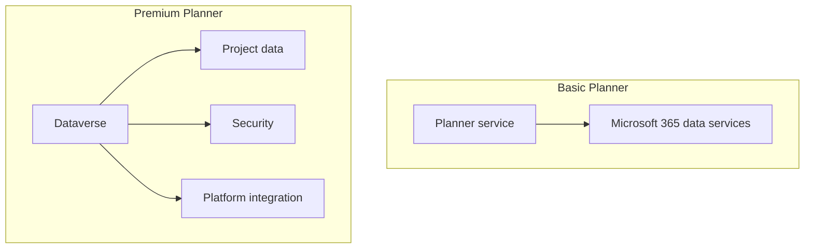
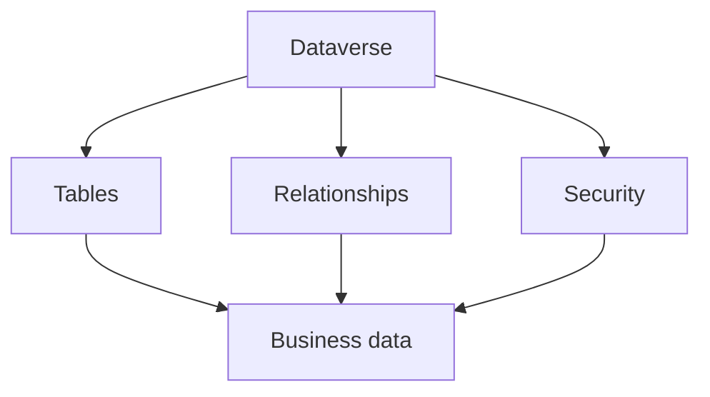
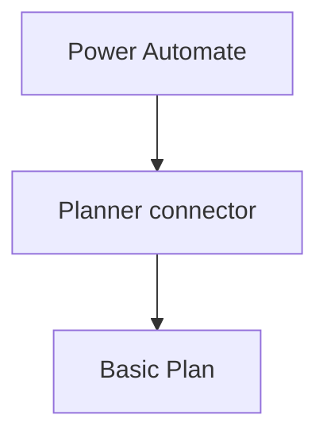
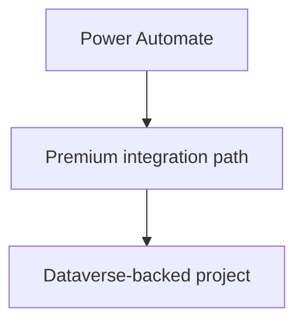
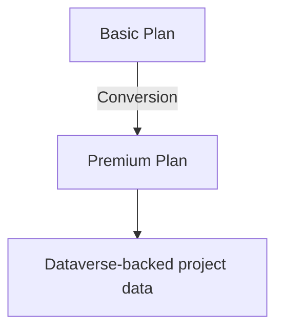

import PlannerIntegrationArchitectureCheck from "../../components/content/PlannerIntegrationArchitectureCheck.astro";
import ComparisonTable from "../../components/content/ComparisonTable.astro";
import ArticleImageLightbox from "../../components/article/widgets/ArticleImageLightbox.astro";
import plannerBasicVsPremiumArchitecture from "../../assets/images/articles/planner-premium-integrations/planner-basic-vs-premium-architecture.png";
import plannerPremiumDataverseEcosystem from "../../assets/images/articles/planner-premium-integrations/planner-premium-dataverse-ecosystem.png";
import plannerPowerAutomateConnectorBoundary from "../../assets/images/articles/planner-premium-integrations/planner-power-automate-connector-boundary.png";

You build a workflow in Power Automate that creates or updates Planner tasks.

It works with a standard Planner plan.

Then the workload moves to Premium.

You open the familiar Planner connector and expect to continue working with the new plan—but the Premium plan is not available through that connector.

At first, this can look like a licensing or permissions issue.

The underlying reason is architectural.

Microsoft documents that the Planner connector currently supports Basic plans only, while Premium plans use a different project-data architecture backed by Dataverse.

That leads to the central point of this article:

> **The Power Automate connector boundary exists because Basic and Premium Planner workloads use different underlying architectures.**

Understanding that difference makes the rest of the integration model much easier to understand.

## 1. Basic Planner and Premium Planner Use Different Data Architectures

Basic and Premium are not simply two licensing levels sitting on top of the same data service.

For Basic Planner, the Planner service manages the plan and its associated data. Microsoft documents Basic and Premium as separate plan types with different capabilities and integration behavior.

Premium plans use a different project-data model backed by Dataverse. Microsoft documents Premium plans as being backed by Dataverse and provides an administrative control for allowing Basic plans to be converted into Premium plans with data flowing to Dataverse.

A simplified model is:

The important takeaway is:

> **Premium is not simply Basic Planner with additional project features enabled.**

The different project architecture creates a different integration surface.

<ArticleImageLightbox
  src={plannerBasicVsPremiumArchitecture.src}
  alt="Comparison of Basic Planner and Premium Planner architectures, showing Basic plans managed through the Planner service and Premium projects backed by Dataverse with structured project data, security, and broader platform integration."
/>

## 2. What Is Microsoft Dataverse?

If you primarily work with Microsoft 365, Dataverse can initially sound like another database.

A better mental model is:

> **Dataverse is Microsoft's business-data platform for storing and managing structured data that applications and Power Platform services can work with.**

At a simplified level:

For Planner Premium, the important point is not to learn Dataverse as a product in isolation.

It is to understand why Microsoft uses it:

> **Premium project data has a structured business-data foundation that can participate in the wider Power Platform ecosystem.**

Microsoft's architecture documentation identifies Dataverse as the data platform for Premium project data and describes Power Platform services such as Power Apps, Power Automate, and Power BI as part of the surrounding ecosystem.

<ArticleImageLightbox
  src={plannerPremiumDataverseEcosystem.src}
  alt="Planner Premium Dataverse ecosystem showing Premium project data centered in Dataverse and connected to Power Automate, Power Apps, Power BI, Microsoft services, security, relationships, and APIs."
/>

## 3. Why the Native Planner Connector Supports Basic Plans Only

The standard Planner connector is built around the Basic Planner integration model.

Microsoft currently states plainly:

> **The Planner connector supports Basic plans only.**

Conceptually:

Premium follows a different architecture:

The connector's supported integration surface is designed for Basic plans, while Premium projects use a different project-data architecture.

Microsoft also notes that applications and workflows built to interact with Basic plans require modification to work with Premium plans.

<ArticleImageLightbox
  src={plannerPowerAutomateConnectorBoundary.src}
  alt="Planner Power Automate connector boundary showing the native Planner connector supporting Basic plans while Premium projects use a Dataverse-backed architecture and require a different integration approach."
/>

## 4. What Changes When a Basic Plan Becomes Premium?

When a plan moves to Premium, the administrator needs to consider the underlying data transition as well as the user experience.

Microsoft provides an administrative setting called `AllowDataFlowToDataverse` because Basic-to-Premium conversion involves data flowing to Dataverse.

Conceptually:

The project may still appear familiar to users in Planner.

The integration architecture underneath it has changed.

That is why a successful plan conversion does not automatically mean every connected workflow remains valid.

## 5. Why Existing Workflows May Need Modification

Consider a Basic Planner workflow:

**Form → Power Automate → Planner connector → Create task**

If the destination becomes Premium, do not begin by asking:

> **"How do I reconnect this flow?"**

Start with:

> **"What business operation does this flow need to perform, and what is the supported Premium integration path for that operation?"**

A flow may do much more than create one task. It may update project data, trigger approvals, send notifications, synchronize information, or feed another business process.

Microsoft's current comparison guidance explicitly states that applications and workflows built to interact with Basic plans require modification to work with Premium plans.

The migration effort therefore depends on the operation being performed, not merely on the number of steps in the flow.

## 6. What Dataverse Changes for the Administrator

Once Premium project data becomes part of the Dataverse architecture, several additional questions become relevant:

**Environment** — Which Dataverse environment contains the project data?

**Security** — Who can access that data and through which applications or services?

**Governance** — Who owns the environment and the data?

**Integration** — Which Power Automate flows, applications, or other services depend on the data?

**Support** — Who is responsible for the integration after the workload becomes Premium?

The important change in mindset is:

> **A Premium project is still managed in Planner, but its data architecture is part of the broader Power Platform environment.**

## 7. What Administrators Should Inventory Before Moving to Premium

Before converting or redesigning a Basic workload, identify every integration that touches it.

<ComparisonTable
  caption="Integration dependencies to review before moving to Premium"
  columns={[
    { label: "Area" },
    { label: "Questions" }
  ]}
  rows={[
    {
      label: "Automation",
      cells: ["Which Power Automate flows use the plan?"]
    },
    {
      label: "Applications",
      cells: ["Does a custom application interact with the plan?"]
    },
    {
      label: "Data",
      cells: ["Which fields or identifiers does it depend on?"]
    },
    {
      label: "Dataverse",
      cells: ["Which environment will contain the Premium data?"]
    },
    {
      label: "Security",
      cells: ["Who owns and governs that data?"]
    },
    {
      label: "Testing",
      cells: ["Which business operations must continue working?"]
    },
    {
      label: "Ownership",
      cells: ["Who supports the integration afterward?"]
    }
  ]}
/>

The goal is simple:

> **Find the dependencies before the plan changes, not after an integration fails.**

<PlannerIntegrationArchitectureCheck />

## Conclusion — The Connector Limitation Is Architectural

The question often starts as:

> **"Why doesn't the Planner connector in Power Automate work with my Premium plan?"**

The answer becomes straightforward once the architecture is understood.

Microsoft documents the Planner connector as supporting Basic plans only, while Premium plans use a Dataverse-backed project architecture.

Microsoft also warns that applications and workflows built for Basic plans require modification when working with Premium plans.

So the practical lesson is:

> **When a workload moves from Basic Planner to Premium, do not only check what changed in the Planner interface. Check the data architecture underneath it and every integration that depends on it.**

Once you understand **Dataverse, the Premium data model, and the separation between the Basic and Premium integration surfaces**, the connector limitation stops looking arbitrary.

It becomes an architectural consequence.

> **Basic and Premium may look like two versions of Planner to the user. Underneath, they use different integration models.**

That is what administrators need to understand before building—or migrating—automation around Planner Premium.
