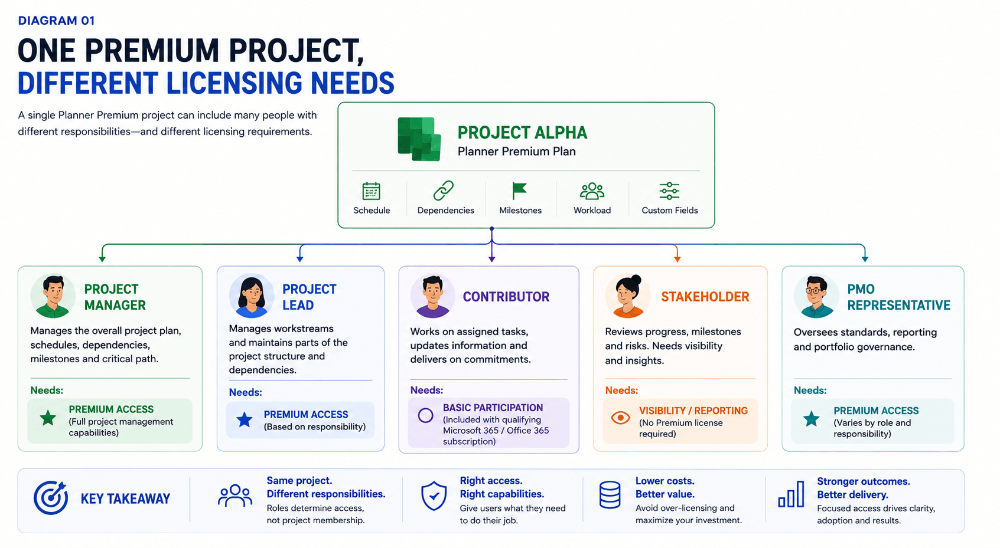
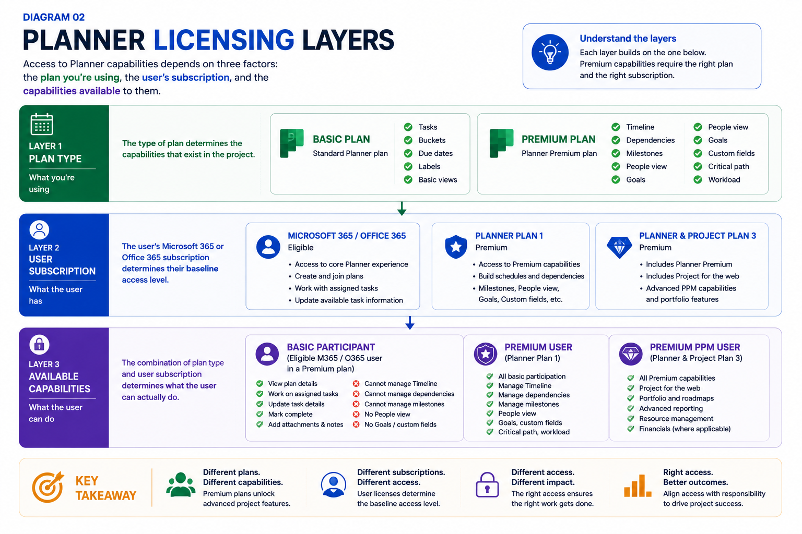

import PlannerPremiumLicenseFitCheck from "../../components/content/PlannerPremiumLicenseFitCheck.astro";
import ComparisonTable from "../../components/content/ComparisonTable.astro";

When an organization introduces Planner Premium, one of the first questions is:

> **Who needs a Premium license?**

The instinctive answer is often:

> "Everyone working on the Premium project."

That sounds reasonable, but it doesn't necessarily reflect how Planner licensing and access work.

A project can contain people with very different responsibilities.

The project manager may need to build schedules, manage dependencies, maintain milestones, and use other Premium capabilities. A developer may only need to work with tasks assigned to them. A business stakeholder may primarily need project visibility. A PMO representative may need advanced capabilities depending on their role.

They can all work on the same project without necessarily having the same licensing requirement.

Microsoft distinguishes between the Planner experience available through eligible Microsoft 365 or Office 365 subscriptions and Premium capabilities that require a Premium subscription. Microsoft currently identifies **Planner Plan 1** and **Planner and Project Plan 3** as Premium subscriptions.

The important question is therefore not:

> **"Who belongs to the project?"**

It is:

> **"What does each person actually need to do?"**

That question should drive the licensing decision.

---

## 1. Understand the Licensing Model First

Three concepts are often mixed together:

**Plan type**

What kind of Planner plan is being used?

**User subscription**

What Microsoft subscription does the individual have?

**Available capabilities**

What can that user actually do with the plan?

These are related, but they are not the same thing.

### Basic Planner access

Eligible Microsoft 365 and Office 365 subscriptions can provide the core Planner experience.

This is appropriate for users who primarily need to:

- view assigned work
- update tasks
- track status
- manage due dates
- collaborate on everyday work

Having Planner access, however, does not automatically provide Premium capabilities.

### Premium access

Premium plans introduce more advanced project-management capabilities such as:

- Timeline
- dependencies
- milestones
- critical path
- People view
- Goals
- custom fields
- other advanced project-planning capabilities

That distinction is central to this article:

> **A user can participate in Premium-managed work without necessarily requiring every Premium project-management capability.**

Microsoft's documentation describes basic edit access for qualifying users working with shared Premium projects, while Premium-specific capabilities remain restricted to appropriately licensed users.

---

## 2. Who Actually Needs Premium?

The best licensing model is:

> **Responsibility → required capability → appropriate subscription**

The role itself is only the starting point.

### Project Manager

A project manager may need to:

- build the project schedule
- manage dependencies
- maintain milestones
- review the critical path
- monitor workload
- maintain project structure

When those responsibilities require Premium capabilities, Premium access is appropriate.

This is the clearest example of a role whose work directly depends on advanced project-management functionality.

### Project or Workstream Lead

A project lead may need Premium if they actively maintain project structure, schedules, dependencies, or milestones.

Another lead may simply coordinate assigned work.

The title alone should therefore not determine the license.

> **License according to responsibility, not job title.**

### PMO

A PMO can contain several different types of users.

One person may actively manage Premium project information.

Another may primarily consume reporting.

Another may oversee portfolio governance.

Their licensing needs can therefore differ.

The PMO should be treated as a set of responsibilities rather than one licensing category.

### Project Contributors

Developers, analysts, testers, designers, and other contributors may primarily need:

- assigned work
- task updates
- completion
- attachments
- collaboration

They may not need to manage dependencies, schedules, or other Premium capabilities.

Microsoft documents participation and basic editing for qualifying users working with shared Premium projects.

So:

> **A contributor can participate in Premium-managed work without necessarily requiring Premium-level project-management capabilities.**

### Stakeholders

A stakeholder may only need to understand:

- project progress
- milestones
- delivery dates
- risks
- portfolio information

That does not necessarily require project-authoring access.

Organizations can also use a separate reporting layer, such as **Power BI**, when stakeholders need curated project or portfolio information rather than direct access to the project-management environment.

We'll keep the reporting architecture as a separate topic rather than turning this licensing article into a Power BI guide.

### Microsoft 365 Administrators

Administrators are responsible for:

- licensing
- governance
- requests
- adoption
- support
- reclamation

But administering Premium licenses does not, by itself, mean an administrator needs Premium access.

Again, the user's actual responsibilities determine the capability requirement.



## 3. The Same Project Can Have Different Licensing Needs

Consider a 20-person project:

- 1 Project Manager
- 2 Project Leads
- 12 Developers and Analysts
- 3 Business Stakeholders
- 2 PMO representatives

They are all project participants.

Their responsibilities are different.

The project manager may need advanced scheduling and dependencies.

The project leads may need to maintain project structure.

The developers may only need assigned tasks.

The stakeholders may need visibility.

The PMO users may have different requirements from one another.

So this:

**20 project participants → 20 Premium licenses**

is not automatically a valid licensing model.

A better model is:

```text
                ONE PREMIUM PROJECT
                       │
        ┌──────────────┼──────────────┐
        │              │              │
        ▼              ▼              ▼
   Project Manager  Contributors  Stakeholders
        │              │              │
        ▼              ▼              ▼
 Premium capability  Basic         Visibility /
      access       participation     reporting
```

This is one of the most important cost-control opportunities in a large rollout.

---

## 4. What Can a Basic-License User Actually Do?

This is where the licensing boundary becomes practical.

A qualifying Microsoft 365 or Office 365 user can participate in shared Premium project work with the capabilities provided by their subscription.

Microsoft documents task-level interaction such as working with assigned tasks and updating available task information. Premium-only project capabilities remain restricted.

Microsoft also documents limited interaction with Premium-plan tasks through **Assigned to me** for users who are members of the associated Microsoft 365 Group. Users need the appropriate Premium access to work with the full Premium plan and its advanced capabilities.

<ComparisonTable
  caption="Capabilities available to users with Basic-capable access compared with Premium access."
  columns={[
    { label: "Activity" },
    { label: "Basic access" },
    { label: "Premium access", emphasis: true }
  ]}
  rows={[
    {
      label: "Work with assigned tasks",
      cells: ["Yes", "Yes"]
    },
    {
      label: "Update available task information",
      cells: ["Yes", "Yes"]
    },
    {
      label: "Complete assigned work",
      cells: ["Yes", "Yes"]
    },
    {
      label: "Manage Timeline",
      cells: ["No", "Yes"]
    },
    {
      label: "Manage advanced dependencies",
      cells: ["No", "Yes"]
    },
    {
      label: "Critical-path analysis",
      cells: ["No", "Yes"]
    },
    {
      label: "People view",
      cells: ["No", "Yes"]
    },
    {
      label: "Goals / other Premium capabilities",
      cells: ["No", "Yes"]
    }
  ]}
/>

The exact experience depends on the user's subscription and current Microsoft licensing model, so administrators should validate the current documentation before establishing policy.

The important principle is:

> **Participation does not automatically equal project administration.**

---

## 5. Common Licensing Mistakes

Several patterns repeatedly create unnecessary cost or confusion.

### Licensing everyone because the project is Premium

A Premium project does not automatically require every participant to have Premium capabilities.

### Assuming Microsoft 365 includes Premium

Having Planner through an eligible Microsoft 365 subscription does not automatically provide Premium project-management capabilities.

### Using job titles as licensing rules

"Project Manager," "Developer," and "PMO" are useful indicators, but none should become an automatic licensing rule.

### Giving Premium access for stakeholder visibility

A reporting requirement does not necessarily require project-authoring access. Power BI can be considered as a separate reporting layer.

### Treating every Premium capability as one licensing tier

Administrators should determine the specific capability required and then identify the current subscription that provides it.

### Confusing Planner Premium with Copilot licensing

Planner project-management capabilities and AI experiences such as Planner Agent have their own licensing considerations. Microsoft's current documentation should be checked for the specific AI capability being requested.

The common thread is simple:

> **Don't assign a license because the user is near the work. Assign it because the user needs the capability.**

---

## 6. Trials as a Licensing and Adoption Tool

Sometimes a user genuinely doesn't know whether Premium is necessary.

That's where a trial can be useful.

Microsoft currently provides a **30-day trial for advanced Planner capabilities through Planner and Project Plan 3**, subject to organizational settings and administrator controls.

The important point is to use the trial to evaluate a **real workload**, not merely demonstrate features.

Ask:

- Can the project manager build a useful schedule?
- Do dependencies improve planning?
- Does Timeline improve stakeholder conversations?
- Does People view reveal useful workload information?
- Are the advanced capabilities actually being used?
- Does Premium simplify the process?

The outcome doesn't have to be:

**Trial → Premium**

It can be:

**Trial → Basic is sufficient**

or:

**Trial → broader PPM evaluation**

That's useful information too.

A good trial converts:

> "I think I need Premium."

into:

> **"We tested the capability against our workload, and now we know whether it is justified."**

---

## 7. Build a Planner Premium Licensing Policy

An organization with a handful of Premium users can manage licensing informally.

That becomes increasingly difficult at scale.

A simple policy should establish five things.

### Define eligibility

Identify the responsibilities that normally require Premium:

- managing Premium plans
- maintaining schedules
- managing dependencies
- maintaining milestones
- using other Premium-only capabilities

### Define the request

A request should capture:

- user
- role
- workload
- required capability
- expected duration
- business reason

### Define approval

Decide whether access is approved by:

- Microsoft 365 administrators
- PMO
- department owners
- project owners
- another governance function

### Define review

Licenses should be reviewed when:

- projects end
- responsibilities change
- users change roles
- a temporary assignment finishes
- Premium capabilities are no longer needed

### Define reclamation

The lifecycle should be:

```text
Request
  ↓
Evaluate
  ↓
Assign
  ↓
Use
  ↓
Review
  ↓
Continue or Reclaim
```

This is much healthier than treating a Premium license as a permanent entitlement.

---

## 8. Licensing Is Only Part of Adoption

Correct licensing does not guarantee successful adoption.

An organization can have the right licenses and still have teams working from:

- Excel
- email
- chat
- manually maintained status decks
- shadow project schedules

The underlying problem may not be training.

A project manager may understand Timeline perfectly well but continue maintaining an Excel schedule because:

- the PMO hasn't defined Planner as the authoritative plan,
- stakeholders still expect another reporting format,
- the reporting architecture remains disconnected,
- or the organization hasn't changed its process.

That is a **process problem**, not simply a training problem.

### Train according to responsibility

#### Project Managers

Scheduling, dependencies, milestones, critical path, workload and governance.

#### Project Leads

Maintaining project structure and coordinating workstreams.

#### Contributors

Assigned work, task updates, completion and blockers.

#### PMO

Standards, governance, reporting and lifecycle.

#### Stakeholders

Status, milestones and reporting.

The same principle applies to training as to licensing:

> **Give people the capability and knowledge required for the responsibility they actually perform.**

### Measure outcomes, not licenses

Counting Premium licenses is not an adoption metric.

More useful questions include:

- Are eligible projects using Premium appropriately?
- Are dependencies being maintained?
- Are milestones current?
- Has manual reporting decreased?
- Are project managers spending less time maintaining parallel schedules?
- Has project visibility improved?

Successful adoption does not mean maximizing Premium adoption.

A simple operational workload may be better served by Basic Planner.

The objective is to use the **right level of planning**, not the highest license available.

---

## 9. A Practical Planner Premium Licensing Framework

We can now reduce the entire article to one lifecycle:

### 1. Assess

What does the user need to accomplish?

### 2. Classify

Is the requirement task participation, project management, governance, reporting, or something else?

### 3. Request

Which specific capability is required?

### 4. Validate

Can the requirement be demonstrated against a real workload?

### 5. Trial

Use a trial when the need is uncertain.

### 6. License

Assign the appropriate current subscription for the required capability.

### 7. Adopt

Provide role-appropriate training and define the expected process.

### 8. Review

Reassess the license when responsibilities or workloads change.

### 9. Reclaim

Return licenses that are no longer justified to the available pool.

```text
Assess
  ↓
Classify
  ↓
Request
  ↓
Validate
  ↓
Trial
  ↓
License
  ↓
Adopt
  ↓
Review
  ↓
Reclaim
```

<PlannerPremiumLicenseFitCheck />




This is the difference between **license assignment** and **licensing governance**.

---

# Conclusion — Don't License the Project. License the Responsibility.

Planner Premium licensing becomes much easier to understand once project membership and user responsibility are separated.

A Premium project can contain:

- project managers who need advanced project-management capabilities,
- project leads who may need them,
- contributors who may only need assigned-task participation,
- stakeholders who may primarily need reporting,
- and PMO users with different levels of responsibility.

They do not necessarily need identical subscriptions.

The right approach is therefore not:

> **Premium project = Premium license for everyone.**

It is:

> **Identify the responsibility. Identify the required capability. Assign the appropriate current subscription.**

Then review that decision as the workload changes.

Trials can help validate uncertain requirements.

Role-based training can improve adoption.

A licensing policy can keep decisions consistent.

Periodic review can prevent temporary assignments from becoming permanent costs.

And reporting requirements can sometimes be separated from project-authoring requirements through a reporting layer such as Power BI.

The broader lesson is the same one we've used throughout the Planner Premium series:

> **Technology should follow the work. Licensing should follow the responsibility.**

A Premium license is valuable when it enables someone to perform work that genuinely requires Premium capabilities.

It becomes wasteful when it is assigned simply because the user belongs to a project.

The goal is therefore not to minimize Premium licenses.

It is to ensure that **every Premium license has a reason to exist**.
