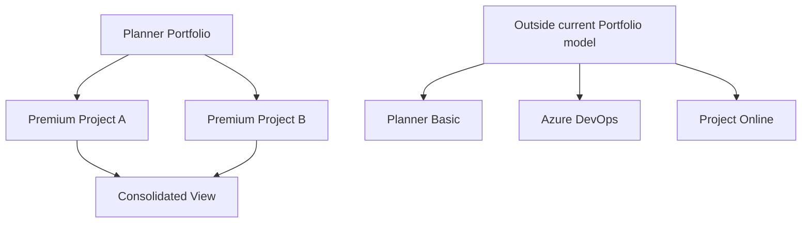
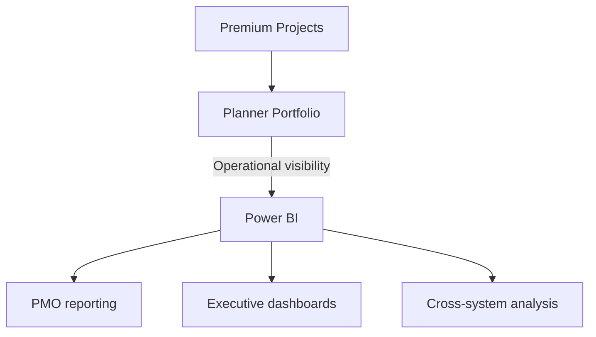
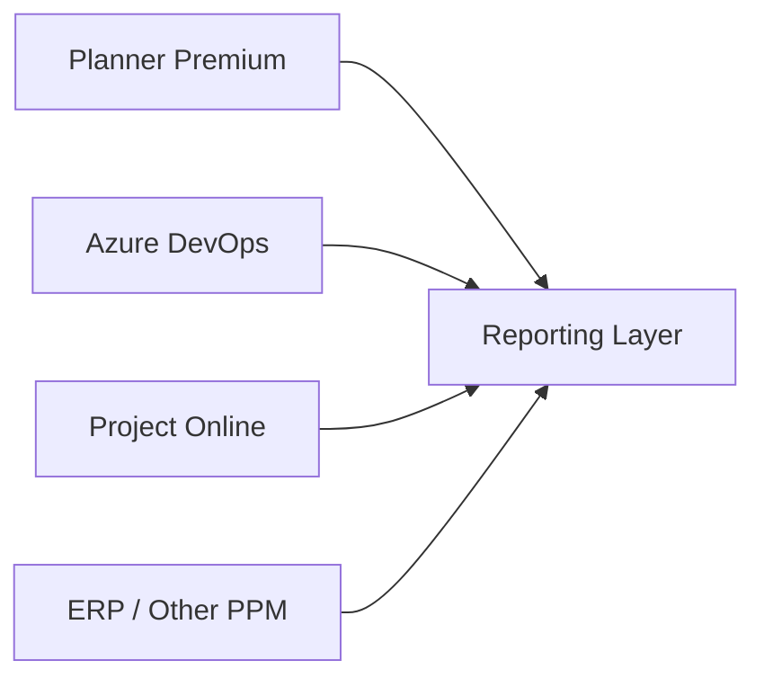
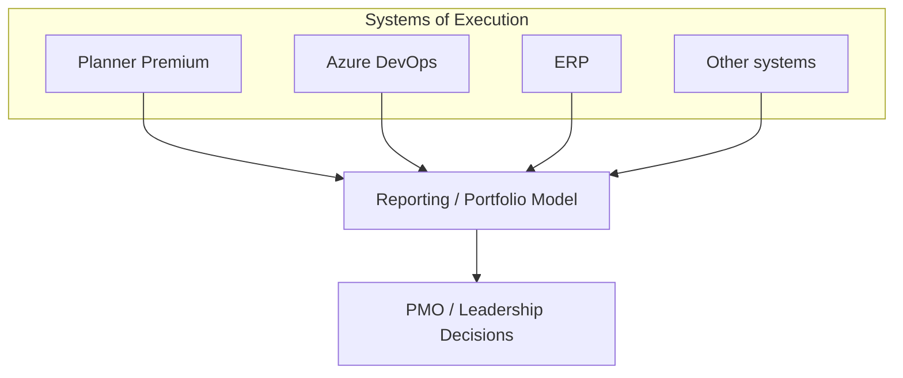

import PlannerPortfolioFitCheck from "../../components/content/PlannerPortfolioFitCheck.astro";
import ArticleImageLightbox from "../../components/article/widgets/ArticleImageLightbox.astro";
import plannerPremiumPortfolioScope from "../../assets/images/articles/planner-premium-portfolios/planner-premium-portfolio-scope.png";
import portfolioVisibilityToStrategy from "../../assets/images/articles/planner-premium-portfolios/portfolio-visibility-to-strategy.png";
import enterprisePortfolioReportingArchitecture from "../../assets/images/articles/planner-premium-portfolios/enterprise-portfolio-reporting-architecture.png";

A portfolio can mean very different things depending on who is using it.

A project manager may simply want to see several projects together.

A PMO may want consistent project status, ownership, milestones, and progress.

An executive team may want to decide which initiatives should continue, change direction, or stop.

Those are related requirements, but they are not the same problem.

Planner Premium Portfolios provide a consolidated view across supported Premium projects, including information such as project status, progress, milestones, and ownership. They are useful for **operational portfolio visibility**.

They are not, by themselves, a complete enterprise portfolio-management system.

That distinction matters because organizations often use the word *portfolio* to describe everything from project reporting to strategic investment management.

So the useful question is not:

> **"Does Planner have portfolios?"**

It is:

> **"What portfolio problem are we trying to solve?"**

## What Planner Premium Portfolios Actually Solve

The simplest use case is visibility.

A PMO may oversee dozens of projects. Without a consolidated view, information can become scattered across individual plans, spreadsheets, status decks, and meetings.

A Portfolio gives the PMO a common place to review supported Premium projects.

That can help answer questions such as:

- Which projects are active?
- Who owns them?
- What is their current status?
- Which milestones are approaching?
- Which projects need attention?

For project managers, the benefit is easier visibility across related projects.

For PMOs, it can provide a common operational review point.

For stakeholders, it can provide a higher-level view without requiring them to manage the underlying project schedules.

That is useful.

But it is useful specifically because it solves a **visibility problem**.

## Understand the Portfolio Boundary

Planner Portfolios are not a universal aggregation layer for every system an organization uses.

Microsoft currently documents Planner Portfolios around **Premium plans**. Basic plans are not currently supported, and Azure DevOps projects and Project Online projects cannot be directly connected to a Planner Portfolio.

The practical boundary is:

This is especially important during a Project Online retirement transition.

An organization should not assume:

> Project Online retires → move everything to Planner Premium → add everything to one Portfolio.

The workload still needs to be assessed, and the resulting reporting requirement may extend beyond the Planner Portfolio itself.

<ArticleImageLightbox
  src={plannerPremiumPortfolioScope.src}
  alt="Planner Premium Portfolio Scope showing supported Premium projects feeding a consolidated portfolio view, while Planner Basic, Azure DevOps, Project Online, and other PPM systems remain outside the current portfolio model."
/>

## Portfolio Visibility vs. Portfolio Governance

This is the most important distinction in the article.

A Portfolio helps answer:

> **What is happening across our projects?**

Governance asks:

> **What should the organization do about it?**

Consider a project reported as delayed.

The Portfolio can surface the project.

Governance determines whether the organization should:

- add resources,
- change scope,
- reprioritize work,
- escalate the issue,
- change funding,
- or stop the project.

Those are different activities.

A useful maturity model is:

**Individual Project → Portfolio Visibility → Portfolio Governance → Strategic Portfolio Management**

Planner Premium Portfolios sit primarily in the **portfolio visibility** layer.

That is not a weakness.

It is simply the right way to define their role.

<ArticleImageLightbox
  src={portfolioVisibilityToStrategy.src}
  alt="Three-layer portfolio maturity model showing progression from project execution and portfolio visibility to portfolio governance and strategic portfolio management."
/>

## What PMOs Can Realistically Use Portfolios For

Once the boundary is understood, the practical value becomes clearer.

### Status Reviews

A PMO can use the Portfolio as the starting point for regular project reviews.

Instead of collecting separate updates manually, the review can focus on:

- projects needing attention,
- upcoming milestones,
- changes in project status,
- ownership,
- progress.

The Portfolio becomes the starting point for the discussion rather than the entire governance process.

### Milestone Oversight

Milestones provide a common language across projects.

The PMO may not need every task from every project.

It may need to know:

> **Which important delivery points are approaching, and which ones are at risk?**

That is a strong operational use case for consolidated project visibility.

### Stakeholder Visibility

Executives and sponsors may not need to work inside project schedules.

They may only need:

- current status,
- project owner,
- major dates,
- progress,
- key concerns.

A Portfolio can support that visibility without turning every stakeholder into a project-management user.

### PMO Oversight

A PMO can also use Portfolios to reinforce basic governance expectations:

- projects have owners,
- dates are maintained,
- milestones are defined,
- status is reviewed,
- completed projects are closed appropriately.

The technology provides the visibility.

The PMO defines the operating standard.

## Where Power BI Fits

A Planner Portfolio answers:

> **"What is happening across the Premium projects in this portfolio?"**

Power BI becomes more useful when the question expands to:

> **"What is happening across all of our work, regardless of where that work is managed?"**

An enterprise may have:

- Planner Premium projects,
- Azure DevOps projects,
- Project Online workloads during transition,
- financial systems,
- resource data,
- other PPM platforms.

Planner Portfolios are not designed to consolidate all of those systems.

A broader reporting layer can.

This gives us a useful model:

This does **not** mean every Planner Portfolio needs Power BI.

A small PMO may be well served by Planner itself.

Power BI becomes more compelling when the reporting requirement includes multiple systems, custom metrics, historical analysis, or additional business information.

This distinction also leaves room for a dedicated Power BI article that can cover the implementation details without turning this article into a Power BI tutorial.

## What Happens When Your Portfolio Is Larger Than Planner?

Mixed environments are normal in enterprise organizations.

A company may have:

Trying to force these systems into a single Planner Portfolio is the wrong architectural goal.

Instead, distinguish between:

### System of Execution

Where the project team actually manages the work.

### Portfolio Reporting

Where project information is consolidated and analyzed.

### Decision-Making

Where PMO and leadership make portfolio decisions.

These layers can be connected without being the same product.

For example:

The organization does not need one application to perform every function.

It needs clear responsibilities between the layers.

<ArticleImageLightbox
  src={enterprisePortfolioReportingArchitecture.src}
  alt="Enterprise portfolio architecture showing Planner Premium, Azure DevOps, Project Online, ERP, and other execution systems feeding a portfolio reporting layer before information reaches PMO, leadership, and other decision-makers."
/>

## Portfolio Governance: Questions the PMO Should Answer

A Portfolio becomes useful when the information inside it can be trusted.

That requires a small but deliberate governance model.

### Portfolio Ownership

Who owns the Portfolio itself?

### Project Ownership

Who is accountable for each underlying project?

### Inclusion Criteria

Which projects belong in the Portfolio?

### Status Definition

What does "On track", "At risk", or equivalent status actually mean?

### Review Cadence

How often is Portfolio information reviewed?

### Escalation

What happens when a project needs intervention?

### Lifecycle

What happens when a project closes?

The organization should also be able to answer:

> **Which project is the official plan of record?**

This becomes important when duplicate plans exist.

Microsoft 365 Groups are also part of the access model for Planner Portfolios, so governance should account for ownership, membership, guest access, and lifecycle.

## A Practical Decision Framework

The decision can be simplified into three levels.

### Planner Portfolio

Use it when the main requirement is:

- consolidated Premium project visibility,
- milestone and status review,
- lightweight PMO oversight,
- stakeholder visibility.

### Planner Portfolio + Power BI

Consider this when the requirement expands to:

- custom reporting,
- historical analysis,
- executive dashboards,
- cross-system reporting,
- multiple project-management platforms.

### Broader Portfolio Architecture

Look beyond Planner when decisions depend on:

- strategic investment,
- enterprise resource capacity,
- financial portfolio management,
- scenario modelling,
- demand management,
- broader PPM governance.

The goal is not to make Planner Portfolios responsible for everything.

It is to give each layer a clear responsibility.

<PlannerPortfolioFitCheck />

## Administrator and PMO Checklist

Before adopting Planner Portfolios at scale, the organization should be able to answer:

### Scope

- Which Premium projects belong in the Portfolio?
- Which work remains outside Planner?

### Ownership

- Who owns the Portfolio?
- Who owns each project?
- Who maintains status and milestones?

### Governance

- What constitutes a valid project?
- What does status mean?
- How frequently is the Portfolio reviewed?
- What happens when a project becomes at risk?

### Reporting

- Is Planner Portfolio sufficient?
- Does the organization need Power BI?
- Are multiple systems involved?
- Where is the official executive report?

### Lifecycle

- What happens when a project closes?
- When does it leave active Portfolio governance?
- What happens to its historical information?

If those questions have clear answers, the organization has an operating model around the technology.

## Conclusion — Visibility Is Valuable. Know Where It Ends.

Planner Premium Portfolios solve a real problem.

They can bring supported Premium projects together, provide operational visibility, help PMOs review milestones and status, and give stakeholders a clearer view of active project work.

Their boundaries are equally important. Basic Planner, Azure DevOps, and Project Online are not currently consolidated into the Planner Portfolio experience.

That boundary should not automatically be treated as something to overcome.

It should be treated as part of the architecture.

For an organization managing a relatively consistent set of Premium projects, Planner Portfolios may provide exactly the visibility required.

As the portfolio becomes more diverse, a broader reporting layer such as Power BI can provide cross-system analysis.

And when portfolio management becomes closely tied to strategic investment, enterprise resource capacity, financial management, or advanced governance, the organization should evaluate a broader portfolio-management architecture.

The most useful distinction is therefore:

> **Where is work executed?**

> **Where is work reported?**

> **Where are portfolio decisions made?**

Those can be connected.

They do not have to be the same product.

And that is the right way for a Microsoft 365 administrator or PMO to think about Planner Premium Portfolios.

> **A Portfolio can tell you what is happening across your projects. The organization still needs a governance model to decide what happens next.**
