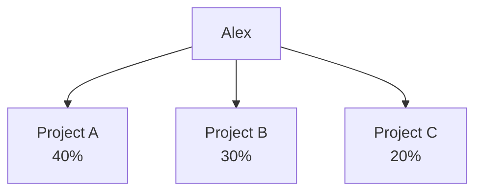
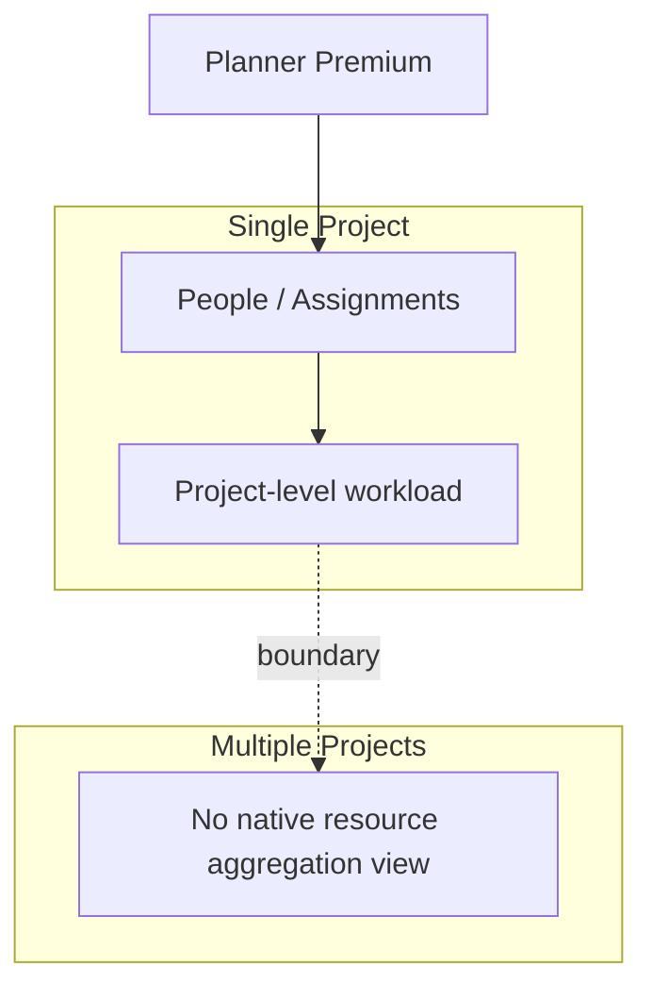
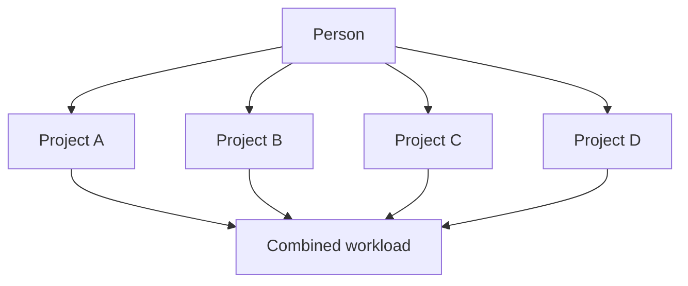
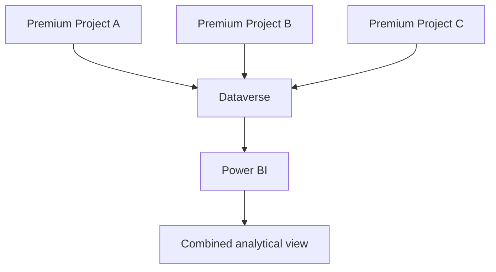
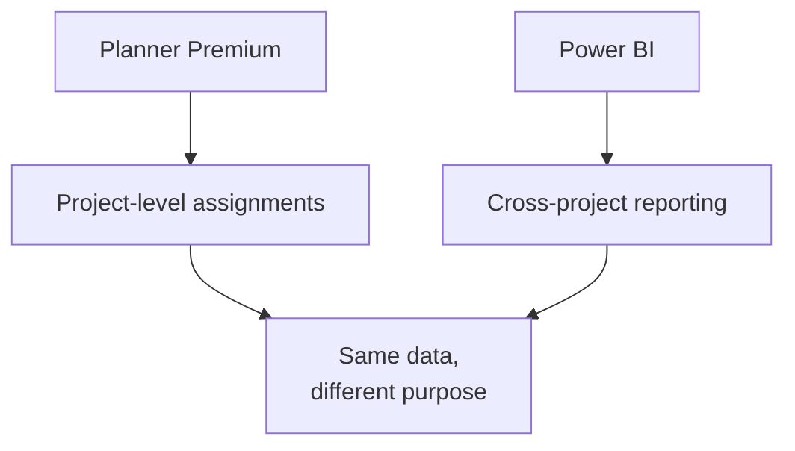

import PlannerPremiumResourceScopeCheck from "../../components/content/PlannerPremiumResourceScopeCheck.astro";
import ComparisonTable from "../../components/content/ComparisonTable.astro";
import ArticleImageLightbox from "../../components/article/widgets/ArticleImageLightbox.astro";
import plannerPremiumResourceVisibility from "../../assets/images/articles/planner-premium-resource-management/planner-premium-resource-visibility.png";
import plannerPremiumCrossProjectBoundary from "../../assets/images/articles/planner-premium-resource-management/planner-premium-cross-project-boundary.png";

Planner Premium includes capabilities that help project managers understand how work is distributed among the people working on a project.

People view can highlight where team members may be over- or under-allocated, while Assignments view provides a more detailed view of effort associated with tasks.

That makes Planner Premium useful for a straightforward question:

> **"How is work distributed across the people on this project?"**

But another question is fundamentally different:

> **"How much work is this person carrying across all the projects they are assigned to?"**

Planner Premium does not currently provide a native cross-project resource view for that purpose.

So the key boundary is:

> **Planner Premium provides project-level resource visibility, not cross-project resource management.**

---

## 1. What Planner Premium Provides

Planner Premium's resource capabilities are primarily built around the individual project.

### People View

People view helps the project team understand how work is distributed among the people assigned to the project and identify possible workload imbalance.

### Assignments View

Assignments view provides a more detailed view of the work assigned to people and the effort associated with those assignments.

Together, these views help answer:

> **"Is the workload reasonably distributed within this project?"**

That is useful project-level resource management.

<ArticleImageLightbox
  src={plannerPremiumResourceVisibility.src}
  alt="Planner Premium resource visibility within a single Premium project, showing People view for workload distribution and Assignments view for task-level effort and assignment details."
/>

---

## 2. What Planner Premium Does Not Provide

The boundary becomes obvious when the question changes from a **project** to a **person**.

Suppose Alex works on three Premium projects:

A manager may want to know:

> **"Is Alex carrying 90% of planned project work?"**

Planner Premium does not provide a native screen that combines those assignments into a single cross-project workload view.

This is a scope boundary, not simply a missing filter or alternate navigation option.

---

## 3. Why the Boundary Matters

Within one project, the question is:

> **"Who has too much work?"**

Across multiple projects, the question becomes:

> **"Which projects are consuming this person's capacity?"**

Those are different views of the same underlying assignments.

Three project managers might each see Alex as appropriately allocated within their own project. The organization may still need a consolidated understanding of Alex's workload across all three.

That information is not presented as a native cross-project resource view in Planner Premium.

And that is the capability boundary the administrator needs to understand.

---

## 4. People View Is Not a Cross-Project Resource Center

The name *People view* can make the capability sound broader than it is.

It is a way to examine workload distribution **within the plan**.

It is not a centralized workspace where a manager selects a person and sees:

The practical distinction is:

> **People view helps you understand the people working on a project. It does not provide a native view of everything a person is working on across projects.**

---

## 5. Where Power BI Can Help

Organizations that need a broader view can build a reporting layer using Premium project data.

Premium project data is available in Dataverse for reporting scenarios, including Power BI.

The architecture can look like:

<ComparisonTable
  caption="Example of a consolidated analytical view of Alex's planned work across multiple Premium projects."
  columns={[
    { label: "Person" },
    { label: "Project" },
    { label: "Planned Work", emphasis: true }
  ]}
  rows={[
    {
      label: "Alex",
      cells: ["Project A", "40%"]
    },
    {
      label: "Alex",
      cells: ["Project B", "30%"]
    },
    {
      label: "Alex",
      cells: ["Project C", "20%"]
    }
  ]}
/>

But Power BI is not the place where the underlying Planner assignments are managed.

> **Power BI can show the combined picture; Planner remains where the project work is managed.**

<ArticleImageLightbox
  src={plannerPremiumCrossProjectBoundary.src}
  alt="Planner Premium project data flowing through Dataverse into Power BI for a consolidated, read-only cross-project resource analysis, while project assignments remain managed in Planner."
/>

---

## 6. When Planner Premium Is Enough

Planner Premium's native resource views may be sufficient when:

- projects are managed independently;
- resource conflicts across projects are uncommon;
- project managers control their own allocations;
- the organization only needs project-level workload visibility;
- there is no requirement for a centralized person-level view across projects.

In that situation, People view and Assignments view provide the appropriate level of resource visibility.

There is no reason to introduce another reporting layer simply because one is technically possible.

---

## 7. When the Gap Becomes Important

The limitation becomes significant when the organization regularly needs questions such as:

> **"Where is Alex working?"**

> **"Which projects are contributing to Alex's workload?"**

> **"Which people are assigned across several Premium projects?"**

> **"Who appears overloaded when all Premium projects are considered together?"**

These are cross-project questions.

The native Planner Premium resource views do not provide that consolidated perspective.

A reporting layer may therefore become useful when:

- people work across multiple Premium projects;
- shared specialists are common;
- managers need person-level visibility across projects;
- resource conflicts are affecting delivery;
- teams are maintaining spreadsheets simply to understand combined workload.

The appearance of those spreadsheets is often a useful signal:

> **The organization has a reporting requirement that the native project-level view does not satisfy.**

---

## 8. A Practical Decision Guide

### Project-level workload

Use:

> **People view + Assignments view**

when the requirement is to understand and manage workload within one Premium project.

### Cross-project visibility

Use:

> **Additional reporting, such as Power BI**

when the requirement is to analyze a person's workload across multiple Premium projects.

The result is a **consolidated, read-only analytical view**, not an editing interface.

### Managing the underlying work

Return to:

> **Planner Premium**

when assignments, tasks, schedules, and project execution need to be changed.

This gives us a clean separation:

<PlannerPremiumResourceScopeCheck />

---

## Conclusion — Planner Premium Stops at the Project Boundary

Planner Premium provides useful resource-management capabilities within a Premium project.

People view helps project teams understand how work is distributed among team members, while Assignments view provides more detailed visibility into assigned effort.

But there is a clear boundary.

Planner Premium does **not** currently provide a native cross-project resource view that allows a manager to select a person and see their combined workload across multiple Premium projects.

When that broader visibility is required, an organization can build a reporting layer using the underlying project data—for example, through Dataverse and Power BI.

That report can provide the consolidated picture, but it remains **analytical and read-only**. Project assignments and schedules are still managed in Planner.

So the answer to the article's title is deliberately simple:

> **Planner Premium resource management stops at the project boundary.**

Within a project, Planner Premium can help you understand who is doing what.

Across projects, you need another view of the data.

That distinction is important for anyone designing a Planner Premium operating model.
