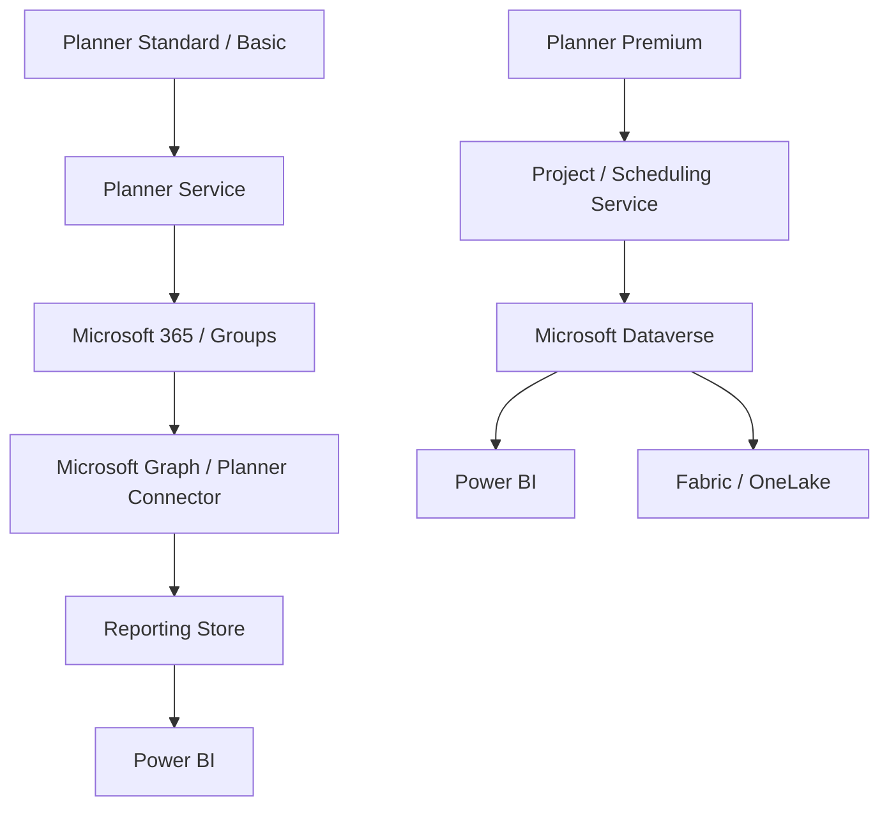
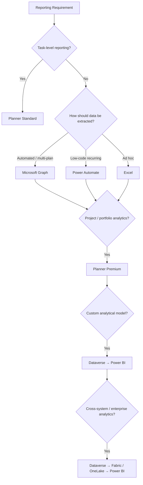

import ComparisonTable from "../../components/content/ComparisonTable.astro";
import Callout from "../../components/ui/Callout.astro";
import PlannerReportingPathSelector from "../../components/content/PlannerReportingPathSelector.astro";
import ArticleImageLightbox from "../../components/article/widgets/ArticleImageLightbox.astro";

import plannerStandardVsPremiumReportingArchitecture from "../../assets/images/articles/planner/planner-standard-vs-premium-reporting-architecture.png";
import plannerStandardVsPremiumCapabilityModel from "../../assets/images/articles/planner/planner-standard-vs-premium-capability-model.png";

At first glance, Planner Standard and Planner Premium can look like two versions of the same product.

For reporting, that assumption is misleading.

Planner Standard/Basic plans are built around the Planner service, Microsoft 365 groups, and Microsoft Graph. Planner Premium follows the Project for the web architecture, with project data stored in Microsoft Dataverse.

That difference affects:

- **Data access**
- **Reporting**
- **Automation**
- **Licensing**
- **Security**
- **Governance**

The real question is:

> **What Planner architecture are we reporting from, and what reporting path does that architecture support?**

<ArticleImageLightbox
  src={plannerStandardVsPremiumReportingArchitecture.src}
  alt="Comparison of Planner Standard and Planner Premium reporting architectures, showing Standard plans using Microsoft Graph, Power Automate, or Excel through a reporting store before Power BI, while Premium uses the Project scheduling architecture with Dataverse and can extend to Fabric or OneLake."
/>

---

## 1. Standard and Premium Use Different Reporting Architectures

At a high level:

Standard typically reaches Power BI through Graph, Power Automate, or export.

Premium is Dataverse-backed, so Power BI can work directly with project data or extend the data into Fabric.

<Callout type="important" title="The source architecture drives the reporting architecture">
Planner Standard and Planner Premium do not expose the same underlying data model. The reporting design should follow where the data lives and how the workload is represented.
</Callout>

---

## 2. Data Extraction in Basic Planner

Standard reporting commonly uses three paths.

### Microsoft Graph

Best for automated, multi-plan reporting across groups, plans, buckets, tasks, and assignees.

Graph provides endpoints for listing plans and tasks, with least-privilege permission options such as `Tasks.Read` for delegated access and `Tasks.Read.All` for application access.

### Power Automate

A lower-code option for recurring extraction into a reporting store.

The Microsoft Planner connector currently supports Basic plans and should be designed with its API and connector throttling limits in mind.

### Excel

Useful for ad-hoc or departmental reporting, but not a strong foundation for enterprise dashboards, multi-plan reporting, or governed refresh.

The resulting pattern is:

**Planner Standard → Graph / Power Automate / Excel → Reporting Store → Power BI**

---

## 3. Premium Is a Dataverse-Backed Analytics Path

Planner Premium follows the Project for the web architecture and stores project data in Dataverse.

That brings project concepts such as:

- **dependencies**
- **milestones**
- **custom fields**
- **resource assignments**
- **project schedules**

into the reporting model.

The simplest pattern is:

**Planner Premium → Dataverse → Power BI**

For larger or cross-system analytics:

**Planner Premium → Dataverse → Fabric / OneLake → Power BI**

---

## 4. Premium Offers Multiple Reporting Paths

There are three useful starting points.

<ComparisonTable
  caption="Planner Premium reporting paths"
  columns={[
    { label: "Approach" },
    { label: "Best fit" }
  ]}
  rows={[
    {
      label: "Project Power BI template",
      cells: ["Fast portfolio-style reporting"]
    },
    {
      label: "Dataverse + Power BI",
      cells: ["Custom KPIs, fields, security, and semantic modeling"]
    },
    {
      label: "Dataverse → Fabric / OneLake",
      cells: ["Cross-system or larger-scale analytics"]
    }
  ]}
/>

The Project Power BI template provides a fast starting point, while Dataverse and Fabric provide progressively greater control and analytical flexibility.

---

## 5. The Feature Difference Explains the Reporting Difference

<ComparisonTable
  caption="Planner Standard versus Premium information model"
  columns={[
    { label: "Capability" },
    { label: "Standard / Basic" },
    { label: "Premium" }
  ]}
  rows={[
    {
      label: "Tasks",
      cells: ["Yes", "Yes"]
    },
    {
      label: "Owners / assignees",
      cells: ["Yes", "Yes"]
    },
    {
      label: "Buckets",
      cells: ["Yes", "Yes"]
    },
    {
      label: "Dates / completion",
      cells: ["Yes", "Yes"]
    },
    {
      label: "Timeline / Gantt",
      cells: ["—", "Yes"]
    },
    {
      label: "Dependencies",
      cells: ["—", "Yes"]
    },
    {
      label: "Milestones",
      cells: ["—", "Yes"]
    },
    {
      label: "Custom fields",
      cells: ["—", "Yes"]
    },
    {
      label: "Critical path",
      cells: ["—", "Yes"]
    },
    {
      label: "Sprints",
      cells: ["—", "Yes"]
    },
    {
      label: "Goals",
      cells: ["—", "Yes"]
    },
    {
      label: "Task history",
      cells: ["—", "Yes"]
    },
    {
      label: "Dataverse-backed project data",
      cells: ["—", "Yes"]
    }
  ]}
/>

These additional Premium concepts are part of the project and Dataverse-backed model rather than simply more fields on a Standard Planner task.

> **Premium changes the information model, not just the feature list.**

<ArticleImageLightbox
  src={plannerStandardVsPremiumCapabilityModel.src}
  alt="Planner Standard and Planner Premium capability comparison showing shared task-management information and Premium additions such as timeline, resources, dependencies, milestones, custom fields, critical path, sprints, goals, task history, and richer Dataverse-backed project data."
/>

---

## 6. Choose the Reporting Path From the Requirement

A practical rule is:

**Standard** for lightweight task-oriented reporting where an extraction layer is acceptable.

**Premium** when portfolio reporting needs richer project concepts, Dataverse-backed analytics, or Fabric integration.

<PlannerReportingPathSelector />

---

## 7. Licensing and Security Follow the Architecture

Planner licensing does not answer every reporting question.

The solution involves three distinct licensing considerations:

**Planner / Project licensing**  
Determines the project-management capabilities available to users.

**Power BI licensing**  
Determines report authoring, publishing, and collaboration capabilities.

**Fabric capacity**  
Provides the capacity and platform capabilities required for broader Fabric-based analytics.

These address different parts of the overall solution and should be evaluated separately.

Security also changes with the reporting architecture.

**Planner Standard** introduces concerns around Microsoft Graph permissions and access to the reporting store.

**Planner Premium** introduces Dataverse permissions together with Power BI semantic-model security, including RLS/OLS and controlled workspace or app access.

Power BI security should be enforced at the semantic-model layer rather than relying on hidden report content or unnecessary workspace permissions. Report consumers should receive only the access required for their role.

---

## 8. The Architecture Has Operational Boundaries

Neither reporting architecture eliminates operational responsibility; it simply places the complexity in different areas.

### Standard

- **API permissions**
- **Pagination**
- **Throttling**
- **Persisted storage**

### Premium

- **Dataverse permissions**
- **TDS / Connectivity**
- **Semantic-model design**
- **Refresh failures**
- **Service limits**

Both paths therefore require deliberate operational design. Standard reporting concentrates more of the effort around extraction and persistence, while Premium shifts more of the reporting foundation into Dataverse but still requires attention to connectivity, modeling, refresh, and platform limits.

<Callout type="warning" title="The question is where the complexity belongs">
Standard moves more complexity into extraction and persistence. Premium moves more of the reporting foundation into Dataverse, but still requires semantic modeling, security, refresh, and governance.
</Callout>

---

## 9. Common Mistakes

### Treating Premium like Standard Planner

The Standard connector model does not simply continue into Premium because the underlying architecture is different.

### Using Power Automate as an analytical ingestion platform

It is useful for low-volume extraction and orchestration, not as a general replacement for an analytical data pipeline.

### Treating Excel as an enterprise reporting store

It is useful for lightweight analysis, not governed multi-plan analytics.

### Assuming Premium removes architectural work

Dataverse-backed data still requires modeling, security, refresh, performance, and governance.

---

## 10. The Practical Decision

<ComparisonTable
  caption="Which Planner reporting architecture should you start with?"
  columns={[
    { label: "Requirement" },
    { label: "Better starting point" }
  ]}
  rows={[
    {
      label: "Task counts, owners, dates, status",
      cells: ["Planner Standard"]
    },
    {
      label: "Lightweight departmental reporting",
      cells: ["Standard + Excel / Power Automate"]
    },
    {
      label: "Automated multi-plan reporting",
      cells: ["Standard + Graph"]
    },
    {
      label: "Portfolio timelines and milestones",
      cells: ["Planner Premium"]
    },
    {
      label: "Custom project KPIs",
      cells: ["Premium + Dataverse + Power BI"]
    },
    {
      label: "Cross-system portfolio analytics",
      cells: ["Premium + Dataverse + Fabric"]
    }
  ]}
/>

The source's recommendation follows the same progression: use Standard for lightweight task-oriented scenarios and Premium when reporting moves toward richer project, portfolio, resource, schedule, and governed analytics.

---

## Conclusion

Planner Standard and Planner Premium are not simply two reporting sources with different feature counts.

They expose different architectures.

**Planner Standard**

> Planner service → Microsoft 365 / Graph → reporting store → Power BI

**Planner Premium**

> Project / scheduling service → Dataverse → Power BI

**Enterprise Premium analytics**

> Dataverse → Fabric / OneLake → Power BI

Once that distinction is understood, the reporting choices become much easier.

> **Choose the Planner architecture from the information and reporting model you actually need—not from the assumption that both plan types expose the same data in the same way.**

Standard is primarily a **task-data extraction path**.

Premium is primarily a **Dataverse-backed project analytics path**.

And at enterprise scale, Premium can extend into a broader **Dataverse → Fabric → Power BI architecture**.
