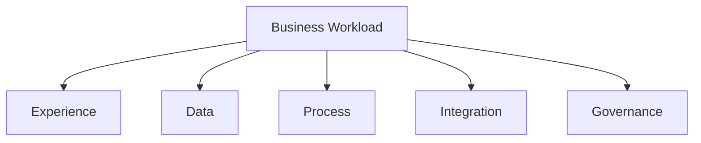
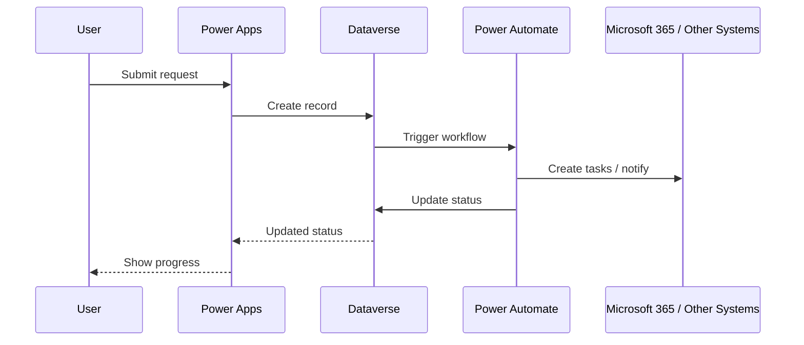
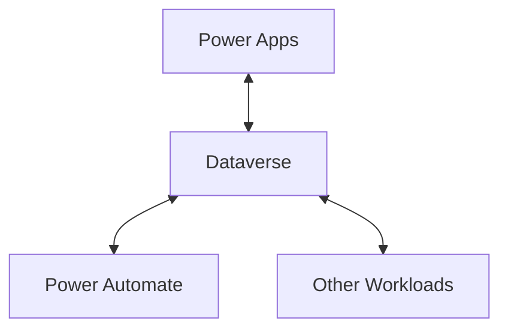
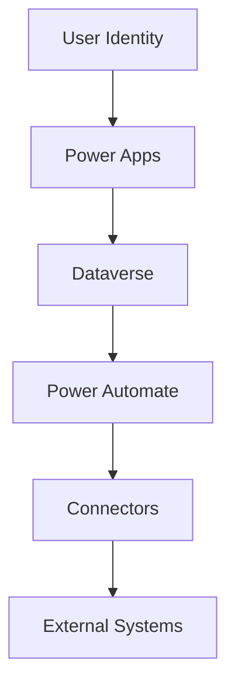
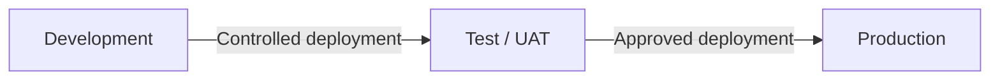
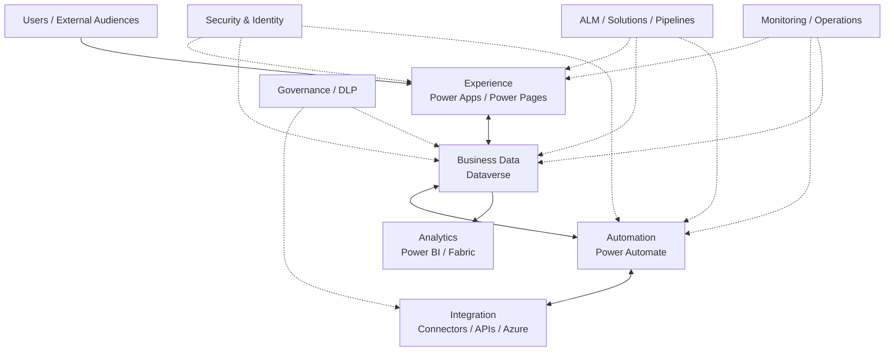
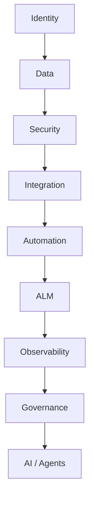

import ComparisonTable from "../../components/content/ComparisonTable.astro";
import Callout from "../../components/ui/Callout.astro";
import PowerPlatformArchitectureGuide from "../../components/content/PowerPlatformArchitectureGuide.astro";
import ArticleImageLightbox from "../../components/article/widgets/ArticleImageLightbox.astro";

import powerPlatformSolutionArchitecture from "../../assets/images/articles/power-platform/power-platform-solution-architecture.png";
import powerPlatformResponsibilityBoundaries from "../../assets/images/articles/power-platform/power-platform-responsibility-boundaries.png";

Power Apps, Dataverse, and Power Automate are often learned as separate products.

That is useful at first.

For a production workload, the more useful question is how their responsibilities fit together:

**Power Apps → experience**

**Dataverse → business data**

**Power Automate → orchestration**

Around them sit connectors, APIs, analytics, security, environments, ALM, monitoring, and governance.

The platform becomes valuable when those responsibilities are designed together rather than implemented as isolated products.

<ArticleImageLightbox
  src={powerPlatformSolutionArchitecture.src}
  alt="Microsoft Power Platform solution architecture showing users connecting through Power Apps as the experience layer, Dataverse as the governed business data layer, and Power Automate as the automation layer, with Microsoft 365, Dynamics 365, Azure services, external APIs, security, DLP, environments, ownership, monitoring, and ALM surrounding the workload."
/>

---

## 1. Start With the Workload

Do not begin by asking which product to deploy.

Start with:

- Who are the users?
- What are they trying to accomplish?
- What business data is involved?
- What processes happen after data changes?
- Which systems must participate?
- What needs automation?
- Which decisions require people?
- How critical is the workload?
- How will it be deployed and operated?

The application model should follow those requirements.

---

## 2. Give Each Component a Clear Responsibility

### Power Apps — Experience

Use Power Apps to give users the interface they need.

**Canvas Apps** suit highly customized task and mobile experiences.

**Model-Driven Apps** suit data-heavy, process-driven Dataverse applications.

**Power Pages** suits secure external-facing experiences.

### Dataverse — Business Data

Dataverse provides governed operational business data together with relationships, metadata, security, business logic, APIs, auditing, integration, and lifecycle capabilities.

### Power Automate — Orchestration

Power Automate connects events to the work that should happen next:

- approvals;
- notifications;
- record updates;
- cross-system processing;
- scheduled or event-driven automation.

The simplest mental model is:

**Power Apps for experience.**

**Dataverse for business data.**

**Power Automate for orchestration.**

---

## 3. The Core Pattern: Experience → Data → Automation

Consider an onboarding application:

No single component needs to own the entire solution.

The application does not need to become the workflow engine.

The workflow does not need to become the user interface.

The data platform does not need to become the presentation layer.

<Callout type="information" title="Clear responsibilities produce clearer architecture">
Design the hand-offs between components deliberately rather than allowing one product to accumulate experience, data, orchestration, and integration responsibilities.
</Callout>

---

## 4. Dataverse as the Shared Business Context

Dataverse can act as the common business-data layer for applications, automations, agents, reports, and custom integrations.

This means data ownership, relationships, security, and lifecycle can be designed at the platform boundary instead of recreated independently in every application.

---

## 5. Connectors and APIs Form the Integration Layer

Connectors allow the platform to communicate with:

- Microsoft 365;
- Dataverse;
- Dynamics 365;
- Azure;
- SharePoint;
- SQL Server;
- third-party services.

They therefore influence architecture, permissions, data movement, reliability, governance, and sometimes licensing.

Custom connectors and APIs extend the integration model when a certified connector is not enough.

For more specialized requirements, use APIs or Azure services rather than pushing complex compute into Power Apps or Power Automate.

---

## 6. Put Logic Where It Belongs

<ComparisonTable
  caption="Power Platform components and their primary architectural responsibilities"
  columns={[
    { label: "Component / layer" },
    { label: "Primary responsibility" }
  ]}
  rows={[
    {
      label: "Power Apps",
      cells: ["Presentation, user interaction, application experience"]
    },
    {
      label: "Dataverse",
      cells: ["Business data, relationships, security, data-centric rules"]
    },
    {
      label: "Power Automate",
      cells: ["Approvals, notifications, orchestration, cross-system workflows"]
    },
    {
      label: "Azure / APIs",
      cells: ["Specialized compute and complex integration"]
    },
    {
      label: "Power BI / Fabric",
      cells: ["Analytics and large-scale reporting"]
    }
  ]}
/>

The point is not to enforce rigid boundaries in every solution.

It is to prevent one component from becoming responsible for everything.

<ArticleImageLightbox
  src={powerPlatformResponsibilityBoundaries.src}
  alt="Power Platform responsibility boundaries showing Power Apps for presenting and capturing information, Dataverse for storing and governing business data, Power Automate for orchestrating and coordinating processes, and Azure or APIs for complex computation and specialized integration, with security, DLP, environments, ALM, monitoring, and ownership shared across all layers."
/>

---

## 7. Security Is a Workload-Level Concern

Security crosses every boundary:

Review:

- identity;
- least privilege;
- Dataverse permissions;
- connection ownership;
- service identities;
- environment boundaries;
- DLP;
- external-system permissions.

A secure Power App can still participate in an insecure solution if a flow or connector has excessive access.

> **Security belongs to the workload architecture, not to a single product.**

---

## 8. Environments, ALM, and Governance Are the Control Plane

The platform components need common operational boundaries.

Solutions package related components, while pipelines support controlled movement between environments.

A mature model uses:

**unmanaged development → managed test/UAT → managed production**

along with source control, automated validation, approvals, environment variables, connection references, monitoring, and rollback/runbooks.

Governance then spans:

- environments;
- DLP;
- connectors;
- ownership;
- security;
- ALM;
- monitoring;
- capacity;
- licensing.

---

## 9. Keep Operational and Analytical Workloads Separate

A Power Platform application is not automatically an analytics platform.

A useful separation is:

**Power Apps** → interact with the business process.

**Dataverse** → manage operational business data.

**Power Automate** → orchestrate processes.

**Power BI / Fabric** → analyze and unify data.

**Azure / APIs** → provide specialized compute and integration.

This prevents transactional applications and workflows from becoming general-purpose analytics or compute engines.

---

## 10. Common Architectural Mistakes

The recurring mistakes are mostly boundary problems:

**Power Apps as the entire system**  
The app accumulates data, orchestration, integration, and business logic.

**Power Automate as the application layer**  
Flows become oversized, user-facing processes.

**Dataverse treated as only a database**  
Security, APIs, lifecycle, and governance are ignored.

**Everything built in the default environment**  
Development and production boundaries become difficult to manage.

**Uncontrolled connector growth**  
Integrations proliferate without ownership or DLP controls.

**RPA where an API exists**  
UI automation introduces unnecessary operational fragility.

---

## 11. The Power Platform Reference Model

Everything now comes together:

The key is not that every workload needs every component.

It is that each component has a **clear responsibility**.

---

## 12. AI Sits on Top of the Foundation

Microsoft's 2026 direction increasingly points toward AI-assisted and agentic low-code across Power Apps, Power Automate, Dataverse, Copilot, APIs, and governance.

The architectural sequence remains:

AI does not eliminate the platform foundation.

It increases the importance of getting that foundation right.

---

# Conclusion

Power Apps, Dataverse, and Power Automate are not three isolated tools.

They represent three important responsibilities within a broader platform:

**Power Apps → experience**

**Dataverse → business data**

**Power Automate → orchestration**

Connectors and APIs provide integration.

Power BI and Fabric provide analytics.

Azure and custom services provide specialized capabilities.

Environments, security, DLP, solutions, pipelines, monitoring, and ownership provide the control plane.

The most useful architectural question is therefore not:

> **"Which Power Platform product should I use?"**

It is:

> **"Which responsibility belongs to which platform component?"**

Build around the workload, give each component a clear job, and design the boundaries deliberately.

That is how Power Apps, Dataverse, and Power Automate become a platform rather than a collection of disconnected tools.
