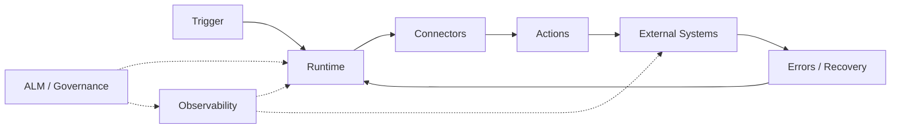
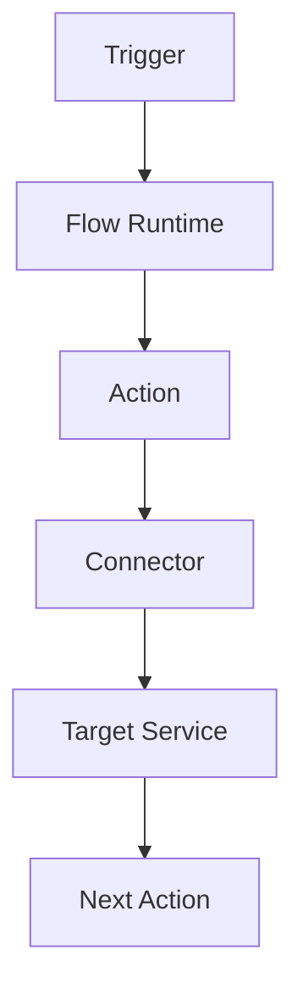
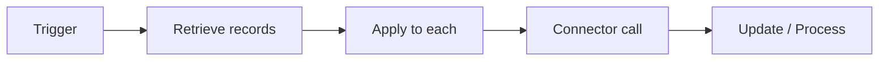
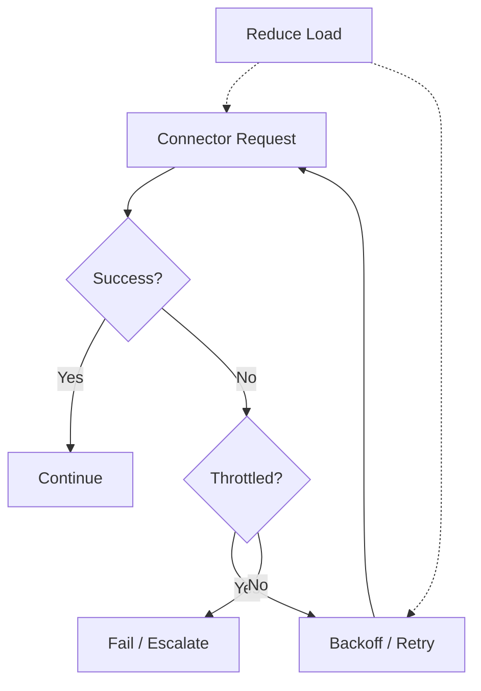
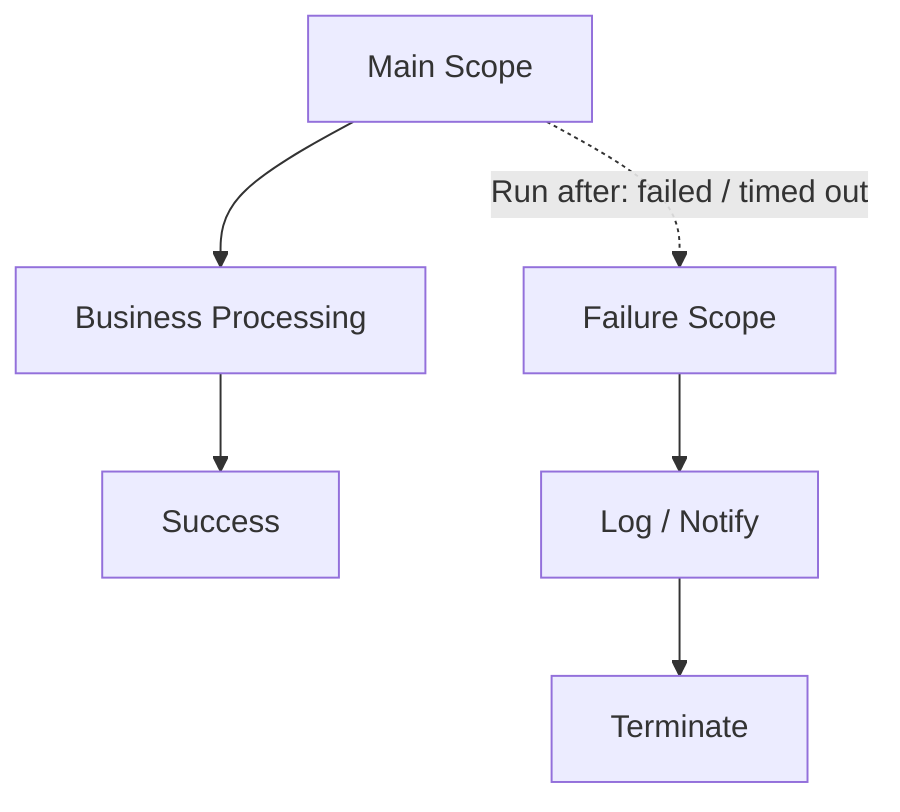
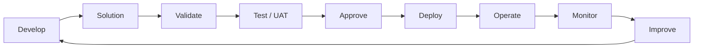
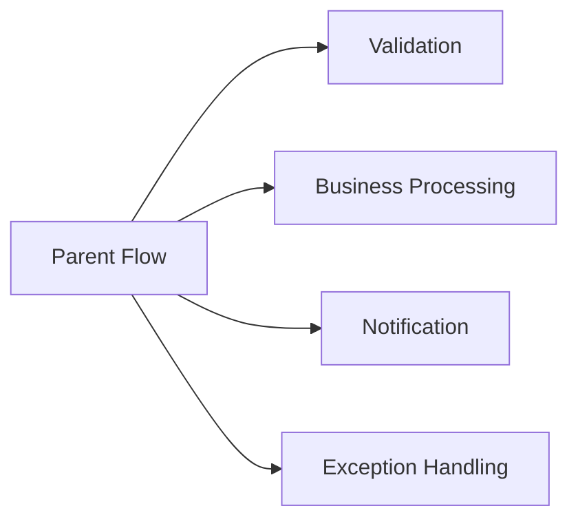
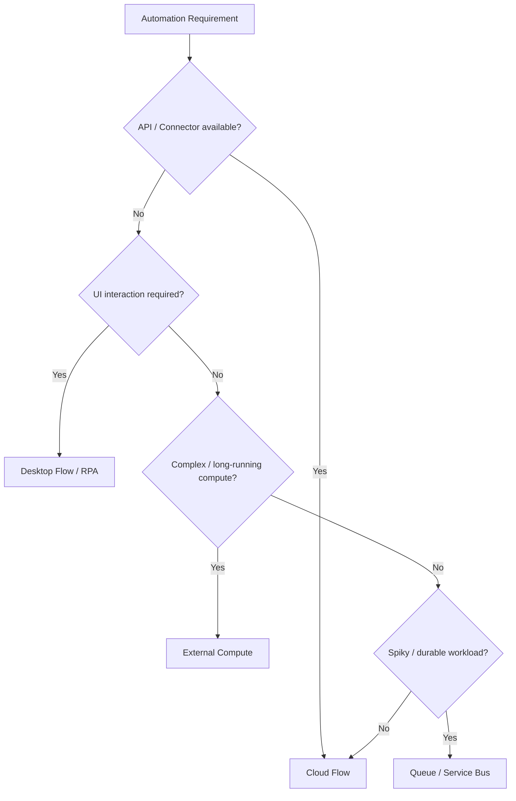
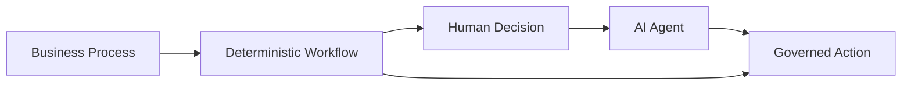

import Callout from "../../components/ui/Callout.astro";
import ComparisonTable from "../../components/content/ComparisonTable.astro";
import PowerAutomateProductionReadiness from "../../components/content/PowerAutomateProductionReadiness.astro";
import ArticleImageLightbox from "../../components/article/widgets/ArticleImageLightbox.astro";

import powerAutomateProductionArchitecture from "../../assets/images/articles/power-automate/power-automate-production-architecture.png";
import powerAutomateRuntimePerformanceModel from "../../assets/images/articles/power-automate/power-automate-runtime-performance-model.png";

Power Automate is easy to start with: a trigger, a few actions, and a connector can produce a working workflow in minutes.

Production automation is different.

Once a flow becomes business-critical, the engineering questions become:

- What happens when volume increases?
- What happens when a connector throttles?
- How are failures retried or isolated?
- How do operators know something is wrong?
- Who owns the automation when its maker leaves?
- How is the flow promoted safely into production?
- When should the workload move outside Power Automate?

This article treats Power Automate as a **production automation platform** rather than simply a workflow designer.

---

## 1. A Working Flow Is Not Automatically a Production Workload

A production flow must account for:

**volume** — how often it runs and how much data each run processes;

**concurrency** — how many executions and connector calls occur at once;

**dependencies** — what happens when a downstream service is slow or unavailable;

**limits** — runtime, request, connector, payload, and definition constraints;

**recovery** — how failed work is retried, isolated, resumed, or escalated;

**observability** — how operators detect and investigate failures;

**ownership** — who is responsible for the automation;

**ALM** — how changes are developed, tested, approved, and deployed.

The flow is only one part of the production system.

<ArticleImageLightbox
  src={powerAutomateProductionArchitecture.src}
  alt="Power Automate production architecture showing triggers feeding the Power Automate runtime, connections to Microsoft 365, Dataverse, external APIs and Azure services, with governance and ALM above and observability and monitoring below."
/>

---

## 2. Understand the Runtime Before Optimizing It

Cloud flows can be triggered by events, schedules, manual invocation, Power Apps, and other services.

A simplified execution path is:

Every connector call introduces another dependency.

Every loop can multiply request volume.

Every retry can generate additional requests.

Every parallel branch can increase concurrency.

> **The number of actions in a flow is not the same thing as the workload generated by the flow.**

That distinction becomes important when performance and throttling enter the picture.

---

## 3. Design Around Platform Limits

Microsoft documents constraints around flow definitions and runtime behavior, including:

- 500 actions per workflow;
- 8 levels of action nesting;
- 250 variables;
- 30-day run duration and retention;
- request limits;
- concurrent outbound-call limits;
- content-throughput limits;
- 120-second synchronous request timeouts;
- 100 MB message size;
- retry-policy limits.

The exact limit can depend on the feature, connector, request type, and licensing/performance profile, so production design should use the current Microsoft documentation for the specific workload.

The architectural lesson is more important than any single number:

> **Design from the workload backward, not from the flow designer forward.**

---

## 4. Start Performance Engineering at the Trigger

The first optimization is often preventing unnecessary runs.

Use:

- trigger conditions;
- event filtering;
- scoped queries;
- appropriate schedules;
- change detection;
- selective polling.

Prefer:

**Relevant event → Retrieve only what is needed → Process**

over:

**Broad trigger → Retrieve everything → Filter inside the flow**

This reduces run count, connector calls, payload volume, and downstream processing.

---

## 5. Loops, Concurrency, and Throttling

A loop can multiply the workload quickly.

If 1,000 records produce three connector operations each, the flow is no longer performing "one workflow"; it is generating a potentially large request workload.

Pagination, retries, and parallel execution can increase that load further.

> **Faster execution is not always better execution.**

Increasing concurrency can shorten a run while simultaneously overwhelming its dependency.

<ArticleImageLightbox
  src={powerAutomateRuntimePerformanceModel.src}
  alt="Power Automate runtime performance model showing how trigger volume, loops and work amplification, concurrency, connector requests, throttling, retries, and recovery affect the workload generated by a flow."
/>

### Handling throttling

A connector can return HTTP `429 Too Many Requests`, while Dataverse applies its own service-protection limits.

A resilient flow should:

1. recognize throttling;
2. honor applicable retry guidance;
3. use backoff;
4. control concurrency;
5. reduce unnecessary requests;
6. make the operation safe to retry.

> **A retry strategy is part of the workload model.**

---

## 6. Make Retries Safe

Retries become dangerous when an operation is not idempotent.

Suppose a flow creates a record in an external system and times out before receiving the response. Retrying may create a duplicate.

Safer designs can use:

- stable business keys;
- correlation IDs;
- existence checks;
- upsert-style operations;
- duplicate detection;
- durable state.

The goal is:

**Same business event → Retry → Same intended outcome**

This is especially important when a flow crosses system boundaries.

---

## 7. Treat Error Handling as Part of the Architecture

Not every failure should be handled the same way.

<ComparisonTable
  caption="Power Automate failure types and appropriate responses"
  columns={[
    { label: "Failure type" },
    { label: "Appropriate response" }
  ]}
  rows={[
    {
      label: "Transient service/network failure",
      cells: ["Controlled retry"]
    },
    {
      label: "Throttling",
      cells: ["Backoff and reduced concurrency"]
    },
    {
      label: "Business-rule failure",
      cells: ["Capture and route appropriately"]
    },
    {
      label: "Configuration/credential failure",
      cells: ["Stop and escalate"]
    },
    {
      label: "Unexpected failure",
      cells: ["Capture evidence and investigate"]
    }
  ]}
/>

Power Automate supports scopes, **Run after** conditions, retry policies, terminate actions, notifications, and other patterns for building explicit recovery paths.

A common structure is:

<Callout type="important" title="Design the failure path">
Error handling should answer four questions: what failed, why it failed, what happens next, and who owns the outcome.
</Callout>

---

## 8. Observability: Know What Happened

Opening individual flow runs is useful for investigation, but it should not be the entire operating model.

A practical operating model is:

**Automation Center** for day-to-day operations;

**Application Insights and KQL** for fleet-level diagnostics and alerting;

**custom logging** only where business-specific context is actually needed.

Useful signals include:

- failure rate;
- run duration;
- dependency failures;
- action volume;
- throttling;
- repeated retries;
- abnormal execution patterns;
- connection or ownership failures.

The objective is not to log everything.

It is to produce **actionable evidence**.

---

## 9. Ownership Is Reliability

A critical production flow should not depend on one employee's account.

Ownership needs to survive:

- role changes;
- employee departure;
- access changes;
- credential changes;
- incident response.

For important or long-running automations, consider service-principal ownership and clear connection governance.

Document at least:

- business owner;
- technical owner;
- dependencies;
- connections;
- support procedure;
- escalation path;
- recovery procedure.

<Callout type="warning" title="Avoid single-person ownership">
If a business-critical automation depends on one person's account, treat that dependency as a production risk and establish durable ownership before scaling the workload.
</Callout>

---

## 10. Production Flows Need ALM

Power Platform solutions are the ALM mechanism for Power Apps and Power Automate.

The recommended model is:

**unmanaged solutions → development**

**managed solutions → test / UAT / production**

Solutions track components, dependencies, publishers, and lifecycle operations. Power Platform pipelines can deploy solutions and target-environment configuration such as connections, connection references, and environment variables; they do not deploy Dataverse table data.

For mature teams, combine pipelines with source control, automated validation, solution checking, approvals, and rollback/runbook procedures.

### Keep configuration out of the flow definition

Use:

**environment variables** for environment-specific configuration;

**connection references** for connector dependencies.

That allows the same solution to move through environments without embedding production-specific values into the workflow.

<Callout type="best-practice" title="Keep production solution-aware">
Production flows should be changed through controlled, repeatable deployment rather than direct edits in the production environment.
</Callout>

---

## 11. Know When to Split the Flow

A small flow can gradually become a **mega-flow**.

Warning signs include:

- unrelated responsibilities;
- deep nesting;
- repeated logic;
- long execution paths;
- difficult troubleshooting;
- excessive action counts;
- unrelated failure domains.

A better structure can separate responsibilities:

The objective is not to maximize the number of flows.

It is to create **clear execution and failure boundaries**.

---

## 12. Power Automate Is Not Always the Execution Layer

Use **cloud flows** when APIs or connectors exist and the process is event-driven, scheduled, or manually triggered.

Use **desktop flows/RPA** when UI interaction is genuinely required or an application lacks a usable API.

Consider **external services** when the workload needs complex or long-running compute.

Consider **queues such as Service Bus** when work is spiky and needs durable buffering.

The goal is not to maximize Power Automate usage.

> **The goal is to build the most reliable automation system for the workload.**

---

## 13. Governance at Enterprise Scale

As the number of makers and flows grows, automation sprawl becomes an operating problem.

Governance should cover:

- environment strategy;
- DLP;
- connector controls;
- ownership;
- managed environments;
- ALM;
- monitoring;
- licensing;
- service accounts and service principals;
- support procedures.

Governance should also distinguish between:

**personal productivity automation**

and

**business-critical enterprise automation.**

They do not necessarily need the same ownership, deployment, monitoring, or support model.

---

## 14. Production Anti-Patterns

The most important patterns to avoid are:

- personal-owner production flows;
- unmanaged production edits;
- all-purpose mega-flows;
- unconstrained loops;
- aggressive retries;
- excessive polling;
- over-alerting;
- RPA where APIs exist;
- unmanaged premium connector sprawl;
- flows that violate DLP boundaries.

The common failure is not that the flow was technically possible.

It is that it was **not engineered as a production system**.

---

## 15. Deterministic Automation and AI Agents

Power Automate is moving toward AI-assisted automation, richer desktop automation, process intelligence, and agent-aware workflows. Roadmap functionality can change, so forward-looking capabilities should be validated against current Microsoft documentation before implementation.

The useful distinction is:

**Deterministic workflow**

> The process should follow predictable rules and produce auditable results.

**Agentic workflow**

> The process may need reasoning and adaptation because the exact path is not known in advance.

These patterns are complementary.

The architectural question is not:

> **"Should we replace workflows with AI?"**

It is:

> **"Which parts of the process require deterministic execution, and which genuinely benefit from reasoning?"**

---

## 16. Production Readiness Checklist

Before promoting a critical flow, ask:

### Runtime

- Is the trigger properly scoped?
- Is expected volume understood?
- Is concurrency intentional?
- Are connector limits understood?

### Reliability

- Are transient failures retried?
- Is throttling handled?
- Is the workflow idempotent?
- Are permanent failures separated from transient failures?

### Performance

- Are loops bounded?
- Is pagination intentional?
- Are payloads minimized?
- Is complex compute externalized where appropriate?

### Observability

- Can operators see failures?
- Can they identify the affected business process?
- Are throttling and repeated retries visible?
- Is alerting actionable?

### Ownership

- Does the automation have durable ownership?
- Are connections governed?
- Is there a runbook?
- Is escalation documented?

### ALM

- Is the flow solution-aware?
- Is production deployment controlled?
- Are environment variables and connection references used?
- Is rollback defined?

### Governance

- Is the environment appropriate?
- Does the flow comply with DLP?
- Is connector usage governed?
- Is licensing understood?

<PowerAutomateProductionReadiness />

---

# Conclusion

A production Power Automate flow is not simply a successful sequence of actions.

It is a **small distributed system** with:

**triggers, runtime behavior, dependencies, limits, concurrency, failure modes, retry behavior, observability, ownership, deployment lifecycle, and governance.**

The strongest implementations therefore follow one principle:

> **Build the automation so that scale, failure, change, and ownership are expected parts of its design—not surprises discovered after deployment.**

Power Automate is well suited to enterprise automation when it is treated as a governed platform with deliberate architecture, reliable integration patterns, observable execution, and controlled lifecycle management.

And as AI agents become more capable, the important distinction will not be **automation versus AI**.

It will be:

> **Where must execution remain deterministic, and where does reasoning genuinely add value?**
