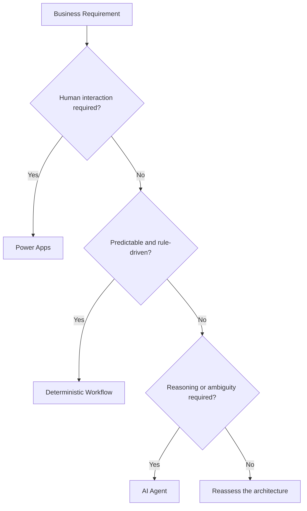
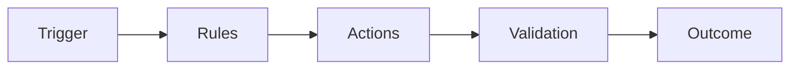
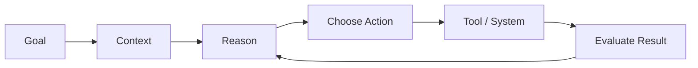
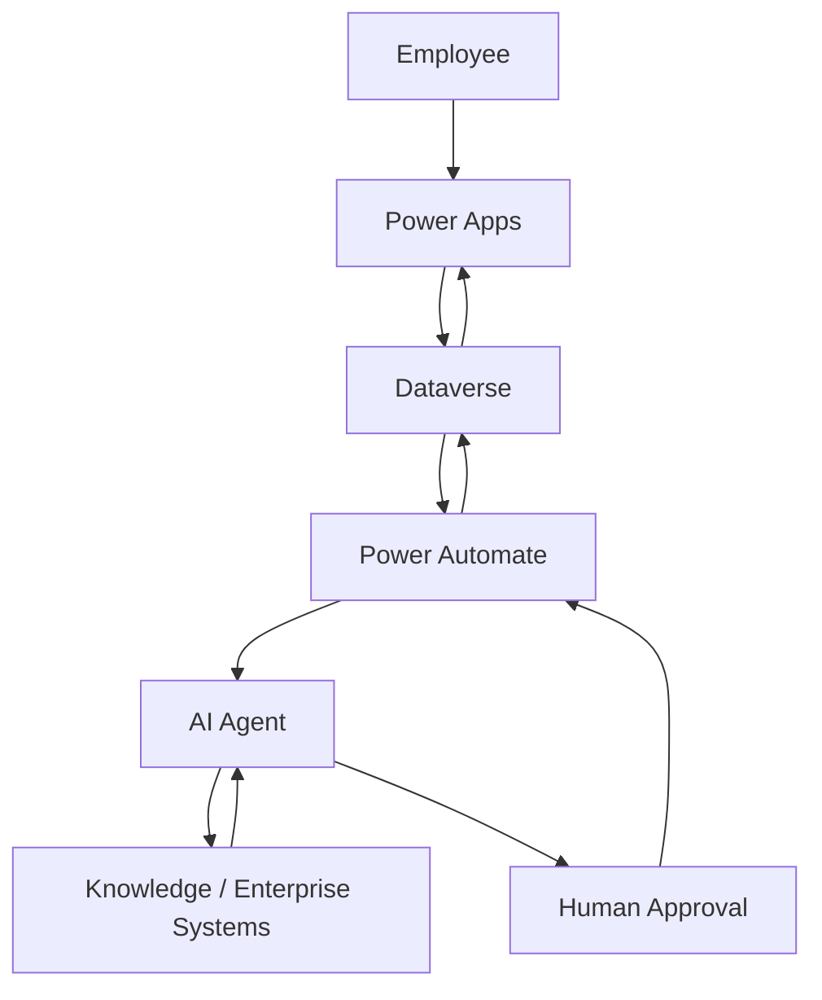
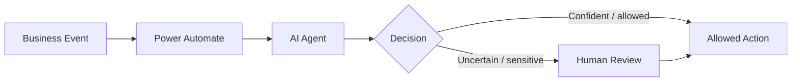
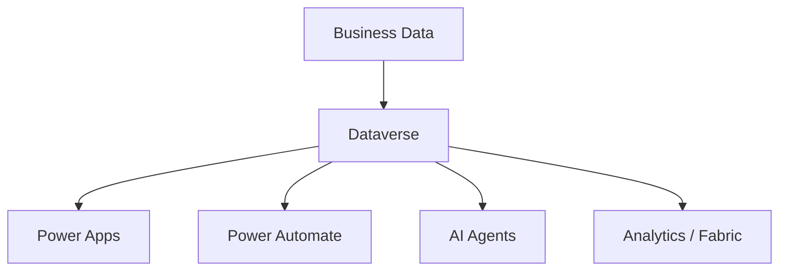
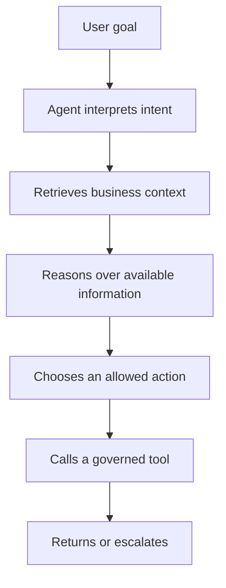
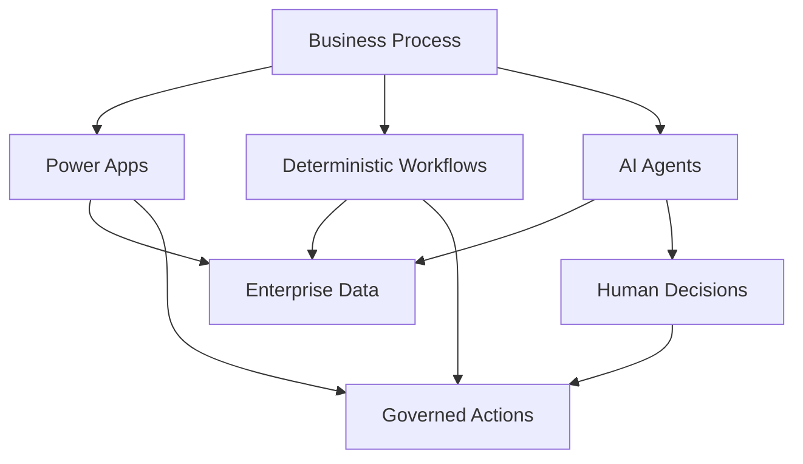

import ComparisonTable from "../../components/content/ComparisonTable.astro";
import Callout from "../../components/ui/Callout.astro";
import PowerPlatformExecutionModelSelector from "../../components/content/PowerPlatformExecutionModelSelector.astro";
import ArticleImageLightbox from "../../components/article/widgets/ArticleImageLightbox.astro";

import powerPlatformExecutionModels from "../../assets/images/articles/power-platform/power-platform-execution-models.png";
import powerPlatformAgenticWorkflowPattern from "../../assets/images/articles/power-platform/power-platform-agentic-workflow-pattern.png";

AI agents are becoming a bigger part of Power Platform.

That does not mean every process should become agentic.

A user interface is still valuable when people need to work with structured information.

A deterministic workflow is still valuable when a process needs predictable, repeatable, auditable execution.

An agent becomes valuable when the work contains ambiguity, requires reasoning, or needs to adapt its behavior to context.

The architectural question is therefore not:

> **"Should we use AI?"**

It is:

> **"Which execution model best matches the work?"**

<ArticleImageLightbox
  src={powerPlatformExecutionModels.src}
  alt="Power Platform execution models comparing Power Apps for human interaction, Power Automate for deterministic rule-driven execution, and AI agents for adaptive reasoning, with Dataverse, orchestration, and governance showing how the models can compose together."
/>

---

## 1. Start With the Work

Before choosing an execution model, ask:

- Does a person need to interact with the process?
- Are the rules known in advance?
- Is the process repeatable?
- Does the work contain ambiguity or incomplete information?
- Is human approval required?
- What level of autonomy is acceptable?
- How important are auditability and predictability?

The result does not have to be one technology. Enterprise solutions can combine all three.

---

## 2. Power Apps: When the Human Experience Matters

Power Apps remains the natural choice when people need a controlled application experience.

Typical needs include:

- structured forms;
- task-oriented interfaces;
- dashboards;
- record management;
- guided interaction;
- business-specific user experiences.

Canvas Apps support highly customized experiences, while Model-Driven Apps suit data-heavy, process-driven Dataverse applications.

> **An agent does not automatically make a better user interface.**

---

## 3. Power Automate: When the Process Is Predictable

Use deterministic workflows when:

- the trigger is known;
- the business rules are explicit;
- the sequence is repeatable;
- the expected outcome is defined;
- auditability matters.

Examples include approvals, onboarding, ticket routing, record synchronization, scheduled notifications, and standardized compliance processes.

When the path is already known, adding autonomy may add complexity without adding value.

---

## 4. AI Agents: When Reasoning Adds Value

Agents become more useful when the process includes:

- ambiguous input;
- multiple possible paths;
- context-dependent decisions;
- unstructured information;
- multiple knowledge sources or tools;
- a need for reasoning or adaptation.

The important distinction is that an agent is not merely executing a predefined sequence.

It is determining parts of the sequence dynamically.

---

## 5. Rules vs. Reasoning

<ComparisonTable
  caption="Power Platform execution models at a glance"
  columns={[
    { label: "Characteristic" },
    { label: "Power Apps" },
    { label: "Deterministic workflow" },
    { label: "AI agent" }
  ]}
  rows={[
    {
      label: "Primary purpose",
      cells: ["Human experience", "Repeatable execution", "Contextual reasoning"]
    },
    {
      label: "Input",
      cells: ["User interaction", "Event / structured data", "Goal + context"]
    },
    {
      label: "Path",
      cells: ["User-driven", "Predetermined", "Adaptive"]
    },
    {
      label: "Rules",
      cells: ["Application logic", "Explicit business rules", "Rules + model reasoning"]
    },
    {
      label: "Human role",
      cells: ["Primary", "Optional", "Often supervisory"]
    },
    {
      label: "Best fit",
      cells: ["Interaction", "Repeatable process", "Ambiguous work"]
    }
  ]}
/>

These are architectural roles, not mutually exclusive products.

---

## 6. The Best Architecture May Use All Three

Consider an employee-support scenario:

Here:

**Power Apps** provides the experience.

**Dataverse** holds business state.

**Power Automate** provides deterministic orchestration.

**The agent** handles ambiguous reasoning or information gathering.

**A human** remains responsible for decisions that require explicit approval.

<Callout type="information" title="Compose execution models">
The strongest architecture often combines applications, deterministic workflows, and agents rather than forcing the entire workload into one execution model.
</Callout>

---

## 7. Agents Need Tools, Data, and Boundaries

An agent becomes useful only when it has the context and actions required for its task.

That can include:

- Dataverse;
- Power Apps capabilities;
- Power Automate flows;
- Microsoft 365;
- connectors;
- APIs;
- knowledge sources.

But capability without boundaries creates risk.

Define:

- **Tools**
- **Data access**
- **Permissions**
- **Allowed actions**
- **Escalation paths**
- **Ownership**

---

## 8. Put Agentic Decisions Inside Governed Workflows

A strong pattern is to place AI reasoning inside a deterministic workflow boundary:

<ArticleImageLightbox
  src={powerPlatformAgenticWorkflowPattern.src}
  alt="Governed Power Platform agentic workflow showing Power Automate receiving a trigger, validating and scoping the request, invoking an AI agent, evaluating the response, and taking an allowed action or routing uncertain decisions to human review, with data, tools, monitoring, and security inside the workflow boundary."
/>

The workflow supplies structure and control.

The agent supplies reasoning where it is actually needed.

<Callout type="best-practice" title="Keep agentic decisions inside governed boundaries">
Use explicit tools, permissions, workflow controls, monitoring, and escalation paths around an agent rather than treating it as an unrestricted process engine.
</Callout>

---

## 9. Keep Users in the Loop Where Risk Requires It

User involvement can remain appropriate when:

- financial impact is significant;
- sensitive information is involved;
- policy interpretation is required;
- the system is uncertain;
- the action is irreversible;
- legal or compliance responsibility remains human.

> **Increase autonomy only as confidence, observability, and control increase.**

---

## 10. Agents Must Follow the Same Governance Model

Agents do not create a separate governance universe.

They still require:

- **Identity**
- **Data access**
- **DLP**
- **Least privilege**
- **Environment boundaries**
- **ALM**
- **Monitoring**
- **Ownership**

The governance controls established across the platform still apply; AI adds another actor that must operate inside them.

---

## 11. Dataverse Becomes More Important as Context

Dataverse provides governed business context for Power Apps, Power Automate, Dynamics 365, Copilot, and emerging agent scenarios.

> **AI does not reduce the need for good business data. It increases its value.**

Clean metadata, meaningful relationships, appropriate security, and governed data become more important when agents depend on that context.

---

## 12. When an Agent Is the Wrong Choice

Do not introduce an agent simply because one is available.

A normal application or workflow may be better when:

- the process is completely deterministic;
- rules are explicit;
- the task is simple;
- predictability is more important than adaptability;
- the workload is primarily data entry;
- the action is highly consequential;
- an auditable fixed path is preferred.

<Callout type="important" title="Do not use AI by default">
Use AI when reasoning solves a real problem. If explicit rules already describe the work, a deterministic design may be simpler, easier to test, and easier to govern.
</Callout>

---

## 13. When an Agent Adds Real Value

An agent becomes more attractive when several characteristics appear together:

- **ambiguous input**
- **multiple possible paths**
- **context-dependent decisions**
- **unstructured information**
- **need for reasoning**
- **multiple tools or knowledge sources**
- **human supervision**

A useful pattern is:

The more deterministic the process becomes, the more carefully you should question whether an agent is still necessary.

---

## 14. Cost and Operational Risk Still Matter

AI architecture has an economic and operational dimension.

Consider:

- AI capacity;
- Power Platform licensing;
- premium connectors;
- Dataverse capacity;
- external services;
- model usage;
- monitoring;
- support;
- human review.

The relevant comparison is not simply:

> **"Workflow = cheap; agent = expensive."**

It is:

> **"What is the total cost of achieving the required outcome with the required reliability and control?"**

---

## 15. The Practical Decision Framework

<ComparisonTable
  caption="Power Platform responsibility and execution model"
  columns={[
    { label: "Requirement" },
    { label: "Natural starting point" }
  ]}
  rows={[
    {
      label: "Human interaction and application experience",
      cells: ["Power Apps"]
    },
    {
      label: "Governed operational business data",
      cells: ["Dataverse"]
    },
    {
      label: "Predictable orchestration",
      cells: ["Power Automate"]
    },
    {
      label: "Specialized compute or integration",
      cells: ["Azure / APIs"]
    },
    {
      label: "Analytics and data products",
      cells: ["Power BI / Fabric"]
    },
    {
      label: "Ambiguous, context-rich reasoning",
      cells: ["AI Agent"]
    }
  ]}
/>

When a workload needs several of these, **compose them** instead of forcing everything into one execution model.

---

## 16. The Emerging Enterprise Pattern

The likely enterprise model is not:

**Traditional automation → Replace everything with agents**

It is:

Different execution models coexist.

The enterprise chooses the appropriate one for each part of the process.

---

## 17. Governance Becomes More Important, Not Less

As agent capabilities expand, governance must become more precise.

Organizations need to define:

- who can create or publish agents;
- which environments they can use;
- what data they can access;
- which connectors they can invoke;
- which actions they can execute;
- where human approval is mandatory;
- how activity is monitored;
- how identities are managed;
- how agents are retired.

The governance model established for Power Platform workloads still applies; agentic capabilities add another actor and therefore another set of permissions, tools, and operational events to govern.

---

# Conclusion

AI agents do not make applications and deterministic workflows obsolete.

They make architecture more important.

**Power Apps** remains valuable for human experience.

**Dataverse** remains valuable as governed business context.

**Power Automate** remains valuable for predictable orchestration.

**Azure and APIs** remain valuable for specialized compute and integration.

**Power BI and Fabric** remain valuable for analytics.

**AI agents** become valuable when the work genuinely requires reasoning, adaptation, or context-dependent decisions.

The principle is simple:

> **Use deterministic systems for deterministic work and adaptive systems for work that genuinely requires reasoning.**

And when both are needed, combine them.

The strongest future architecture is not:

> **"AI everywhere."**

It is:

> **"Apps for interaction. Data for context. Workflows for control. Agents for reasoning. Governance around all of them."**

That is how the Power Platform can evolve into a governed platform for **human work, deterministic automation, and agentic execution** without abandoning the engineering discipline required to operate it responsibly.
