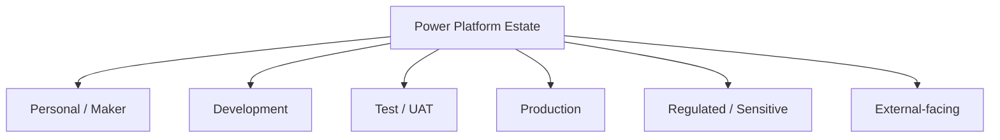
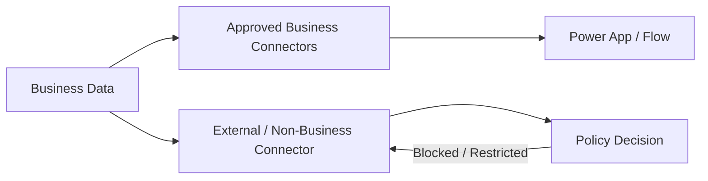
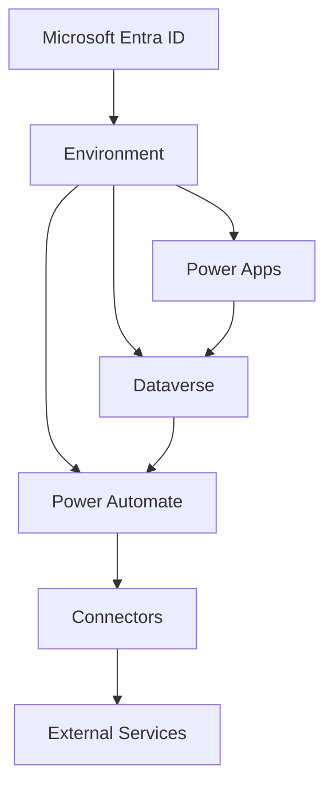
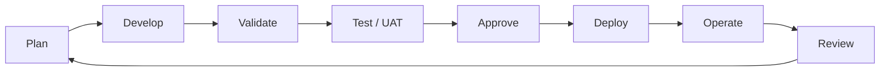
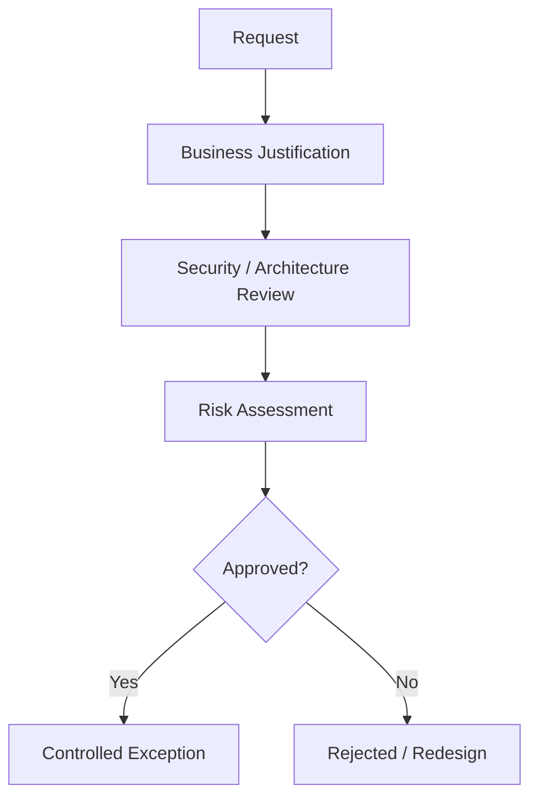
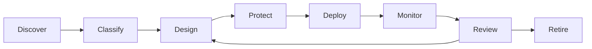
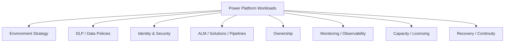

import ComparisonTable from "../../components/content/ComparisonTable.astro";
import Callout from "../../components/ui/Callout.astro";
import PowerPlatformGovernanceMaturity from "../../components/content/PowerPlatformGovernanceMaturity.astro";
import ArticleImageLightbox from "../../components/article/widgets/ArticleImageLightbox.astro";

import powerPlatformGovernanceControlPlane from "../../assets/images/articles/power-platform/power-platform-governance-control-plane.png";
import powerPlatformEnvironmentGovernanceModel from "../../assets/images/articles/power-platform/power-platform-environment-governance-model.png";

Power Platform governance becomes important when adoption succeeds.

A single maker can build an app or flow with little formal oversight. An organization with hundreds of makers, applications, flows, connectors, environments, and Dataverse workloads needs a different operating model.

The goal is not to stop people from building.

> **The goal is to make the safe path the scalable path.**

<ArticleImageLightbox
  src={powerPlatformGovernanceControlPlane.src}
  alt="Power Platform governance control plane showing Power Apps, Dataverse, and Power Automate workloads surrounded by environment strategy, DLP and data policies, identity and security, ALM and solution lifecycle, ownership, monitoring and observability, capacity and licensing, and recovery and continuity controls."
/>

---

## 1. Governance Starts With the Environment

An environment is more than where an app runs. It establishes boundaries for resources, data, security, connectors, policies, lifecycle, and administration.

A practical estate might distinguish:

The exact structure varies by organization, but the boundary should reflect workload sensitivity, criticality, lifecycle, and maker population.

> **Environment design is the foundation of Power Platform governance.**

---

## 2. Keep the Default Environment From Becoming the Platform

The default environment is convenient, which is exactly why it can become the place where experimentation, development, integrations, and production workloads accumulate.

A stronger lifecycle is:

**Personal → Development → Test → Production**

The objective is not necessarily to eliminate legitimate default-environment use.

It is to prevent it from quietly becoming the organization's universal development and production platform.

---

## 3. Match Governance to Workload Risk

Not every workload needs the same controls.

<ComparisonTable
  caption="Governance posture by workload type"
  columns={[
    { label: "Workload" },
    { label: "Governance posture" }
  ]}
  rows={[
    {
      label: "Personal productivity",
      cells: ["Lightweight controls"]
    },
    {
      label: "Departmental business application",
      cells: ["Structured ownership and ALM"]
    },
    {
      label: "Business-critical / regulated workload",
      cells: ["Strong security, managed environments, controlled ALM, monitoring, and recovery"]
    }
  ]}
/>

Governance should be proportional.

Too little control creates risk.

Too much control encourages workarounds.

<ArticleImageLightbox
  src={powerPlatformEnvironmentGovernanceModel.src}
  alt="Power Platform environment governance model showing progression from Personal or Maker through Development, Test or UAT, Production, and Regulated or Sensitive workloads, with governance intensity increasing from lightweight to highly governed controls."
/>

---

## 4. DLP Controls Data Paths

Data policies are one of the primary connector-governance mechanisms.

Connectors can be classified as:

**Business**

**Non-Business**

**Blocked**

Policies can then be scoped across environments and evaluated against apps, flows, and chatbots.

The architectural question is not simply:

> **"Which connector should we block?"**

It is:

> **"Which data combinations should never be possible through the platform?"**

DLP therefore protects **data paths**, not just individual connectors.

<Callout type="important" title="DLP is a data-path control">
DLP governs which connector combinations are allowed across environments. It does not replace identity, authorization, or least-privilege design.
</Callout>

---

## 5. DLP Needs Governance Too

A DLP policy is itself a managed asset.

A sustainable process defines:

- who creates policies;
- who approves changes;
- who reviews exceptions;
- how policy changes are tested;
- how conflicts are resolved.

Otherwise the organization accumulates rules that nobody understands.

---

## 6. Security Is Bigger Than DLP

DLP controls connector combinations.

It does not replace identity or authorization.

A governed workload may involve:

Governance must therefore address:

- identity;
- least privilege;
- environment access;
- Dataverse permissions;
- connection ownership;
- service identities;
- external-system permissions.

> **DLP governs data paths; identity and authorization govern access.**

---

## 7. Ownership Is a Reliability Control

A production workload that depends on one employee's account is fragile.

Define durable responsibility:

**Business Owner → Technical Owner → Connection Owner → Support / Operations Owner**

Critical workloads may also need service-principal ownership or other durable identity patterns.

Document:

- business owner;
- technical owner;
- dependencies;
- connections;
- support procedure;
- escalation path;
- recovery procedure.

<Callout type="warning" title="Avoid single-person ownership">
Business-critical workloads should have durable ownership and connection governance that survive personnel changes.
</Callout>

> **If nobody knows who owns a failed production workload, governance has already failed.**

---

## 8. ALM Is Governance in Motion

Governance is not only about what is allowed. It is also about how change happens.

Power Platform ALM is solution-centered. The recommended enterprise model is:

**Unmanaged development → Managed test/UAT → Managed production**

A mature model combines:

- source control;
- solution-aware assets;
- automated validation;
- approvals;
- pipelines;
- solution checker;
- environment variables;
- connection references;
- monitoring;
- rollback and runbooks.

Production governance therefore becomes a **repeatable change process**, not a manual approval step.

<Callout type="best-practice" title="Keep production solution-aware">
Production Power Platform workloads should move through controlled, repeatable deployment rather than direct unmanaged changes.
</Callout>

---

## 9. You Cannot Govern What You Cannot See

An enterprise platform team should know:

- which environments exist;
- which applications and flows exist;
- which workloads are business-critical;
- who owns them;
- which connectors they use;
- where sensitive data is involved;
- which solutions are deployed;
- which resources are inactive or orphaned;
- how capacity is being consumed.

Managed governance capabilities can support inventory, environment exploration, governance recommendations, capacity management, managed security, managed operations, and observability.

> **Governance requires inventory before it requires policy.**

---

## 10. Managed Governance Should Reduce Manual Work

Managed environments and related governance capabilities can provide platform-level controls around:

- environment grouping;
- governed settings;
- delegated administration;
- environment routing;
- maker onboarding;
- inventory;
- capacity;
- managed security;
- managed operations;
- observability;
- quality checking;
- backup and recovery.

The architectural principle is simple:

> **Use platform controls wherever possible instead of relying entirely on documentation and manual review.**

---

## 11. Production Needs a Higher Standard

As a workload becomes more important, increase:

- **Ownership**
- **Security**
- **ALM Rigor**
- **Monitoring**
- **Backup / Recovery**
- **Documentation**
- **Change Control**
- **Architecture Review**

A useful progression is:

**Prototype → Departmental Tool → Business Application → Business-Critical Workload → Regulated / High-Risk Workload**

Not every application needs the final level of governance.

But every application should have a deliberate place on the spectrum.

<PowerPlatformGovernanceMaturity />

---

## 12. Governance Must Continue After Deployment

Governance does not end at release.

Operations should be able to answer:

- Is the workload healthy?
- Are flows failing?
- Are integrations throttling?
- Is capacity growing unexpectedly?
- Are environments becoming inactive?
- Are new connectors introducing risk?
- Are security or policy changes creating exposure?

Monitoring, Application Insights, auditing, capacity management, backup, and recovery all become part of the operating model for important workloads.

---

## 13. Governance and Licensing Are Connected

Licensing should not be treated as an after-the-fact procurement exercise.

Architecture can affect:

- Power Apps licensing;
- Power Automate licensing;
- managed-environment requirements;
- premium connectors;
- Dataverse capacity;
- external-user requirements;
- pay-as-you-go scenarios;
- multiplexing considerations.

> **Architecture, governance, and licensing need to be reviewed together.**

---

## 14. Exceptions Need a Process

A sustainable governance model cannot simply say "no."

Legitimate exceptions will occur:

- a connector outside the standard classification;
- a new environment;
- an external integration;
- elevated permissions;
- a special ALM path.

Use an explicit process:

A good exception is:

**Documented**

**Owned**

**Reviewable**

**Visible**

and, where appropriate, **time-bounded**.

An undocumented exception eventually becomes the new normal.

---

## 15. Common Governance Anti-Patterns

The recurring failures are:

**One environment for everything**  
Boundaries between experimentation, development, and production disappear.

**Block everything**  
Governance becomes so restrictive that makers work around it.

**No DLP ownership**  
Policies exist but nobody maintains them.

**Single-owner production workloads**  
Business processes depend on individual accounts.

**Manual production changes**  
Deployments bypass solution and ALM controls.

**No inventory**  
The organization cannot identify its resources, dependencies, or owners.

**Governance without monitoring**  
Policies exist, but nobody checks whether the environment follows them.

**Governance without lifecycle**  
Applications are reviewed once and then forgotten.

---

## 16. The Governance Lifecycle

A sustainable model follows the workload from creation to retirement:

Governance is therefore a lifecycle discipline, not a one-time review.

---

## 17. The Governance Control Plane

The broader model is:

The governance layer surrounds the workload rather than becoming another isolated application.

---

## 18. AI Adds Another Governance Boundary

AI-assisted and agentic capabilities introduce another actor into the platform.

Governance increasingly needs to consider:

- who can create or use agents;
- what data agents can access;
- which connectors agents can invoke;
- what actions agents can perform;
- how agent activity is monitored;
- how agent identities are managed;
- where human approval is required.

The underlying principle remains:

> **AI needs identity, data, security, ALM, observability, and ownership just like other workloads.**

---

# Conclusion

Power Platform governance is a system of controls covering:

- **Environments**
- **DLP**
- **Identity**
- **Security**
- **ALM**
- **Ownership**
- **Monitoring**
- **Capacity**
- **Licensing**
- **Recovery**

The goal is not to prevent people from building.

It is to make the responsible path easier to follow than the risky path.

That means giving makers appropriate environments, controlling data paths with DLP, establishing durable ownership, deploying through managed ALM, maintaining platform inventory, monitoring production workloads, and providing an explicit route for legitimate exceptions.

> **Good governance allows Power Platform adoption to scale without allowing platform risk to scale at the same rate.**

That is the purpose of governance:

**not to slow down innovation, but to make innovation sustainable.**
