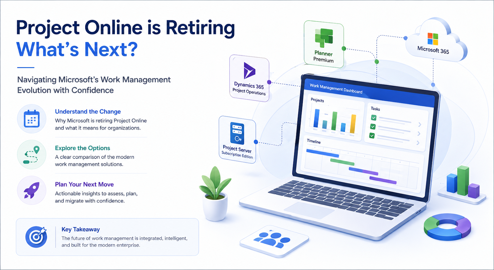
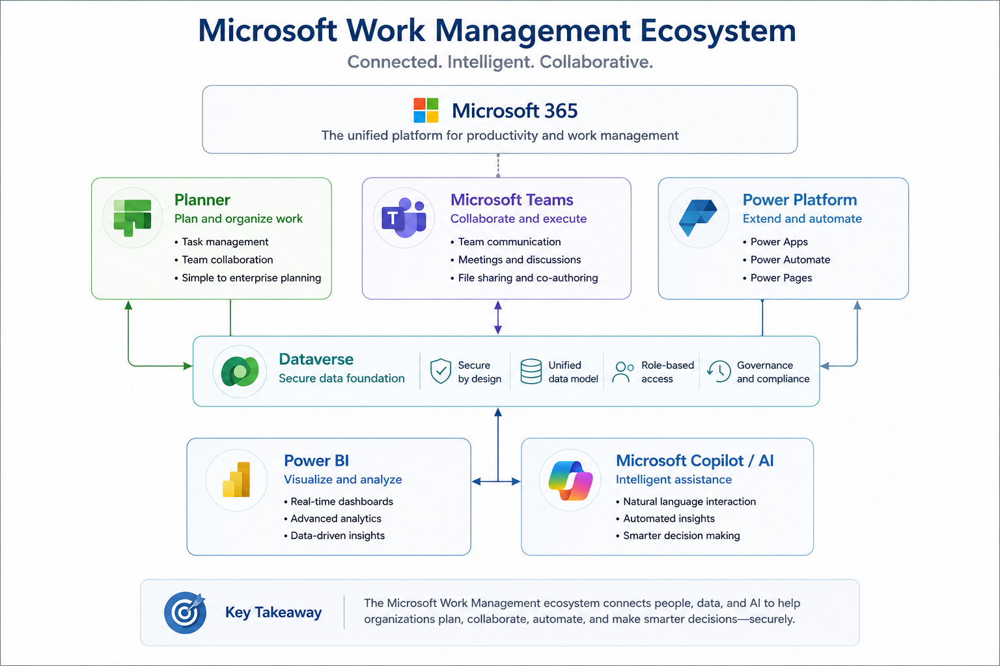
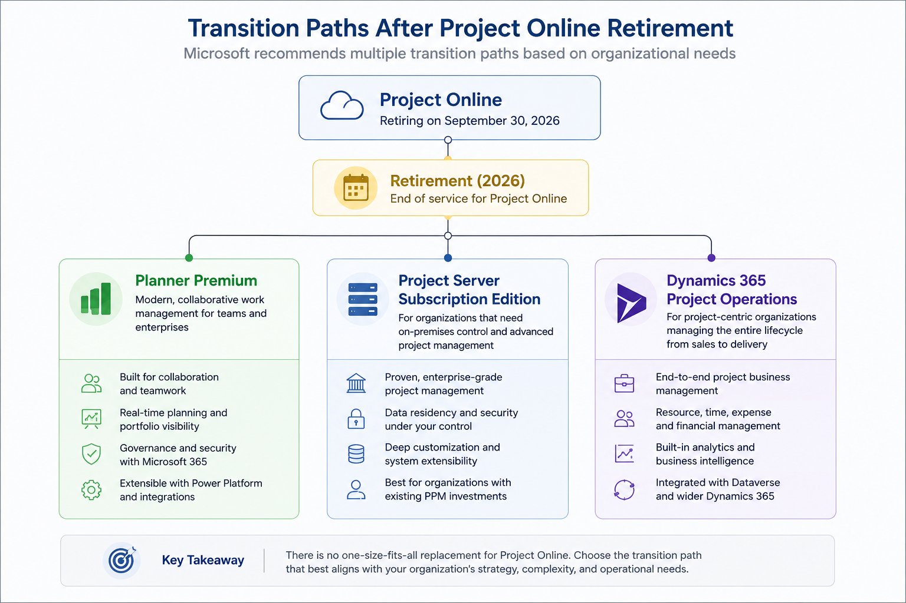
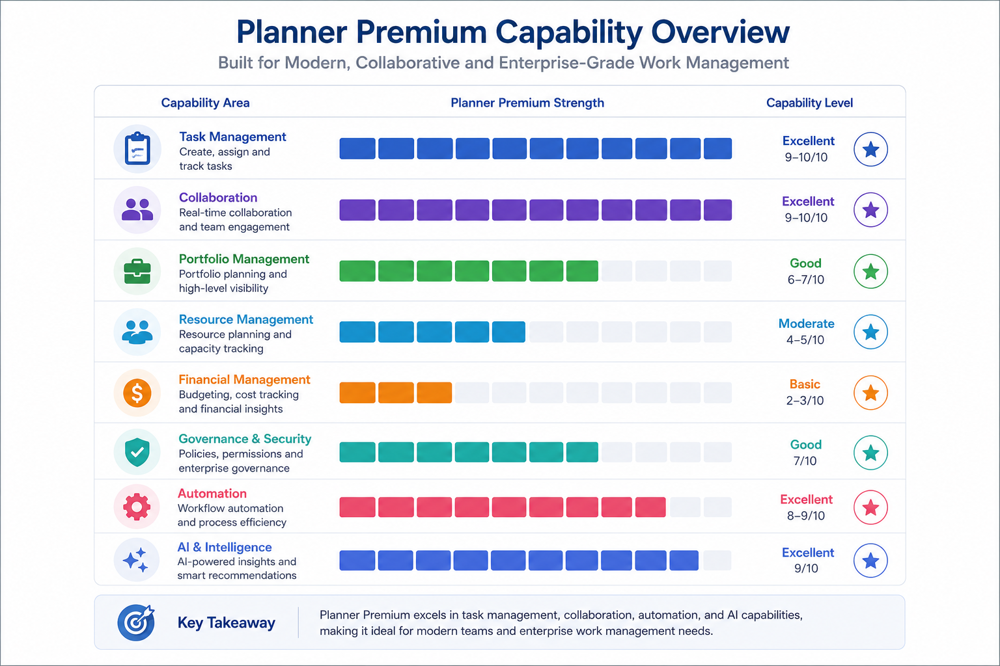
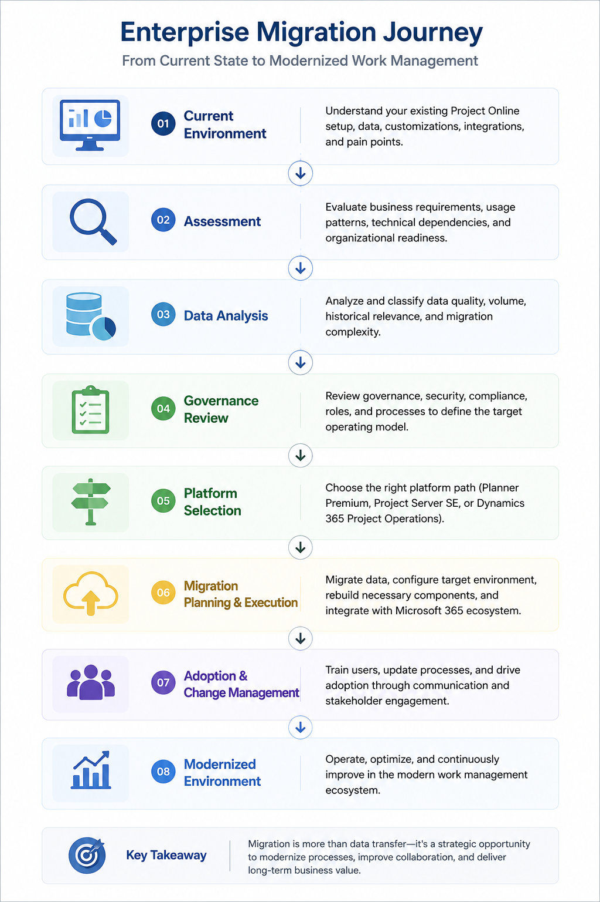
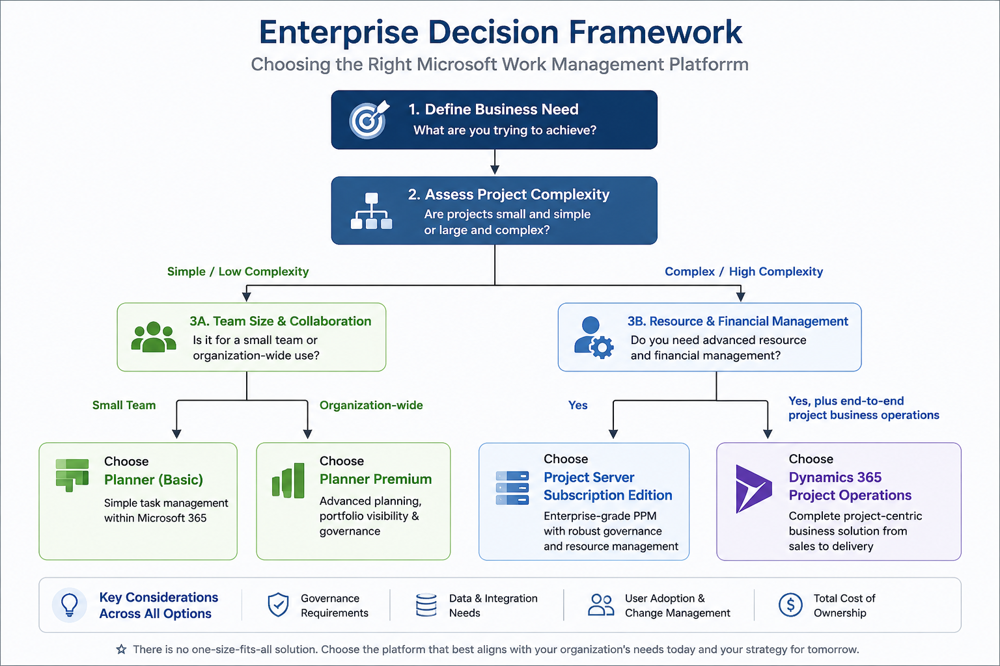

import MilestoneTimeline from "../../components/content/MilestoneTimeline.astro";

Microsoft's retirement of Project Online marks more than the end of a product—it reflects a broader shift in Microsoft's work management strategy. This paper examines what retirement means for enterprise customers, evaluates the available transition paths, and provides a decision framework for selecting the platform that best aligns with organizational requirements.

## Quick Summary

- **Project Online retires on September 30, 2026.** The retirement applies specifically to Project Online; Microsoft Project desktop, Project Server Subscription Edition, and Planner are not being retired as part of this announcement.
- **Planner Premium is not a 1:1 replacement for Project Online.** It is a strong fit for modern collaborative project execution, but mature PPM, resource, governance, financial, and project-based business requirements may point elsewhere.
- **There is no one successor for every Project Online workload.** Planner Premium, Project Server Subscription Edition, and Dynamics 365 Project Operations address different operating models.
- **Migration is a modernization exercise.** Existing PWA projects cannot simply be opened in Planner Premium; organizations should expect data assessment, solution redesign, reporting changes, and potentially project recreation.
- **The target architecture matters.** Planner Premium uses Dataverse and the wider Power Platform for many advanced scenarios, while Basic Planner plans use a different storage and integration model.
- **The strategic direction is broader than Planner alone.** Microsoft's trajectory increasingly connects Planner, Teams, Dataverse, Power Platform, and Microsoft 365 Copilot into a unified work-management ecosystem.

## The Bigger Picture Behind Project Online's Retirement

Microsoft has officially announced that Project Online will reach end of service on September 30, 2026. The retirement applies specifically to the Project Online service and does not affect Microsoft Project desktop applications, Project Server Subscription Edition, or Microsoft Planner. Existing Project Online environments will continue to operate until the retirement date, while Project Online-only subscriptions have no longer been available for new customers since October 1, 2025.

For many organizations, however, the retirement announcement raises a more important question than the date itself:

**What should replace Project Online?**

**The answer is more nuanced than simply moving to Planner Premium.**

Microsoft's public guidance presents Planner Premium, Project Server Subscription Edition, and Dynamics 365 Project Operations as valid transition paths, each designed to address different business requirements. Planner Premium introduces modern work management capabilities—including Gantt charts, task dependencies, baselines, and portfolio management—but Microsoft has been equally clear that it is not, and has never been positioned as, a one-to-one replacement for Project Online.

This distinction is particularly important for enterprise organizations. Project Online has traditionally served as a Project Portfolio Management (PPM) platform with mature governance, resource management, and portfolio planning capabilities. Planner Premium, by contrast, focuses on collaborative project execution within the Microsoft 365 ecosystem. While there is overlap between the two products, their design goals and target scenarios are fundamentally different.

As a result, the retirement of Project Online should not be viewed as a mandatory migration to a single successor. Instead, organizations should evaluate their existing workloads, governance requirements, and operational processes before selecting the most appropriate destination platform.

## What This Means for Enterprise Customers

For most organizations, the decision can be summarized as follows:

- Planner Premium is the preferred choice for organizations looking to modernize project execution and collaboration within Microsoft 365.

- Project Server Subscription Edition remains the most suitable option for organizations that depend on traditional Project Online-style Project Portfolio Management (PPM) capabilities and require the highest level of functional continuity.

- Dynamics 365 Project Operations should be evaluated when project delivery extends beyond scheduling and resource planning into sales, resource staffing, time and expense tracking, billing, and financial management.

Rather than searching for a single replacement product, enterprise customers should approach the retirement as an opportunity to evaluate multiple transition paths. The most appropriate destination depends on whether the organization's primary objective is collaborative work management, enterprise portfolio governance, or end-to-end project-based business operations.

The following diagram summarizes the enterprise decision framework based on Microsoft's published retirement guidance and supporting documentation. It is intended to help organizations identify the most appropriate transition path while avoiding the common misconception that Planner Premium provides complete functional parity with Project Online.

## How Microsoft's Work Management Platform Has Evolved

Understanding the retirement of Project Online requires looking beyond a single product announcement. It reflects a broader shift in Microsoft's work management strategy—one that has gradually moved from maintaining separate project management applications toward delivering a unified work management platform within Microsoft 365.

Historically, Microsoft offered multiple entry points for planning and managing work. Traditional Project products focused on structured project and portfolio management, while Microsoft Planner addressed lightweight team collaboration. Over time, however, the distinction between personal task management, collaborative planning, and enterprise project management became less clear as organizations increasingly expected these experiences to work together.

Microsoft first outlined this direction in 2018 with its vision for modern work management. The company recognized that work was no longer confined to large, formally managed projects. Organizations were simultaneously managing strategic initiatives, departmental projects, operational work, and personal tasks, often across the same teams. To support this evolving landscape, Microsoft introduced Project Home, Roadmap, and a new cloud-based project management service built on the Common Data Service (now Microsoft Dataverse), with native integration across Power Platform services such as Power Apps, Power Automate, and Power BI.

That cloud service became Project for the web, which entered general availability on October 29, 2019. Unlike the desktop application, Project for the web was designed as a modern, browser-based project management experience built on the Microsoft Power Platform. Alongside Project Home and Roadmap, it represented Microsoft's first significant step toward a cloud-native project management ecosystem.

Microsoft's strategy continued to evolve over the following years. Rather than maintaining separate applications for task management, project management, and roadmap planning, Microsoft gradually unified these capabilities under Microsoft Planner. The modern Planner experience now combines Microsoft To Do, Planner, Project for the web, and Microsoft 365 Copilot into a single work management interface, allowing users to manage personal tasks, team plans, and enterprise projects from a common workspace.

The consolidation became official during the 2025 Planner transition. Microsoft announced that Project for the web, Project in Teams, and Roadmap in Teams would no longer exist as separate endpoints. Instead, their capabilities would be surfaced through Planner on the web and within Microsoft Teams. Importantly, this change was architectural rather than functional: organizations were not required to migrate existing Project for the web plans or purchase new licenses. Existing plans remained accessible through Planner, reflecting Microsoft's objective of simplifying the user experience without disrupting customer data or ongoing projects.

Viewed together, these milestones illustrate a consistent product direction rather than a series of isolated announcements. Microsoft's investment has shifted toward a unified work management platform that brings together personal productivity, collaborative planning, and project execution within Microsoft 365. This broader strategy also provides the context for understanding why Planner Premium is presented as one of the primary transition paths following the retirement of Project Online.

## What Is Retiring—and What Remains

The retirement announced by Microsoft applies only to Project Online. Organizations using Microsoft Project desktop applications, Project Server Subscription Edition, or Microsoft Planner are not directly affected by this announcement. Under Microsoft's Modern Lifecycle Policy, Project Online—first released on March 1, 2013—will reach end of service on September 30, 2026, concluding more than a decade as Microsoft's cloud-based Project Portfolio Management (PPM) platform.

Understanding the scope of this retirement is important because it is often misunderstood. The announcement does not represent the retirement of Microsoft Project as a product family. Instead, it marks the retirement of a specific cloud service whose underlying architecture was designed for an earlier generation of Microsoft 365 technologies.

Microsoft attributes the retirement primarily to architectural limitations. According to the company's published guidance, Project Online's legacy platform makes it increasingly difficult to deliver the level of integration, collaboration, and AI-powered experiences that modern Microsoft 365 services are designed to provide. Rather than continuing to evolve Project Online, Microsoft has chosen to invest in platforms such as Planner, Microsoft 365 Copilot, and Project Manager Agent, which are built on newer cloud-native technologies and integrate more closely with the broader Microsoft ecosystem.

Another contributing factor is the retirement of legacy SharePoint workflow technologies. Many Project Online environments rely on SharePoint 2013 workflows for governance and business process automation. Microsoft has already disabled SharePoint 2013 workflows for new Microsoft 365 tenants and has announced their complete retirement for existing tenants in 2026, recommending Power Automate and other modern workflow orchestration solutions as replacements. As organizations modernize their workflow infrastructure, Project Online's dependency on older platform components becomes increasingly difficult to justify.

### Key Retirement Milestones

Enterprise administrators should be aware of the following milestones as they plan their transition strategy:

<MilestoneTimeline
    milestones={[
        {
            date: "October 1, 2025",
            datetime: "2025-10-01",
            title: "Project Online-only subscriptions are no longer available for new customers.",
            impact: "Existing customers remain fully supported."
        },
        {
            date: "April 1, 2026",
            datetime: "2026-04-01",
            title: "Creation of new Project Web App (PWA) sites is blocked.",
            description: "Existing PWA sites that do not contain projects become inaccessible.",
            impact: "New Project Online deployments are effectively frozen."
        },
        {
            date: "September 30, 2026",
            datetime: "2026-09-30",
            title: "Project Online reaches end of service.",
            impact: "The Project Online service is retired and will no longer be available."
        }
    ]}
/>

Until the retirement date, existing Project Online customers can continue using their current environments, including projects, integrations, permissions, and team member access, with Microsoft's standard product support. The announcement is therefore best viewed as a planned transition period rather than an immediate disruption, giving organizations sufficient time to evaluate alternative platforms and execute a migration strategy aligned with their business requirements.

## Planner Basic vs. Planner Premium for Enterprise Users

One of the first questions organizations ask after learning about Project Online's retirement is whether the version of Planner included with Microsoft 365 is sufficient for enterprise project management. The answer depends entirely on the type of work being managed.

Microsoft now delivers Planner through a two-tier licensing model. Planner in Microsoft 365 (sometimes referred to as Basic) is included with eligible Microsoft 365 subscriptions and is designed for collaborative task management. Organizations requiring structured project planning, portfolio oversight, advanced scheduling, or resource management must license Planner Plan 1 or Planner and Project Plan 3, which unlock the platform's premium project management capabilities.

This distinction is important because many of the features commonly associated with Microsoft Project are available only through the premium licensing tiers. While both licensing models share the same modern Planner interface, they are intended to address different business scenarios.

The following table summarizes the capabilities that are most relevant for enterprise customers evaluating a transition from Project Online.

Table: Comparison of Planner in Microsoft 365 (Basic) and Planner Premium capabilities.

| Enterprise capability | Planner in Microsoft 365 (Basic) | Planner Premium |
| --- | --- | --- |
| Task management | Grid, Board, Charts, filters, grouping, notifications, copy plan, export to Excel, Assigned to me, Microsoft To Do integration, rich notes, task conversations | Includes all Basic capabilities together with advanced project scheduling and execution features, depending on the assigned license |
| Scheduling | Schedule view and Outlook calendar integration | Timeline (Gantt), task dependencies, milestones, summary tasks, subtasks, custom calendars, critical path, advanced dependency types |
| Workload and resource management | Not available | People view identifies resource over- and under-allocation, while Assignments view provides more granular effort tracking |
| Agile project management | Boards, buckets, and task organization | Backlogs, sprints, goals, custom fields, task history, and conditional formatting |
| Portfolio management | Not supported | Portfolio views consolidate premium plans. Basic plans, Azure DevOps projects, and Project Online projects are not currently supported within Planner portfolios |
| AI capabilities | Planner Agent requires Microsoft 365 Copilot licensing | Planner Agent can generate tasks, produce status reports, execute assigned work, and respond to feedback. Microsoft 365 Copilot licensing is required |
| Data platform and governance | Task data stored in Azure; attachments in SharePoint; conversations stored in Exchange Online | Project data stored in Microsoft Dataverse with Dataverse-based security, governance, and reporting capabilities |
| Compliance | Supports Microsoft Purview eDiscovery and Legal Hold for group-connected plans | Audit logging is supported, although Microsoft currently notes that Purview eDiscovery does not fully cover premium plans |
| Automation and APIs | Planner connector for Power Automate and Microsoft Graph supports basic plans | Advanced scheduling operations use Dataverse and Project Scheduling APIs rather than the standard Planner connector |
| Scale | Up to 9,000 tasks per plan | Up to 3,000 tasks, 300 resources, 2,000 successor links, and 10 custom fields per project |

The comparison illustrates that Planner Basic and Planner Premium are complementary offerings rather than competing products. Planner in Microsoft 365 focuses on lightweight team collaboration and day-to-day task management, whereas Planner Premium extends the platform with capabilities traditionally associated with enterprise project management, including advanced scheduling, portfolio management, workload balancing, and project governance.

It is equally important to distinguish between Planner Premium and Project Online. Although Planner Premium introduces many advanced planning capabilities, it should not be viewed as a feature-for-feature replacement for Project Online. Organizations that rely on mature Project Portfolio Management (PPM) functionality should evaluate Microsoft's published transition guidance carefully before selecting a migration path.

### Interpreting the Comparison

The feature comparison highlights an important distinction that is often overlooked during migration discussions: Planner Basic and Planner Premium are designed for different levels of project maturity rather than different sizes of organizations.

Teams that primarily coordinate day-to-day work, track deliverables, and collaborate within Microsoft 365 will typically find that Planner in Microsoft 365 (Basic) provides the functionality they need. Organizations that require structured scheduling, resource planning, portfolio visibility, or formal project governance will need the capabilities available through Planner Premium.

At the same time, enterprise customers should avoid assuming that Planner Premium is simply "Project Online under a new name." While Planner Premium introduces several advanced capabilities—including Gantt charts, dependencies, portfolio management, and workload balancing—it has been designed around modern collaborative work management rather than traditional Project Portfolio Management (PPM). Consequently, organizations with mature governance processes, extensive customizations, or complex portfolio reporting requirements should evaluate the available transition paths against their existing operating model instead of comparing feature lists alone.

The comparison presented in this article should therefore be viewed as a starting point for architectural evaluation rather than a migration checklist. The appropriate destination depends not only on feature availability, but also on how projects are governed, how work is delivered, and how project data integrates with the wider Microsoft 365 and business application landscape.

### Licensing Considerations

Licensing is equally important when planning a long-term migration strategy. Microsoft has announced that Planner and Project Plan 5 entered End of Sale on May 1, 2026, and is no longer available for new purchases. Accordingly, this article focuses on the licensing options that represent Microsoft's current investment direction: Planner in Microsoft 365 (Basic), Planner Plan 1, and Planner and Project Plan 3.

Throughout the remainder of this article, references to Planner Premium refer collectively to the premium capabilities available through Planner Plan 1 and Planner and Project Plan 3 unless otherwise stated.

## Evaluating Planner Premium as a Project Online Successor

The most important question facing existing Project Online customers is not whether Planner Premium offers more features than Planner Basic, but whether it can satisfy the organization's existing Project Portfolio Management (PPM) requirements.

The answer depends largely on how Project Online is being used today. For some organizations, Planner Premium represents a natural modernization path. For others, it provides only part of the required functionality, while organizations with mature PPM practices may find that Project Server Subscription Edition or Dynamics 365 Project Operations remain better aligned with their operational needs.

The following assessment summarizes where Planner Premium is likely to be a strong, partial, or limited replacement for Project Online.

### Strong Fit: Collaborative Project Execution and Modern Work Management

Planner Premium is particularly well suited for organizations that view project management primarily as a collaborative execution process. It provides a modern project workspace integrated with Microsoft 365, supporting capabilities such as Timeline (Gantt) views, task dependencies, milestones, custom fields, critical path analysis, sprint planning, workload balancing through People view, task history, and organizational goals.

For organizations standardizing on Microsoft Teams and the Planner web experience, Planner Premium also benefits from Microsoft's ongoing investment in a unified work management platform. Project for the web plans are now accessed directly through Planner, allowing teams to manage both collaborative tasks and structured projects within a consistent user experience.

Organizations modernizing from legacy project management tools may therefore find that Planner Premium offers a more integrated and collaborative way of delivering projects without introducing unnecessary complexity.

### Partial Fit: Portfolio Visibility and PMO Reporting

Planner Premium also introduces portfolio capabilities that allow organizations to monitor multiple premium projects through consolidated status reporting, milestone tracking, progress indicators, and roadmap-style views.

However, these capabilities should not be interpreted as providing complete Project Online portfolio management. Microsoft currently limits Planner portfolios to premium plans and does not support Planner Basic plans, Azure DevOps projects, or Project Online projects within a single portfolio. As a result, organizations managing diverse project ecosystems cannot rely on Planner portfolios as a centralized enterprise reporting solution.

Similarly, organizations that depend on portfolio prioritization, governance workflows, cross-project dependency management, enterprise resource pools, or sophisticated PMO reporting should recognize that these scenarios extend beyond Planner Premium's native capabilities.

Microsoft's own guidance reflects this distinction. For customers requiring enterprise portfolio reporting and capacity planning, Microsoft recommends an architecture that combines Planner Premium for project execution with Microsoft Dataverse, Power Apps, Power Automate, and Power BI to deliver portfolio-level reporting and business process automation.

Viewed in this context, Planner Premium provides the operational layer for project execution, while the wider Power Platform supplies many of the governance and reporting capabilities traditionally delivered within Project Online itself.

### Limited Fit: Mature Project Portfolio Management and Project-Based Business Operations

Organizations with mature Project Portfolio Management practices should evaluate Planner Premium carefully before considering it a direct successor to Project Online.

Microsoft's retirement guidance continues to identify Project Server Subscription Edition as the preferred option for customers seeking the closest functional continuity with Project Online. Project Server retains capabilities such as demand management, enterprise resource management, portfolio selection and optimization, financial management, issue and risk tracking, advanced reporting, and comprehensive Project Portfolio Management processes.

Similarly, organizations whose projects drive revenue-generating business operations should evaluate Dynamics 365 Project Operations rather than Planner Premium. Unlike Planner, Project Operations extends beyond project scheduling to support resource staffing, time and expense entry, costing, budgeting, invoicing, revenue recognition, and financial reporting. These capabilities are particularly important for consulting firms, professional services organizations, engineering companies, and other businesses where project delivery is closely integrated with sales and finance.

For these organizations, Planner Premium should be viewed as a collaborative work management platform rather than a comprehensive Project Portfolio Management or Professional Services Automation solution.

### Assessment

Planner Premium is best understood as a modern project execution platform that aligns closely with Microsoft's long-term investment in Microsoft 365. It delivers significant improvements in usability, collaboration, and integration compared to Project Online, making it an attractive option for organizations seeking to modernize how teams plan and execute work.

At the same time, modernization should not be confused with functional equivalence. Organizations that rely heavily on Project Online's governance, portfolio optimization, enterprise resource management, or financial project management capabilities should evaluate whether Project Server Subscription Edition or Dynamics 365 Project Operations provide a better strategic fit. The most successful migration strategies begin with understanding the organization's operating model—not with selecting the newest platform.

## Understanding the Migration Effort

One of the most common misconceptions surrounding Project Online's retirement is that migration to Planner Premium is simply a matter of moving existing projects into a new interface. In practice, the transition is considerably more involved.

Microsoft's guidance distinguishes between two separate changes that organizations often conflate. The consolidation of Project for the web into Planner requires no migration because existing Project for the web plans remain accessible through the Planner experience. Project Online, however, is an entirely different service with a different architecture, data model, and application platform.

Consequently, there is no native "open in Planner" or one-click migration path for Project Online environments. Existing Project Web App (PWA) projects cannot simply be converted into Planner Premium plans. Organizations should instead plan for a structured migration effort that includes data assessment, solution redesign, and, where necessary, the recreation of project structures within the destination platform.

Microsoft's Planner transition guidance also clarifies what customers should expect during this period. Project Online projects do not appear in Planner's My Plans experience, Project Online links are not surfaced within Planner, and Roadmaps are replaced by Planner Portfolios, which currently display only premium Planner plans. Although Project Online APIs and ProjectData OData endpoints remain supported until the service retires, organizations planning a long-term migration should begin evaluating Microsoft Graph and Microsoft Dataverse as the preferred data access platforms for future integrations and reporting.

> **Enterprise Insight**

> **Planner Premium migration is primarily a modernization exercise, not a data migration project. The complexity lies less in moving projects and more in redesigning governance, reporting, automation, and business processes for a modern Microsoft 365 architecture.**

### Begin with an Environment Assessment

Before selecting a migration destination, organizations should develop a comprehensive inventory of their existing Project Online environment. The objective is not simply to count projects, but to understand how Project Online supports business processes across the organization.

A typical enterprise assessment should include:

- Active and archived projects

- Enterprise project templates

- Custom fields and lookup tables

- Project Web App (PWA) workflows

- Enterprise resource pools

- Timesheet and approval processes

- OData feeds and reporting solutions

- Power BI datasets and dashboards

- Power Automate flows

- Custom applications and third-party integrations

- Security model and permission structure

This inventory becomes the foundation for every subsequent migration decision. Some components may transfer directly to modern Microsoft 365 services, while others will require redesign or replacement because equivalent functionality does not exist within Planner Premium.

### Expect Modernization, Not Just Migration

Enterprise migration projects should be viewed as modernization initiatives rather than data transfer exercises.

Many Project Online implementations have evolved over several years, accumulating custom workflows, reporting solutions, and business-specific processes that reflect the organization's operating model. Replicating these capabilities in Planner Premium often involves redesigning solutions using Microsoft Dataverse, Power Apps, Power Automate, Power BI, or other Microsoft 365 services instead of attempting to recreate Project Online exactly as it existed.

This perspective is consistent with Microsoft's guidance, which recommends backing up Project Online data before retirement while emphasizing that migration planning, platform selection, and implementation remain the responsibility of the customer and their implementation partner.

Organizations that treat migration as an opportunity to simplify governance, retire obsolete customizations, and adopt modern Microsoft 365 capabilities are generally better positioned than those attempting to reproduce every aspect of their existing Project Online environment without change.

## The Broader Shift in Enterprise Work Management

The retirement of Project Online should not be viewed as an isolated product lifecycle event. It reflects a broader transformation taking place across the enterprise work management market, where organizations are moving beyond traditional project scheduling toward integrated platforms that connect strategy, execution, governance, collaboration, and artificial intelligence.

This evolution is evident across the research published by Gartner, Forrester, and IDC. Although each firm approaches the market from a different perspective, all describe a common direction: enterprise work management platforms are becoming more connected, more data-driven, and increasingly expected to support decision-making across the entire project lifecycle.

### Gartner: Strategic Portfolio Management Is Expanding

Gartner's Strategic Portfolio Management (SPM) framework illustrates how enterprise portfolio management has evolved beyond managing individual projects. Modern SPM platforms are expected to support strategic planning, investment prioritization, scenario analysis, continuous portfolio monitoring, stakeholder engagement, and data-driven decision-making across the organization.

At the same time, Gartner's definition of the Project and Portfolio Management (PPM) market continues to emphasize capabilities such as demand management, project planning, resource and capacity management, portfolio governance, reporting, security, integration, and enterprise usability.

This broader definition highlights an important consideration for Project Online customers. Evaluating a replacement platform is no longer simply about identifying another scheduling tool; it requires understanding how project execution fits into the organization's wider governance, resource management, and strategic planning processes.

### Forrester: Collaborative Work Management Continues to Mature

Forrester identifies a parallel trend through its Collaborative Work Management (CWM) research. Modern work management platforms are evolving from simple task management applications into systems of record for planning, collaboration, and organizational execution. Artificial intelligence, workflow automation, and deep integration across business applications are becoming core platform capabilities rather than optional enhancements.

However, Forrester also notes that Collaborative Work Management platforms are not yet complete substitutes for mature Project Portfolio Management solutions. Enterprise-scale portfolio governance, financial oversight, and complex resource management continue to require more sophisticated data models and governance capabilities than many collaborative work management platforms currently provide.

This distinction closely mirrors Microsoft's own positioning of Planner Premium. While Planner significantly modernizes collaborative project execution, organizations with advanced PMO requirements may still require complementary technologies or alternative platforms depending on the complexity of their operating model.

### IDC: A Rapidly Growing Market

IDC's market forecasts reinforce the scale of this transformation. Worldwide Project Portfolio Management software revenue continues to grow as organizations increase investment in cloud-native project management, collaborative work management, artificial intelligence, automation, and adaptive portfolio management.

According to IDC, worldwide PPM software revenue reached $7.46 billion in 2024 and is expected to grow to $13.6 billion by 2029, representing a compound annual growth rate (CAGR) of 12.8%. IDC attributes this growth to increasing demand for strategic execution, AI-assisted decision-making, cloud platforms, resource optimization, and the ability to manage projects and portfolios in increasingly dynamic business environments.

### What This Means for Enterprise Customers

Viewed together, these industry perspectives provide important context for Microsoft's retirement strategy.

Microsoft is not simply replacing one project management application with another. Instead, it is aligning its work management platform with broader market trends that emphasize unified collaboration, cloud-native architecture, AI-assisted productivity, and deeper integration across the Microsoft ecosystem.

At the same time, the research also reinforces an important conclusion: collaborative work management and enterprise Project Portfolio Management are related but distinct disciplines. Organizations evaluating a successor to Project Online should therefore begin by understanding their business requirements rather than assuming that every modern work management platform is intended to address the same problem.

The decision is ultimately less about selecting a Microsoft product and more about choosing the operating model that best supports how the organization plans, governs, and delivers work.

## The Future of Enterprise Work Management

Although Project Online's retirement has a fixed end date, the broader transformation of enterprise work management is only beginning. Microsoft's product strategy, together with research from Gartner, Forrester, and IDC, points toward several long-term trends that are likely to influence how organizations plan, govern, and deliver projects over the next few years.

Understanding these trends can help organizations make migration decisions that remain relevant well beyond the immediate retirement of Project Online.

### AI-Assisted Project Management Will Become the Default Experience

Artificial intelligence is rapidly evolving from a productivity enhancement into an active participant in project execution.

Microsoft's Planner Agent already demonstrates this direction by assisting with task creation, project planning, progress reporting, and responding to project updates within Planner Premium. When combined with Microsoft 365 Copilot, users can create and update plans, ask questions about project status, manage tasks, and perform common project management activities without switching between multiple applications.

The significance extends beyond individual features. Rather than simply recording project information, future work management platforms will increasingly assist teams in organizing work, identifying risks, summarizing progress, and recommending next steps.

Enterprise implication: Organizations should evaluate future project management platforms not only for their current capabilities, but also for how well their data structures support AI-driven planning, reporting, and decision-making.

### Unified Work Management Platforms Will Replace Standalone Project Applications

Microsoft's consolidation of Microsoft To Do, Planner, Project for the web, and Microsoft 365 Copilot into a single Planner experience reflects a broader industry movement toward unified work management platforms.

Instead of maintaining separate applications for personal tasks, collaborative planning, project scheduling, and AI assistance, organizations are increasingly expected to manage these activities within an integrated workspace. Microsoft's retirement of separate Project for the web and Roadmap experiences reinforces this strategy by establishing Planner as the primary work management interface across Microsoft 365.

This shift suggests that the center of Microsoft's investment is moving away from standalone project management endpoints and toward a platform that combines Planner, Microsoft Teams, Microsoft Dataverse, Microsoft Power Platform, and Microsoft 365 Copilot into a connected ecosystem.

Enterprise implication: Future platform decisions should prioritize integration and interoperability rather than evaluating project management applications in isolation.

### Portfolio Management Will Continue to Separate into Operational and Strategic Layers

Modern work management platforms increasingly distinguish between operational project execution and enterprise portfolio governance.

Planner Premium portfolios provide useful visibility across multiple premium projects, including milestone tracking, status reporting, and progress monitoring. However, they are intentionally lightweight and currently support only premium Planner plans. They do not consolidate Planner Basic plans, Azure DevOps projects, or Project Online environments into a unified portfolio.

Industry research suggests that enterprise Strategic Portfolio Management (SPM) is evolving in a different direction. Gartner describes modern SPM platforms as supporting investment planning, scenario analysis, strategic prioritization, portfolio optimization, and continuous governance across complex organizational portfolios.

These capabilities extend well beyond project status reporting.

Enterprise implication: Organizations with mature PMO functions should distinguish between portfolio visibility and portfolio governance when evaluating replacement platforms. While Planner Premium supports operational oversight, strategic portfolio management may continue to require complementary technologies depending on organizational complexity.

### Data Governance Will Become the Foundation for AI

Every analyst firm examining enterprise AI reaches a similar conclusion: the quality of AI outcomes depends on the quality of enterprise data.

Forrester emphasizes that successful AI initiatives require structured, trustworthy, and accessible organizational data, while IDC similarly highlights governance as a prerequisite for realizing value from AI, machine learning, and autonomous agents.

Microsoft's Planner architecture reflects this principle. Planner Basic and Planner Premium differ not only in functionality, but also in how project information is stored and governed. Basic plans rely on Microsoft 365 services such as Azure, SharePoint, and Exchange Online, whereas Planner Premium stores project information in Microsoft Dataverse, enabling richer governance, security, reporting, and integration capabilities.

As AI becomes increasingly embedded within enterprise work management platforms, the underlying data architecture will become just as important as the user interface itself.

Enterprise implication: Organizations preparing for AI-enabled project management should treat data governance, information architecture, and platform integration as strategic investments rather than implementation details. Well-governed project data is likely to become a competitive advantage as AI capabilities continue to mature.

## Enterprise Decision Framework

The retirement of Project Online should not be approached as a product migration exercise alone. It is an opportunity to reassess how projects are planned, governed, delivered, and integrated across the organization.

Based on Microsoft's published guidance, industry research, and the capabilities discussed throughout this article, the following recommendations can help enterprise organizations develop a transition strategy that aligns with both current requirements and future business objectives.

### 1. Assess Business Scenarios Before Selecting a Platform

Avoid treating every Project Online deployment as a single migration project. Most enterprise environments contain multiple types of projects with different governance, reporting, and collaboration requirements.

A practical segmentation approach is:

- Collaborative project delivery — Organizations focused on team execution, task coordination, Microsoft Teams collaboration, and modern project planning should evaluate Planner Premium.

- Enterprise Project Portfolio Management (PPM) — Organizations requiring portfolio governance, enterprise resource management, demand management, and the closest functional continuity with Project Online should evaluate Project Server Subscription Edition.

- Project-based business operations — Organizations whose projects drive customer engagements, professional services, engineering delivery, or consulting should evaluate Dynamics 365 Project Operations, where project management is integrated with sales, resource scheduling, finance, billing, and revenue recognition.

The objective is not to select a single successor for every workload, but to align each workload with the platform best suited to its business purpose.

### 2. Avoid Assuming Functional Equivalence

Throughout its retirement guidance, Microsoft consistently presents Planner, Project Server Subscription Edition, Project desktop, and Dynamics 365 Project Operations as distinct transition options rather than direct replacements for Project Online.

This distinction is important. Planner Premium modernizes collaborative project execution but was not designed to replicate every Project Online capability. Migration planning should therefore begin with documenting business processes and governance requirements instead of comparing feature checklists.

Organizations that define success as "rebuilding Project Online exactly as it exists today" are likely to encounter unnecessary complexity. Those that define success as "supporting the business with modern capabilities" will often achieve better long-term outcomes.

### 3. Redesign Reporting Rather Than Recreating It

Reporting is frequently one of the most underestimated aspects of Project Online migration.

While Project Online APIs and ProjectData OData endpoints remain available until retirement, organizations moving to Planner Premium should expect reporting architectures to evolve. Planner Premium stores project information in Microsoft Dataverse, making Power BI, Dataverse, Microsoft Graph, and Power Platform services the preferred foundation for future reporting and analytics.

Rather than attempting to reproduce existing reports unchanged, organizations should use migration as an opportunity to simplify reporting, retire redundant dashboards, and build data models that better support modern analytics and AI capabilities.

### 4. Align Governance with the Target Platform

Governance should be designed around the capabilities of the destination platform rather than inherited from the source environment.

Planner Basic and Planner Premium differ in their storage architecture, security model, compliance capabilities, APIs, and automation options. These architectural differences influence how organizations implement reporting, lifecycle management, automation, integrations, and information governance.

Establishing governance standards early—including naming conventions, workspace provisioning, data ownership, security boundaries, and lifecycle policies—can significantly reduce complexity after migration.

### 5. Treat Licensing as Part of Organizational Change

Licensing decisions affect far more than procurement costs.

Planner in Microsoft 365 provides collaborative task management as part of eligible Microsoft 365 subscriptions, while Planner Plan 1 and Planner and Project Plan 3 unlock progressively more advanced planning, scheduling, and portfolio capabilities. Organizations intending to adopt AI-assisted work management should also account for Microsoft 365 Copilot licensing requirements, as Planner Agent depends on Copilot to deliver its AI functionality.

Licensing strategy should therefore be planned alongside user adoption, governance, training, and platform rollout rather than as a separate procurement activity.

### 6. Validate the Target Architecture Through Pilot Projects

Enterprise migrations should always begin with representative pilot projects rather than production-wide deployments.

A successful pilot should evaluate more than task creation and scheduling. It should validate project templates, dependencies, resource assignments, reporting, Power Platform integrations, security, governance, automation, and end-user adoption.

This recommendation is particularly important because Project Online and Planner Premium are built on different architectural foundations. There is no native one-click migration path from Project Web App (PWA) to Planner Premium, making early validation essential before broader rollout.

### Final Recommendation

Perhaps the most important recommendation is to view Project Online's retirement as a modernization initiative rather than a deadline-driven migration.

Organizations that focus solely on replacing Project Online risk reproducing legacy processes on a modern platform. Those that use this transition to simplify governance, modernize reporting, strengthen data quality, and align project delivery with Microsoft's long-term work management strategy will be better positioned to take advantage of future innovations in collaboration, automation, and AI-assisted project management.

Ultimately, the most successful transition will not be determined by the platform an organization selects, but by how well that platform supports the way the organization plans, governs, and delivers work.

## Looking Ahead: The Future of Microsoft's Work Management Platform

Project Online's retirement represents the conclusion of one chapter in Microsoft's project management portfolio, but it is equally the beginning of a broader transformation in how work is expected to be planned, coordinated, and governed across Microsoft 365.

Over the next several years, Microsoft's investment is likely to continue focusing on three complementary pillars: Planner as the unified work management experience, Microsoft Dataverse and the Power Platform as the foundation for extensibility and governance, and Microsoft 365 Copilot together with Planner Agent as the intelligence layer that supports planning, execution, and decision-making.

This direction is consistent with Microsoft's publicly stated vision for Planner as a unified platform spanning personal task management, collaborative work, enterprise project management, and AI-assisted productivity. Rather than expanding the number of project management applications, Microsoft's strategy increasingly emphasizes a connected ecosystem in which planning, collaboration, automation, reporting, and AI operate as parts of a single platform.

At the same time, organizations should avoid interpreting this strategy as an indication that Planner Premium will eventually replace every Project Online capability. Microsoft's published transition guidance continues to present Planner Premium, Project Server Subscription Edition, and Dynamics 365 Project Operations as distinct solutions addressing different business requirements. Industry research reinforces this position by distinguishing collaborative work management platforms from enterprise Project Portfolio Management (PPM) systems, particularly in areas such as strategic portfolio governance, financial management, and enterprise resource planning.

For enterprise organizations, the most sustainable strategy is therefore one of modernization rather than replacement. Adopt Planner Premium where it aligns with collaborative project execution, retain or transition to platforms that better support mature PPM or project-based business operations where necessary, and invest in a well-governed data foundation capable of supporting automation, analytics, and AI-driven work management.

Viewed through this broader lens, Project Online's retirement is less about the end of a product than the evolution of Microsoft's enterprise work management platform. Organizations that use this transition to simplify processes, strengthen governance, improve data quality, and align with Microsoft's long-term architectural direction will be better positioned to take advantage of future innovations across Microsoft 365.

The organizations that derive the greatest value from this transition are unlikely to be those that reproduce their existing environment feature for feature. Instead, they will be those that use the retirement of Project Online as an opportunity to rethink how work is planned, governed, and delivered in an increasingly connected and AI-assisted enterprise environment.

## Summary

Microsoft will retire Project Online on September 30, 2026, marking the end of one of its longest-running cloud project management services. This paper examines the strategic reasons behind the retirement, evaluates Microsoft's recommended transition platforms, analyzes broader industry trends, and provides an enterprise decision framework for organizations planning their migration strategy.